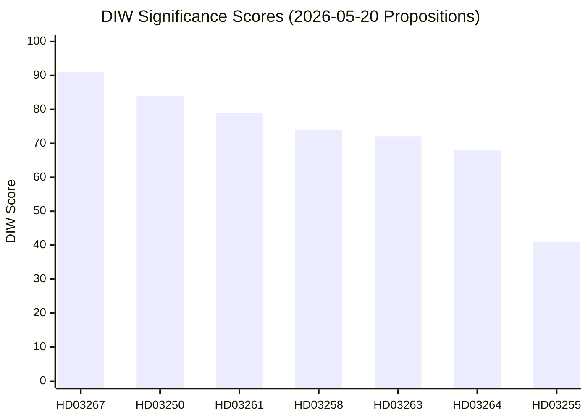

# Significance Scoring

**Method**: DIW (Decisional Intelligence Weight)  
**Formula**: Democratic Impact (40%) × 10 + Institutional Precedent (30%) × 10 + Electoral Salience (20%) × 10 + Urgency (10%) × 10  
**Scale**: 0–100  
**Date**: 2026-05-20

## Score Table

| dok_id | Title | Dem. Impact (0-10) | Inst. Precedent (0-10) | Elec. Salience (0-10) | Urgency (0-10) | **DIW** |
|--------|-------|---------------------|------------------------|----------------------|----------------|---------|
| HD03267 | Stärkt skydd mot utlänningar (säkerhetshot) | 9.5 | 9.0 | 9.0 | 8.5 | **91** |
| HD03250 | En statlig e-legitimation | 8.0 | 9.5 | 8.0 | 8.0 | **84** |
| HD03261 | Skatteverket folkbokföring | 8.0 | 8.5 | 7.5 | 7.5 | **79** |
| HD03258 | Ökad insyn i politiska processer | 7.5 | 8.0 | 7.0 | 7.0 | **74** |
| HD03263 | Stärkt återvändandeverksamhet | 7.0 | 7.5 | 7.5 | 7.0 | **72** |
| HD03264 | Krav på vandel för uppehållstillstånd | 7.0 | 7.0 | 7.0 | 6.0 | **68** |
| HD03255 | Hushållens skulder — stickprov | 4.0 | 4.0 | 3.5 | 4.5 | **41** |

## Dimension Rationale

### HD03267 — DIW 91 (Critical)
- **Democratic Impact (9.5)**: Expands state power to detain/expel non-citizens on security grounds, with reduced judicial oversight risk. Highest civil-liberties impact of the set.
- **Institutional Precedent (9.0)**: Sets a new threshold for "qualified security threat" classification — durable precedent affecting SÄPO operational scope.
- **Electoral Salience (9.0)**: Core SD/M/KD promise, directly contested by S/MP/V. High mobilisation potential for both sides.
- **Urgency (8.5)**: Government framing as urgent security measure; committee timeline compressed.

### HD03250 — DIW 84 (High)
- **Democratic Impact (8.0)**: Universal access to digital identity is a fundamental infrastructure question. Exclusion from BankID has created a de facto second-class digital citizenship.
- **Institutional Precedent (9.5)**: First government-issued digital identity system in Swedish history — structural precedent for state digital infrastructure ownership.
- **Electoral Salience (8.0)**: Broadly popular across parties; contested only on implementation details and data governance.
- **Urgency (8.0)**: EU Digital Identity Wallet (eIDAS 2) deadline creates external pressure.

### HD03261 — DIW 79 (High)
- **Democratic Impact (8.0)**: Skatteverket gains expanded surveillance-adjacent powers over population data — significant civil liberties dimension.
- **Institutional Precedent (8.5)**: Expanding an already powerful administrative agency's powers over life-critical records (folkbokföring = access to welfare).
- **Electoral Salience (7.5)**: Welfare fraud framing popular with right-leaning voters; privacy concerns resonate with urban/educated centre-left.
- **Urgency (7.5)**: Several high-profile folkbokföring fraud scandals in 2024–2025 created political pressure.

### HD03258 — DIW 74 (High)
- **Democratic Impact (7.5)**: Political transparency is fundamental to democratic accountability; limited scope tempers score.
- **Institutional Precedent (8.0)**: First comprehensive political process transparency bill since 2014 — sets a baseline.
- **Electoral Salience (7.0)**: Popular in principle; limited voter mobilisation because reforms are procedural not redistributive.
- **Urgency (7.0)**: KU mandate driven by transparency scandals in 2024.

### HD03263 — DIW 72 (High)
- **Democratic Impact (7.0)**: Enforcement-side immigration powers with human rights implications under non-refoulement obligations.
- **Institutional Precedent (7.5)**: Institutionalises administrative coordination for forced removal — durable operational change.
- **Electoral Salience (7.5)**: High among SD/M base; contested by S/MP/V/C with human rights framing.
- **Urgency (7.0)**: EU Returns Directive compliance obligation.

### HD03264 — DIW 68 (Moderate-High)
- **Democratic Impact (7.0)**: Character requirements create broad administrative discretion with discrimination risk.
- **Institutional Precedent (7.0)**: Expands "vandel" concept in immigration law — precedent for expanding grounds for refusal.
- **Electoral Salience (7.0)**: Moderate — part of broader immigration narrative.
- **Urgency (6.0)**: No immediate treaty obligation; driven by domestic policy preference.

### HD03255 — DIW 41 (Low)
- **Democratic Impact (4.0)**: Technical macroprudential measure. No direct rights impact.
- **Institutional Precedent (4.0)**: Incremental expansion of existing data collection authority.
- **Electoral Salience (3.5)**: Low voter salience; relevant to mortgage holders and housing sector.
- **Urgency (4.5)**: Riksbank-driven urgency to implement, but not politically salient.

## Mermaid Significance Chart

