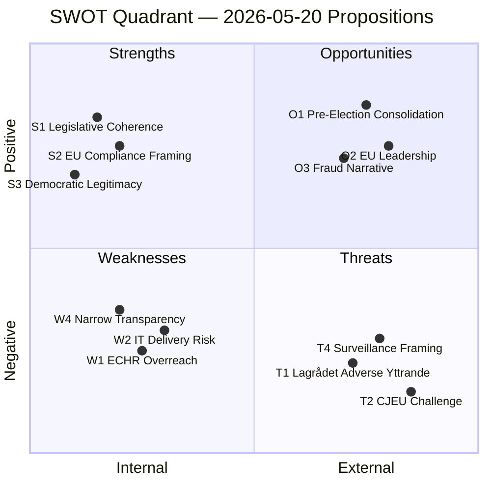

# SWOT Analysis

**Scope**: 2026-05-20 Government Propositions — Busch Government Legislative Cluster  
**Framework**: SWOT with dok_id citations + TOWS strategic matrix  
**Date**: 2026-05-20

## SWOT Matrix

### Strengths

- **S1 — Legislative coherence**: The immigration security cluster (HD03267, HD03263, HD03264) forms a mutually reinforcing package that plugs gaps in existing law, reducing legal challenges to individual deportations (HD03267; HD03263).
- **S2 — EU compliance framing**: HD03250 addresses a genuine gap relative to eIDAS 2 (EU Digital Identity Wallet) deadline; HD03263 aligns with EU Returns Directive — both create frames that are difficult for opposition to reject outright.
- **S3 — Democratic legitimacy basis**: HD03258 (transparency) provides rhetorical cover for the security expansion, enabling the government to claim a balanced agenda (security + accountability).
- **S4 — Administrative problem-solving**: HD03261 and HD03255 address documented operational problems (folkbokföring fraud; insufficient household debt data) rather than being purely ideological.
- **S5 — Coalition cohesion**: The entire package reflects M/KD/SD/L consensus — no internal coalition division visible at proposition stage.

### Weaknesses

- **W1 — ECHR overreach risk** (HD03267): The qualified security threat threshold may not survive ECHR Art. 5 scrutiny if it enables detention without judicial review. A Lagrådet critical yttrande would undermine the government's legal credibility.
- **W2 — Digital infrastructure execution risk** (HD03250): Sweden's track record on large state IT projects (see failed Migrationsverket IT systems 2019–2022) raises delivery credibility questions. Cost overruns could become a campaign issue.
- **W3 — Civil liberties backlash risk** (HD03261): Skatteverket's expanded powers may generate a constitutional freedom-of-movement debate that the government cannot win rhetorically.
- **W4 — Narrow transparency scope** (HD03258): The political transparency proposition does not address lobbying registration, revolving doors, or foundation-channelled funding, leaving the government vulnerable to "half-hearted reform" criticism.
- **W5 — Implementation timeline**: Multiple propositions require cross-agency coordination (HD03250 requires Bolagsverket + Digg + eSam; HD03261 requires Skatteverket + Migrationsverket integration). Timeline slippage is probable.

### Opportunities

- **O1 — Pre-election consolidation**: Delivering high-salience security legislation before the 2026 election consolidates the M/KD/SD core vote and puts S/MP/V on the defensive.
- **O2 — EU leadership positioning**: If HD03250 delivers a functional state e-ID aligned with eIDAS 2, Sweden can position itself as an EU digital governance leader — valuable for the EU Council rotation agenda.
- **O3 — Fraud reduction narrative**: HD03261 enables a "taxpayer protection" narrative in the 2026 election campaign — polling shows welfare fraud concern among broad swing voters.
- **O4 — Coalition expansion**: A successful transparency reform (HD03258) could attract support from C (Centerpartiet) for other government priorities, broadening the parliamentary base beyond the current SD-supported majority.
- **O5 — Security agency capacity**: HD03267 strengthens SÄPO's operational toolkit — if a high-profile security event occurs before the election, the government benefits from having legislated in advance.

### Threats

- **T1 — Lagrådet constitutionality finding** (HD03267, HD03261): Adverse Lagrådet yttranden would force amendments, delay committee processing, and dominate negative media coverage in the pre-election period.
- **T2 — CJEU/ECtHR challenge** (HD03267, HD03263): International courts have increasingly constrained EU member-state detention and removal powers. A CJEU referral from Swedish courts could invalidate HD03267 post-enactment.
- **T3 — SD legislative maximalism**: As the main beneficiary of the security cluster, SD may demand further escalation beyond what M/KD can deliver — creating internal coalition tension if Lagrådet or KU forces scope reductions.
- **T4 — Opposition coalition framing** (S + MP + V + C): If the opposition succeeds in framing the package as "surveillance state" rather than "security state", the government loses the rhetorical advantage with swing voters.
- **T5 — Digital ID data breach risk** (HD03250): A breach or privacy incident in the new state e-ID system — even during the implementation phase — would become the dominant narrative, undermining the government's competence framing.

## TOWS Strategic Matrix

| | **Strengths** | **Weaknesses** |
|---|---|---|
| **Opportunities** | **SO (Exploit)**: Use S2 (EU framing) + O2 (EU leadership) to position HD03250 as Sweden's flagship EU digital contribution. Use S1 (legislative coherence) + O1 (pre-election) to maximise security cluster impact before September 2026. | **WO (Improve)**: Strengthen HD03258 scope (W4) before committee stage to capture O4 (C-party support) and O1 credibility. Commission independent review of HD03250 delivery capacity to mitigate W2 before O2 narrative is needed. |
| **Threats** | **ST (Defend)**: Use S3 (democratic legitimacy) to pre-empt T4 (surveillance framing). Use S5 (coalition cohesion) to manage T3 (SD maximalism) by presenting the package as already SD-satisfying. | **WT (Avoid)**: W1 + T1 (ECHR + Lagrådet) is the highest-risk cell — proactively seek informal Lagrådet guidance on HD03267 before formal submission to identify fatal flaws early (W1 mitigation before T1 materialises). |

## Mermaid SWOT Visual

