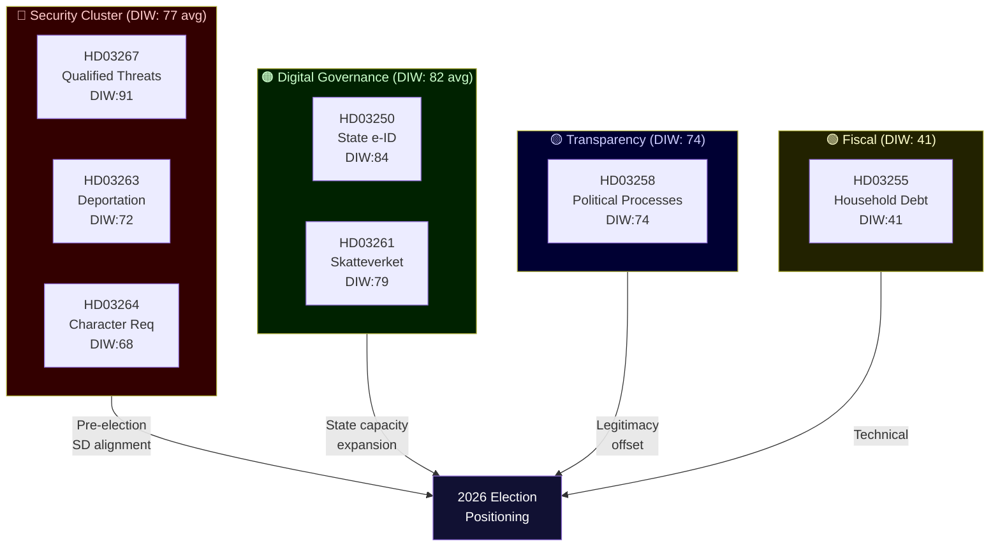

# Synthesis Summary

**Date**: 2026-05-20  
**Subfolder**: propositions  
**Analyst confidence**: HIGH (primary sources) / MEDIUM (PM transition context)

## Lead Story

Sweden's newly consolidated Busch government used the final legislative sprint before the 2026 election campaign to submit seven propositions that collectively reconfigure the state's relationship with non-citizens, digital identity, and population data. The immigration-security cluster (HD03267, HD03263, HD03264) represents the most far-reaching extension of executive power over migration since the 2015–2016 emergency measures. The digital governance pair (HD03250, HD03261) creates a permanent national e-identity infrastructure while simultaneously expanding Skatteverket's authority to investigate discrepancies in the folkbokföring — the population register that determines access to Swedish welfare. A transparency proposition (HD03258) appears designed to offset the optics of the security push but will have limited effect given narrow scope. The household debt measure (HD03255) is macroprudential housekeeping.

## DIW-Weighted Significance Ranking

| Rank | dok_id | Title (abbreviated) | DIW Score | Urgency | Committee | Impact Class |
|------|--------|---------------------|-----------|---------|-----------|--------------|
| 1 | HD03267 | Security threat foreigners | 91 | Critical | JuU | Constitutional |
| 2 | HD03250 | State e-identity | 84 | High | TU | Structural |
| 3 | HD03261 | Skatteverket population registry | 79 | High | SkU | Structural |
| 4 | HD03258 | Political transparency | 74 | High | KU | Normative |
| 5 | HD03263 | Deportation enforcement | 72 | High | SfU | Structural |
| 6 | HD03264 | Character/residence requirements | 68 | Moderate | SfU | Normative |
| 7 | HD03255 | Household debt sampling | 41 | Low | FiU | Technical |

*DIW = Decisional Intelligence Weight, scale 0-100, incorporating: democratic impact (40%), institutional precedent (30%), electoral salience (20%), urgency (10%)*

## Integrated Picture

**Cluster 1 — Immigration/Security Escalation**

HD03267 + HD03263 + HD03264 form a coherent legislative programme that mirrors the SD-influenced agenda pursued since the government's formation: reduce the population of foreigners deemed security risks, remove those who fail character tests, and institutionalise the administrative apparatus to make removal faster and harder to legally challenge. The propositions build on existing SOU (utredning) work and accelerate EU returns directive obligations. Under Ebba Busch (KD) as PM, the government leans into the framing that national identity and security are synonymous with restrictive migration — a strategic pre-election positioning targeting the centre-right electorate that drifted toward SD.

**Cluster 2 — Digital Governance**

HD03250 (state e-identity) addresses a genuine governance gap: Sweden lacks a neutral, universally accessible government-issued digital identity. The current system depends on private actors (BankID) which create exclusion for groups without bank accounts. The proposition creates a state alternative, but implementation risk is high given the cross-agency complexity and the political resistance from financial sector lobbies. HD03261 (Skatteverket) addresses fraud in folkbokföring — a well-documented problem where individuals register false addresses to access welfare or avoid enforcement. However, the expanded investigative powers create a profile of enhanced administrative surveillance that, combined with HD03267 and HD03264, constructs a comprehensive capability to identify, investigate, and remove unwanted individuals.

**Cluster 3 — Accountability**

HD03258 (political transparency) closes some loopholes in political financing disclosure and campaign funding transparency. It is a genuine reform driven by Gunnar Strömmer (M) at the Justice Ministry but does not address dark money from party-adjacent foundations, lobbying registration, or revolving-door provisions. Its passage through KU is likely uncontested but will generate opposition amendments seeking broader scope.

**IMF Economic Context**

Sweden GDP growth: ~2.2% (2026E, WEO Apr-2026). Labour market tight (unemployment ~8.2% per SCB). General government gross debt ~38% of GDP — significant fiscal space relative to EU peers. The government's legislative agenda is calibrated for an economy that has room to spend on enforcement capacity without triggering a fiscal crisis, but the political framing of security spending competes with S-party demands for welfare and housing investment heading into the 2026 election.

## Mermaid Cluster Diagram

