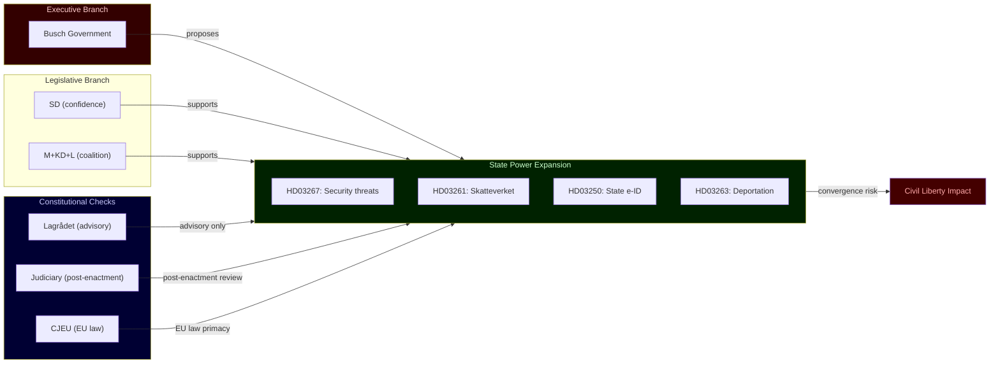

# Threat Analysis

**Framework**: Political Threat Taxonomy (PTT v2) + Attack Tree Analysis  
**Date**: 2026-05-20  
**Scope**: Threats to democratic accountability and civil liberties arising from the 2026-05-20 proposition cluster

## Threat Classification (PTT v2)

| Threat ID | Threat Class | Description | Propositions | Severity |
|-----------|-------------|-------------|-------------|----------|
| TH-01 | Executive Overreach | Government accumulates disproportionate administrative discretion over individuals without adequate judicial oversight | HD03267, HD03261 | CRITICAL |
| TH-02 | Minority Rights Erosion | Migration propositions disproportionately affect ethnic/religious minorities; risk of discriminatory application | HD03267, HD03263, HD03264 | HIGH |
| TH-03 | Surveillance State Creep | Expansion of state identity and population data infrastructure enables mass data aggregation | HD03250, HD03261 | HIGH |
| TH-04 | Democratic Accountability Deficit | Transparency reform (HD03258) is structurally inadequate to offset expanded state powers | HD03258 (insufficient) | MEDIUM |
| TH-05 | Pre-election Legislative Manipulation | Government uses pre-election legislative rush to lock in structural changes before democratic accountability cycle | All 7 | MEDIUM |
| TH-06 | International Norm Violation | Swedish legislation conflicts with ECHR, EU Charter, or Refugee Convention creating reputational and legal exposure | HD03267, HD03263 | HIGH |

## Attack Tree: Civil Liberty Erosion

```
Goal: Maximise state control over non-citizens while minimising judicial oversight
│
├── Branch A: Legal authority expansion (HD03267)
│   ├── Expand "qualified security threat" definition (administrative)
│   ├── Reduce burden of proof for detention orders
│   └── Limit judicial review of classified-evidence detentions
│
├── Branch B: Enforcement capacity expansion (HD03263, HD03264)
│   ├── New administrative cooperation mechanisms for forced return
│   ├── Expanded "vandel" grounds for residence permit refusal
│   └── Streamlined removal procedures bypassing standard appeals
│
├── Branch C: Digital surveillance infrastructure (HD03250, HD03261)
│   ├── State e-ID creates universal tracking of digital transactions
│   ├── Skatteverket folkbokföring powers enable residential surveillance
│   └── Cross-agency data sharing enables profiling (migration + tax + identity)
│
└── Branch D: Accountability suppression (HD03258 — insufficient)
    ├── Narrow transparency scope leaves state power expansion unchecked
    ├── No lobbying register limits visibility of SD policy influence
    └── Foundation funding loopholes not addressed
```

## Threat Narrative: Convergence Risk

The most significant threat identified in this analysis is not any individual proposition but their **systemic convergence**. When HD03267 (expanded grounds for security-threat designation) + HD03261 (Skatteverket can cross-check population register against other databases) + HD03250 (universal state digital identity) are implemented together, Sweden acquires a unified capability to: (1) designate individuals as security threats, (2) track their digital transactions, and (3) verify their physical location through population register discrepancies. This capability exists in all liberal democracies to varying degrees, but the simultaneous legislative deployment of all three pillars in a single six-week period, without a comprehensive privacy impact assessment framework, represents an acceleration that normal oversight mechanisms are structurally slow to check.

The political-threat taxonomy here is **executive-legislative convergence** — the government controls both the executive proposing these powers and the parliamentary majority approving them (through the SD-supported confidence-and-supply arrangement), while the constitutional check (Lagrådet) is advisory and its recommendations can be overridden. The only remaining check is the Judiciary, which acts post-enactment.

## Threat Actors (External Risks to Swedish Democracy)

- **Russia (FSB)**: Will monitor HD03267/SÄPO capability expansion; likely to test the new security-threat framework through targeted influence operations that blur the line between political advocacy and security threat — potentially capturing legitimate activists in the security net.
- **Extreme domestic actors**: HD03264 character requirement discretion could be misused by mid-level administrators with extreme-right sympathies — a documented phenomenon in other EU states.
- **Technology sector (lobbying)**: BankID consortium may attempt to shape HD03250 implementation in ways that preserve their market dominance while nominally complying with the state e-ID mandate.

## Mermaid Threat Map


