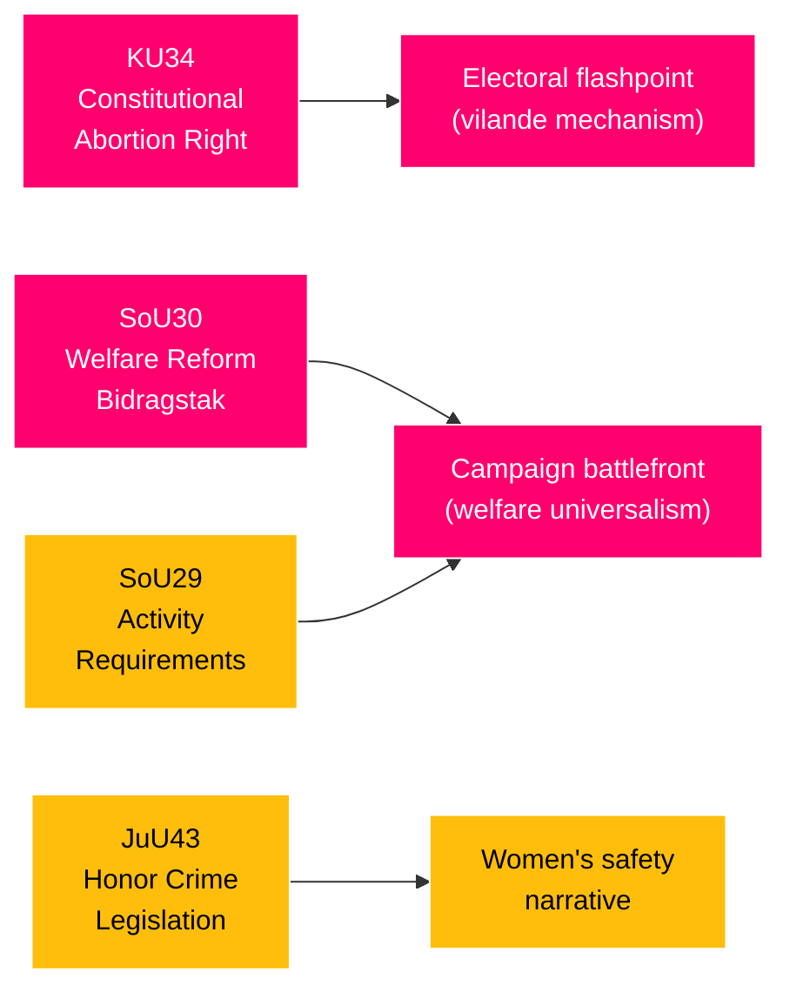

# Classification Results
**Date**: 2026-05-20 | **Subfolder**: realtime-pulse  
**Framework**: Political-classification-guide.md | Admiralty Code | GDPR Art. 9

---

## Document Classification Matrix

| Document | Policy Domain | Political Dimension | Ideological Axis | GDPR Category | Admiralty |
|----------|--------------|--------------------|--------------------|---------------|-----------|
| HD01KU34 | Constitutional law / Fundamental rights | High — constitutional change, broad coalition | Rights-expansion vs. security-conditionality | Art. 9(2)(e) — publicly made public life | A2 |
| HD01SoU30 | Social policy / Welfare state | High — partisan divide S+V+C+MP vs. M+SD+KD+L | Universalism vs. conditionality | Art. 9(2)(e) | A2 |
| HD01SoU29 | Social policy / Labour activation | High — partisan divide | Universal welfare vs. conditional activation | Art. 9(2)(e) | A2 |
| HD01JuU43 | Criminal law / Gender equality | Moderate — broad support, minor reservations | Protective legislation (consensus) | Art. 9(2)(e) | A2 |
| HD01FiU38 | EU financial regulation | Low — technical implementation | Not partisan | N/A — no personal data | A1 |

---

## Policy Domain Classification

### Constitutional Law (KU34)
- **Domain**: Fundamental rights — Regeringsformen ch. 2
- **Constitutional significance**: EXCEPTIONAL — amendment requires two riksdagsbeslut with election interval (RF ch. 8:14). Today's first reading (vilande) is the critical enabling step.
- **Scope**: Universal (all Swedish citizens, dual citizens, organizations)
- **Rights affected**: Reproductive rights, freedom of association, citizenship
- **Reversibility**: LOW — constitutional change is structurally resistant; but vilande mechanism allows post-election modification before second reading

### Social Policy — Welfare Conditionality (SoU29/30)
- **Domain**: Social insurance / Municipal welfare administration
- **Policy type**: Regulatory (activity requirements + benefit cap)
- **Administrative locus**: Municipal (kommunerna) — implementation responsibility falls on 290 municipalities
- **Population affected**: Estimated 300,000+ households receiving försörjningsstöd
- **EU alignment**: Consistent with EU activation framework but at the more conditional end of Nordic spectrum

### Criminal Law (JuU43)
- **Domain**: Criminal law / Gender equality / Cultural minority rights
- **Policy type**: Penal code amendment
- **Rights at stake**: Protection from honor-based violence; tension with cultural/religious practice claims

---

## Political Dimension Classification

### Partisan alignment map

| Legislation | M | SD | KD | L | S | V | C | MP |
|-------------|---|----|----|---|---|---|---|----|
| KU34 (support vilande) | ✅ | ✅ | ✅ | ✅ | ✅ | ❌ res. | ⚠️ res. | ⚠️ res. |
| SoU30 bidragstak | ✅ | ✅ | ✅ | ✅ | ❌ | ❌ | ❌ | ❌ |
| SoU29 activity req | ✅ | ✅ | ✅ | ✅ | ❌ | ❌ | ❌ | ❌ |
| JuU43 honor crimes | ✅ | ✅ | ✅ | ✅ | ✅ | ✅ | ✅ | ✅ |

*Source: HD01KU34, HD01SoU29, HD01SoU30, HD01JuU43 betänkanden — reservation filings*

---

## GDPR Classification

**Legal bases under GDPR Art. 9**:
- **Art. 9(2)(e)**: Data manifestly made public by individuals (parliamentary debate, party positions, named MPs filing reservations)
- **Art. 9(2)(g)**: Substantial public interest — democratic accountability, parliamentary monitoring

**Data minimisation**: Analysis uses only publicly stated political positions, official documents, and aggregated voting patterns. No individual health, financial, or private data processed.

**DPIA required**: No — processing covers exclusively public political activity by public officials in their official capacities.

---

## Classification Summary

| Dimension | Rating |
|-----------|--------|
| Constitutional significance | EXCEPTIONAL |
| Electoral relevance | CRITICAL (116 days to election) |
| Policy domain breadth | HIGH (constitutional + social + criminal) |
| Partisan contestation | HIGH (KU34 cross-party; SoU contested) |
| Aggregate day significance | 9.0/10 |
| GDPR risk | LOW (Art. 9(2)(e)(g) applied) |

*Sources: HD01KU34, HD01SoU29, HD01SoU30, HD01JuU43. Methodology: analysis/methodologies/political-classification-guide.md.*
