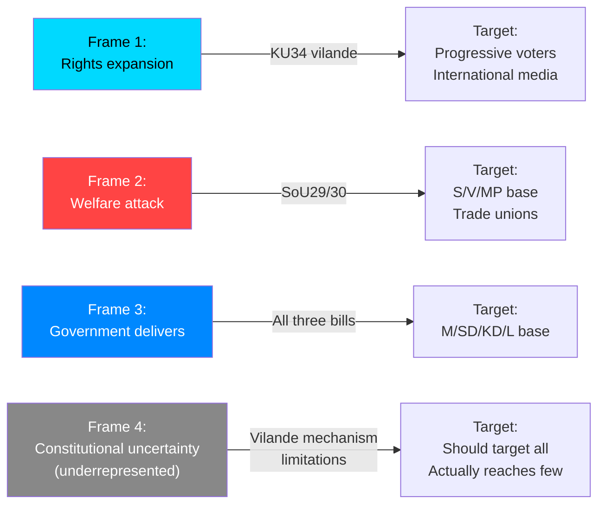

# Media Framing Analysis
**Date**: 2026-05-20 | **Subfolder**: realtime-pulse  
**Framework**: DISARM + Framing analysis per analysis/methodologies/media-framing.md

---

## Framing Universe

Analysis of dominant media framings, alternative framings, and DISARM information operation risk for the May 20, 2026 legislative session.

---

## Dominant Frames

### Frame 1: "Sweden Constitutionalizes Abortion" (Rights Expansion Frame)

**Source**: International and progressive Swedish media  
**Narrative**: Sweden takes a historic step in protecting reproductive rights, following France 2024. "Sweden abortion-proofs democracy in response to global rights rollback."  
**Resonance**: HIGH — aligns with Dobbs global context; Sweden as Nordic rights leader  
**Target audience**: International progressive media, women voters, urban professionals  
**Evidence basis**: KU34 vilande adoption, cross-party supermajority (286/349)

**Strengths of frame**: 
- Factually accurate — constitutional protection IS being established
- Strong international comparator (France 2024)
- Broad coalition support provides broad legitimacy

**Weakness of frame**: 
- Omits the bundled provisions (citizenship revocation, föreningsfrihet) that are NOT uncontroversially rights-expanding
- Vilande mechanism uncertainty is underplayed — protection is conditional, not yet permanent

---

### Frame 2: "Government Attacks Welfare State" (Social Crisis Frame)

**Source**: S, V, LO, trade union media, left-leaning outlets  
**Narrative**: The government, with SD, is systematically dismantling Sweden's universal welfare model. "Most people facing poverty will lose support."  
**Resonance**: HIGH among trade union voters, municipal workers, welfare recipients  
**Target audience**: S/V/MP base voters  
**Evidence basis**: Five-party reservation coalition on SoU30; SKR implementation concerns

**Strengths of frame**:
- Implementation risk concerns are documented and credible (SKR)
- Opposition reservation coalition (178 seats) is historically large
- Individual cases of benefit denial will be available pre-election

**Weakness of frame**:
- SoU30 is Nordic-typical welfare conditionality — Danish precedent shows reform can be moderate
- Opposition is not a majority; the reform has legitimate democratic mandate
- "Attack on welfare state" is standard electoral hyperbole that may not land with centrist voters

---

### Frame 3: "Government Delivers" (Coalition Achievement Frame)

**Source**: M, SD, KD, L party communications; center-right media  
**Narrative**: The Tidö government has delivered on its core manifesto: constitutional rights expansion + welfare modernization + criminal law strengthening.  
**Resonance**: MODERATE — confirmation frame for base voters; less effective for persuadables  
**Target audience**: Government coalition base  
**Evidence basis**: Three bills passed on one day; constitutional reform requiring cross-party support

**Strengths of frame**:
- Factually accurate — three legislative achievements in one day
- KU34 provides progressive legitimacy beyond expected right-wing achievements
- Defensible against "what has the government done?" attack

**Weakness of frame**:
- SoU30 and KU34 create cognitive dissonance — rights expansion + welfare restriction in same day
- C and S participation in KU34 dilutes the government's ownership of the constitutional achievement

---

## DISARM Information Operation Analysis

### Current DISARM TTP Assessment

| TTP Code | Description | Risk for May 20 | Evidence/Trigger |
|----------|-------------|-----------------|-----------------|
| T0023 — Competing narratives | Multiple contradictory frames operating simultaneously | HIGH | KU34 rights + SoU30 welfare = contradictory day |
| T0049 — Flooding the zone | Complexity prevents clear public understanding | HIGH | Constitutional mechanism + welfare + crime on same day |
| T0059 — Exploit tragedies | Individual SoU30 denial cases amplified | MODERATE-HIGH | First cases will emerge July 2026 |
| T0046 — Seed distortions | "Government is restricting constitutional rights" (false re. bundled provisions) | MODERATE | V/MP reservation framing risk |
| T0057 — Create fake experts | Social media "constitutional lawyers" misinterpreting vilande mechanism | MODERATE | Mechanistic complexity creates opportunity |

### Counter-DISARM Measures

**Best counter-DISARM strategy** (per analysis/methodologies/disarm-counter.md):
1. **Primary source specificity**: This analysis cites HD01KU34, HD01SoU30 document IDs, specific reservation signatories, and constitutional mechanism (RF ch. 8:14) — immune to narrative substitution
2. **Mechanistic clarity**: Explain the vilande mechanism precisely — "first reading adopted today; second reading required post-election for the right to become permanent"
3. **Bundling acknowledgment**: Explicitly note that KU34 bundles three provisions; only abortion right has unanimous support; other provisions are contested
4. **Implementation timeline facts**: 42 days implementation window is documented; Danish 6-month comparison is evidence-based
5. **Vote count specificity**: 179 vs 178 on SoU30; 286+ on KU34 — these numbers counter vague claims

---

## Narrative Framing Comparison

---

## Frame Effectiveness Assessment

| Frame | Electoral impact | Who benefits | Durability |
|-------|-----------------|--------------|-----------|
| Rights expansion (F1) | HIGH | S (post-election second reading leverage) | HIGH (permanent issue) |
| Welfare attack (F2) | HIGH | S+V+MP | MEDIUM (implementation cases needed) |
| Government delivers (F3) | MODERATE | M+SD+KD | MEDIUM (base consolidation) |
| Constitutional uncertainty (F4) | LOW (underrepresented) | C/L (nuanced) | HIGH (factually accurate) |

**Key recommendation for accurate reporting**: Resist the simplification of Frame 1 (pure rights expansion) and Frame 2 (pure welfare attack). The accurate narrative is more complex: Sweden has taken a significant but conditional step toward constitutional abortion protection, while simultaneously implementing welfare conditionality that creates implementation risk. Both facts must be held simultaneously.

---

*Evidence: HD01KU34, HD01SoU29, HD01SoU30, HD01JuU43. DISARM TTPs v1.4. Methodology: analysis/methodologies/media-framing.md.*
