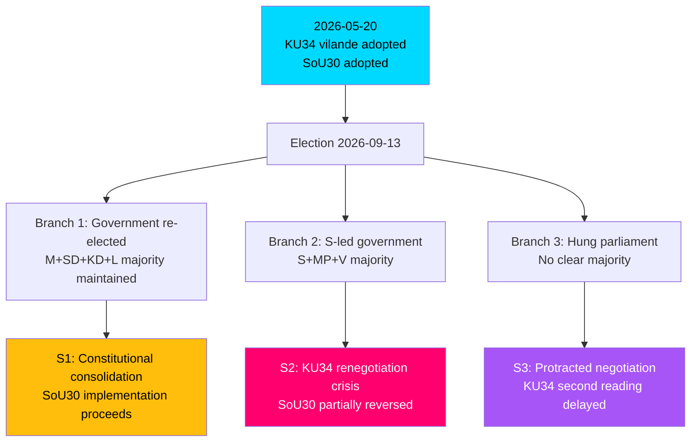

# Scenario Analysis
**Date**: 2026-05-20 | **Subfolder**: realtime-pulse  
**Framework**: Scenario planning per analysis/methodologies/scenario-framework.md  
**Horizon**: T+116d (election) + T+180d (second KU34 reading window) + T+365d

---

## Scenario Architecture

Three primary branches from the decisive bifurcation point: September 2026 election outcome.

---

## Scenario 1: Government Re-elected (Probability: 35%)

**Title**: Constitutional Consolidation  
**Conditions**: M+SD+KD+L retains 175+ mandate majority; no major seat shift

**Sequence of events**:
1. September 2026: Government re-elected
2. October 2026: New parliament constituted; same parties form government
3. November 2026: KU34 second reading scheduled in new parliament
4. December 2026 / Q1 2027: Second reading passes (~290+ votes in favor); KU34 becomes permanent
5. January 2027: SoU30 full implementation underway; initial municipal data collected
6. Mid-2027: Assessment of SoU30 outcomes; government adjusts implementation guidance

**KU34 dynamics**: Easy passage of second reading — same parliamentary arithmetic. V/C/MP reservations on bundled provisions may trigger minor modifications in second reading text but abortion right secured.

**SoU30 dynamics**: Implementation proceeds; municipal struggles visible but managed. Government communications emphasize early successes; opposition maintains implementation failure narrative.

**Electoral/constitutional significance**: Sweden becomes the first Nordic country with constitutionally protected abortion right. International template for reproductive rights protection.

**Risks within scenario**: SoU30 implementation failures create political liability even in re-elected government; KD/L internal tensions on welfare harshness.

---

## Scenario 2: S-Led Government (Probability: 40%)

**Title**: Constitutional Renegotiation Crisis  
**Conditions**: S wins plurality; forms government with MP+V support (or minority); C provides confidence-and-supply

**Sequence of events**:
1. September 2026: S becomes largest party; government negotiations begin
2. October 2026: Coalition negotiations dominated by KU34 second reading conditions
3. Key tension: V and MP demand modification of citizenship revocation + föreningsfrihet provisions BEFORE second reading
4. November 2026: Risk of KU34 second reading delay while conditions negotiated
5. December 2026: Either (a) second reading with modifications (complex legally) or (b) pass as-is (politically costly for V/MP) or (c) delay to 2027

**KU34 second reading options**:
- **Option A**: Pass as-is (most legally clean; politically difficult for S/V/MP to accept bundled provisions)
- **Option B**: Modify provisions in second reading (legally untested under RF ch. 8:14 — possible but unprecedented)
- **Option C**: Delay/deadlock — most damaging outcome; constitutional abortion right lapses

**SoU30 dynamics**: S government moves quickly to modify or suspend welfare conditionality via proposition. New betänkande possible by Q1 2027. Municipal implementation paused pending new legislation.

**Critical risk**: If KU34 lapses due to political deadlock, it becomes the defining constitutional failure of Swedish democracy in a generation.

---

## Scenario 3: Hung Parliament (Probability: 25%)

**Title**: Protracted Negotiation  
**Conditions**: Neither bloc achieves 175 mandates; C/L hold balance of power

**Sequence of events**:
1. September 2026: No clear majority
2. October–December 2026: Extended government formation negotiations (5–8 weeks historically)
3. KU34 second reading clock ticking — must be passed before the current riksdag term expires (constitutional interpretation: new parliament term begins September 2026; second reading must occur in this new parliament)
4. Risk: If government formation stalls past December 2026, second reading becomes procedurally urgent
5. January 2027: Either national unity government on KU34 second reading OR continued uncertainty

**Unique dynamics**: A hung parliament could paradoxically force cross-party agreement on KU34 (all parties agree on abortion component; second reading passes with modifications by agreement) — producing a stronger constitutional text.

**SoU30 dynamics**: Government in caretaker capacity; SoU30 implementation paused or slowed; municipal guidance unclear.

---

## Wildcard Scenarios

### WC1: KU34 Constitutional Challenge Before Second Reading
**Probability**: LOW (10%)  
A constitutional scholar or party challenges the bundled KU34 provisions before Lagrådet or via EU law. Could force a partial re-do of the first reading. Trigger: European Court of Justice advisory opinion on citizenship revocation.

### WC2: SoU30 Implementation Emergency
**Probability**: MODERATE-LOW (20%)  
A high-profile case of benefit denial (child homelessness, medical emergency) before election day creates a pre-election welfare crisis. Forces emergency Riksdag session. Trigger: Municipal non-implementation or mass administrative denials by August 2026.

### WC3: International Diplomatic Impact
**Probability**: LOW (5%)  
Sweden's constitutional abortion right triggers international conservative political campaign pressure (US evangelical organizations, European nationalist parties). Creates unexpected international dimension to Swedish domestic politics.

---

## Scenario Comparison Table

| Dimension | S1: Gov re-elected | S2: S government | S3: Hung parliament |
|-----------|--------------------|--------------------|---------------------|
| KU34 second reading | Passes easily, Dec 2026 | Risk of delay/modification | Forced cross-party deal |
| SoU30 outcome | Full implementation | Partial reversal, 2027 | Implementation paused |
| Constitutional security | HIGH | MODERATE-LOW | MODERATE |
| Welfare policy stability | HIGH | LOW | MODERATE |
| Election significance | Confirmation | Mandate for change | Realignment |
| IMF economic impact (SEK) | Neutral-positive | Uncertain (transition) | Negative (delay premium) |
| Probability | 35% | 40% | 25% |

---

*Evidence: HD01KU34 (vilande mechanism), HD01SoU29, HD01SoU30, HD01JuU43. Framework: analysis/methodologies/scenario-framework.md. Election arithmetic per Riksdag mandate distribution.*
