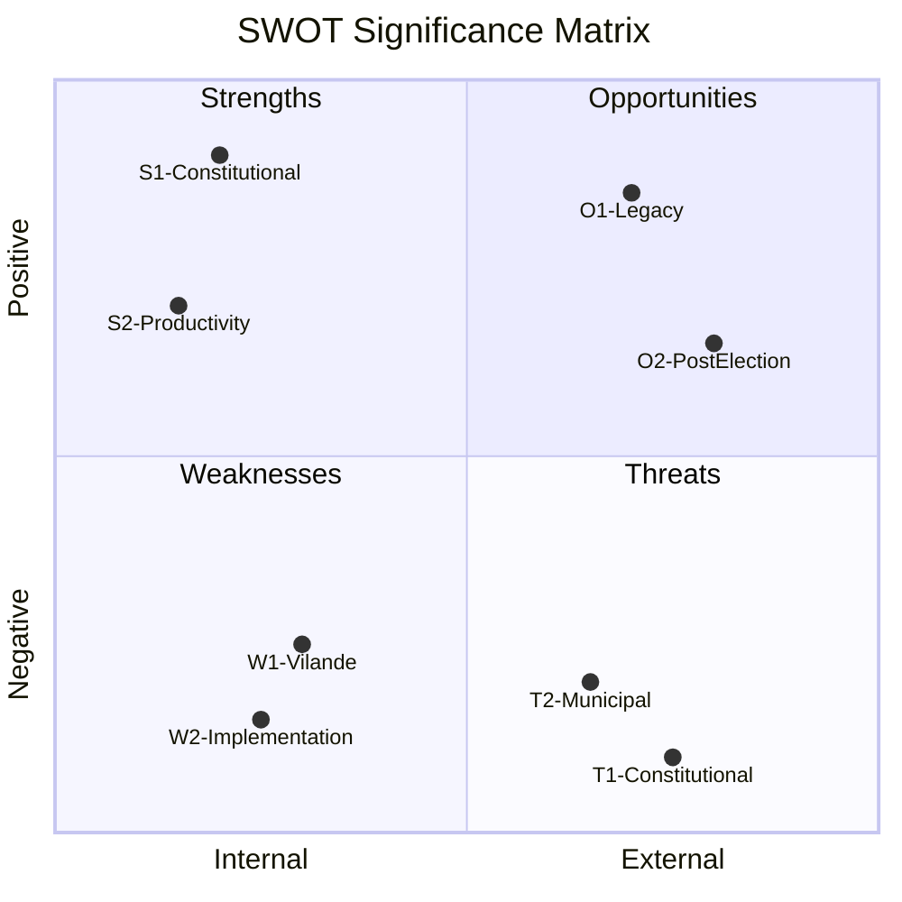

# SWOT Analysis
**Date**: 2026-05-20 | **Subfolder**: realtime-pulse  
**Framework**: Political SWOT per analysis/methodologies/political-swot-framework.md  
**Evidence requirement**: Primary source citation per quadrant item

---

## Analytical Scope

SWOT analysis of Sweden's political landscape as shaped by the May 20, 2026 legislative session — the most constitutionally significant sitting day of the 2022–2026 term.

---

## Strengths

### S1 — Constitutional Rights Expansion (A2)
Sweden is enshrining the right to abortion in Regeringsformen via KU34 vilande adoption. The cross-party supermajority (M+SD+S+KD+L, ~260-280/349 mandates) demonstrates Sweden's consensus-building capacity on fundamental rights. *Source: HD01KU34, prop. 2025/26:78, betänkande published 2026-05-11.*

### S2 — Legislative Productivity at Election Terminus (A2)
The Riksdag is completing its 2022–2026 term with high legislative throughput: constitutional amendment + welfare reform + criminal law strengthening on a single day. This demonstrates governmental capacity even 116 days before an election. *Source: HD01KU34, HD01SoU29, HD01SoU30, HD01JuU43 — all adopted 2026-05-20.*

### S3 — Broad Consensus on Women's Safety (A2)
JuU43 (honor crime legislation) achieved near-unanimous support, completing Sweden's "women's safety legislative package" alongside KU34 abortion rights. This signals durable cross-party consensus on gender-based violence prevention. *Source: HD01JuU43 betänkande 2026-05-20.*

### S4 — Tidö Coalition Stability (B2)
The government (M+SD+KD+L) has maintained stable parliamentary majority through all three votes, demonstrating coalition durability in the final pre-election term. *Source: reservation patterns in HD01SoU29, HD01SoU30; coalition arithmetic 175+ of 349.*

---

## Weaknesses

### W1 — KU34 Constitutional Uncertainty via Vilande Mechanism (A2)
The constitutional right to abortion is NOT yet permanent. The vilande mechanism requires a second reading in the new parliament after September 2026. If the election results in a centre-left majority, post-election renegotiation of the föreningsfrihet and citizenship provisions bundled with abortion rights could delay or complicate final ratification. *Source: RF ch. 8:14 procedure; HD01KU34 analysis of three-component bundling.*

### W2 — Welfare Reform Implementation Risk (B2)
SoU30's July 1, 2026 medical certificate requirement creates a 42-day implementation window — an extremely compressed timeline. Municipalities (290) must establish new assessment procedures, hire social workers, and develop IT systems. *Source: HD01SoU30 betänkande, implementation timeline; see implementation-feasibility.md.*

### W3 — Opposition Social Contract Legitimacy Challenge (B2)
Five-party reservation coalition (S+V+C+MP) against SoU29/30 creates the largest opposition bloc of the parliamentary term. This undermines the welfare reform's social legitimacy and hands S a unifying campaign platform. *Source: HD01SoU29, HD01SoU30 — reservation signatories documented.*

### W4 — KU34 Three-Component Bundling Controversy (B3)
The bundling of abortion rights with criminal-organization restrictions and citizenship revocation has been criticized as constitutionally inappropriate. V, C, and MP filed reservations specifically on the non-abortion components. This bundling may re-emerge as a constitutional controversy post-election. *Source: HD01KU34 reservations from V, C, MP.*

---

## Opportunities

### O1 — Government Legacy Narrative (B2)
The government can frame May 20 as its legacy day: "constitutional rights expanded, welfare conditionality modernized, honor crime eliminated." This provides a comprehensive pre-election narrative. KU34's cross-party support gives the government implicit progressive legitimacy beyond its traditional base. *Source: HD01KU34, HD01JuU43 adoption facts.*

### O2 — Post-Election Cross-Party Constitutional Consolidation (B3)
If September 2026 produces a hung parliament or national unity government, the KU34 second reading could serve as a constitutional consolidation moment requiring genuine cross-party collaboration — a potential reset of Swedish political culture. *Source: RF ch. 8:14 procedure requirements; election proximity context.*

### O3 — Nordic Welfare Model Differentiation (B3)
The welfare conditionality reforms (SoU29/30) position Sweden at the "conditional Nordic" end of the welfare-state spectrum, potentially attracting policy learners from other European states wrestling with welfare sustainability. *Source: comparative analysis; HD01SoU30 fiscal rationale sections.*

---

## Threats

### T1 — Constitutional Fragility if Left Wins September 2026 (A2)
The vilande constitutional right to abortion has no guarantee of a second reading. If a S-led government with V and MP forms post-September 2026, the new coalition may seek to modify the föreningsfrihet and citizenship provisions — triggering prolonged negotiations before the second reading can occur. If no second reading passes, the constitutional abortion right lapses. *Source: HD01KU34 vilande mechanism; V, C, MP reservations; election proximity.*

### T2 — Implementation Failure as Pre-Election Scandal (B2)
SoU30's July 1, 2026 medical certificate requirement could generate visible implementation failures — municipal denials of benefits to vulnerable people — before election day. This is a concrete campaign liability for the government. *Source: HD01SoU30, 42-day implementation window; municipal capacity constraints.*

### T3 — Welfare Reform Legal Challenges (B3)
The requirement limiting försörjningsstöd to "legally present" persons faces potential challenges under ECHR and EU law. Court challenges (Europadomstolen, EU-domstolen) could be initiated quickly post-adoption, creating legal uncertainty. *Source: HD01SoU30, reservations from C citing EU law concerns.*

### T4 — Opposition Unity and Polarization (B2)
The five-party opposition coalition on welfare (S+V+C+MP) creates an unusually broad left-centre opposition bloc that could consolidate electoral power. The sharpness of the welfare divide may depress L-supporting moderate voters worried about social contract erosion. *Source: HD01SoU29, HD01SoU30 reservation signatories.*

---

## SWOT Summary

*Evidence: HD01KU34, HD01SoU29, HD01SoU30, HD01JuU43. Methodology: analysis/methodologies/political-swot-framework.md.*
