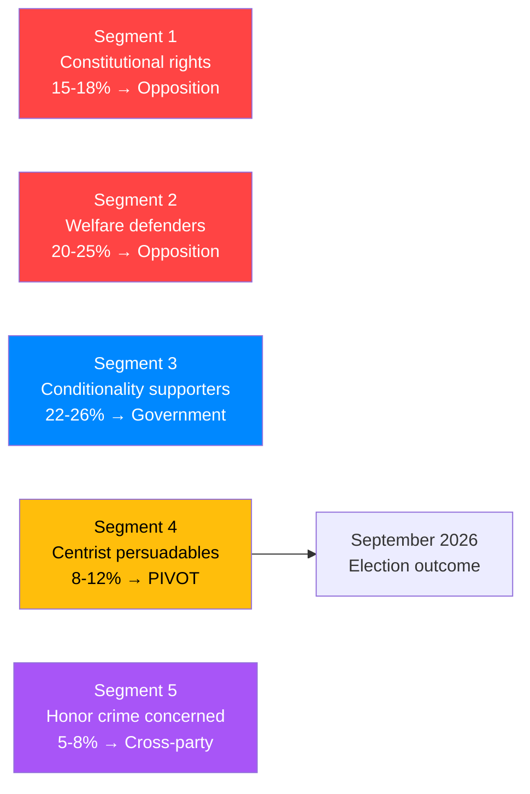

# Voter Segmentation
**Date**: 2026-05-20 | **Subfolder**: realtime-pulse  
**Framework**: Voter psychology and segmentation per analysis/methodologies/voter-segmentation.md

---

## Segmentation Dimensions

Voter segments are defined by: (1) issue salience, (2) party affiliation probability, (3) persuadability, (4) activation likelihood from May 20 events.

---

## Segment 1: Constitutional Rights Voters (KU34 salient)

**Size estimate**: ~15-18% of electorate  
**Core concerns**: Reproductive rights, gender equality, civil liberties  
**Party distribution**: S(40%), V(20%), MP(15%), L(10%), M(10%), other(5%)  
**Activation by KU34**: HIGH — vilande adoption is a galvanizing event  
**Electoral direction**: Predominantly opposition (S+V+MP)

**Behavioral prediction**:
- This segment will be highly engaged in September 2026 election
- The vilande mechanism creates specific motivation: "must vote to protect KU34"
- KU34 second reading framing ("your vote determines if abortion right becomes permanent") is uniquely motivating for this segment
- S benefits most from this segment's activation — S can claim post-election constitutional guarantee

**Campaign message resonance**: "Protect what we've built" (S), "Our constitutional legacy" (M), "Vote to make it permanent" (generic)

---

## Segment 2: Welfare State Defenders (SoU29/30 opposing)

**Size estimate**: ~20-25% of electorate  
**Core concerns**: Welfare universalism, social safety net, municipal services  
**Party distribution**: S(55%), V(25%), MP(10%), C(5%), other(5%)  
**Activation by SoU30**: HIGH — welfare conditionality hits this segment's identity  
**Electoral direction**: Opposition (S+V+MP)

**Behavioral prediction**:
- Pre-election implementation failures (benefit denials, medical certificate problems) will amplify this segment's mobilization
- Union affiliation (LO, TCO) correlates strongly with this segment
- S's "defending the welfare model" narrative has straightforward purchase here
- Municipal workers witnessing implementation struggles may shift from M/L to S

---

## Segment 3: Welfare Conditionality Supporters (SoU30 favoring)

**Size estimate**: ~22-26% of electorate  
**Core concerns**: Welfare sustainability, immigration cost management, work incentives  
**Party distribution**: SD(40%), M(30%), KD(15%), L(8%), other(7%)  
**Activation by SoU30**: MODERATE — confirmation vote, not galvanizing (expected)  
**Electoral direction**: Government (M+SD+KD+L)

**Behavioral prediction**:
- This segment treats SoU30 as "what the government was elected to do"
- Less emotionally activated than Segment 2 because SoU30 is an expected government delivery
- SD voters are most energized by "legally present" criterion targeting non-citizens
- Segment may be demobilized if no dramatic pre-election SoU30 news (no crisis = no activation)

---

## Segment 4: Moderate Centrist Persuadables (C/L swing voters)

**Size estimate**: ~8-12% of electorate  
**Core concerns**: EU alignment, economic competence, institutional stability  
**Party distribution**: C(45%), L(35%), soft-M(10%), soft-S(10%)  
**Activation by May 20 events**: MODERATE — both KU34 and SoU30 create cognitive dissonance  
**Electoral direction**: GENUINELY PERSUADABLE — this segment decides the election

**Cognitive dissonance**:
- KU34 → This segment supports constitutional rights (activation toward opposition/progressive)
- SoU30 → This segment is divided; many C/L voters support conditionality as EU-aligned policy, but are uncomfortable with the harshest restrictions
- The combination of both issues on the same day may produce decision paralysis or nuanced positioning ("support KU34 AND support some welfare conditionality")

**Critical electoral importance**: Segments 1-3 are largely mobilized in predictable directions. Segment 4 is where the election is won or lost. C (25 seats) and L (16 seats) together hold the balance. The M+SD+KD+L government's 179-seat majority (from 2022) may be at risk precisely because May 20 activates Segment 1 more than Segment 3.

**Key persuadable message**:
- For C voters: "SoU30 EU law concerns (our R5 reservation) show we hold the government accountable"
- For L voters: "KU34 is L's constitutional legacy; we led the rights expansion"
- Against: "Government coalition is too dependent on SD's welfare-restriction agenda"

---

## Segment 5: Honor Crime Concerned Voters (JuU43 salient)

**Size estimate**: ~5-8% of electorate  
**Core concerns**: Gender equality, cultural integration, women's safety  
**Party distribution**: Cross-party — but especially M(30%), S(25%), L(15%), SD(20%), KD(10%)  
**Activation by JuU43**: LOW-MODERATE — JuU43 is widely supported; less polarizing  
**Electoral direction**: Cross-party; not a decisive segment for the election outcome

---

## Aggregate Electoral Segment Map

**May 20 activation assessment**:
- Segments 1+2 (opposition): ~35-43% of electorate — HIGH activation, opposition direction
- Segment 3 (government): ~22-26% of electorate — MODERATE activation, government direction
- Segment 4 (pivot): ~8-12% — UNCERTAIN, cognitive dissonance from dual KU34+SoU30
- **Net assessment**: May 20 events create slightly more opposition activation than government activation, consistent with a slight opposition electoral advantage

---

*Evidence: HD01KU34, HD01SoU30, HD01JuU43, parliamentary arithmetic. Methodology: analysis/methodologies/voter-segmentation.md.*
