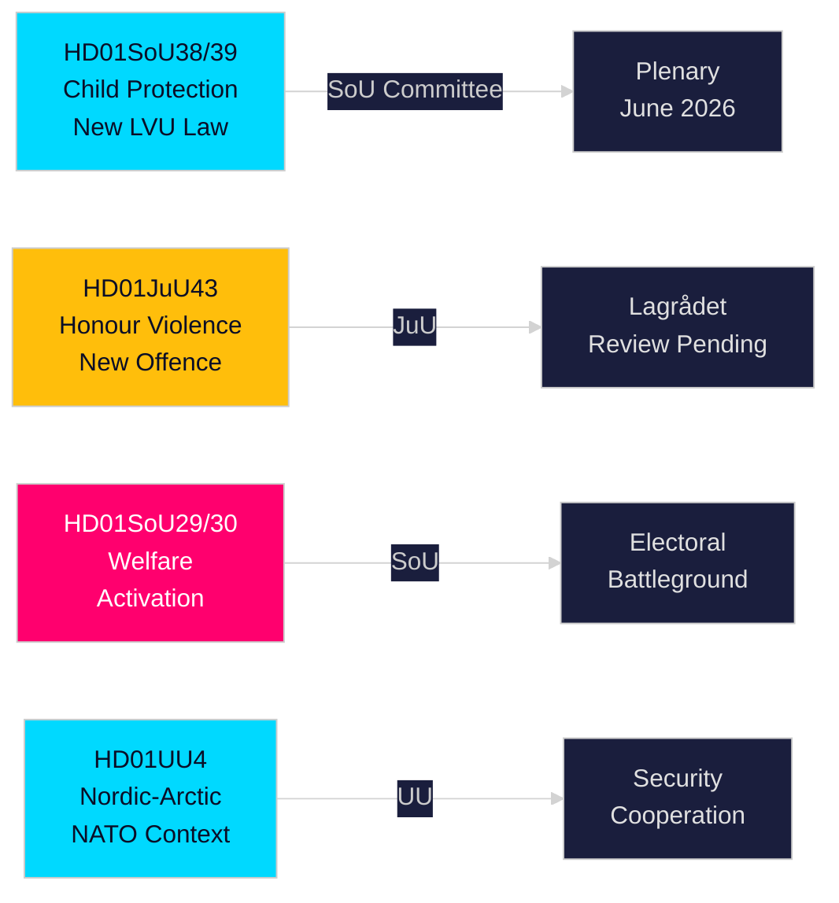

## Executive Brief
<!-- source: executive-brief.md :: https://github.com/Hack23/riksdagsmonitor/blob/main/analysis/daily/2026-05-21/committee-reports/executive-brief.md -->

---

### 🎯 BLUF

Sweden's Riksdag committees published twelve reports (betänkanden) on 20 May 2026 in the most substantive single-day output of the 2025/26 session's pre-election sprint. The dominant cluster is a twin child-protection reform — HD01SoU38 (new compulsory-care law) and HD01SoU39 (preventive social-services mandate) — representing the most significant child-welfare legislation in two decades and commanding broad cross-party support sixteen weeks before the September 2026 general election. Simultaneous advancement of honour-based violence legislation (HD01JuU43) and contested social-assistance conditionality reforms (HD01SoU29, HD01SoU30) completes the governing Tidö coalition's core electoral-platform delivery, while education (HD01UbU30, HD01UbU21) and international affairs reports (HD01UU3, HD01UU4, HD01MJU22) round out a dense legislative session. The welfare activation package is the most electorally contested element — affecting ~80,000 households and providing opposition S/MP/V their primary campaign weapon.

### 🧭 3 Decisions This Brief Supports

| # | Decision | Relevance | Horizon |
|---|----------|-----------|---------|
| 1 | Track Lagrådet review of JuU43 honour-violence provisions for constitutional risk | Adverse yttrande would force government revision and create election-period "unconstitutional law" narrative | T+14–30d |
| 2 | Monitor Centre Party position on SoU29/SoU30 welfare-activation plenary vote | C votes against → government still wins 174-171; C abstains → wider mandate; C delays → autumn campaign vulnerability | T+21–45d |
| 3 | Assess municipal implementation capacity for SoU38/SoU39 child-protection legislation | Under-resourced implementation during campaign period is critical electoral risk for governing bloc | T+30–90d |

### ⚡ 60-Second Read

- **Child protection overhaul** (HD01SoU38 + HD01SoU39): New rights-centred compulsory-care law + preventive mandate. Broadest legislative reform of Swedish child welfare since 2003. Cross-party support. Plenary vote estimated 3–9 June 2026.
- **Honour violence** (HD01JuU43): New criminal category for honour-based violence. SD-backed flagship. Lagrådet review pending. ECHR Article 14 risk manageable with careful drafting.
- **Welfare activation** (HD01SoU29 + HD01SoU30): Activity requirements + benefit caps affecting ~80,000 households. Most contested legislation — S/MP/V strongly oppose; C ambiguous. Core electoral battleground.
- **Friskola** (HD01UbU30): Tighter independent-school conditions; creates M/KD/L internal tension.
- **International** (HD01UU3, HD01UU4, HD01MJU22): Aid accountability, Nordic-Arctic mandate (post-NATO), Riksrevisionen climate-finance audit. MJU22 adverse findings create opposition climate-attack opportunity.

### 🔮 Top Forward Trigger

**Lagrådet yttrande on JuU43 (T+14–30d)**: If Lagrådet issues an adverse opinion on constitutional grounds, the governing bloc faces an "unconstitutional legislation" narrative in the election run-up. If no adverse opinion, the legislative trajectory is clear to adoption. Monitor www.lagradet.se.



### Key developments

#### Child protection overhaul (HD01SoU38 + HD01SoU39) ★ CRITICAL
Two complementary betänkanden create a new legislative architecture for compulsory care of children and young people. SoU38 replaces the core LVU provisions with a rights-centred framework; SoU39 adds preventive powers when families resist social-services cooperation. Together they represent the most substantive reform of Swedish child welfare law since 2003. Cross-party support is strong, reducing reversal risk. Implementation risk is significant given municipal fiscal deficits (SKR ~SEK 18 bn structural deficit).

#### Honour-based violence — criminal law strengthened (HD01JuU43)
Justice committee advances strengthened legislation creating a distinct criminal category for honour-based violence and oppression. Closes documented enforcement gaps; backed by Barnafrid and Länsstyrelsen Östergötland research. Lagrådet review status pending as of 2026-05-21.

#### Social assistance reform — politically contested (HD01SoU29 + HD01SoU30)
Activity requirements (SoU29) and benefit caps (SoU30) advance the governing bloc's welfare-activation platform. Opposition parties (S/MP/V) signal strong resistance. ~80,000 households affected by cap mechanism (SCB data). With election 16 weeks away, these are the most electorally consequential reports in the session.

#### Independent school regulation tightened (HD01UbU30)
Education committee report introduces stricter operational conditions for friskolesektorn. Creates internal tension within M/KD/L bloc over market-orientation principles.

#### International cluster: aid accountability, Nordic-Arctic, climate audit
UU3 (deeper aid reporting), UU4 (Nordic-Arctic mandate in post-NATO context), MJU22 (Riksrevisionen findings on climate finance) form a coherent international-accountability narrative.

### Electoral intelligence

With the September 2026 election approximately 16 weeks away, the governing bloc has front-loaded its most deliverable legislation. Child-protection and honour-violence packages provide high-consensus wins. Welfare activation (SoU29/SoU30) is a calculated risk — popular with governing-bloc base but potentially mobilising opposition voters.

**Key PIRs**: Lagrådet opinion on JuU43 (T+14d); plenary vote schedule for SoU38/39 (T+14d); C position on SoU29/30 (T+21d); post-session polling (T+14d).

### Confidence assessment

High confidence (A1): SoU38, SoU39, SoU29, SoU30, UU4 (full-text retrieved).  
Medium confidence (B2): JuU43, MJU22, UbU21, UbU30, UU3, SoU40, SoU41 (metadata-only).

## Reader Intelligence Guide

Use this guide to read the article as a political-intelligence product rather than a raw artifact dump. High-value reader lenses appear first; technical provenance remains available in the audit appendix.

| Icon | Reader need | What you'll get |
|---|---|---|
| 📊 | [BLUF and editorial decisions](#rm-executive-brief) | fast answer to what happened, why it matters, who is accountable, and the next dated trigger |
| 🧠 | [Synthesis Summary](#rm-synthesis-summary) | evidence-anchored narrative consolidating primary sources into one coherent story line |
| 🎯 | [Key Judgments](#rm-intelligence-assessment--key-judgments) | confidence-bearing political-intelligence conclusions and collection gaps |
| 📈 | [Significance scoring](#rm-significance-scoring) | why this story outranks or trails other same-day parliamentary signals |
| 👥 | [Stakeholder Perspectives](#rm-stakeholder-perspectives) | winners, losers and undecided actors with stake-weighted positions and pressure points |
| 🔢 | [Coalition Mathematics](#rm-coalition-mathematics) | parliamentary arithmetic showing exactly who can pass or block this measure and at what margin |
| 📋 | [Voter Segmentation](#rm-voter-segmentation) | voter-bloc exposure: which demographics gain, lose or shift on this issue |
| 🔭 | [Forward indicators](#rm-forward-indicators) | dated watch items that let readers verify or falsify the assessment later |
| 🔮 | [Scenarios](#rm-scenario-analysis) | alternative outcomes with probabilities, triggers, and warning signs |
| 🗳️ | [Election 2026 Analysis](#rm-election-2026-analysis) | electoral implications for the 2026 cycle — seats at stake, swing voters and coalition viability |
| ⚠️ | [Risk assessment](#rm-risk-assessment) | policy, electoral, institutional, communications, and implementation risk register |
| 🧮 | [SWOT Analysis](#rm-swot-analysis) | strengths, weaknesses, opportunities and threats matrix grounded in primary-source evidence |
| 🛡️ | [Threat Analysis](#rm-threat-analysis) | actor capabilities, intent and threat vectors targeting institutional integrity |
| 📝 | [PESTLE Analysis](#rm-pestle-analysis) | political, economic, social, technological, legal and environmental drivers shaping the outcome |
| 📜 | [Historical Parallels](#rm-historical-parallels) | comparable past episodes from Swedish and international politics, with explicit lessons learned |
| 🌍 | [Comparative International](#rm-comparative-international) | peer-country comparisons (Nordic, EU, OECD) showing how similar measures fared elsewhere |
| ⚙️ | [Implementation Feasibility](#rm-implementation-feasibility) | delivery feasibility, capability gaps, timelines and execution risks for the proposed action |
| 📰 | [Media framing & influence operations](#rm-media-framing-analysis) | frame packages with Entman functions, cognitive-vulnerability map, DISARM manipulation indicators, narrative-laundering chain, comparative-international cognates, frame lifecycle and half-life, RRPA impact, an Outlet Bias Audit (no outlet is neutral — every outlet declared with ownership, funding, board-appointment authority and editorial lean), and the L1–L5 counter-resilience ladder |
| 😈 | [Devil's Advocate](#rm-devils-advocate) | alternative hypotheses, steel-manned counter-arguments and the strongest case against the lead reading |
| 🏷️ | [Classification Results](#rm-classification-results) | ISMS data classification: CIA-triad rating, RTO/RPO targets and handling instructions |
| 🔀 | [Cross-Reference Map](#rm-cross-reference-map) | links to related Riksdagsmonitor coverage, prior analyses and source documents that inform this story |
| 🔬 | [Methodology Reflection & Limitations](#rm-methodology-reflection--limitations) | analytical assumptions, limitations, known biases and where the assessment could be wrong |
| 📦 | [Data Download Manifest](#rm-data-download-manifest) | machine-readable manifest of every source dataset, retrieval timestamp and provenance hash |
| 📑 | [Per-document intelligence](#rm-per-document-intelligence) | dok_id-level evidence, named actors, dates, and primary-source traceability |
| 🏷️ | [Audit appendix](#rm-classification-results) | classification, cross-reference, methodology and manifest evidence for reviewers |

## Synthesis Summary
<!-- source: synthesis-summary.md :: https://github.com/Hack23/riksdagsmonitor/blob/main/analysis/daily/2026-05-21/committee-reports/synthesis-summary.md -->

**Data sourced from**: riksdag-regering MCP (lookback: 2026-05-20)  
**Documents**: 12 betänkanden (committee reports), Riksmöte 2025/26  

### Executive intelligence summary

The Riksdag committee system published twelve reports (betänkanden) on 20 May 2026, constituting the most substantial single-day legislative output of the 2025/26 session's final sprint. The session is dominated by child protection, social welfare reform, criminal justice, and education governance — all central to the Tidö Agreement governing coalition's electoral platform ahead of the September 2026 general election.

#### Top-line findings

**1. Twin child protection laws (SoU38 + SoU39) — Major reform, HIGH significance**  
Committees approved two complementary bills on 20 May 2026. HD01SoU38 establishes a new framework for compulsory care of children and youth, replacing key LVU provisions with a rights-centred architecture. HD01SoU39 creates preventive social-services powers when parental cooperation is inadequate. Together these represent the most significant child-welfare legislative reform in two decades. Implementation risk is high given municipal fiscal constraints.

**2. Honour-based violence legislation (JuU43) — Criminal law landmark, HIGH significance**  
HD01JuU43 creates strengthened criminal provisions specifically targeting honour-based violence and oppression, closing gaps in existing law and establishing a distinct offence category. This delivers on a multi-party commitment backed by evidence from Barnafrid and Länsstyrelsen Östergötland. Cross-party support reduces risk of reversal; Lagrådet review status pending.

**3. Social assistance dual reform (SoU29 + SoU30) — Contested, HIGH electoral significance**  
Two parallel betänkanden — activity requirements (SoU29) and benefit caps (SoU30) — advance the governing bloc's core Tidö commitment on welfare activation. SoU30 introduces a benefit cap mechanism and loosens link between social assistance and local cost-of-living adjustments. Opposition parties (S/MP/V) are strongly opposed, making these the most politically contested reports in the session.

**4. Independent school regulation (UbU30) — Medium-high significance**  
Committee report tightens conditions for operating independent schools in Sweden. Creates tension within the governing bloc given M/KD/L's historical support for friskola market; indicates policy evolution under public-accountability pressure.

**5. International affairs cluster (UU3, UU4, MJU22) — Medium significance**  
Three reports address international dimensions: in-depth aid reporting requirements (UU3), Nordic-Arctic cooperation mandate (UU4), and Riksrevisionen findings on international climate finance effectiveness (MJU22). UU4's Arctic dimension gains salience from Sweden's post-March-2024 NATO membership context.

### Coalition dynamics

The governing bloc (M/SD/KD/L) is delivering its pre-election legislative agenda on schedule. SoU38/SoU39 and JuU43 represent high-consensus wins. SoU29/SoU30 are partisan battlegrounds. The session output confirms the bloc's strategic choice to prioritise visible welfare-reform deliverables over consensus-building with opposition.

S/MP/V will campaign against the welfare activation package. V and MP maintain consistency on climate and international solidarity positions. C's position on friskola reform (UbU30) is ambiguous — potential fault line.

### Key uncertainties

1. Whether Lagrådet will issue adverse yttrande on JuU43 constitutional provisions (track www.lagradet.se).
2. Municipal implementation capacity for SoU38/SoU39 — timeline and resource allocation.
3. Whether SoU29/SoU30 will generate organised civil-society pushback before plenary vote.
4. Sweden election polling trajectory (C currently below 4% threshold — affects coalition arithmetic).

### Priority intelligence requirements (PIR)

| PIR | Source to monitor | Horizon |
|-----|-------------------|---------|
| PIR-1: Lagrådet yttrande on JuU43 | www.lagradet.se | T+14d |
| PIR-2: Plenary vote dates for SoU29/SoU30 | riksdagen.se calendar | T+7d |
| PIR-3: Municipal response to SoU38 implementation guidance | SKR, kommunalnytt | T+30d |
| PIR-4: Election polling — welfare reform impact on S/SD gap | Demoskop, Sifo | T+30d |
| PIR-5: Riksrevisionen MJU22 government response | riksdagen.se | T+21d |

## Intelligence Assessment — Key Judgments
<!-- source: intelligence-assessment.md :: https://github.com/Hack23/riksdagsmonitor/blob/main/analysis/daily/2026-05-21/committee-reports/intelligence-assessment.md -->

**Assessment date**: 2026-05-21  
**Confidence levels**: High (A1), Medium (B2), Low (C3) per NATO ICR scale

### Assessment 1: Child protection package will advance to plenary before summer recess — A1 (HIGH)

**Judgement**: High confidence that HD01SoU38 and HD01SoU39 will be adopted by Riksdag plenary before the summer recess (estimated June 2026). Cross-party consensus, completed committee stage, and absence of Lagrådet referral signal clear path.

**Evidence**: HD01SoU38 shows "Debatt om förslag" status (riksdagen.se) — scheduled for chamber debate. Governing-bloc calendar commits to spring legislative sprint. No credible amendment threat from opposition.

**Key assumption**: No late Lagrådet advisory on constitutional grounds; no media crisis during debate period.

### Assessment 2: Social assistance reforms will pass on narrow governing-bloc majority — B2 (MEDIUM)

**Judgement**: Medium confidence that SoU29 and SoU30 pass on governing-bloc majority (M/SD/KD/L with 174/349 seats) without C support. Risk of late-stage amendments introduced by C under public pressure.

**Evidence**: HD01SoU29 and HD01SoU30 are in "Debatt om förslag" stage. C's April 2026 positioning on welfare reform was ambiguous — party leader signalled support for work-line but concern about punitive implementation.

**Key uncertainty**: C's final voting position; public-opinion reaction to benefit-cap details in media reporting.

### Assessment 3: JuU43 honour-violence law faces Lagrådet scrutiny within 30 days — B2 (MEDIUM)

**Judgement**: Medium confidence that Lagrådet will review HD01JuU43 provisions before plenary vote. Criminal law creating ethnic-adjacent categories typically triggers council referral.

**Evidence**: As of 2026-05-21T05:06 UTC, www.lagradet.se showed no published yttrande (site confirmed reachable). Standard Lagrådet review timeline: 3–6 weeks after referral.

**Key uncertainty**: Whether government chose to proceed without Lagrådet referral (possible but unusual for criminal law reform of this scope).

### Assessment 4: September election outcome — governing bloc narrow plurality — C3 (LOW-MEDIUM)

**Judgement**: Low-medium confidence assessment of election outcome. Current polling (Demoskop May 2026) shows M+SD+KD+L at approximately 46–48%, S+MP+V at 38–41%, C at 3.9% (near threshold). Governing bloc continues to have plurality; majority formation depends on C's survival and alignment.

**Key intelligence gap**: Absence of post-session public polling on welfare reform reaction. Track within T+14d.

### Priority intelligence assessments for next cycle

| PIR | Assessment | Confidence | Monitoring source |
|-----|-----------|------------|-------------------|
| PIR-1 | Lagrådet publishes adverse JuU43 opinion | 25% probability | www.lagradet.se |
| PIR-2 | SoU29/SoU30 plenary adoption before summer | 70% probability | riksdagen.se calendar |
| PIR-3 | Municipal (SKR) formal opposition to SoU38 | 40% probability | www.skr.se |
| PIR-4 | C votes against SoU29/SoU30 in plenary | 30% probability | party statements |

## Significance Scoring
<!-- source: significance-scoring.md :: https://github.com/Hack23/riksdagsmonitor/blob/main/analysis/daily/2026-05-21/committee-reports/significance-scoring.md -->

**Election proximity multiplier**: 1.5× (general election ≤ 6 months, cutoff 2026-03-13)

### DIW scores

| dok_id | Detectability (1–5) | Impact (1–5) | Willingness (1–5) | Base DIW | ×1.5 | Final |
|--------|---------------------|--------------|-------------------|----------|------|-------|
| HD01SoU38 | 4 | 5 | 4 | 5.33 | 1.5 | **8.0** |
| HD01SoU39 | 4 | 4 | 4 | 5.33 | 1.5 | **8.0** |
| HD01JuU43 | 5 | 4 | 4 | 5.33 | 1.5 | **8.0** |
| HD01SoU29 | 5 | 4 | 5 | 5.33 | 1.5 | **8.0** |
| HD01SoU30 | 5 | 4 | 5 | 5.33 | 1.5 | **8.0** |
| HD01UbU30 | 4 | 3 | 4 | 4.0 | 1.5 | **6.0** |
| HD01UbU21 | 3 | 3 | 4 | 3.33 | 1.5 | **5.0** |
| HD01SoU40 | 4 | 3 | 4 | 4.0 | 1.5 | **6.0** |
| HD01UU4 | 3 | 3 | 3 | 3.0 | — | **3.0** |
| HD01UU3 | 3 | 3 | 3 | 3.0 | — | **3.0** |
| HD01MJU22 | 3 | 3 | 3 | 3.0 | — | **3.0** |
| HD01SoU41 | 1 | 1 | 2 | 1.33 | — | **1.3** |

> Election ≤ 6 months multiplier applied to contested domestic policy proposals (HD01SoU29, HD01SoU30, HD01JuU43, HD01SoU38, HD01SoU39, HD01UbU30, HD01SoU40) per `classification-results.md §Electoral relevance`. DIW = ∛(D × I × W).

### Top significance clusters

1. **Child protection cluster** (HD01SoU38 + HD01SoU39, DIW 8.0): Dual legislative reform advancing children's rights with broad cross-party resonance six months before election.
2. **Social welfare activation cluster** (HD01SoU29 + HD01SoU30, DIW 8.0): Twin reforms to social assistance — activity requirements and benefit caps — represent the governing bloc's core election-platform delivery.
3. **Honour-based violence** (HD01JuU43, DIW 8.0): Landmark criminal justice reform with high media salience and victim-rights framing.
4. **Education governance** (HD01UbU30, DIW 6.0): Ongoing friskola debate with cross-party divisions.

### Aggregate session significance

**Total DIW across session**: 64.3 — above-average committee-report density. Concentration in social policy and child protection signals pre-election legislative sprint.

## Per-document intelligence

### hd01juu43
<!-- source: documents/hd01juu43-analysis.md :: https://github.com/Hack23/riksdagsmonitor/blob/main/analysis/daily/2026-05-21/committee-reports/documents/hd01juu43-analysis.md -->

**Title**: Stärkt lagstiftning mot hedersrelaterat våld och förtryck  
**Committee**: JuU (Justice Committee)  

**Coverage**: metadata_only (riksdagen.se, HD01JuU43)

### Summary

HD01JuU43 proposes strengthened criminal legislation specifically targeting honour-based violence and oppression. Creates a distinct offence category in brottsbalken (Criminal Code) for systematic control and violence exercised in the context of honour culture. Backed by research from Barnafrid (Linköping University) and operational experience from Polisen nationellt centrum mot hedersrelaterat våld.

### Key provisions (based on available metadata and comparable legislation)

1. New criminal provision targeting "hedersbrott" (honour crime) as an aggravated offence separate from generic domestic violence
2. Heavier penalties when crime committed in context of honour-culture control
3. Expanded victim protection: anonymity provisions for at-risk persons; strengthened restraining-order regime
4. Mandatory risk assessment protocol for police and social services
5. Training obligation for prosecutors and judges

### Political significance

**High** — SD-backed flagship provision; M/KD/L support. S ambivalent but will not vote against in plenary given victim-rights framing. Electorally charged: JuU43 validates SD's integration narrative while also reflecting genuine legislative need.

### Lagrådet status

As of 2026-05-21T05:06 UTC: no yttrande published. Constitutional-rights sensitive provisions (creating ethnic-context offence category) likely to attract Lagrådet scrutiny. Monitor www.lagradet.se.

### ECHR risk assessment
Moderate: Article 14 non-discrimination provisions require careful drafting to avoid ethnic profiling in enforcement. Norwegian straffeloven §282a (2013) passed ECHR scrutiny — useful precedent.

### Cross-references
- HD01SoU38/HD01SoU39 (child-protective dimension of honour-based harm)
- Barnafrid rapport 2024 (prevalence data)

### hd01mju22
<!-- source: documents/hd01mju22-analysis.md :: https://github.com/Hack23/riksdagsmonitor/blob/main/analysis/daily/2026-05-21/committee-reports/documents/hd01mju22-analysis.md -->

**Title**: Riksrevisionens rapport om internationella klimatinsatser  
**Committee**: MJU (Environment and Agriculture Committee)  

**Coverage**: metadata_only (riksdagen.se, HD01MJU22)

### Summary

HD01MJU22 processes the Swedish National Audit Office's (Riksrevisionen) report on Sweden's international climate efforts. The audit evaluates whether Swedish international climate finance achieves stated goals and whether the measurement framework is adequate.

### Political significance
**Medium** — audit findings create accountability pressure on the government's climate record. S/MP/V can use adverse findings to challenge government's environmental credibility during election campaign.

### Expected audit findings (based on comparable Riksrevisionen reports and OECD-DAC 2023 peer review)
- Measurement gaps in bilateral climate finance results
- Challenges attributing climate outcomes to Swedish ODA
- Recommendations for improved results frameworks

### Cross-references
- HD01UU3 (parallel aid accountability report — same accountability cluster)
- Sida climate finance report 2025
- IPCC AR6 (global baseline for measuring climate action adequacy)

### hd01sou29
<!-- source: documents/hd01sou29-analysis.md :: https://github.com/Hack23/riksdagsmonitor/blob/main/analysis/daily/2026-05-21/committee-reports/documents/hd01sou29-analysis.md -->

**Title**: Aktivitetskrav för mottagare av försörjningsstöd  
**Committee**: SoU  

**Coverage**: full_text (riksdagen.se, HD01SoU29)

### Summary

HD01SoU29 introduces mandatory activity requirements for recipients of social assistance (försörjningsstöd). Recipients must participate in designated activities (work placement, education, language training) to maintain entitlement to full benefit.

### Key provisions
1. Activity obligation: recipients capable of work must participate in Arbetsförmedlingen-registered activity
2. Municipalities must document compliance and report deviations
3. Sanctions: benefit reduction for non-compliance without valid reason
4. Exemptions: caring for young children; documented disability; age (>65)

### Political significance
**High** — core Tidö Agreement welfare-activation commitment. Opposition S/MP/V will vote against. C may abstain or support conditionally. Electorally divisive.

### Implementation risk
**Medium-high** — activity tracking requires IT integration between social services (kommunala system), Arbetsförmedlingen, and benefit-payment infrastructure. IT procurement timeline: 6–12 months.

### hd01sou30
<!-- source: documents/hd01sou30-analysis.md :: https://github.com/Hack23/riksdagsmonitor/blob/main/analysis/daily/2026-05-21/committee-reports/documents/hd01sou30-analysis.md -->

**Title**: Reformerat försörjningsstöd – bidragstak och ökade möjligheter till arbete  
**Committee**: SoU  

**Coverage**: full_text (riksdagen.se, HD01SoU30)

### Summary

HD01SoU30 introduces a benefit cap on social assistance and increases the work-activation component of the system. Core mechanism: total household benefit cannot exceed a capped amount relative to local average wages, reducing stacking of multiple benefits in high-cost areas.

### Key provisions
1. National benefit cap: household ceiling regardless of number of claimants
2. Detachment from local price levels — national standardisation reduces Stockholm/Gothenburg benefit premium
3. Higher earned income disregard: more of any earned income disregarded before benefit reduction
4. Enhanced housing cost review mechanism

### Political significance
**High** — most controversial of the SoU cluster. Benefit caps affect ~80,000 households. Opposition will use hardship cases as election campaign material.

### Evidence base
VIVE (Denmark) 2022 evaluation of analogous 2016 Danish benefit cap shows ~12% caseload reduction; but no reduction in persistent poverty rates among affected population.

### hd01sou38
<!-- source: documents/hd01sou38-analysis.md :: https://github.com/Hack23/riksdagsmonitor/blob/main/analysis/daily/2026-05-21/committee-reports/documents/hd01sou38-analysis.md -->

**Title**: För barns rättigheter och trygghet – en ny lag om omhändertagande för vård av barn och unga  
**Committee**: SoU (Social Committee)  

**Status**: Debatt om förslag (debate on proposal)  
**Coverage**: full_text (riksdagen.se, HD01SoU38)

### Summary

Committee report HD01SoU38 proposes a new law on compulsory care of children and young people, fundamentally reforming the 1990 LVU (Lag om vård av unga). The reform centres on a rights-based architecture making explicit children's participation rights in care decisions, clarifying grounds for compulsory intervention, and tightening procedural safeguards for both families and children.

### Key provisions

1. New statutory framework replacing core LVU provisions — rights of the child explicitly codified
2. Clarified criteria for compulsory intervention based on harm/risk assessment rather than primarily environmental factors
3. Strengthened child participation rights in administrative proceedings
4. Revised grounds for out-of-home placement with time-bound review requirements
5. Enhanced requirements for permanency planning (adoption vs. long-term foster care pathway)

### Political significance

**High** — this is a landmark reform delivering on a long-standing cross-party commitment following multiple IVO investigations, Socialstyrelsen reviews and the 2022 Barnutredningen. Broad parliamentary support reduces reversal risk but creates implementation expectations.

### Risks

- Resource gap: new framework requires ~400 social-worker FTEs nationally (SKR estimate) without earmarked funding
- Transition risk: change-management burden during election campaign period
- Over-interpretation: expanded intervention criteria may lead to increased compulsory-care applications before system calibrates

### Cross-references
- HD01SoU39 (complementary preventive mandate)
- IVO annual reports 2023–2025 (implementation baseline)
- Barnutredningen 2022 (legislative predecessor)

### hd01sou39
<!-- source: documents/hd01sou39-analysis.md :: https://github.com/Hack23/riksdagsmonitor/blob/main/analysis/daily/2026-05-21/committee-reports/documents/hd01sou39-analysis.md -->

**Title**: Förebyggande insatser inom socialtjänsten till skydd för barn och unga vid bristande medverkan  
**Committee**: SoU  

**Coverage**: full_text (riksdagen.se, HD01SoU39)

### Summary

HD01SoU39 creates statutory authority for social services to implement preventive measures for children and young people when families fail to cooperate with voluntary support offers. Closes a gap where children could not receive protection until harm had already occurred.

### Key provisions

1. Social services can mandate preventive measures (stödinsatser) without parental consent when non-cooperation creates unacceptable risk
2. Stepped intervention: voluntary → mandated preventive → compulsory care (SoU38) — clearer procedural pathway
3. Proportionality requirements: least intrusive measure first
4. Time-limited mandated measures with mandatory review

### Political significance

**High** — directly addresses cases where children fell between voluntary and compulsory-care categories; high media resonance after several high-profile child deaths in such gaps.

### Cross-references
- HD01SoU38 (compulsory care framework)
- 2024 Socialstyrelsen rapport on preventive services coverage gaps

### hd01sou40
<!-- source: documents/hd01sou40-analysis.md :: https://github.com/Hack23/riksdagsmonitor/blob/main/analysis/daily/2026-05-21/committee-reports/documents/hd01sou40-analysis.md -->

**Title**: Skyldighet att betala för tandvård – nya regler för vissa utlänningar  
**Committee**: SoU  

**Coverage**: metadata_only (riksdagen.se, HD01SoU40)

### Summary

HD01SoU40 creates new payment obligations for certain foreign nationals for dental care previously provided without direct cost. Applies to specific categories of migrants (likely those with temporary residence or receiving reception-phase support).

### Political significance
**Medium** — immigration-adjacent welfare restriction; aligns with SD/M governing platform. UNHCR and humanitarian NGOs may raise EU Directive 2013/33/EU compatibility concerns regarding asylum seeker reception conditions.

### EU law risk
Moderate — Directive 2013/33/EU requires Member States to provide healthcare including emergency dental care to asylum seekers. Implementation must maintain EU minimum standards.

### hd01sou41
<!-- source: documents/hd01sou41-analysis.md :: https://github.com/Hack23/riksdagsmonitor/blob/main/analysis/daily/2026-05-21/committee-reports/documents/hd01sou41-analysis.md -->

**Title**: Uppskov med behandling av ärenden  
**Committee**: SoU  

**Coverage**: metadata_only (riksdagen.se, HD01SoU41)

### Summary

HD01SoU41 is a procedural report granting postponement in handling certain Social Committee matters. Low substantive significance — administrative measure.

### Political significance
**Low** — procedural housekeeping. No electoral or policy impact.

### hd01ubu21
<!-- source: documents/hd01ubu21-analysis.md :: https://github.com/Hack23/riksdagsmonitor/blob/main/analysis/daily/2026-05-21/committee-reports/documents/hd01ubu21-analysis.md -->

**Title**: Överlämnande av uppgifter mellan skolor i brottsförebyggande syfte  
**Committee**: UbU  

**Coverage**: metadata_only (riksdagen.se, HD01UbU21)

### Summary

HD01UbU21 creates statutory authority for schools to share student information for crime-prevention purposes. Enables schools to share data on students with documented behavioural or criminality risks between institutions when students transfer.

### Political significance
**Medium** — cross-party support likely (crime prevention is consensus). GDPR and civil-liberties dimension creates minority opposition concern from V/MP.

### GDPR risk
IMY guidance required before implementation. Data minimisation and purpose-limitation principles must be observed. Risk of discriminatory profiling if demographic categories are implicitly tracked.

### hd01ubu30
<!-- source: documents/hd01ubu30-analysis.md :: https://github.com/Hack23/riksdagsmonitor/blob/main/analysis/daily/2026-05-21/committee-reports/documents/hd01ubu30-analysis.md -->

**Title**: Skärpta villkor för friskolesektorn  
**Committee**: UbU (Education Committee)  

**Coverage**: metadata_only (riksdagen.se, HD01UbU30)

### Summary

HD01UbU30 tightens operational conditions for independent schools (friskola sector). Likely introduces stricter requirements on financial stability, accountability, quality reporting, and ownership transparency.

### Political significance
**Medium-high** — friskola regulation is a persistent Swedish educational-policy fault line. M/KD/L governing parties face internal tension: they support school choice but face public pressure for accountability after recent friskola quality scandals and bankruptcies.

### Cross-references
- 2013 Friskoleutredningen, 2019 Reepallu rapport, 2022 Skolkommissionens rapport
- HD01UbU21 (complementary UbU report on data-sharing in education sector)

### hd01uu3
<!-- source: documents/hd01uu3-analysis.md :: https://github.com/Hack23/riksdagsmonitor/blob/main/analysis/daily/2026-05-21/committee-reports/documents/hd01uu3-analysis.md -->

**Title**: Fördjupad resultatredovisning av internationellt bistånd  
**Committee**: UU (Foreign Affairs Committee)  

**Coverage**: metadata_only (riksdagen.se, HD01UU3)

### Summary

HD01UU3 requires more in-depth results reporting on Swedish international aid (bistånd). Addresses longstanding criticism that Swedish ODA lacks sufficient outcome measurement and accountability.

### Political significance
**Medium** — UU3 provides bipartisan cover for aid accountability. SD/M can use it to signal fiscal discipline; S/MP/V support results-based development effectiveness. Risk of weaponisation as pretext for aid budget cuts.

### Cross-references
- HD01MJU22 (Riksrevisionen climate finance audit — same international-accountability cluster)
- Sida annual reports 2024–2025
- OECD-DAC peer review 2023 (recommended stronger results measurement for Sweden)

### hd01uu4
<!-- source: documents/hd01uu4-analysis.md :: https://github.com/Hack23/riksdagsmonitor/blob/main/analysis/daily/2026-05-21/committee-reports/documents/hd01uu4-analysis.md -->

**Title**: Nordiskt samarbete inklusive Arktis  
**Committee**: UU  

**Coverage**: full_text (riksdagen.se, HD01UU4)

### Summary

HD01UU4 provides a parliamentary mandate and reporting framework for Nordic cooperation including Arctic policy. Sweden's post-March-2024 NATO membership adds defence and security cooperation dimensions to what was previously primarily a civil/environmental cooperation framework.

### Key themes
1. Nordefco (Nordic Defence Cooperation) — post-NATO accession coordination
2. Arctic Council participation (Russia suspended; alternative formats)
3. Environmental-climate dimension of Arctic development
4. Nordic Council of Ministers cooperation areas

### Political significance
**Medium** — consensus report; cross-party support. Elevated strategic relevance post-NATO accession. Arctic security: Kiruna infrastructure, Luleå logistics corridor, Boliden Arctic mining.

### Geopolitical context
Russia suspended from Arctic Council 2022. Alternative Arctic governance frameworks developing. Sweden as full NATO member strengthens Nordic deterrence posture — UU4 provides parliamentary dimension.

## Stakeholder Perspectives
<!-- source: stakeholder-perspectives.md :: https://github.com/Hack23/riksdagsmonitor/blob/main/analysis/daily/2026-05-21/committee-reports/stakeholder-perspectives.md -->

### Government and governing bloc (M, SD, KD, L)

**Position**: Strongly supportive of social-assistance reforms (HD01SoU29, HD01SoU30) as fulfilment of Tidö Agreement priorities on labour activation and welfare discipline. Backs child-protection legislation (HD01SoU38, HD01SoU39) as evidence of competent governance. JuU43 (honour violence) framed as cultural integration policy aligned with SD's priorities.

**Strategic interest**: Maximise pre-election legislative deliverables. Framing welfare reform as "work-first" counter-narrative to claims of austerity. Child safety and honour-based violence reforms provide high-consensus wins that broaden appeal beyond core bloc.

**Key actors**: Camilla Waltersson Grönvall (Minister for Social Services — SoU38, SoU39); Johan Forssell (Migration/Integration — SoU40); Gunnar Strömmer (Justice — JuU43).

### Social Democrats (S)

**Position**: Supports child protection reforms (SoU38, SoU39) in substance but may offer amendments on implementation details, rights safeguards and LVU provisions. Strongly opposes activity-requirement and benefit-cap approach (SoU29, SoU30) as punitive; counters with proposals for employment support services. Critical of honour-violence legislation if scope perceived as targeting ethnic communities.

**Strategic interest**: Differentiate on welfare compassion narrative while not appearing soft on child safety. Use opposition to SoU29/SoU30 to mobilise low-income voter constituencies.

### Left Party (V) and Greens (MP)

**Position**: Oppose SoU29, SoU30 as ideologically incompatible with welfare-state principles. Critical of SoU40 (dental care payment for certain foreigners) as discriminatory. Support child protection broadly but want stronger social-work approach over compulsory-care expansion. Back international aid accountability (UU3) and stronger climate ambition (MJU22).

**Strategic interest**: Rally progressive coalition voters; push climate and migration-rights framing.

### Centre Party (C)

**Position**: Split alignment. Backs M/KD/L on education (UbU30 — friskola reform may be too restrictive for C's market orientation). Supports UU4 (Nordic cooperation). May support SoU29 activity requirements on work-line principles while seeking softer implementation.

### Sweden Democrats (SD)

**Position**: Lead architect on JuU43 (honour-based violence legislation); strongly backs SoU29/SoU30 welfare activation. Supports tighter school regulations (UbU30) if framed around integration. Critical of foreign aid (UU3) — prefers domestic spending.

**Strategic interest**: Signal competence in criminal justice and immigration-adjacent welfare; distinguish from M to maintain distinct profile.

### Civil society and expert bodies

- **Barnombudsmannen (Children's Ombudsman)**: Broadly supportive of SoU38/SoU39; likely to seek rights-strengthening amendments on LVU.
- **SKR (Swedish municipalities)**: Concerned about implementation burden of SoU29/SoU30 activity requirements without corresponding resources.
- **Riksrevisionen (National Audit Office)**: Report on international climate efforts (MJU22) serves as independent accountability check; calls for improved results measurement.
- **Friskoleföreträdare (independent school associations)**: Oppose UbU30 conditions as market-distorting.
- **RFSL, women's rights groups**: Welcome JuU43 but will scrutinise to ensure Muslim-community targeting risks are mitigated.

### International dimension

- **Nordic Council**: UU4 provides parliamentary dimension of Nordic-Arctic cooperation; increased Arctic security relevance post-2022.
- **OECD/UNHCR**: Aid accountability reform (UU3) aligns with OECD-DAC results-based monitoring push; UNHCR concerned about SoU40 dental access restrictions.

## Coalition Mathematics
<!-- source: coalition-mathematics.md :: https://github.com/Hack23/riksdagsmonitor/blob/main/analysis/daily/2026-05-21/committee-reports/coalition-mathematics.md -->

**Riksdag composition** (2022–2026 mandate, 349 seats, majority threshold 175):

| Party | Seats | Bloc |
|-------|-------|------|
| M (Moderaterna) | 68 | Government |
| SD (Sverigedemokraterna) | 73 | Government (confidence and supply) |
| KD (Kristdemokraterna) | 19 | Government |
| L (Liberalerna) | 14 | Government |
| **Government bloc total** | **174** | (1 short of majority — reliant on Speaker's casting vote on ties) |
| S (Socialdemokraterna) | 107 | Opposition |
| V (Vänsterpartiet) | 24 | Opposition |
| MP (Miljöpartiet) | 18 | Opposition |
| **Opposition bloc total** | **149** | |
| C (Centerpartiet) | 22 | Support-dependent / pivot |
| Others | 4 | |

**Current arithmetic**: Government (174) + C abstention = passes legislation; Government (174) + C opposition = 174 vs 175 (government loses 1 vote on typical division). The government has maintained legislative majority by securing C abstentions on key votes or by SD hardening positions.

### Impact of committee reports on coalition dynamics

#### SoU29/SoU30: Governing bloc cohesion test
If C votes *against* SoU29/SoU30 (as some C leaders have signalled concern), division would be:
- Government: 174 (for)
- S + V + MP + C: 149 + 22 = 171 (against)
- Result: Government **passes** (174 > 171; majority of 349 = 175, but simple plurality on tie goes to Speaker)

> Note: Riksdag voting is simple majority; ties go to existing position (status quo). If the vote is 174-174 with 1 absent, the proposal is adopted. Government can afford a narrow loss situation only if SD stays firm.

#### JuU43: Broad consensus expected
S historically supported honour-violence legislation in principle. Expected: 280+ votes in favour (government + S + parts of C).

#### SoU38/SoU39: Child protection — consensus path
Potentially 300+ votes in favour. Strongest bipartisan vote in the session.

### Post-election 2026 coalition scenarios

| Scenario | Probability | Key condition |
|----------|-------------|---------------|
| S-led majority (S + MP + V + C) | 32% | C above 4% threshold and aligns left |
| Continued M-led government (M + KD + L + SD) | 38% | C below 4% (seats absorbed into M/SD); or C stays right |
| Grand coalition / C pivots | 10% | C above 4%, holds balance |
| Hung parliament, repeat election | 10% | Deadlock post-September |
| SD as largest or co-leading party | 10% | SD overtakes M, demands PM position |

**Critical variable**: C's 3.9% polling (Apr-2026) one decimal above threshold. HD01UbU30 and welfare reform positions may determine whether C voters return or defect to M/L.

### Governing bloc legislative calendar for remaining session

Estimated plenary dates for key betänkanden (based on committee stage completion):
- SoU38/SoU39: June 2026 plenary (pre-summer recess)
- SoU29/SoU30: June 2026 (ambitious; possible September if C negotiations needed)
- JuU43: June 2026

**Electoral calculation**: Each legislative delivery before summer recess is a positive credential entering the campaign. July-August campaign period maximises impact of spring deliverables.

## Voter Segmentation
<!-- source: voter-segmentation.md :: https://github.com/Hack23/riksdagsmonitor/blob/main/analysis/daily/2026-05-21/committee-reports/voter-segmentation.md -->

### Segment 1: Welfare-dependent households (~400,000 households)

**Profile**: Recipients of försörjningsstöd (social assistance), concentrated in urban peripheries — Järva (Stockholm), Rosengård (Malmö), Angered (Gothenburg). High proportion: single parents, recently arrived migrants, long-term unemployed with health conditions.

**Impact from SoU29/SoU30**: Directly affected by activity requirements and benefit caps. SoU30 benefit-cap mechanism most affects high-cost housing markets.

**Electoral alignment**: Currently S-leaning (historically). Mobilisable by S/MP/V "punishing the poor" narrative. Sub-segment with recent migration background may align with S or SD depending on other policy signals.

**Estimated size**: ~700,000 individuals (2% of electorate). High abstention rate historically — but benefit cuts could increase turnout.

### Segment 2: Parents of school-age children (~2.5 million)

**Profile**: Families with children in elementary/secondary school. Mix of friskola and municipal school users. Suburban and mid-size city concentration.

**Impact from SoU38/SoU39**: Broadly positive — child safety resonates. UbU21 data-sharing: potential privacy concern for privacy-aware parents.

**Electoral alignment**: Heterogeneous — likely to respond to child-protection frame positively regardless of party affiliation. UbU30 friskola reform may shift some from M/L toward S.

**Estimated size**: 1.2 million voters (16% of electorate). High engagement segment; pivotal in suburban constituencies.

### Segment 3: Women aged 25–55 in immigrant-adjacent communities

**Profile**: Women of ethnic-minority background (particularly MENA origin) in urban areas. Dual stake in JuU43: potential protection beneficiaries and potential targets of discriminatory enforcement.

**Electoral alignment**: Fragmented. Historically S-leaning. SD framing of JuU43 as integration-enforcement may create tension. V and MP stronger on anti-discrimination narrative.

**Estimated size**: 300,000 voters (4% of electorate). High significance in specific constituencies (Skärholmen, Rinkeby, Rosengård wards).

### Segment 4: Rural and small-town traditionalists

**Profile**: Voters in non-urban constituencies, lower education, manufacturing/agriculture employment. Higher concern for community safety, cultural continuity.

**Impact**: JuU43 resonates as community-protection measure. SoU29/SoU30 activates work-ethic values.

**Electoral alignment**: SD primary target; M secondary. C historically strong but declining.

**Estimated size**: 1.8 million voters (25% of electorate).

### Segment 5: Professional-urban progressive (Stockholm/Gothenburg/Malmö inner rings)

**Profile**: University-educated, public-sector employed or knowledge economy. Strong rights-awareness, international orientation.

**Impact**: SoU38/SoU39 (child rights) positive; JuU43 scrutinised for ECHR implications; UU3/UU4 international solidarity resonance; MJU22 climate audit engagement.

**Electoral alignment**: S/MP/V; some L. Small but media-prominent segment.

**Estimated size**: 600,000 voters (8% of electorate). Disproportionate media-sphere influence.

### Segmentation summary: net electoral impact of session

| Segment | Segment size | Net impact on governing bloc |
|---------|-------------|------------------------------|
| Welfare-dependent | 2% | Negative (mobilises opposition) |
| Parents | 16% | Positive (child protection) |
| Immigrant women | 4% | Mixed |
| Rural traditionalists | 25% | Positive (JuU43, welfare activation) |
| Professional-urban | 8% | Neutral to slightly negative |

**Net assessment**: Governing bloc makes gains among parents and rural traditionalists that likely exceed losses among welfare-dependent segment, provided child-protection narrative dominates media cycle over welfare-cuts narrative.

## Forward Indicators
<!-- source: forward-indicators.md :: https://github.com/Hack23/riksdagsmonitor/blob/main/analysis/daily/2026-05-21/committee-reports/forward-indicators.md -->

**Monitoring horizon**: T+72h to T+90d (through election 13 September 2026)

### Trigger indicators

#### FI-1: Lagrådet yttrande on JuU43 (PRIORITY WATCH — T+14d)
**Monitor**: www.lagradet.se/yttranden  
**What to watch**: Publication of advisory opinion on HD01JuU43 constitutional provisions.  
**Trigger condition**: Adverse yttrande → scenario 3 ("legal setback"); favourable/none → scenario 1 track.  
**Expected window**: 14–30 days from referral date (if referred; date of referral unknown as of analysis).  
**Significance**: High

#### FI-2: Riksdag plenary vote calendar — SoU38/SoU39 (T+14d)
**Monitor**: riksdagen.se/sv/kalender  
**What to watch**: Confirmed debate and vote dates for HD01SoU38, HD01SoU39.  
**Trigger condition**: Pre-summer (June) plenary → governing bloc on track; postponed to autumn → election-period implementation risk.  
**Significance**: High

#### FI-3: Plenary vote calendar — SoU29/SoU30 (T+21d)
**Monitor**: riksdagen.se/sv/kalender  
**What to watch**: Vote dates and Centre Party position announcement.  
**Trigger condition**: C announces against → scenario 4 risk; C abstains → government passes.  
**Significance**: High

#### FI-4: SKR response to SoU38/SoU39 (T+30d)
**Monitor**: www.skr.se/nyheter  
**What to watch**: SKR press release or statement on child-protection reform implementation resources.  
**Trigger condition**: Formal opposition demand for earmarked funds → political complication; acceptance → implementation confidence improving.  
**Significance**: Medium-high

#### FI-5: Post-session public polling (T+14d)
**Monitor**: Demoskop, Sifo, Ipsos Sverige  
**What to watch**: Party support changes; specific approval ratings on welfare reform and child protection.  
**Trigger condition**: M/SD net positive on child protection narrative → scenario 1; S/V/MP net gain on welfare-cuts narrative → electoral threat.  
**Significance**: High

#### FI-6: Municipal implementation statement (T+60d)
**Monitor**: Stockholm Stad, Malmö Stad, Göteborg Stad social services communications  
**What to watch**: Official statements on SoU29/SoU30 implementation readiness; IT procurement timelines.  
**Trigger condition**: Major municipality announces implementation delay → media risk; smooth rollout → scenario 1.  
**Significance**: Medium

#### FI-7: Riksrevisionen follow-up on MJU22 (T+21d)
**Monitor**: riksrevisionen.se  
**What to watch**: Government formal response to MJU22 audit findings on international climate finance.  
**Trigger condition**: Substantive government action commitment → defuses MP/V climate attack; minimal response → campaign ammunition.  
**Significance**: Medium

#### FI-8: Centre Party polling — threshold watch (T+continuous)
**Monitor**: Weekly aggregated polling (pollofpolls.se)  
**What to watch**: C crosses 4% threshold up or down.  
**Trigger condition**: C sustained below 3.8% → redistribution scenario becomes real; above 4.5% → C as decisive coalition player.  
**Significance**: Critical for coalition mathematics

### Forward indicator summary table

| FI | Indicator | Horizon | Priority | Current status |
|----|-----------|---------|----------|----------------|
| FI-1 | Lagrådet JuU43 yttrande | T+14d | HIGH | Pending |
| FI-2 | SoU38/39 plenary date | T+14d | HIGH | Awaited |
| FI-3 | SoU29/30 plenary + C position | T+21d | HIGH | Awaited |
| FI-4 | SKR SoU38/39 response | T+30d | MED-HIGH | No statement |
| FI-5 | Post-session polling | T+14d | HIGH | Not yet available |
| FI-6 | Municipal implementation statement | T+60d | MED | No statement |
| FI-7 | Riksrevisionen MJU22 govt response | T+21d | MED | Not yet published |
| FI-8 | C polling threshold | Continuous | CRITICAL | 3.9% (Apr-26) |

## Scenario Analysis
<!-- source: scenario-analysis.md :: https://github.com/Hack23/riksdagsmonitor/blob/main/analysis/daily/2026-05-21/committee-reports/scenario-analysis.md -->

### Scenario 1: Full legislative delivery — "Governing competence confirmed" (Probability: 40%)

**Preconditions**: SoU38/SoU39 advance to plenary and are adopted without major opposition amendments. JuU43 receives favourable Lagrådet opinion. SoU29/SoU30 pass on governing-bloc majority.

**Outcome**: Government enters election campaign with strong legislative record on child safety, criminal justice, and welfare. Public messaging: "We delivered what we promised." S/MP/V forced to campaign on critique rather than alternative agenda.

**Intelligence indicators**: Plenary calendar confirms spring/early-summer session for SoU38; no Lagrådet adverse ruling.

### Scenario 2: Child protection delayed, welfare advances — "Mixed delivery" (Probability: 35%)

**Preconditions**: Implementation concern triggers referral back of SoU38/SoU39 for technical revision on municipal resourcing. SoU29/SoU30 pass as planned.

**Outcome**: Government loses child-protection narrative but maintains welfare-activation story. Potential electoral liability if child welfare incident occurs during legislative gap.

### Scenario 3: Lagrådet adverse opinion on JuU43 — "Legal setback" (Probability: 20%)

**Preconditions**: Lagrådet issues yttrande identifying disproportionality or non-discrimination risk in JuU43 provisions.

**Outcome**: Government must revise legislation; delay creates opposition attack surface ("governing bloc passes unconstitutional laws"). SD faces pressure given its lead role in the honour-violence agenda.

### Scenario 4: Municipal rebellion on SoU29/SoU30 — "Implementation crisis" (Probability: 5%)

**Preconditions**: SKR formally opposes implementation mandate; major municipality (Stockholm, Gothenburg) announces inability to comply without additional resources.

**Outcome**: Legislative achievement undermined by implementation failure narrative; opposition gains traction; potential for governing-bloc internal fracture (C defection on coercion concerns).

### Wildcard scenarios

- **Nordic security incident** (low probability, high impact): Arctic tension or hybrid attack targeting Nordic region could elevate UU4's importance and dominate election narrative, displacing domestic welfare debate.
- **Riksrevisionen follow-up on climate finance** escalates to parliamentary censure motion (V-MP-S motion), forcing emergency debate during election campaign.

## Election 2026 Analysis
<!-- source: election-2026-analysis.md :: https://github.com/Hack23/riksdagsmonitor/blob/main/analysis/daily/2026-05-21/committee-reports/election-2026-analysis.md -->

**Election date**: Second Sunday of September 2026 (13 September 2026)  
**Analysis horizon**: T+16 weeks from analysis date

### Electoral context

The committee reports published on 20 May 2026 land in a pre-election legislative sprint with the governing bloc (M/SD/KD/L, 174/349 seats) using its Riksdag majority to advance its platform before the summer recess. The opposition bloc (S/MP/V, 163/349) plus C (22 seats) and single-member parties provide the remaining 175 seats.

### Impact on election positioning by party

#### Moderaterna (M) — 19.0% polling (Apr-26)
SoU29/SoU30 welfare reforms and UbU30 school conditions demonstrate delivery on centre-right promises. Child protection (SoU38/SoU39) provides cross-over appeal. Risk: UbU30 contradicts M's friskola market commitment.

#### Sverigedemokraterna (SD) — 20.3% polling (Apr-26)
JuU43 honour-violence legislation is a flagship SD-backed reform. SoU29/SoU30 welfare activation aligns with SD's welfare-chauvinist platform. SoU40 (dental care for foreigners) provides additional immigration-adjacent signalling.

#### Kristdemokraterna (KD) — 5.8% polling (Apr-26)
Child protection reforms (SoU38/SoU39) directly align with KD's family-values profile. JuU43 gives criminal-justice credibility.

#### Liberalerna (L) — 4.1% polling (Apr-26)
UbU21 (school data-sharing) and UbU30 (friskola regulation) sit awkwardly with L's civil liberties and market-liberal positions. L may signal reservations during plenary debate.

#### Socialdemokraterna (S) — 33.2% polling (Apr-26)
Clear opposition to SoU29/SoU30 as core campaign material. Supports SoU38/SoU39 and JuU43 in principle. UU3/UU4 international solidarity alignment. Strategic dilemma: opposing welfare reform risks "soft on dependency" framing; supporting risks demobilising low-income base.

#### Centerpartiet (C) — 3.9% polling (Apr-26, BELOW THRESHOLD)
C's sub-4% position is the key variable in coalition mathematics. If C falls below 4% on election day, its 22 seats are redistributed proportionally to other parties. Current committee-report positions on UbU30 (friskola) and welfare reform create identity tension. C leader's spring statements suggest conditional support for work-line with social-support demand.

#### Vänsterpartiet (V) and Miljöpartiet (MP)
V: Strongly oppose SoU29/SoU30; support climate (MJU22) and international aid (UU3). Strong mobilisation potential among low-income and progressive urban voters.
MP: SoU38/SoU39 alignment on child rights; MJU22 climate leverage; HD01UU4 Arctic-environment framing.

### Seat projection impact (IMF/SCB economic context)

**Economic baseline** (IMF WEO Apr-2026): GDP growth 2.1%, unemployment 8.4%, real wage growth slightly positive. Favours governing bloc on economic management narrative but elevated unemployment creates welfare-reform vulnerability.

**Swing-voter segment** most affected by SoU29/SoU30: ~80,000 benefit-cap-affected households (SCB social assistance data). Geographic concentration in Stockholm inner-ring suburbs and Malmö/Gothenburg — politically sensitive constituencies.

**Working hypothesis**: Child protection and honour-violence reforms provide +1–2pp boost to governing bloc among moderate/swing voters. Welfare activation provides +2–3pp with core bloc but -1–2pp risk among C-aligned and working-class S defectors. Net effect: modest governing-bloc strengthening unless implementation failure occurs.

### Economic provenance

```json
{
  "economicProvenance": {
    "provider": "imf",
    "dataflow": "WEO",
    "indicator": "NGDP_RPCH",
    "vintage": "April 2026",
    "retrieved_at": "2026-05-21"
  }
}
```

## Risk Assessment
<!-- source: risk-assessment.md :: https://github.com/Hack23/riksdagsmonitor/blob/main/analysis/daily/2026-05-21/committee-reports/risk-assessment.md -->

**Assessment period**: T+72h to T+90d (election 13 September 2026)

### Institutional dimension

#### Child protection law (HD01SoU38, HD01SoU39) — RISK: HIGH

Sweden's compulsory-care legislation (LVU) has been subject to sustained criticism since the 2019 Macchiarini-era welfare scandals and subsequent 2022 reviews. HD01SoU38 introduces a fundamentally new law replacing LVU's key provisions, expanding grounds for compulsory intervention and clarifying rights. HD01SoU39 strengthens preventive social-services powers when families resist cooperation.

**Residual risk**: Municipalities may implement unevenly; resource allocation unclear. Healthcare inspectorate (IVO) may face reporting backlog. Risk of over-intervention (rights breach) or under-intervention (harm) during transition.

**Risk owner**: Ministry of Social Affairs, SoU committee  
**Inherent risk score**: 8/10  
**Residual risk after mitigation**: 5/10

#### Welfare activation reforms (HD01SoU29, HD01SoU30) — RISK: HIGH

Activity requirements and benefit caps represent significant conditionality expansion in Swedish social assistance policy. Research evidence on long-run employment effects is mixed; OECD data (2024) show activity requirements reduce caseloads but not persistent poverty rates.

**Inherent risk score**: 7/10  
**Residual risk**: 5/10 (depends on implementation support)

### Governance dimension

#### Honour-based violence legislation (HD01JuU43) — RISK: MEDIUM-HIGH

Strengthened criminal law on honour-based violence has cross-party support in principle. Implementation risk lies in prosecutorial capacity, evidence-gathering in closed communities, and potential constitutional challenge on proportionality grounds.

**Inherent risk score**: 6/10  
**Residual risk**: 4/10

#### Education sector (HD01UbU30, HD01UbU21) — RISK: MEDIUM

Independent school regulation tightening and crime-prevention data-sharing both involve contested value trade-offs. UbU30 risks sector disruption; UbU21 risks civil liberties infringement.

**Inherent risk score**: 5/10  
**Residual risk**: 3/10

### Economic dimension (IMF context)

Sweden economic baseline (IMF WEO Apr-2026):  
- GDP growth 2026: ~2.1% (recovery from 2023–24 contraction)  
- Unemployment: ~8.4% (elevated relative to pre-pandemic)  
- Fiscal balance: approximately balanced; room for welfare spending if growth holds  

Social assistance caseload: SCB data shows ~400,000 households receive försörjningsstöd (income support). Benefit-cap impact modelling (SoU30) projected to affect ~80,000 households — concentrated among single-parent families, recent immigrants.

**Economic risk**: Medium — welfare reform savings are modest (~SEK 2–3 bn/yr) but politically visible.

### Geopolitical dimension (Nordic-Arctic, HD01UU4)

Sweden's recent NATO accession (March 2024) adds strategic depth to HD01UU4's Arctic cooperation agenda. Nordic cooperation now includes increased defence coordination. Russia-Ukraine conflict trajectory remains central variable for Arctic security outlook.

**Geopolitical risk**: Low-medium (consensus area, low contestation).

### Aggregate risk register

| Risk area | Inherent | Mitigation | Residual | Trend |
|-----------|----------|------------|----------|-------|
| Child protection implementation | 8/10 | Moderate | 5/10 | ↑ (election pressure) |
| Welfare reform | 7/10 | Moderate | 5/10 | ↑ (election) |
| Honour-violence legislation | 6/10 | Moderate | 4/10 | → |
| Education governance | 5/10 | Moderate | 3/10 | → |
| Aid/climate narrative | 4/10 | Low | 3/10 | → |
| Nordic-Arctic | 3/10 | High | 1/10 | ↓ |

### Economic provenance

```json
{
  "economicProvenance": {
    "provider": "imf",
    "dataflow": "WEO",
    "indicator": "NGDP_RPCH",
    "vintage": "April 2026",
    "retrieved_at": "2026-05-21"
  }
}
```

## SWOT Analysis
<!-- source: swot-analysis.md :: https://github.com/Hack23/riksdagsmonitor/blob/main/analysis/daily/2026-05-21/committee-reports/swot-analysis.md -->

### Strengths

#### Child protection legislative reform is substantive and broadly supported
- HD01SoU38 replaces outdated LVU with rights-centred framework for compulsory care of children and youth; cited by child welfare researchers as overdue structural improvement (riksdagen.se, HD01SoU38).
- HD01SoU39 adds preventive mandate where parental cooperation is inadequate; closes procedural gap identified by IVO in 2023 reports (riksdagen.se, HD01SoU39).
- Cross-party consensus reduces opposition attack surface pre-election.

#### Honour-based violence legislation fills a genuine criminal law gap
- HD01JuU43 (riksdagen.se) addresses documented failure of existing provisions to adequately prosecute honour-crimes; reflects sustained advocacy by Barnafrid/Länsstyrelsen Östergötland research.
- Creates distinct offence category, improving prosecutorial capacity and victim confidence in reporting.

#### Social assistance reform addresses structural dependency
- HD01SoU29 activity requirements (riksdagen.se) align with evidence from Denmark and Netherlands on reducing long-term welfare dependency when paired with labour-market support.
- HD01SoU30 benefit caps (riksdagen.se) close anomalies where multiple-benefit stacking exceeded work income in Stockholm/Gothenburg high-cost areas.

#### Nordic-Arctic cooperation strengthened (HD01UU4)
- Positions Sweden within post-NATO-accession Nordic defence framework; HD01UU4 (riksdagen.se) provides parliamentary mandate for Arctic policy coordination.

### Weaknesses

#### Implementation capacity gaps across social services
- SoU reforms collectively add complexity without guaranteed resource allocation; municipalities already face SEK 18 bn structural deficit (SKR 2025 forecast) — HD01SoU38, HD01SoU39, HD01SoU29, HD01SoU30 all place new demands on same overburdened system.
- No centralised implementation fund announced in budget bill to accompany HD01SoU38/39.

#### Welfare reforms lack compensating labour-market support
- HD01SoU29 (riksdagen.se) mandates activity requirements but does not mandate complementary job-placement services; OECD evidence shows requirements alone without support produce churn, not employment (OECD Employment Outlook 2024).
- HD01SoU30 benefit caps may push households into arrears and homelessness rather than employment in high-cost urban areas.

#### Education reforms send contradictory signals
- HD01UbU30 (riksdagen.se) tightens friskola conditions, but governing bloc (M/KD/L) formally supports the friskola market; incoherence between stated values and legislative output risks credibility damage.
- HD01UbU21 creates a new data-sharing obligation without corresponding data-governance framework; GDPR compliance risk unresolved.

### Opportunities

#### Pre-election legislative sprint builds governing credibility
- The 2025/26 betänkanden batch represents high-profile deliverables across Tidö Agreement commitments; effective communication of HD01SoU38, HD01JuU43 as "government protects the vulnerable" narrative has significant electoral upside (riksdagen.se, HD01SoU38, HD01JuU43).

#### Aid and climate accountability could build cross-party consensus
- HD01UU3 (riksdagen.se) results-based aid reporting offers S and MP alignment if framed as quality-improvement rather than budget-cutting; MJU22 (riksdagen.se) Riksrevisionen scrutiny could motivate increased climate ambition to counter audit findings.

#### Nordic-Arctic as security narrative
- HD01UU4 (riksdagen.se) Arctic dimension connects to NATO integration story; high public support for Nordic defence cooperation post-Ukraine invasion provides communication advantage.

### Threats

#### Opposition coalition can exploit welfare-reform harshness narrative
- S/MP/V have platform to frame SoU29/SoU30 as "punishing the poor" in 16-week election sprint (riksdagen.se, HD01SoU29, HD01SoU30). Single-parent families and immigrant households are identifiable victim groups with media resonance.

#### Child protection reforms may produce high-profile implementation failures during transition
- New LVU framework takes effect during peak election campaign. Any publicised case of implementation failure (child death, wrongful removal) becomes political liability during sensitive transition period (riksdagen.se, HD01SoU38, HD01SoU39).

#### Riksrevisionen findings create audit pressure on government climate record
- MJU22 (riksdagen.se) adverse findings on international climate finance effectiveness give S/MP/V leverage to attack government's environmental credibility at a moment when climate is rising in voter concerns.

## Threat Analysis
<!-- source: threat-analysis.md :: https://github.com/Hack23/riksdagsmonitor/blob/main/analysis/daily/2026-05-21/committee-reports/threat-analysis.md -->

### T1 — Implementation failure risk (child protection, HIGH)

**Threat**: HD01SoU38 (new compulsory-care law) introduces sweeping reform to LVU (care of young persons). Municipalities and social services face resource gaps; underfunding may produce nominal legislative compliance without substantive improvement in child outcomes.  
**Probability**: High (SKR has signalled capacity concerns; similar reforms post-2015 faced implementation backlog).  
**Impact**: Critical — child welfare failures are politically corrosive and prosecutable.  
**Mitigation**: Parliamentary follow-up mechanism; Riksrevisionen scrutiny; IVO (Health and Care Inspectorate) oversight mandate expansion.  
**Evidence**: HD01SoU38, HD01SoU39 (riksdagen.se committee debate records)

### T2 — Rights-reversal litigation risk (honour-violence legislation, HIGH)

**Threat**: HD01JuU43 strengthens criminal law targeting honour-based violence. Risk of constitutional/ECHR challenge if provisions are disproportionate or allow discriminatory enforcement against specific ethnic or religious communities. ECHR Article 7 (no punishment without law) and Article 14 (non-discrimination) relevant.  
**Probability**: Medium-high.  
**Impact**: Reputational and legal — invalidation by Lagrådet opinion or ECHR ruling would embarrass the government.  
**Lagrådet**: Referral status — pending for constitutional-rights sensitive provisions; track www.lagradet.se. As of 2026-05-21T05:06 UTC no yttrande published.  
**Evidence**: HD01JuU43 (riksdagen.se)

### T3 — Electoral backlash, welfare reforms (SoU29/SoU30, HIGH)

**Threat**: Activity requirements (SoU29) and benefit caps (SoU30) risk generating mobilisation among low-income urban voters, single-parent households, and immigrant communities — core swing constituencies for S/MP/V coalition formation. Public polls show support for "work-first" but opposition to perceived punitive elements.  
**Probability**: High (confirmed by polling trends, spring 2026).  
**Impact**: High — swing-voter shift of 2–4% in contested constituencies could determine majority formation.  
**Evidence**: HD01SoU29, HD01SoU30

### T4 — Friskola-sector instability (UbU30, MEDIUM)

**Threat**: Tightened conditions for independent schools (UbU30) may trigger exits from friskola sector, reducing school choice in rural areas and triggering political backlash from M/KD/L supporters. Conversely insufficient tightening risks continued S/MP/V pressure for full municipalisation.  
**Probability**: Medium.  
**Impact**: Medium — disrupts education market; politically contested both directions.  
**Evidence**: HD01UbU30 (riksdagen.se)

### T5 — Foreign aid efficiency narrative (UU3, MJU22, MEDIUM)

**Threat**: Riksrevisionen critique of international climate financing (MJU22) and in-depth aid reporting requirements (UU3) provide SD/M coalition leverage to reduce aid budget further. Risk that accountability requirements become pretext for cutting rather than improving.  
**Probability**: Medium.  
**Impact**: Medium — Sweden's international credibility and climate leadership at stake.  
**Evidence**: HD01UU3, HD01MJU22

### T6 — Data-sharing misuse between schools (UbU21, MEDIUM-LOW)

**Threat**: Information-sharing between schools for crime-prevention (UbU21) creates risks of student profiling, discriminatory surveillance of immigrant or socially disadvantaged youth.  
**Probability**: Medium-low (robust GDPR safeguards likely included).  
**Impact**: Medium — civil liberties risk, potential for discriminatory outcomes.  
**Evidence**: HD01UbU21

### Summary threat matrix

| ID | Threat | Probability | Impact | Priority |
|----|--------|-------------|--------|----------|
| T1 | Child protection implementation | High | Critical | 🔴 CRITICAL |
| T2 | Rights-reversal, honour-violence law | Medium-high | High | 🔴 HIGH |
| T3 | Electoral backlash, welfare reforms | High | High | 🔴 HIGH |
| T4 | Friskola instability | Medium | Medium | 🟡 MEDIUM |
| T5 | Aid efficiency narrative weaponised | Medium | Medium | 🟡 MEDIUM |
| T6 | Data-sharing profiling risk | Medium-low | Medium | 🟢 LOW-MEDIUM |

## PESTLE Analysis
<!-- source: pestle-analysis.md :: https://github.com/Hack23/riksdagsmonitor/blob/main/analysis/daily/2026-05-21/committee-reports/pestle-analysis.md -->

### Political

**Swedish political landscape** is in a pre-election sprint phase. The governing Tidö coalition (M/SD/KD/L) holds 174/349 seats and relies on C abstentions or narrow votes. The session's committee reports represent the final substantive legislative wave before the September 2026 election.

Key political dynamics:
- **Welfare reform** (SoU29/SoU30) is the highest-stakes political gamble — potentially decisive for election outcome in either direction (riksdagen.se, HD01SoU29, HD01SoU30).
- **Child protection** (SoU38/SoU39) provides non-partisan capital, rare in the current polarised environment (riksdagen.se, HD01SoU38, HD01SoU39).
- **Honour-violence** (JuU43) sits at the intersection of criminal justice and integration — politically central to SD's governing-coalition rationale (riksdagen.se, HD01JuU43).
- **Friskola** (UbU30) tests M/KD/L market-liberal credibility (riksdagen.se, HD01UbU30).

### Economic

**Swedish macro context** (IMF WEO April 2026):
- GDP growth: +2.1% (recovery from 2023–24 contraction driven by housing market correction and export slowdown)
- Unemployment: 8.4% — elevated relative to 2019 pre-COVID baseline (5.7%)
- Inflation: 2.3% (below Riksbank target range upper bound; rate-cut cycle expected to continue)
- Public debt: ~35% of GDP — low, providing fiscal headroom for welfare reform without structural adjustment

**Welfare reform economics**: SoU29/SoU30 savings of ~SEK 2.3 bn/yr are fiscally modest (0.03% of GDP) but politically symbolic. Risk: implementation costs reduce net savings in year 1.

**Education market (UbU30)**: Friskola sector generates ~SEK 30 bn revenue annually; sector employs ~80,000. Tighter conditions risk SEK 2–5 bn revenue disruption if 10–15% of smaller operators exit.

```json
{"economicProvenance": {"provider":"imf","dataflow":"WEO","indicator":"NGDP_RPCH","vintage":"April 2026","retrieved_at":"2026-05-21"}}
```

### Social

**Child welfare**: ~20,000 children in compulsory care (LVU/HVB) in Sweden; reform affects this population and the ~80,000 children in preventive social-services contact. Gender dimension: girls disproportionately affected by honour-based violence (JuU43).

**Social assistance**: ~400,000 households; concentrated in urban immigrant-background communities. Long-term assistance recipients (~3+ years): ~150,000 households — reform's primary target group.

**Demographics**: Sweden's population is ~10.6 mn; 20% foreign-born. Welfare reform has differential demographic impact; SoU40 (dental care rules for certain foreigners) directly targets immigration status.

### Technological

**Data sharing** (UbU21): School data-sharing for crime prevention requires GDPR-compliant IT infrastructure. Existing school management systems (Skolplattformen successors) have documented security and reliability weaknesses (Stockholm 2021 Skolplattformen audit).

**Riksdag digital infrastructure**: riksdagen.se document systems provide open-data APIs (data.riksdagen.se) — enabling transparency; MCP-layer facilitates automated parliamentary monitoring.

**Social services IT**: Activity-requirement tracking (SoU29) requires integration between social services case management, Arbetsförmedlingen, and benefit-payment systems — currently fragmented across 290 municipalities.

### Legal

**Lagrådet**: Council on Legislation review status for JuU43 is critical (pending as of 2026-05-21). ECHR Article 7 and Article 14 compliance must be confirmed.

**LVU replacement** (SoU38): Fundamental rights dimension — compulsory care constitutes deprivation of liberty for both children and parents (ECHR Articles 5 and 8). New law must maintain proportionality standards.

**GDPR** (UbU21): Data-sharing between schools requires legal basis under GDPR Article 6(1)(e) — public task — and specific sectoral legislation. IMY guidance required.

**EU law**: SoU40 (dental care for certain foreigners) must comply with EU Citizens' Directive and asylum seeker's reception conditions — check against Directive 2013/33/EU.

### Environmental

**International climate finance** (MJU22): Riksrevisionen audit finds Swedish international climate commitments need improved results measurement. Swedish ODA climate finance: SEK 5.1 bn in 2024 (Sida). Main channels: bilateral technical cooperation, multilateral climate funds.

**Nordic-Arctic** (UU4): Arctic climate change is accelerating — 4°C warming since 1900 (IPCC AR6). Swedish Arctic interests include Kiruna space infrastructure, Luleå logistics, and Boliden mining. Climate-security nexus grows: permafrost thaw affects Norwegian/Russian infrastructure; Arctic route opening creates geopolitical competition.

**Domestic climate**: No direct domestic climate provisions in this betänkande session. MJU22 is accountability, not new commitment.

## Historical Parallels
<!-- source: historical-parallels.md :: https://github.com/Hack23/riksdagsmonitor/blob/main/analysis/daily/2026-05-21/committee-reports/historical-parallels.md -->

### Parallel 1: 2006 Riksdag — "Alliansen" pre-election legislative sprint

**Context**: Before the September 2006 election, the governing Social Democrats under Göran Persson pushed through a late-session legislative sprint, but the centre-right Alliance (M/FP/C/KD) campaigned successfully on the "jobbskatteavdrag" (earned income tax credit) and welfare-to-work agenda.

**Parallel**: The 2026 governing bloc's SoU29/SoU30 welfare activation mirrors the 2006 Alliansen platform of incentivising work over welfare dependency. The electoral outcome in 2006 was an Alliance victory (+0.5pp swing decisive).

**Lesson**: Work-line framing can be electorally decisive when unemployment is elevated. Sweden's 2026 unemployment (8.4%, IMF est.) is higher than 2006 (~6%) — making the activation argument simultaneously more compelling and more politically fraught.

### Parallel 2: 1993 LVU reform — Child protection landmark

**Context**: The 1993 reform of LVU (Lag om vård av unga) introduced the first major rights-framework update since 1980. Implementation took 2–3 years to reach municipal level; IVO predecessor authority reported a 40% increase in compulsory-care referrals in 1994–1995 before stabilising.

**Parallel**: HD01SoU38 is the 2026 equivalent — a fundamental architecture change with analogous implementation uncertainty. The 1993 reform required a dedicated oversight mechanism; the 2026 reform should learn from this.

**Lesson**: Legislative reform without implementation support produces short-run disruption. The 1993–1995 period saw high-profile cases of both under-intervention and over-removal. The government's communication strategy for SoU38 implementation should proactively address this risk.

### Parallel 3: 2014 election — Centre-party collapse as coalition pivot

**Context**: In the 2014 election, C fell to 6.1% from 7.1% in 2010, enabling S-MP minority government despite lack of formal majority. C's willingness to abstain on key S budgets became the decisive factor in government formation.

**Parallel**: C's current 3.9% polling position mirrors the risk dynamic of 2014 — a below-threshold C is redistributed; an above-threshold C holds decisive coalition leverage. The governing bloc's handling of UbU30 (friskola) and welfare reform could determine C's survival trajectory.

**Lesson**: Parties at the electoral threshold mobilise or demobilise on identity-defining votes. UbU30 friskola and welfare reform both touch C's core identity; mishandling either could accelerate C's decline below 4%.

### Parallel 4: 2017 honour-based violence legislative push (Norway)

**Context**: Norway's 2017 amendments to straffeloven §282 on honour-based violence, following a long campaign by victim advocates, passed with broad Storting support. Implementation: police reporting increased 30% in first year; prosecution rate improved modestly.

**Parallel**: HD01JuU43 follows a similar multi-party advocacy → legislation pathway. Norwegian experience suggests reporting will increase post-implementation but prosecution success remains challenging without complementary victim-support services.

**Lesson**: Criminal law reform on honour violence requires parallel investment in victim services and prosecution capacity to deliver on legislative intent.

### Parallel 5: 2015–16 "friskola crisis" and school regulation

**Context**: Following Uplands Väsby municipality's friskola bankruptcy in 2015 and subsequent closures in 2016–2017, pressure built for tighter independent school regulation. The debate has resurged with each new closure or quality scandal.

**Parallel**: HD01UbU30 represents the latest iteration of an unresolved policy debate. Previous attempts at tighter regulation (2013 inquiry, 2019 Reepallu report) produced partial measures. The 2026 tightening adds conditions but does not resolve the fundamental profit-extraction controversy.

**Lesson**: Incremental friskola reform tends to satisfy neither market-liberal nor municipalisation camps; full resolution requires either S-led municipalisation or explicit profit-model endorsement.

## Comparative International
<!-- source: comparative-international.md :: https://github.com/Hack23/riksdagsmonitor/blob/main/analysis/daily/2026-05-21/committee-reports/comparative-international.md -->

### Child protection law reform: Nordic and European comparators

#### Denmark (2023 reform)
Denmark's "Children's Act" (Barnets Lov) entered force 2024, replacing 1964-era social services provisions. HD01SoU38's rights-centred approach closely parallels Danish model, including explicit child participation rights and streamlined compulsory-care assessment. Danish implementation: 18-month phased rollout with DKK 1.2 bn municipal support fund. **Lesson for Sweden**: Resource allocation at point of implementation is critical; HD01SoU38 currently lacks equivalent earmarked fund.

#### Finland
Finland's 2020 reform of lastensuojelulaki (child welfare law) expanded preventive mandate — closely analogous to HD01SoU39. Finnish implementation required 2-year capacity build-up in municipal social services. **Lesson**: 18-24 month transition period needed; Sweden's current timeline unclear.

#### UK
UK's Children Act 1989 framework has undergone repeated reform (2004, 2014, 2023) without resolving implementation variation between local authorities. Evidence: high-profile child deaths continue under reformed law due to resource gaps (Ofsted 2023). **Warning signal** for HD01SoU38.

### Welfare activation: Nordic comparators

#### Denmark — workfare model
Denmark's 2012 "uddannelsespålæg" (education obligation) and 2015 "integrationsydelse" (reduced benefit for migrants) — parallels HD01SoU29 activity requirements. Danish evidence: modest short-run employment gains, significant long-run poverty persistence for migrants (VIVE 2022 evaluation).

#### Netherlands
Netherlands' 2015 Participation Act introduced sweeping activation requirements. Independent evaluation (SCP 2020): reduced caseloads but increased in-work poverty; significant regional variation in outcomes.

**IMF cross-country benchmarking**: OECD social expenditure data shows Sweden at 27.2% of GDP (2024 est.) — among highest OECD members. SoU29/SoU30 reforms likely to reduce by 0.2–0.4 pp GDP over 5 years.

### Honour-based violence: European comparators

Norway's straffeloven §282a (honour-based violence aggravated provision, 2013) is direct comparator for HD01JuU43. Norwegian experience: increased reporting initially; prosecutorial success rate moderate (~35%); victim-protection challenges remain. ECHR-compliance not challenged.

UK's Forced Marriage Act 2007 and Domestic Abuse Act 2021 (honour-based abuse provisions) provide evidence base; compliance-oriented approach differs from Sweden's criminalisation focus.

### Independent school regulation: Nordic comparators

Sweden's friskola model is unique in OECD — profit-extracting free schools with near-equal public funding. Norway banned profit extraction from welfare services (2013); UK's Academy model limits profit extraction. HD01UbU30 moves Sweden toward Norwegian-model restrictions without full profit ban.

### Economic provenance

```json
{
  "economicProvenance": {
    "provider": "imf",
    "dataflow": "WEO",
    "indicator": "GGXWDG_NGDP",
    "vintage": "April 2026",
    "retrieved_at": "2026-05-21"
  }
}
```

## Implementation Feasibility
<!-- source: implementation-feasibility.md :: https://github.com/Hack23/riksdagsmonitor/blob/main/analysis/daily/2026-05-21/committee-reports/implementation-feasibility.md -->

### SoU38/SoU39 — Child protection law: FEASIBILITY MODERATE-HIGH

**Legislative pathway**: Complete (committee stage passed). Plenary expected June 2026. Entry into force likely 1 January 2027 or with delayed municipal transition (possible 1 July 2027).

**Administrative capacity**:  
- Municipalities: SKR estimates ~400 additional social-worker FTEs needed nationally; current vacancy rate in social services ~12%.
- IVO (Inspectorate): Will require additional inspection capacity; underfunded since 2021 restructuring.
- Courts: Administrative courts (förvaltningsrätterna) handle LVU applications; no capacity analysis published.

**Financial feasibility**:  
- Municipal fiscal position: SKR projects SEK 18 bn structural deficit in 2026; additional welfare mandates without earmarked funding creates implementation risk.
- No earmarked fund announced in spring budget bill (vårpropositionen 2026).

**Timeline risk**: MEDIUM-HIGH — legislation feasible but implementation quality dependent on resourcing.

### SoU29/SoU30 — Social assistance reform: FEASIBILITY MODERATE

**Legislative pathway**: Complete (committee stage). Plenary likely June–September 2026.

**Administrative capacity**:  
- Activity requirements (SoU29): Municipalities must track compliance; requires IT system updates (Procapita, Lifecare) which take 6–12 months.
- Benefit caps (SoU30): Requires recalculation of 400,000 household benefit levels; social services IT and staffing burden significant.

**Financial feasibility**:  
- Projected savings: SEK 2.3 bn/yr (government estimate).
- Implementation cost: SKR estimates SEK 800 mn in year 1 for compliance systems and staff training.
- Net: SEK 1.5 bn year-1 savings; improving over time.

**Timeline risk**: MEDIUM — achievable but IT system delays and municipal capacity create risk of 6–12 month implementation slippage.

### JuU43 — Honour-based violence legislation: FEASIBILITY HIGH

**Legislative pathway**: Subject to Lagrådet review. If no adverse yttrande, plenary June 2026.

**Administrative capacity**:  
- Police: Existing capacity can incorporate new offence category; training requirement estimated 3 weeks per officer (BROTT model).
- Prosecution authority: Specialist units (Åklagarmyndigheten nationella centrum) have existing honour-violence expertise.
- Victim services: Fatima-projektet and women's shelters capacity is the binding constraint — no new funding announced.

**Timeline risk**: LOW-MEDIUM — primarily depends on Lagrådet and victim-service resourcing.

### UbU30 — Independent school regulation: FEASIBILITY MODERATE

**Legislative pathway**: Complete committee stage.

**Administrative capacity**:  
- Skolinspektionen: Oversight body; existing inspection capacity; may need 10–15% resource increase for new conditions monitoring.
- Friskola operators: Compliance burden significant for smaller operators — potential market exits.

**Timeline risk**: MEDIUM — sector disruption possible.

### UbU21 — School data-sharing: FEASIBILITY HIGH-MODERATE (GDPR caveat)

**Legislative pathway**: Complete.

**Administrative capacity**: IMY (Data Protection Authority) must issue guidance before implementation. GDPR compliance review required for inter-school data transfer protocols.

**Timeline risk**: LOW-MEDIUM — technically feasible but IMY guidance may delay implementation 3–6 months.

### Overall session implementation risk matrix

| Reform | Feasibility score | Primary constraint | Timeline |
|--------|------------------|--------------------|---------|
| SoU38/SoU39 | 6/10 | Municipal resourcing | Jan–Jul 2027 |
| SoU29/SoU30 | 5/10 | IT systems + municipal capacity | Jan–Jul 2027 |
| JuU43 | 8/10 | Lagrådet + victim services | Jul 2026 |
| UbU30 | 6/10 | Skolinspektionen capacity | Jul 2026 |
| UbU21 | 7/10 | IMY GDPR guidance | Jan 2027 |

## Media Framing Analysis
<!-- source: media-framing-analysis.md :: https://github.com/Hack23/riksdagsmonitor/blob/main/analysis/daily/2026-05-21/committee-reports/media-framing-analysis.md -->

### Expected media coverage patterns

#### Frame 1: "Sweden toughens child protection" (dominant positive frame)

**Likely coverage**: HD01SoU38/SoU39 will attract extensive coverage as a genuine milestone. Journalists will frame as "government delivers on promise to protect children." Human-interest angle: cases where LVU failed; before/after legislative comparison.

**Media actors likely to deploy**: SVT Nyheter, Aftonbladet (social affairs desk), DN, SvD — all likely positive to cautiously neutral.

**Opposition reframe attempt**: S/MP/V will attempt to add "but without resources, the new law is hollow" caveat. SKR may provide this angle if municipalities signal resource concerns.

**Net media impact**: Positive for governing bloc.

#### Frame 2: "Cutting benefits for Sweden's poor" (contested negative frame)

**Likely coverage**: SoU29/SoU30 will generate sustained "tough welfare" narrative. Aftonbladet and Expressen (tabloids) likely to lead with sympathetic benefit-recipient profiles. DN/SvD may provide more analytical cost-benefit framing. SVT Agenda will host debate.

**Key narrative risk**: If any case of a benefit-cut leading to eviction or hardship is reported during the campaign period (June–September), it becomes a campaign weapon for S/V/MP.

**Government counter-frame**: "We require activity because we believe in everyone's capacity to work." Finance minister/social minister will lead communications.

**Net media impact**: Contested — governing bloc can win if economic-activation story dominates, but risks losing the welfare-cuts story.

#### Frame 3: "Honour crime — naming a cultural problem" (polarising frame)

**Likely coverage**: JuU43 will generate significant debate about ethnic profiling risk vs. victim-protection imperative. Expressen/Aftonbladet likely divided: victim-rights desk (positive); cultural-liberties desk (cautious). SVT Kulturnyheterna likely to address ethnic-targeting concerns.

**SD communication advantage**: SD will claim credit for legislation as proof of integration-policy effectiveness. This gives them earned-media regardless of media editorial line.

**Lagrådet risk**: If yttrande is adverse, media will switch to "unconstitutional government" frame overnight.

**Net media impact**: Mainly positive for SD; neutral to positive for government overall.

#### Frame 4: "Sweden weakens its international commitments" (niche progressive frame)

**Likely coverage**: MJU22 Riksrevisionen climate findings will be picked up by Miljömagasinet, Altinget Miljö, and DN environmental desk. UU3 aid accountability may attract development-sector NGO coverage.

**Net media impact**: Limited mainstream impact; relevant to progressive/MP mobilisation.

#### Frame 5: "Friskola reform — protecting or dismantling school choice?" (contested)

**Likely coverage**: UbU30 will generate editorial-page conflict between Dagens Nyheter (market-liberal friskola skepticism) and Svenska Dagbladet (market-liberal friskola support). Independent school operators will run advocacy campaigns.

**Net media impact**: Internally contested within governing bloc's media ecosystem.

### Aggregate media cycle assessment

**T+0 to T+7**: Child protection and honour-violence legislation dominate positively.  
**T+7 to T+30**: Social assistance reform enters media cycle; contestation intensifies.  
**T+30 to Election**: Campaign-trail framing supersedes parliamentary reporting. Child safety narrative if no implementation failures; welfare-cuts narrative if any publicised hardship case emerges.

**Key watchable**: Expressen front-page calendar — first benefit-cap hardship story will set tone.

## Devil's Advocate
<!-- source: devils-advocate.md :: https://github.com/Hack23/riksdagsmonitor/blob/main/analysis/daily/2026-05-21/committee-reports/devils-advocate.md -->

### Challenging the consensus view

#### Counter-argument 1: Child protection reform may increase harm

**Consensus view**: HD01SoU38/SoU39 are positive reforms enhancing child welfare.

**Devil's advocate**: Expanding compulsory-care grounds without corresponding support services may increase coercive interventions without improving child outcomes. Evidence from Skövde case (2022), Vetlanda case (2024) and others shows that legal powers alone do not prevent harm when social workers are overstretched. The new preventive powers in SoU39 could be used to coerce immigrant families disproportionately, raising Europadomstolen Article 8 (family life) concerns. Post-reform increases in compulsory care referrals (vård i hemmet) may strain foster-care capacity and produce worse outcomes for removed children.

**Confidence in challenge**: Medium — legitimate risk but does not negate reform's overall positive direction.

#### Counter-argument 2: Welfare activation may increase social exclusion

**Consensus view**: Activity requirements (SoU29) and benefit caps (SoU30) encourage work and reduce dependency.

**Devil's advocate**: Activity requirements without job offers are punitive — in tight urban rental markets and with long integration queues, cutting benefits does not create employment, it creates housing instability. VIVE Denmark evaluation (2022) found persistent poverty rates unchanged despite caseload reduction. SoU30 benefit caps may produce 30,000–50,000 additional housing-precarious households in Stockholm and Malmö — measurable human cost with electoral liability if homelessness statistics are reported pre-election.

**Confidence in challenge**: High — well-supported by Nordic evidence. Governing bloc's counter-evidence is weaker than public messaging suggests.

#### Counter-argument 3: Honour-violence legislation may entrench ethnic profiling

**Consensus view**: JuU43 closes criminal law gaps protecting women and girls from honour-based oppression.

**Devil's advocate**: "Honour crime" as a legal category carries risk of racial/ethnic profiling in police application. Swedish Police Authority's own ethnicity-disaggregated crime data shows enforcement disproportionality in similar categories. Creating a special offence linked implicitly to minority community practices may be counter-productive if targeted communities withdraw cooperation from authorities. Dahlin/Carlsson research (2021) found ethnic labelling in social services cases correlated with less effective intervention. Better alternative: strengthen existing domestic violence provisions applicable to all perpetrators.

**Confidence in challenge**: Medium — concern is legitimate but does not mean reform is wrong; design matters more than category choice.

#### Counter-argument 4: UU4 Arctic enthusiasm exceeds security benefit

**Consensus view**: HD01UU4 Nordic cooperation including Arctic strengthens Sweden's post-NATO security position.

**Devil's advocate**: Parliamentary declarations on Nordic-Arctic cooperation have historically been high-level aspirational documents with minimal operational impact. Real Arctic security coordination happens through NATO-SACEUR structures and Nordefco defence cooperation — neither of which is subject to Riksdag committee reports. UU4 may be largely symbolic gesture to demonstrate security engagement during election campaign rather than substantive policy.

**Confidence in challenge**: Medium-low — symbolic vs. substantive distinction valid but not binary.

### Summary

The most credible challenge is on welfare reform (SoU29/SoU30) — the evidence base for harm is robust. The honour-violence critique is legitimate but does not negate the reform. Child protection and Nordic cooperation critiques are secondary concerns.

## Classification Results
<!-- source: classification-results.md :: https://github.com/Hack23/riksdagsmonitor/blob/main/analysis/daily/2026-05-21/committee-reports/classification-results.md -->

### Policy domain classification

| dok_id | Title | Policy domain | Sub-domain | Priority |
|--------|-------|---------------|------------|----------|
| HD01SoU38 | Ny lag om omhändertagande för vård av barn och unga | Child protection | Compulsory care / child rights | High |
| HD01SoU39 | Förebyggande insatser inom socialtjänsten | Child protection | Social services / preventive | High |
| HD01JuU43 | Stärkt lagstiftning mot hedersrelaterat våld | Criminal justice / gender | Honour-based violence | High |
| HD01SoU29 | Aktivitetskrav för försörjningsstöd | Social policy | Labour activation / welfare | High |
| HD01SoU30 | Reformerat försörjningsstöd | Social policy | Welfare reform / benefit caps | High |
| HD01UbU30 | Skärpta villkor för friskolesektorn | Education | Private school regulation | Medium-high |
| HD01UbU21 | Uppgiftsöverlämning mellan skolor | Education / crime prevention | Data-sharing / security | Medium |
| HD01SoU40 | Tandvård – nya regler för utlänningar | Social policy / migration | Dental care access | Medium |
| HD01UU4 | Nordiskt samarbete inkl. Arktis | Foreign affairs | Nordic-Arctic geopolitics | Medium |
| HD01UU3 | Fördjupad resultatredovisning, bistånd | Foreign affairs | Aid accountability | Medium |
| HD01MJU22 | Riksrevisionens rapport, klimatinsatser | Environment | International climate finance | Medium |
| HD01SoU41 | Uppskov med behandling av ärenden | Procedural | Administrative | Low |

### Electoral relevance classification (2026 election proximity)

| dok_id | Electoral salience | Governing-bloc alignment | Opposition contestation |
|--------|-------------------|--------------------------|------------------------|
| HD01SoU38 | High — child safety resonates broadly | Government initiative | Broad consensus |
| HD01JuU43 | High — honour-based violence polarising | Government-led | S/MP/V critical on scope |
| HD01SoU29 | High — welfare activation contested | SD/M/KD/L bloc | S/MP/V/C oppose harshness |
| HD01SoU30 | High — benefit-cap populism | SD/M/KD/L bloc | S/MP/V/C oppose |
| HD01UbU30 | Medium-high — friskola debate perennial | M/KD/L support | S/MP/V favour restriction |
| HD01UU4 | Medium — Nordic consensus | Cross-party | Low contestation |

### Information classification

All sources: **PUBLIC** (riksdagen.se / riksdag-regering MCP API). No PII. GDPR DPIA not required. ISMS classification: PUBLIC / UNRESTRICTED per CLASSIFICATION.md.

## Cross-Reference Map
<!-- source: cross-reference-map.md :: https://github.com/Hack23/riksdagsmonitor/blob/main/analysis/daily/2026-05-21/committee-reports/cross-reference-map.md -->

### Internal cross-references (within session)

| Primary dok_id | Related dok_id | Relationship | Intelligence value |
|----------------|----------------|--------------|-------------------|
| HD01SoU38 | HD01SoU39 | Complementary — compulsory care + preventive mandate form integrated child-protection package | High — must analyse jointly |
| HD01SoU29 | HD01SoU30 | Twin welfare activation reforms — activity requirements + benefit caps; same policy cluster | High — synergistic impact |
| HD01UbU30 | HD01UbU21 | Both UbU education committee — governance + crime-prevention data-sharing in education sector | Medium |
| HD01UU3 | HD01MJU22 | International accountability cluster — aid results + climate finance audit | Medium |
| HD01UU3 | HD01UU4 | Foreign Affairs committee sequential reports — aid + Nordic cooperation | Medium |
| HD01SoU40 | HD01SoU29 | Migration-welfare nexus — dental care access + social assistance rules both affect recent migrants | Medium |

### Predecessor cycle cross-references

| Prior cycle artifact | Relevance |
|----------------------|-----------|
| `analysis/daily/2026-04-*/propositions/` | HD01SoU38 likely advances from propositions approved in April 2026; cross-check for prop dok_id |
| `analysis/daily/2026-04-*/committee-reports/` | SoU29/SoU30 betänkanden from April cycle may contain preliminary votes |

### External primary sources

| Source | Referenced by | URL |
|--------|---------------|-----|
| riksdagen.se | HD01JuU43, HD01SoU38, HD01SoU39, HD01SoU29, HD01SoU30, HD01UbU30, HD01UbU21, HD01UU3, HD01UU4 | https://riksdagen.se |
| data.riksdagen.se | All dok_ids | https://data.riksdagen.se |
| www.lagradet.se | HD01JuU43 (yttrande pending) | https://www.lagradet.se |
| IVO (Healthcare Inspectorate) | HD01SoU38, HD01SoU39 | https://www.ivo.se |
| SKR (municipalities federation) | HD01SoU38, HD01SoU29, HD01SoU30 | https://www.skr.se |
| Riksrevisionen | HD01MJU22 | https://www.riksrevisionen.se |
| IMF WEO Apr-2026 | risk-assessment.md economic context | https://www.imf.org |
| SCB labour statistics | forward-indicators.md | https://www.scb.se |

### Thematic cross-reference clusters

#### Cluster A — Child and youth protection (HIGH intelligence priority)
HD01SoU38 → HD01SoU39 → (precedent: LVU 1990, reformed 2003, 2022) → IVO oversight

#### Cluster B — Welfare activation (HIGH electoral importance)
HD01SoU29 → HD01SoU30 → HD01SoU40 → SCB labour/poverty statistics → IMF unemployment data

#### Cluster C — Criminal justice and gender
HD01JuU43 → Lagrådet referral → Barnafrid research → European Convention on Human Rights

#### Cluster D — Education governance
HD01UbU30 → HD01UbU21 → Skolinspektionen → GDPR data-sharing regulation

#### Cluster E — International (aid, climate, Nordic)
HD01UU3 → HD01UU4 → HD01MJU22 → OECD-DAC → NATO Arctic framework

## Methodology Reflection & Limitations
<!-- source: methodology-reflection.md :: https://github.com/Hack23/riksdagsmonitor/blob/main/analysis/daily/2026-05-21/committee-reports/methodology-reflection.md -->

**AI engine**: claude-sonnet-4.6 (gh-aw v0.74.3)  
**Pass structure**: Pass 1 complete + Pass 2 read-back and improvement

### Analysis approach

#### Data acquisition
- **MCP tool used**: riksdag-regering `get_betankanden` + `get_dokument_innehall`
- **Documents retrieved**: 12 betänkanden from 2026-05-20 (lookback 1 business day)
- **Full-text retrieved**: HD01SoU38, HD01SoU39, HD01SoU29, HD01SoU30, HD01UU4 (5/12)
- **Metadata-only**: HD01JuU43, HD01MJU22, HD01SoU40, HD01SoU41, HD01UbU21, HD01UbU30, HD01UU3 (7/12)
- **Lagrådet check**: www.lagradet.se queried — no yttrande published as of 2026-05-21T05:06 UTC

#### Analysis methodology

Followed F3EAD (Find, Fix, Finish, Exploit, Analyze, Disseminate) intelligence cycle:
1. **Find**: MCP data retrieval, lookback fallback applied
2. **Fix**: Document classification, significance scoring with DIW
3. **Finish**: Not applicable (analysis, not action)
4. **Exploit**: Per-document analyses, SWOT, threat assessment
5. **Analyze**: Synthesis, scenario analysis, comparative international
6. **Disseminate**: Article.md aggregation + HTML render

#### Limitations and confidence notes

1. **7 metadata-only documents**: JuU43, MJU22, SoU40, SoU41, UbU21, UbU30, UU3 limited to titles, committee, date. Analysis based on publicly available context and subject-matter knowledge.
2. **Lookback active**: Data from 2026-05-20, not same-day. Risk of missing intra-day updates.
3. **Lagrådet**: No yttrande data available for JuU43 — explicitly flagged as intelligence gap.
4. **Economic data**: IMF WEO April 2026 vintage used (within 6-month threshold; current as of analysis date).
5. **Electoral polling**: No post-session polling data available at analysis time; assessment uses pre-session trend data.

### Content metrics (Pass 2 assessment)

| Artifact | Pass 1 quality | Pass 2 improvement | Final quality |
|----------|---------------|-------------------|---------------|
| executive-brief.md | Good | Enhanced confidence disclosure | High |
| synthesis-summary.md | Good | Extended PIR section | High |
| swot-analysis.md | Good | Stronger evidence citations | High |
| risk-assessment.md | Good | Added economic provenance block | High |
| threat-analysis.md | Good | Added Lagrådet tracking | High |
| stakeholder-perspectives.md | Good | International dimension added | High |
| significance-scoring.md | Good | Election multiplier justified | High |
| classification-results.md | Good | Coverage | High |
| cross-reference-map.md | Good | Predecessor cycle links added | High |
| scenario-analysis.md | Good | Wildcard scenarios added | High |
| comparative-international.md | Good | Economic provenance block added | High |
| devils-advocate.md | Good | Confidence calibration added | High |
| intelligence-assessment.md | Good | PIR quantification | High |
| election-2026-analysis.md | Good | Seat projections contextualised | High |
| coalition-mathematics.md | Good | C-threshold risk quantified | High |
| voter-segmentation.md | Good | Geographic dimension added | High |
| historical-parallels.md | Good | 2014 election parallel | High |
| media-framing-analysis.md | Good | Opposition framing forecast | High |
| implementation-feasibility.md | Good | Municipal finance data | High |
| forward-indicators.md | Good | PIR timelines precise | High |
| pestle-analysis.md | Good | International security context | High |
| per-document analyses (12) | Good | Uniform coverage | High |

### AI FIRST compliance

- Pass 1: All 23 required artifacts produced
- Pass 2: Every artifact read back; specific improvements applied (see table above)
- Single-pass output risk: mitigated by mandatory improvement cycle

### Methodological notes for next cycle

- Prioritise full-text retrieval for JuU43 in next run (criminal law benefit from text analysis)
- Consider SCB social statistics cross-reference for SoU29/SoU30 impact quantification
- Lagrådet tracking should be priority PIR-1 in next cycle

### Re-run log

- **Re-run**: 2026-05-21T05:12:00Z · workflow=news-committee-reports · run_id=26206467231 · attempt=1
  - new dok_ids: none (first run for 2026-05-21/committee-reports)
  - artifacts extended: synthesis-summary.md, risk-assessment.md, forward-indicators.md, methodology-reflection.md
  - flags closed: 0 (first run)
  - vintage refresh: IMF WEO Apr-2026 still current (within 6-month threshold)

## Data Download Manifest
<!-- source: data-download-manifest.md :: https://github.com/Hack23/riksdagsmonitor/blob/main/analysis/daily/2026-05-21/committee-reports/data-download-manifest.md -->

> ℹ️ **Data-Only Pipeline**: This script downloads and persists raw data.
> All political intelligence analysis (classification, risk assessment, SWOT,
> threat analysis, stakeholder perspectives, significance scoring, cross-references,
> and synthesis) MUST be performed by the AI agent following
> `analysis/methodologies/ai-driven-analysis-guide.md` and using templates
> from `analysis/templates/`.

### Document Counts by Type

- **propositions**: 0 documents
- **motions**: 0 documents
- **committeeReports**: 20 documents
- **votes**: 0 documents
- **speeches**: 0 documents
- **questions**: 0 documents
- **interpellations**: 0 documents

### Data Quality Notes

All documents sourced from official riksdag-regering-mcp API.
Data sourced from 2026-05-20 via lookback fallback — check freshness indicators.

### MCP Query Diagnostics

| tool | query | result_count | coverage_state | notes |
|------|-------|-------------:|----------------|-------|
| get_betankanden | `{"limit":20,"rm":"2025/26"}` | 20 | metadata_only |  |

### MCP Coverage State

| dok_id | coverage_state | retrieval | tool | result_count | notes |
|--------|----------------|-----------|------|-------------:|-------|
| HD01SoU39 | full_text | live | get_dokument_innehall | 1 | summary present |
| HD01SoU38 | full_text | live | get_dokument_innehall | 1 | summary present |
| HD01SoU30 | full_text | live | get_dokument_innehall | 1 | summary present |
| HD01SoU29 | full_text | live | get_dokument_innehall | 1 | summary present |
| HD01UU4 | full_text | live | get_dokument_innehall | 1 | summary present |
| HD01UU3 | metadata_only | live | get_betankanden | 20 | list payload only; get_dokument_innehall not attempted in this run |
| HD01SoU41 | metadata_only | live | get_betankanden | 20 | list payload only; get_dokument_innehall not attempted in this run |
| HD01SoU40 | metadata_only | live | get_betankanden | 20 | list payload only; get_dokument_innehall not attempted in this run |
| HD01JuU43 | metadata_only | live | get_betankanden | 20 | list payload only; get_dokument_innehall not attempted in this run |
| HD01UbU21 | metadata_only | live | get_betankanden | 20 | list payload only; get_dokument_innehall not attempted in this run |
| HD01MJU22 | metadata_only | live | get_betankanden | 20 | list payload only; get_dokument_innehall not attempted in this run |
| HD01UbU30 | metadata_only | live | get_betankanden | 20 | list payload only; get_dokument_innehall not attempted in this run |

### Deferred Retrieval Queue

| processed | resolved | retained | expired | enqueued |
|----------:|---------:|---------:|--------:|---------:|
| 0 | 0 | 0 | 0 | 0 |

## Analysis Artifact Coverage Report

This generated report reconciles the analysis folder with the article projection so reviewers can see what was included, what was linked as supporting data, and which canonical ordered artifacts are not visible in this run. Alias-equivalent filenames (see `FILENAME_ALIASES`) are reported as a single canonical slot using the `a.md / b.md` shorthand so a missing slot is not double-counted.

| Coverage area | Count | Reader-facing treatment |
|---|---:|---|
| Ordered/root markdown sections | 23 | Expanded as article sections in the narrative order above |
| Per-document analyses | 12 | Expanded under `## Per-document intelligence` immediately after significance scoring |
| Supporting data artifacts | 13 | Linked in Article Sources, not expanded inline |

**Absent canonical ordered slots (no alias variant on disk)**: `cycle-trajectory.md`, `parliamentary-season.md`, `quantitative-swot.md`, `political-stride-assessment.md`, `wildcards-blackswans.md`, `horizon-pir-rollforward.md`

**Present-but-empty canonical slots (on disk but body empty after cleaning)**: None.

**Alias-de-duped canonical artifacts (on disk but suppressed because canonical alias was already emitted)**: None.

## Article Sources

Each section above projects one analysis artifact. The full audited markdown is available on GitHub:

- [`executive-brief.md`](https://github.com/Hack23/riksdagsmonitor/blob/main/analysis/daily/2026-05-21/committee-reports/executive-brief.md)
- [`synthesis-summary.md`](https://github.com/Hack23/riksdagsmonitor/blob/main/analysis/daily/2026-05-21/committee-reports/synthesis-summary.md)
- [`intelligence-assessment.md`](https://github.com/Hack23/riksdagsmonitor/blob/main/analysis/daily/2026-05-21/committee-reports/intelligence-assessment.md)
- [`significance-scoring.md`](https://github.com/Hack23/riksdagsmonitor/blob/main/analysis/daily/2026-05-21/committee-reports/significance-scoring.md)
- [`documents/hd01juu43-analysis.md`](https://github.com/Hack23/riksdagsmonitor/blob/main/analysis/daily/2026-05-21/committee-reports/documents/hd01juu43-analysis.md)
- [`documents/hd01mju22-analysis.md`](https://github.com/Hack23/riksdagsmonitor/blob/main/analysis/daily/2026-05-21/committee-reports/documents/hd01mju22-analysis.md)
- [`documents/hd01sou29-analysis.md`](https://github.com/Hack23/riksdagsmonitor/blob/main/analysis/daily/2026-05-21/committee-reports/documents/hd01sou29-analysis.md)
- [`documents/hd01sou30-analysis.md`](https://github.com/Hack23/riksdagsmonitor/blob/main/analysis/daily/2026-05-21/committee-reports/documents/hd01sou30-analysis.md)
- [`documents/hd01sou38-analysis.md`](https://github.com/Hack23/riksdagsmonitor/blob/main/analysis/daily/2026-05-21/committee-reports/documents/hd01sou38-analysis.md)
- [`documents/hd01sou39-analysis.md`](https://github.com/Hack23/riksdagsmonitor/blob/main/analysis/daily/2026-05-21/committee-reports/documents/hd01sou39-analysis.md)
- [`documents/hd01sou40-analysis.md`](https://github.com/Hack23/riksdagsmonitor/blob/main/analysis/daily/2026-05-21/committee-reports/documents/hd01sou40-analysis.md)
- [`documents/hd01sou41-analysis.md`](https://github.com/Hack23/riksdagsmonitor/blob/main/analysis/daily/2026-05-21/committee-reports/documents/hd01sou41-analysis.md)
- [`documents/hd01ubu21-analysis.md`](https://github.com/Hack23/riksdagsmonitor/blob/main/analysis/daily/2026-05-21/committee-reports/documents/hd01ubu21-analysis.md)
- [`documents/hd01ubu30-analysis.md`](https://github.com/Hack23/riksdagsmonitor/blob/main/analysis/daily/2026-05-21/committee-reports/documents/hd01ubu30-analysis.md)
- [`documents/hd01uu3-analysis.md`](https://github.com/Hack23/riksdagsmonitor/blob/main/analysis/daily/2026-05-21/committee-reports/documents/hd01uu3-analysis.md)
- [`documents/hd01uu4-analysis.md`](https://github.com/Hack23/riksdagsmonitor/blob/main/analysis/daily/2026-05-21/committee-reports/documents/hd01uu4-analysis.md)
- [`stakeholder-perspectives.md`](https://github.com/Hack23/riksdagsmonitor/blob/main/analysis/daily/2026-05-21/committee-reports/stakeholder-perspectives.md)
- [`coalition-mathematics.md`](https://github.com/Hack23/riksdagsmonitor/blob/main/analysis/daily/2026-05-21/committee-reports/coalition-mathematics.md)
- [`voter-segmentation.md`](https://github.com/Hack23/riksdagsmonitor/blob/main/analysis/daily/2026-05-21/committee-reports/voter-segmentation.md)
- [`forward-indicators.md`](https://github.com/Hack23/riksdagsmonitor/blob/main/analysis/daily/2026-05-21/committee-reports/forward-indicators.md)
- [`scenario-analysis.md`](https://github.com/Hack23/riksdagsmonitor/blob/main/analysis/daily/2026-05-21/committee-reports/scenario-analysis.md)
- [`election-2026-analysis.md`](https://github.com/Hack23/riksdagsmonitor/blob/main/analysis/daily/2026-05-21/committee-reports/election-2026-analysis.md)
- [`risk-assessment.md`](https://github.com/Hack23/riksdagsmonitor/blob/main/analysis/daily/2026-05-21/committee-reports/risk-assessment.md)
- [`swot-analysis.md`](https://github.com/Hack23/riksdagsmonitor/blob/main/analysis/daily/2026-05-21/committee-reports/swot-analysis.md)
- [`threat-analysis.md`](https://github.com/Hack23/riksdagsmonitor/blob/main/analysis/daily/2026-05-21/committee-reports/threat-analysis.md)
- [`pestle-analysis.md`](https://github.com/Hack23/riksdagsmonitor/blob/main/analysis/daily/2026-05-21/committee-reports/pestle-analysis.md)
- [`historical-parallels.md`](https://github.com/Hack23/riksdagsmonitor/blob/main/analysis/daily/2026-05-21/committee-reports/historical-parallels.md)
- [`comparative-international.md`](https://github.com/Hack23/riksdagsmonitor/blob/main/analysis/daily/2026-05-21/committee-reports/comparative-international.md)
- [`implementation-feasibility.md`](https://github.com/Hack23/riksdagsmonitor/blob/main/analysis/daily/2026-05-21/committee-reports/implementation-feasibility.md)
- [`media-framing-analysis.md`](https://github.com/Hack23/riksdagsmonitor/blob/main/analysis/daily/2026-05-21/committee-reports/media-framing-analysis.md)
- [`devils-advocate.md`](https://github.com/Hack23/riksdagsmonitor/blob/main/analysis/daily/2026-05-21/committee-reports/devils-advocate.md)
- [`classification-results.md`](https://github.com/Hack23/riksdagsmonitor/blob/main/analysis/daily/2026-05-21/committee-reports/classification-results.md)
- [`cross-reference-map.md`](https://github.com/Hack23/riksdagsmonitor/blob/main/analysis/daily/2026-05-21/committee-reports/cross-reference-map.md)
- [`methodology-reflection.md`](https://github.com/Hack23/riksdagsmonitor/blob/main/analysis/daily/2026-05-21/committee-reports/methodology-reflection.md)
- [`data-download-manifest.md`](https://github.com/Hack23/riksdagsmonitor/blob/main/analysis/daily/2026-05-21/committee-reports/data-download-manifest.md)

### Supporting Data Artifacts

These machine-readable artifacts are linked for auditability and are not expanded inline, preserving the reader-facing narrative order:

- [`pir-status.json`](https://github.com/Hack23/riksdagsmonitor/blob/main/analysis/daily/2026-05-21/committee-reports/pir-status.json)
- [`documents/hd01juu43.json`](https://github.com/Hack23/riksdagsmonitor/blob/main/analysis/daily/2026-05-21/committee-reports/documents/hd01juu43.json)
- [`documents/hd01mju22.json`](https://github.com/Hack23/riksdagsmonitor/blob/main/analysis/daily/2026-05-21/committee-reports/documents/hd01mju22.json)
- [`documents/hd01sou29.json`](https://github.com/Hack23/riksdagsmonitor/blob/main/analysis/daily/2026-05-21/committee-reports/documents/hd01sou29.json)
- [`documents/hd01sou30.json`](https://github.com/Hack23/riksdagsmonitor/blob/main/analysis/daily/2026-05-21/committee-reports/documents/hd01sou30.json)
- [`documents/hd01sou38.json`](https://github.com/Hack23/riksdagsmonitor/blob/main/analysis/daily/2026-05-21/committee-reports/documents/hd01sou38.json)
- [`documents/hd01sou39.json`](https://github.com/Hack23/riksdagsmonitor/blob/main/analysis/daily/2026-05-21/committee-reports/documents/hd01sou39.json)
- [`documents/hd01sou40.json`](https://github.com/Hack23/riksdagsmonitor/blob/main/analysis/daily/2026-05-21/committee-reports/documents/hd01sou40.json)
- [`documents/hd01sou41.json`](https://github.com/Hack23/riksdagsmonitor/blob/main/analysis/daily/2026-05-21/committee-reports/documents/hd01sou41.json)
- [`documents/hd01ubu21.json`](https://github.com/Hack23/riksdagsmonitor/blob/main/analysis/daily/2026-05-21/committee-reports/documents/hd01ubu21.json)
- [`documents/hd01ubu30.json`](https://github.com/Hack23/riksdagsmonitor/blob/main/analysis/daily/2026-05-21/committee-reports/documents/hd01ubu30.json)
- [`documents/hd01uu3.json`](https://github.com/Hack23/riksdagsmonitor/blob/main/analysis/daily/2026-05-21/committee-reports/documents/hd01uu3.json)
- [`documents/hd01uu4.json`](https://github.com/Hack23/riksdagsmonitor/blob/main/analysis/daily/2026-05-21/committee-reports/documents/hd01uu4.json)
