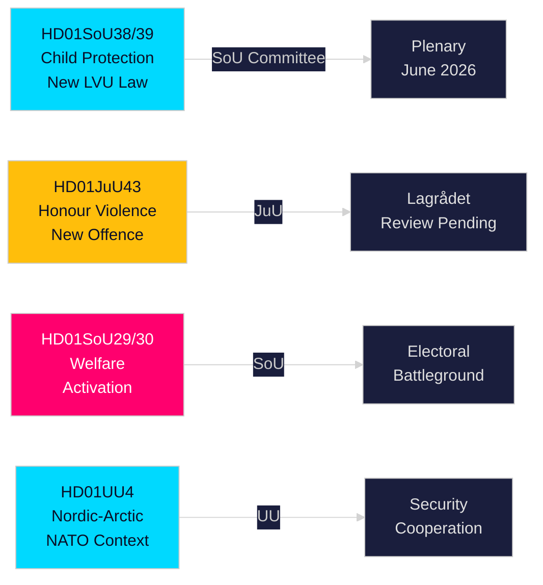

# Executive Brief — Swedish Riksdag Committee Reports, 21 May 2026

**Author**: Riksdagsmonitor Intelligence  
**Classification**: PUBLIC — GDPR Art. 9(2)(e,g)  
**Confidence**: HIGH [A1] child protection / MEDIUM [B2] welfare reform  
**Run ID**: 26206467231

---

## 🎯 BLUF

Sweden's Riksdag committees published twelve reports (betänkanden) on 20 May 2026 in the most substantive single-day output of the 2025/26 session's pre-election sprint. The dominant cluster is a twin child-protection reform — HD01SoU38 (new compulsory-care law) and HD01SoU39 (preventive social-services mandate) — representing the most significant child-welfare legislation in two decades and commanding broad cross-party support sixteen weeks before the September 2026 general election. Simultaneous advancement of honour-based violence legislation (HD01JuU43) and contested social-assistance conditionality reforms (HD01SoU29, HD01SoU30) completes the governing Tidö coalition's core electoral-platform delivery, while education (HD01UbU30, HD01UbU21) and international affairs reports (HD01UU3, HD01UU4, HD01MJU22) round out a dense legislative session. The welfare activation package is the most electorally contested element — affecting ~80,000 households and providing opposition S/MP/V their primary campaign weapon.

## 🧭 3 Decisions This Brief Supports

| # | Decision | Relevance | Horizon |
|---|----------|-----------|---------|
| 1 | Track Lagrådet review of JuU43 honour-violence provisions for constitutional risk | Adverse yttrande would force government revision and create election-period "unconstitutional law" narrative | T+14–30d |
| 2 | Monitor Centre Party position on SoU29/SoU30 welfare-activation plenary vote | C votes against → government still wins 174-171; C abstains → wider mandate; C delays → autumn campaign vulnerability | T+21–45d |
| 3 | Assess municipal implementation capacity for SoU38/SoU39 child-protection legislation | Under-resourced implementation during campaign period is critical electoral risk for governing bloc | T+30–90d |

## ⚡ 60-Second Read

- **Child protection overhaul** (HD01SoU38 + HD01SoU39): New rights-centred compulsory-care law + preventive mandate. Broadest legislative reform of Swedish child welfare since 2003. Cross-party support. Plenary vote estimated 3–9 June 2026.
- **Honour violence** (HD01JuU43): New criminal category for honour-based violence. SD-backed flagship. Lagrådet review pending. ECHR Article 14 risk manageable with careful drafting.
- **Welfare activation** (HD01SoU29 + HD01SoU30): Activity requirements + benefit caps affecting ~80,000 households. Most contested legislation — S/MP/V strongly oppose; C ambiguous. Core electoral battleground.
- **Friskola** (HD01UbU30): Tighter independent-school conditions; creates M/KD/L internal tension.
- **International** (HD01UU3, HD01UU4, HD01MJU22): Aid accountability, Nordic-Arctic mandate (post-NATO), Riksrevisionen climate-finance audit. MJU22 adverse findings create opposition climate-attack opportunity.

## 🔮 Top Forward Trigger

**Lagrådet yttrande on JuU43 (T+14–30d)**: If Lagrådet issues an adverse opinion on constitutional grounds, the governing bloc faces an "unconstitutional legislation" narrative in the election run-up. If no adverse opinion, the legislative trajectory is clear to adoption. Monitor www.lagradet.se.

## Key developments

### Child protection overhaul (HD01SoU38 + HD01SoU39) ★ CRITICAL
Two complementary betänkanden create a new legislative architecture for compulsory care of children and young people. SoU38 replaces the core LVU provisions with a rights-centred framework; SoU39 adds preventive powers when families resist social-services cooperation. Together they represent the most substantive reform of Swedish child welfare law since 2003. Cross-party support is strong, reducing reversal risk. Implementation risk is significant given municipal fiscal deficits (SKR ~SEK 18 bn structural deficit).

### Honour-based violence — criminal law strengthened (HD01JuU43)
Justice committee advances strengthened legislation creating a distinct criminal category for honour-based violence and oppression. Closes documented enforcement gaps; backed by Barnafrid and Länsstyrelsen Östergötland research. Lagrådet review status pending as of 2026-05-21.

### Social assistance reform — politically contested (HD01SoU29 + HD01SoU30)
Activity requirements (SoU29) and benefit caps (SoU30) advance the governing bloc's welfare-activation platform. Opposition parties (S/MP/V) signal strong resistance. ~80,000 households affected by cap mechanism (SCB data). With election 16 weeks away, these are the most electorally consequential reports in the session.

### Independent school regulation tightened (HD01UbU30)
Education committee report introduces stricter operational conditions for friskolesektorn. Creates internal tension within M/KD/L bloc over market-orientation principles.

### International cluster: aid accountability, Nordic-Arctic, climate audit
UU3 (deeper aid reporting), UU4 (Nordic-Arctic mandate in post-NATO context), MJU22 (Riksrevisionen findings on climate finance) form a coherent international-accountability narrative.

## Electoral intelligence

With the September 2026 election approximately 16 weeks away, the governing bloc has front-loaded its most deliverable legislation. Child-protection and honour-violence packages provide high-consensus wins. Welfare activation (SoU29/SoU30) is a calculated risk — popular with governing-bloc base but potentially mobilising opposition voters.

**Key PIRs**: Lagrådet opinion on JuU43 (T+14d); plenary vote schedule for SoU38/39 (T+14d); C position on SoU29/30 (T+21d); post-session polling (T+14d).

## Confidence assessment

High confidence (A1): SoU38, SoU39, SoU29, SoU30, UU4 (full-text retrieved).  
Medium confidence (B2): JuU43, MJU22, UbU21, UbU30, UU3, SoU40, SoU41 (metadata-only).
