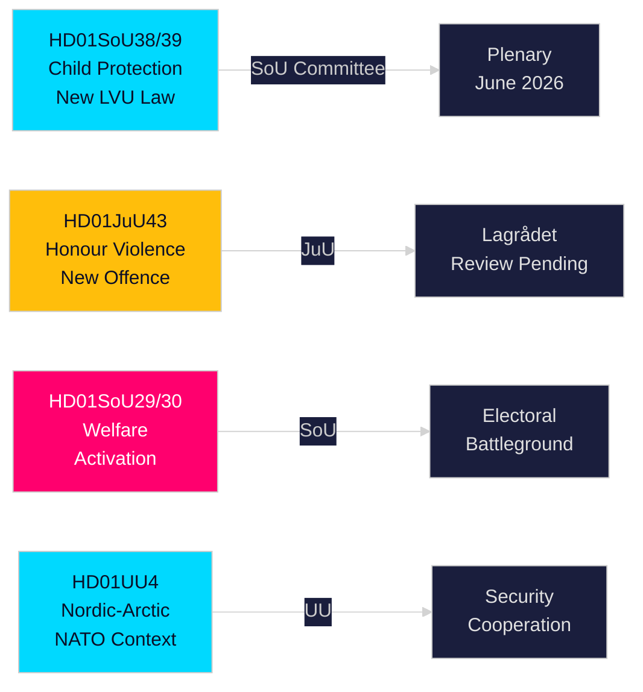

<!-- dir: rtl -->
# موجز تنفيذي — تقارير لجان الريكسداغ السويدي، 21 مايو 2026

**المؤلف**: Riksdagsmonitor Intelligence  
**التصنيف**: PUBLIC — GDPR Art. 9(2)(e,g)  
**الثقة**: HIGH [A1] حماية الطفل / MEDIUM [B2] إصلاح الرعاية الاجتماعية  
**معرّف التشغيل**: 26206467231

---

## 🎯 ملخص

أصدر الريكسداغ السويدي اثني عشر تقرير لجنة في 20 مايو 2026، في أكثر إنتاج يومي موضوعاً خلال اندفاعة ما قبل الانتخابات في دورة 2025/26. يتمحور المحور الرئيسي حول إصلاح مزدوج لحماية الطفل — HD01SoU38 (قانون جديد للرعاية الإلزامية) و HD01SoU39 (تفويض الخدمات الاجتماعية الوقائية) — يمثّلان أهم تشريع لرعاية الطفل منذ عقدين، ويحظيان بدعم واسع عبر الأحزاب قبل ستة عشر أسبوعاً من انتخابات الريكسداغ في سبتمبر 2026. يُكمّل التقدم المتزامن في تشريع العنف القائم على الشرف (HD01JuU43) والإصلاحات المتنازع عليها للمساعدة الاجتماعية (HD01SoU29، HD01SoU30) تنفيذَ منصة الائتلاف الانتخابية الأساسية Tidö، في حين تُنهي التعليم (HD01UbU30، HD01UbU21) والشؤون الدولية (HD01UU3، HD01UU4، HD01MJU22) دورةً تشريعيةً كثيفة. تُعدّ حزمة تفعيل الرعاية الاجتماعية العنصرَ الأكثر جدلاً انتخابياً — إذ تمسّ نحو 80,000 أسرة وتمنح المعارضةَ S/MP/V سلاحَها الانتخابي الرئيسي.

## 🧭 3 قرارات يدعمها هذا الموجز

| # | القرار | الأهمية | Horizon |
|---|--------|---------|--------------|
| 1 | متابعة مراجعة Lagrådet لبنود العنف القائم على الشرف في JuU43 بحثاً عن مخاطر دستورية | رأي سلبي سيُلزم الحكومة بالمراجعة ويُفرز رواية "قانون غير دستوري" أثناء الحملة الانتخابية | T+14–30d |
| 2 | رصد موقف حزب الوسط من التصويت في الجلسة العامة حول SoU29/SoU30 بشأن تفعيل الرعاية | C يصوت ضد ← الحكومة تفوز بـ 174-171 على أي حال؛ C يمتنع ← تفويض أوسع؛ C يتأخر ← مشكلة حملة خريفية | T+21–45d |
| 3 | تقييم قدرة البلديات على تنفيذ تشريعات حماية الطفل SoU38/SoU39 | التنفيذ المحدود التمويل خلال فترة الحملة يُمثّل خطراً انتخابياً حرجاً على كتلة الحكومة | T+30–90d |

## ⚡ قراءة 60 ثانية

- **إصلاح حماية الطفل** (HD01SoU38 + HD01SoU39): قانون جديد للرعاية الإلزامية مرتكز على الحقوق + تفويض وقائي. أشمل إصلاح تشريعي لرعاية الطفل السويدية منذ 2003. دعم حزبي واسع. التصويت في الجلسة العامة متوقع 3–9 يونيو 2026.
- **العنف القائم على الشرف** (HD01JuU43): فئة جنائية جديدة للعنف القائم على الشرف. المشروع الرئيسي لـ SD. مراجعة Lagrådet قيد الانتظار. مخاطر المادة 14 من ECHR قابلة للإدارة بصياغة دقيقة.
- **تفعيل الرعاية الاجتماعية** (HD01SoU29 + HD01SoU30): اشتراطات نشاط + سقف مزايا تمسّ نحو 80,000 أسرة. التشريع الأكثر جدلاً — S/MP/V معارضة بشدة؛ C غامضة. ساحة المعركة الانتخابية الرئيسية.
- **Friskola** (HD01UbU30): شروط تشغيل أكثر صرامة للمدارس المستقلة؛ يُحدث توترات داخلية في كتلة M/KD/L حول مبادئ التوجه السوقي.
- **الشأن الدولي** (HD01UU3، HD01UU4، HD01MJU22): المساءلة عن المساعدات، التفويض الشمالي-القطبي (ما بعد الناتو)، تدقيق تمويل المناخ من Riksrevisionen. النتائج النقدية لـ MJU22 تمنح المعارضةَ فرصةَ هجوم مناخي.

## 🔮 أبرز المحفزات المستقبلية

**رأي Lagrådet حول JuU43 (T+14–30d)**: إذا أصدر Lagrådet رأياً سلبياً لأسباب دستورية، ستواجه كتلة الحكومة رواية "تشريع غير دستوري" في خضمّ الحملة الانتخابية. إذا لم يصدر رأي سلبي، فالمسار التشريعي ممهّد للإقرار. تابع www.lagradet.se.

## التطورات الرئيسية

### إصلاح حماية الطفل (HD01SoU38 + HD01SoU39) ★ حرج
يُنشئ تقريران لجنتيان متكاملان بنيةً تشريعيةً جديدة للرعاية الإلزامية للأطفال والشباب. يستبدل SoU38 الأحكام الجوهرية في LVU بإطار مرتكز على الحقوق؛ ويُضيف SoU39 صلاحيات وقائية حين ترفض الأسر التعاون مع الخدمات الاجتماعية. معاً يُمثّلان أشمل إصلاح لقانون حماية الطفل السويدي منذ 2003. يُقلّل الدعم الحزبي الواسع من مخاطر التراجع. مخاطر التنفيذ كبيرة نظراً لعجوزات ميزانيات البلديات (SKR نحو 18 مليار SEK عجزاً هيكلياً).

### Honour: العنف القائم على الشرف — تعزيز القانون الجنائي (HD01JuU43)
تُروّج لجنة العدل لتشريع مُعزَّز يُنشئ فئة جنائية مستقلة للعنف والاضطهاد القائمَين على الشرف. يُغلق الثغرات التنفيذية الموثقة؛ مدعوم من أبحاث Barnafrid و Länsstyrelsen Östergötland. وضع مراجعة Lagrådet في انتظار الاستكمال بتاريخ 2026-05-21.

### إصلاح المساعدة الاجتماعية — مثير للجدل سياسياً (HD01SoU29 + HD01SoU30)
تدفع اشتراطات النشاط (SoU29) وسقف المزايا (SoU30) برنامجَ تفعيل الرعاية الاجتماعية لكتلة الحكومة. تُشير أحزاب المعارضة (S/MP/V) إلى مقاومة شديدة. تتأثر نحو 80,000 أسرة بآلية السقف (بيانات SCB). مع اقتراب الانتخابات خلال 16 أسبوعاً، تُعدّ هذه التقارير الأكثر تأثيراً انتخابياً في الدورة.

### المدارس المستقلة — شروط أكثر صرامة (HD01UbU30)
يُدخل تقرير لجنة التعليم شروطَ تشغيل أكثر صرامة لقطاع المدارس المستقلة. يُحدث توتراً داخلياً في كتلة M/KD/L حول مبادئ التوجه السوقي.

### التجمع الدولي: المساعدات الإنمائية، الشمال الأقصى-القطبي، مراجعة المناخ
UU3 (إعداد تقارير أعمق للمساعدات)، UU4 (التفويض الشمالي-القطبي في سياق ما بعد الناتو)، MJU22 (نتائج Riksrevisionen بشأن تمويل المناخ) تُشكّل رواية متماسكة للمساءلة الدولية.

## الاستخبارات الانتخابية

مع اقتراب انتخابات الريكسداغ في سبتمبر 2026 بنحو 16 أسبوعاً، قدّمت كتلة الحكومة أكثر تشريعاتها قابليةً للتنفيذ. توفّر حزمتا حماية الطفل والعنف القائم على الشرف مكاسبَ توافقيةً واسعة. تفعيل الرعاية (SoU29/SoU30) مخاطرة محسوبة — محبوب لدى قاعدة ناخبي الكتلة الحاكمة، لكنه قد يُحفّز ناخبي المعارضة.

**أبرز المتطلبات الاستخباراتية ذات الأولوية (PIRs)**: رأي Lagrådet حول JuU43 (T+14d)؛ جدول التصويت في الجلسة العامة لـ SoU38/39 (T+14d)؛ موقف C من SoU29/30 (T+21d)؛ استطلاعات ما بعد الدورة (T+14d).

## تقييم الثقة

ثقة عالية (A1): SoU38، SoU39، SoU29، SoU30، UU4 (تم استرداد النص الكامل).  
ثقة متوسطة (B2): JuU43، MJU22، UbU21، UbU30، UU3، SoU40، SoU41 (بيانات وصفية فقط).

<!-- source-sha: f930d5ccb5c3d5e7b85a164feccaacedd41f53b4 -->
