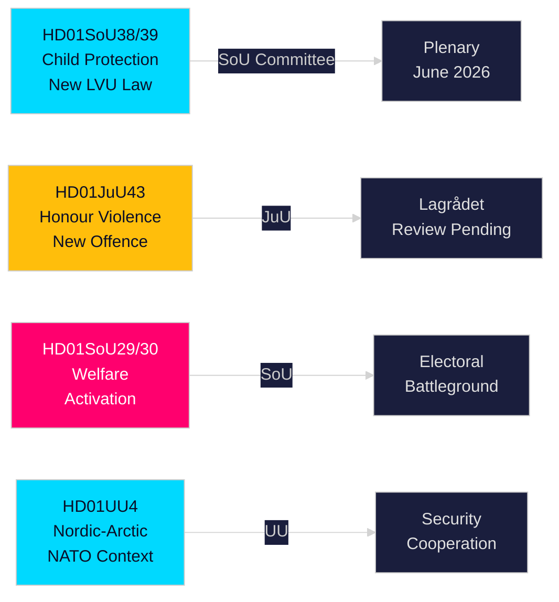

# Briefing — Det svenske Riksdags udvalgsrapporter, 21. maj 2026

**Forfatter**: Riksdagsmonitor Intelligence  
**Klassificering**: PUBLIC — GDPR Art. 9(2)(e,g)  
**Tillid**: HIGH [A1] børnebeskyttelse / MEDIUM [B2] velfærdsreform  
**Kørsels-ID**: 26206467231

---

## 🎯 Konklusion

Det svenske Riksdag offentliggjorde tolv udvalgsrapporter den 20. maj 2026 i den mest substantielle enkeltdagsproduktion i 2025/26-sessionen op til valget. Den dominerende klynge er en tvillingereform om børnebeskyttelse — HD01SoU38 (ny tvangsomsorgslov) og HD01SoU39 (forebyggende socialservicemandat) — som repræsenterer den mest betydende børnevelferdslovgivning i to årtier og opnår bred tværpolitisk støtte seksten uger før Riksdagsvalget i september 2026. Samtidig fremgang for lovgivning om æresbaseret vold (HD01JuU43) og omstridte reformer af sociale ydelser (HD01SoU29, HD01SoU30) fuldender Tidö-koalitionens kernevalprogram, mens uddannelse (HD01UbU30, HD01UbU21) og internationale anliggender (HD01UU3, HD01UU4, HD01MJU22) runder en tæt lovgivningssession af. Velfærdsaktiveringspakken er det mest valgmæssigt kontroversielle element — ~80.000 husstande berøres og oppositionen S/MP/V får deres primære kampagnevåben.

## 🧭 3 Beslutninger denne briefing understøtter

| # | Beslutning | Relevans | Horizon |
|---|------------|----------|----------|
| 1 | Overvåg Lagrådets gennemgang af JuU43 æresvoldsparagrafferne for konstitutionel risiko | Negativ udtalelse tvinger regeringen til revision og skaber en "grundlovsstridig lov"-fortælling i valgkampen | T+14–30d |
| 2 | Følg Centerpartiets holdning til SoU29/SoU30 plenumomröstning om velfærdsaktivering | C stemmer imod → regeringen vinder stadig 174-171; C afholder sig → bredere mandat; C trækker ud → efterårskampagneproblem | T+21–45d |
| 3 | Vurder kommunernes implementeringskapacitet for SoU38/SoU39 børnebeskyttelseslovgivning | Underfinansieret implementering i kampagneperioden er kritisk valgrisiko for regeringsblokken | T+30–90d |

## ⚡ 60-sekunders læsning

- **Børnebeskyttelsesreform** (HD01SoU38 + HD01SoU39): Ny rettighedscentreret tvangsomsorgslov + forebyggende mandat. Bredeste lovgivningsreform af svensk børneomsorg siden 2003. Bred tværpolitisk støtte. Plenumomröstning estimeret 3.–9. juni 2026.
- **Honour-based violence** (HD01JuU43): Ny strafferetlig kategori for æresbaseret vold. SD's flagskib. Lagrådets gennemgang afventer. ECHR-artikel 14-risiko håndterbar med omhyggelig formulering.
- **Velfærdsaktivering** (HD01SoU29 + HD01SoU30): Aktivitetskrav + ydelsesloft berører ~80.000 husstande. Mest omstridte lovgivning — S/MP/V stærkt imod; C tvetydig. Centralt valgkampeslagsmål.
- **Friskola** (HD01UbU30): Skærpede vilkår for frie skoler; skaber intern spænding i M/KD/L-blokken om markedsorientering.
- **Internationalt** (HD01UU3, HD01UU4, HD01MJU22): Bistandsansvarlighed, nordisk-arktisk mandat (post-NATO), Riksrevisionens klimafinansrevision. MJU22's kritiske fund giver oppositionen en klimatangrebsmulighed.

## 🔮 Vigtigste fremadrettede udløser

**Lagrådets udtalelse om JuU43 (T+14–30d)**: Hvis Lagrådet afgiver en negativ udtalelse på konstitutionelt grundlag, står regeringsblokken over for en "grundlovsstridig lovgivning"-fortælling i valgkampen. Uden negativ udtalelse er lovgivningsvejen klar til vedtagelse. Overvåg www.lagradet.se.

## Vigtige udviklinger

### Børnebeskyttelsesreform (HD01SoU38 + HD01SoU39) ★ KRITISK
To komplementære udvalgsrapporter skaber en ny lovgivningsmæssig arkitektur for tvangspleje af børn og unge. SoU38 erstatter kernebestemmelserne i LVU med et rettighedscentreret rammer; SoU39 tilføjer forebyggende beføjelser, når familier modsætter sig socialvæsenets samarbejde. Tilsammen udgør de den mest gennemgribende reform af svensk børnevelferdslovgivning siden 2003. Bred tværpolitisk støtte reducerer tilbagegangsrisikoen. Implementeringsrisikoen er betragtelig givet kommunale budgetunderskud (SKR ~SEK 18 mia. strukturelt underskud).

### Honour: Æresbaseret vold — straffeloven styrkes (HD01JuU43)
Retsudvalget fremmer styrket lovgivning, der opretter en særskilt strafferetlig kategori for æresbaseret vold og undertrykkelse. Lukker dokumenterede håndhævelseshuller; støttet af Barnafrid og Länsstyrelsen Östergötlands forskning. Lagrådets gennemgangsstatus afventer pr. 2026-05-21.

### Kontanthjælpsreform — politisk omstridt (HD01SoU29 + HD01SoU30)
Aktivitetskrav (SoU29) og ydelsesloft (SoU30) fremmer regeringsblokens velfærdsaktiveringsprogram. Oppositionspartier (S/MP/V) signalerer stærk modstand. ~80.000 husstande berøres af loftmekanismen (SCB-data). Med valget 16 uger væk er disse de mest valgmæssigt afgørende rapporter i sessionen.

### Frie skoler — vilkår strammes (HD01UbU30)
Uddannelsesudvalgets rapport indfører strengere driftsvilkår for den frie skolesektor. Skaber intern spænding i M/KD/L-blokken om markedsorienterede principper.

### Internationalt klynge: bistandsansvarlighed, nordisk-arktisk, klimarevision
UU3 (dybere bistandsrapportering), UU4 (nordisk-arktisk mandat i post-NATO-kontekst), MJU22 (Riksrevisionens fund om klimafinansiering) danner et sammenhængende internationalt ansvarsnarrativ.

## Valgkampeintelligens

Med Riksdagsvalget i september 2026 ca. 16 uger væk har regeringsblokken lagt sin mest leverbare lovgivning frem. Børnebeskyttelses- og æresvoldspakker giver høj-konsensus-gevinster. Velfærdsaktivering (SoU29/SoU30) er en kalkuleret risiko — populær hos regeringsblokens vælgerbasis men potentielt mobiliserende for oppositionsvælgere.

**Centrale PIR'er**: Lagrådets udtalelse om JuU43 (T+14d); plenumomröstningsplan for SoU38/39 (T+14d); C's holdning til SoU29/30 (T+21d); meningsmålinger efter sessionen (T+14d).

## Tillids-vurdering

Høj tillid (A1): SoU38, SoU39, SoU29, SoU30, UU4 (fuldtekst hentet).  
Middel tillid (B2): JuU43, MJU22, UbU21, UbU30, UU3, SoU40, SoU41 (kun metadata).

<!-- source-sha: f930d5ccb5c3d5e7b85a164feccaacedd41f53b4 -->
