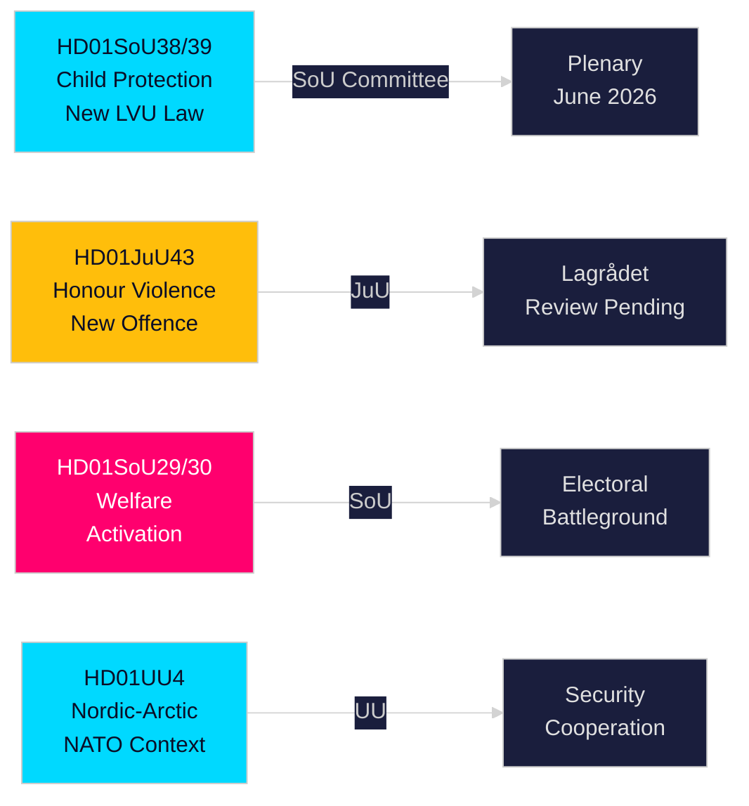

# Kurzbericht — Ausschussberichte des schwedischen Riksdags, 21. Mai 2026

**Autor**: Riksdagsmonitor Intelligence  
**Klassifizierung**: PUBLIC — GDPR Art. 9(2)(e,g)  
**Vertrauen**: HIGH [A1] Kinderschutz / MEDIUM [B2] Sozialreform  
**Ausführungs-ID**: 26206467231

---

## 🎯 Kurzzusammenfassung

Der schwedische Riksdag veröffentlichte am 20. Mai 2026 zwölf Ausschussberichte — die substantiellste Tagesproduktion des Vorsessions-Spurts 2025/26. Den Schwerpunkt bildet eine zweiteilige Kinderschutzreform — HD01SoU38 (neues Zwangspflegegesetz) und HD01SoU39 (präventives Sozialdienstmandat) — die bedeutendste Kindeswohlgesetzgebung seit zwei Jahrzehnten, mit breiter überparteilicher Unterstützung sechzehn Wochen vor den Riksdag-Wahlen im September 2026. Der gleichzeitige Fortschritt bei der Honour-Gesetzgebung (HD01JuU43) und den umstrittenen Sozialhilfereformen (HD01SoU29, HD01SoU30) vollendet die Kernwahlkampfversprechen der Tidö-Koalition, während Bildung (HD01UbU30, HD01UbU21) und außenpolitische Berichte (HD01UU3, HD01UU4, HD01MJU22) eine dichte Legislaturperiode abrunden. Das Wohlfahrtsaktivierungspaket ist das politisch umstrittenste Element — es betrifft ~80.000 Familien und verschafft der Opposition S/MP/V ihre wichtigste Kampagnewaffe.

## 🧭 3 Entscheidungen, die dieser Bericht unterstützt

| # | Entscheidung | Relevanz | Horizon |
|---|--------------|----------|----------|
| 1 | Beobachten Sie die Lagrådet-Prüfung der JuU43 Honour-based-violence-Paragraphen auf verfassungsrechtliche Risiken | Ein negatives Gutachten zwingt die Regierung zur Überarbeitung und schafft eine "verfassungswidrige Gesetzgebung"-Erzählung im Wahlkampf | T+14–30d |
| 2 | Verfolgen Sie die Position der Centerpartei zur SoU29/SoU30-Plenumabstimmung über Wohlfahrtsaktivierung | C stimmt dagegen → Regierung gewinnt trotzdem 174-171; C enthält sich → breiteres Mandat; C verzögert → Herbstkampagneproblem | T+21–45d |
| 3 | Bewerten Sie die kommunale Umsetzungskapazität für SoU38/SoU39 Kinderschutzgesetzgebung | Unterfinanzierte Umsetzung während der Wahlkampfphase ist ein kritisches Wahlrisiko für den Regierungsblock | T+30–90d |

## ⚡ 60-Sekunden-Zusammenfassung

- **Kinderschutzreform** (HD01SoU38 + HD01SoU39): Neues rechtebasiertes Zwangspflegegesetz + präventives Mandat. Umfassendste Gesetzgebungsreform der schwedischen Kinderfürsorge seit 2003. Breite Parteiunterstützung. Plenumabstimmung geschätzt 3.–9. Juni 2026.
- **Honour-based violence** (HD01JuU43): Neue strafrechtliche Kategorie für ehrbasierte Gewalt. SD-Flaggschiff. Lagrådet-Prüfung ausstehend. ECHR-Artikel 14-Risiko mit sorgfältiger Formulierung handhabbar.
- **Wohlfahrtsaktivierung** (HD01SoU29 + HD01SoU30): Aktivitätspflichten + Leistungsdeckelung betreffen ~80.000 Familien. Umstrittenste Gesetzgebung — S/MP/V stark dagegen; C zweideutig. Zentrales Wahlkampfschlachtfeld.
- **Friskola** (HD01UbU30): Strengere Betriebsbedingungen für Privatschulen; erzeugt interne Spannung im M/KD/L-Block zu Marktorientierungsprinzipien.
- **International** (HD01UU3, HD01UU4, HD01MJU22): Entwicklungshilfe-Rechenschaftspflicht, nordisch-arktisches Mandat (post-NATO), Riksrevisionens Klimafinanzierungsprüfung. Kritische MJU22-Befunde geben der Opposition eine Klimaangriffsmöglichkeit.

## 🔮 Wichtigster Vorwärtsauslöser

**Lagrådet-Gutachten zu JuU43 (T+14–30d)**: Wenn Lagrådet ein negatives Gutachten aus verfassungsrechtlichen Gründen abgibt, steht der Regierungsblock vor einer "verfassungswidrigen Gesetzgebung"-Erzählung im Wahlkampf. Kein negatives Gutachten → Gesetzgebungsweg ist klar zur Annahme. Beobachten Sie www.lagradet.se.

## Wichtige Entwicklungen

### Kinderschutzreform (HD01SoU38 + HD01SoU39) ★ KRITISCH
Zwei komplementäre Ausschussberichte schaffen eine neue Gesetzgebungsarchitektur für die Zwangspflege von Kindern und Jugendlichen. SoU38 ersetzt die Kernbestimmungen des LVU durch ein rechtebasiertes Rahmenwerk; SoU39 fügt präventive Befugnisse hinzu, wenn Familien der Zusammenarbeit mit dem Sozialdienst widersprechen. Gemeinsam stellen sie die umfassendste Reform des schwedischen Kinderschutzrechts seit 2003 dar. Breite überparteiliche Unterstützung verringert das Umkehrrisiko. Das Umsetzungsrisiko ist erheblich angesichts kommunaler Haushaltsdefizite (SKR ~SEK 18 Mrd. strukturelles Defizit).

### Ehrbasierte Gewalt — Strafrecht gestärkt (HD01JuU43)
Der Justizausschuss fördert verstärkte Gesetzgebung, die eine eigenständige strafrechtliche Kategorie für ehrbasierte Gewalt und Unterdrückung schafft. Schließt dokumentierte Vollzugslücken; unterstützt durch Barnafrid und Länsstyrelsen Östergötlands Forschung. Lagrådet-Prüfungsstatus ausstehend per 2026-05-21.

### Sozialhilfereform — politisch umstritten (HD01SoU29 + HD01SoU30)
Aktivitätspflichten (SoU29) und Leistungsdeckelung (SoU30) fördern das Wohlfahrtsaktivierungsprogramm des Regierungsblocks. Oppositionsparteien (S/MP/V) signalisieren starken Widerstand. ~80.000 Familien sind von der Deckelungsmechanik betroffen (SCB-Daten). Mit der Wahl in 16 Wochen sind dies die wahlpolitisch bedeutendsten Berichte der Sitzungsperiode.

### Privatschulen — Bedingungen verschärft (HD01UbU30)
Der Bildungsausschussbericht führt strengere Betriebsbedingungen für den Privatschulsektor ein. Erzeugt interne Spannung im M/KD/L-Block bezüglich Marktorientierungsprinzipien.

### Internationales Cluster: Entwicklungshilfe, Nordisch-Arktisch, Klimaprüfung
UU3 (vertiefende Entwicklungshilfeberichterstattung), UU4 (nordisch-arktisches Mandat im post-NATO-Kontext), MJU22 (Riksrevisionens Klimafinanzierungsbefunde) bilden eine kohärente internationale Rechenschaftspflicht-Erzählung.

## Wahlkampf-Nachrichtendienst

Mit den Riksdag-Wahlen im September 2026 ca. 16 Wochen entfernt hat der Regierungsblock seine umsetzbarste Gesetzgebung vorgezogen. Kinderschutz- und Honour-based-violence-Pakete liefern breite Konsenserfolge. Wohlfahrtsaktivierung (SoU29/SoU30) ist ein kalkuliertes Risiko — bei der Wählerschaft des Regierungsblocks beliebt, aber potenziell Oppositionswähler mobilisierend.

**Wesentliche PIRs**: Lagrådet-Gutachten zu JuU43 (T+14d); Plenumabstimmungsplan für SoU38/39 (T+14d); C-Position zu SoU29/30 (T+21d); Umfragen nach der Sitzung (T+14d).

## Vertrauensbeurteilung

Starkes Vertrauen (A1): SoU38, SoU39, SoU29, SoU30, UU4 (Volltext abgerufen).  
Mittleres Vertrauen (B2): JuU43, MJU22, UbU21, UbU30, UU3, SoU40, SoU41 (nur Metadaten).

<!-- source-sha: f930d5ccb5c3d5e7b85a164feccaacedd41f53b4 -->
