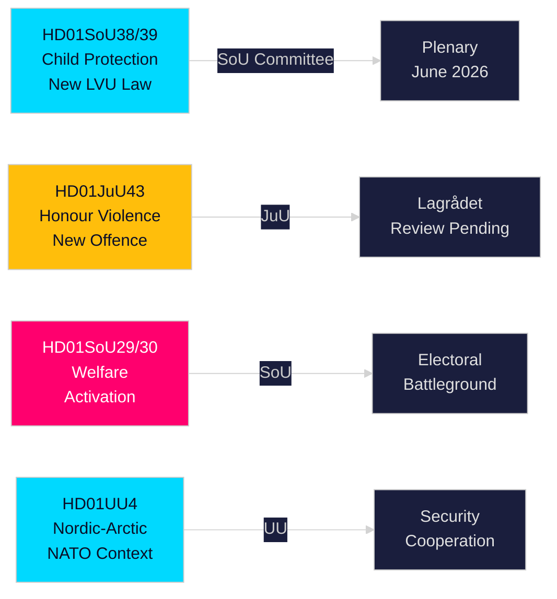

# Informe ejecutivo — Informes de comisiones del Riksdag sueco, 21 de mayo de 2026

**Autor**: Riksdagsmonitor Intelligence  
**Clasificación**: PUBLIC — GDPR Art. 9(2)(e,g)  
**Confianza**: HIGH [A1] protección infantil / MEDIUM [B2] reforma del bienestar  
**ID de ejecución**: 26206467231

---

## 🎯 Resumen

El Riksdag sueco publicó doce informes de comisión el 20 de mayo de 2026, en la producción diaria más sustancial del sprint preelectoral de la sesión 2025/26. El grupo dominante es una doble reforma de protección infantil — HD01SoU38 (nueva ley de cuidados obligatorios) y HD01SoU39 (mandato preventivo de servicios sociales) — que representa la legislación de bienestar infantil más significativa en dos décadas, con amplio apoyo multipartidista dieciséis semanas antes de las elecciones al Riksdag de septiembre de 2026. El avance simultáneo de la legislación sobre violencia de honor (HD01JuU43) y las reformas controvertidas de asistencia social (HD01SoU29, HD01SoU30) completa la entrega de la plataforma electoral central de la coalición Tidö, mientras que educación (HD01UbU30, HD01UbU21) y asuntos internacionales (HD01UU3, HD01UU4, HD01MJU22) redondean una sesión legislativa densa. El paquete de activación del bienestar es el elemento más electoralmente controvertido — afecta a ~80.000 hogares y proporciona a la oposición S/MP/V su principal arma de campaña.

## 🧭 3 Decisiones que apoya este informe

| # | Decisión | Relevancia | Horizon |
|---|----------|------------|-----------|
| 1 | Monitorear la revisión del Lagrådet sobre las disposiciones de violencia de honor JuU43 para riesgos constitucionales | Un dictamen negativo obligaría al gobierno a revisar el texto y crearía una narrativa de "ley inconstitucional" durante la campaña | T+14–30d |
| 2 | Seguir la posición del Partido del Centro en la votación plenaria SoU29/SoU30 sobre activación del bienestar | C vota en contra → el gobierno gana de todas formas 174-171; C se abstiene → mandato más amplio; C retrasa → problema de campaña en otoño | T+21–45d |
| 3 | Evaluar la capacidad de implementación municipal de la legislación de protección infantil SoU38/SoU39 | Una implementación con recursos insuficientes durante el período de campaña es un riesgo electoral crítico para el bloque gobernante | T+30–90d |

## ⚡ Lectura de 60 segundos

- **Reforma de protección infantil** (HD01SoU38 + HD01SoU39): Nueva ley de cuidados obligatorios centrada en derechos + mandato preventivo. La reforma legislativa más amplia de los servicios de infancia suecos desde 2003. Amplio apoyo partidista. Votación plenaria estimada 3–9 de junio de 2026.
- **Violencia de honor** (HD01JuU43): Nueva categoría penal para la violencia basada en el honor. Buque insignia del SD. Revisión del Lagrådet pendiente. Riesgo ECHR Artículo 14 manejable con redacción cuidadosa.
- **Activación del bienestar** (HD01SoU29 + HD01SoU30): Requisitos de actividad + tope de prestaciones que afectan a ~80.000 hogares. Legislación más controvertida — S/MP/V fuertemente en contra; C ambiguo. Principal campo de batalla electoral.
- **Friskola** (HD01UbU30): Condiciones de operación más estrictas para escuelas independientes; genera tensión interna en el bloque M/KD/L sobre principios de orientación al mercado.
- **Internacional** (HD01UU3, HD01UU4, HD01MJU22): Responsabilidad de la ayuda al desarrollo, mandato nórdico-ártico (post-OTAN), auditoría de financiamiento climático del Riksrevisionen. Los hallazgos críticos de MJU22 brindan a la oposición una oportunidad de ataque sobre el clima.

## 🔮 Principal desencadenante prospectivo

**Dictamen del Lagrådet sobre JuU43 (T+14–30d)**: Si el Lagrådet emite un dictamen negativo por razones constitucionales, el bloque gobernante enfrenta una narrativa de "legislación inconstitucional" en plena campaña electoral. Sin dictamen negativo, la vía legislativa está despejada para la aprobación. Monitorear www.lagradet.se.

## Desarrollos clave

### Reforma de protección infantil (HD01SoU38 + HD01SoU39) ★ CRÍTICO
Dos informes de comisión complementarios crean una nueva arquitectura legislativa para el cuidado obligatorio de niños y jóvenes. SoU38 reemplaza las disposiciones centrales del LVU con un marco centrado en derechos; SoU39 añade poderes preventivos cuando las familias se resisten a la cooperación con los servicios sociales. Juntos representan la reforma más sustancial del derecho de protección infantil sueco desde 2003. El amplio apoyo multipartidista reduce el riesgo de reversión. El riesgo de implementación es significativo dado los déficits presupuestarios municipales (SKR ~SEK 18 Md de déficit estructural).

### Honour: Violencia basada en el honor — derecho penal fortalecido (HD01JuU43)
La comisión de justicia promueve una legislación reforzada que crea una categoría penal separada para la violencia y la opresión basadas en el honor. Cierra las lagunas de aplicación documentadas; respaldado por la investigación de Barnafrid y Länsstyrelsen Östergötland. Estado de revisión del Lagrådet pendiente al 2026-05-21.

### Reforma de asistencia social — políticamente controvertida (HD01SoU29 + HD01SoU30)
SoU29 (actividad obligatoria) y SoU30 (tope de prestaciones) impulsan el programa de activación. Oposición S/MP/V fuerte. ~80.000 hogares afectados (SCB). Informes electoralmente más decisivos de la sesión.

### Escuelas independientes — condiciones endurecidas (HD01UbU30)
Condiciones más estrictas para escuelas independientes. Tensión interna M/KD/L sobre principios de mercado.

### Clúster internacional (HD01UU3 + HD01UU4 + HD01MJU22)
UU3 (ayuda al desarrollo), UU4 (mandato nórdico-ártico post-OTAN), MJU22 (financiamiento climático Riksrevisionen) forman una narrativa coherente de responsabilidad internacional.

## Inteligencia electoral

A 16 semanas de las elecciones de septiembre 2026, el bloque gobernante adelanta su legislación clave. Protección infantil y violencia de honor ofrecen consenso amplio. La activación del bienestar (SoU29/SoU30) es un riesgo calculado con potencial movilizador opositor.

**PIRs**: Dictamen Lagrådet JuU43 (T+14d); votación plenaria SoU38/39 (T+14d); posición C sobre SoU29/30 (T+21d).

## Evaluación de confianza

A1: SoU38, SoU39, SoU29, SoU30, UU4 (texto completo).  
B2: JuU43, MJU22, UbU21, UbU30, UU3, SoU40, SoU41 (metadatos).

<!-- source-sha: f930d5ccb5c3d5e7b85a164feccaacedd41f53b4 -->
