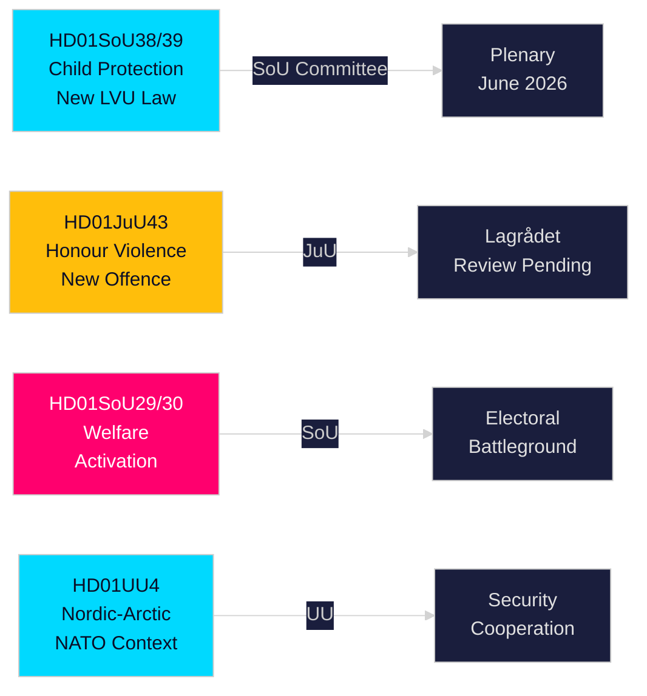

# Tiivistelmä — Ruotsin Riksdagin valiokuntamietinnöt, 21. toukokuuta 2026

**Tekijä**: Riksdagsmonitor Intelligence  
**Luokittelu**: PUBLIC — GDPR Art. 9(2)(e,g)  
**Luottamus**: HIGH [A1] lastensuojelu / MEDIUM [B2] hyvinvointiuudistus  
**Ajo-ID**: 26206467231

---

## 🎯 Lyhyt yhteenveto

Ruotsin Riksdag julkaisi kaksitoista valiokuntamietintöä 20. toukokuuta 2026 — 2025/26 istuntokauden vaalien edellä tapahtuvan sprintin merkittävin yksittäispäivän tuotos. Keskeisimpänä kokonaisuutena on kaksoisuudistus lasten suojelemiseksi — HD01SoU38 (uusi pakkohuolenpitolaki) ja HD01SoU39 (ennaltaehkäisevä sosiaalipalvelumandaatti) — joka edustaa merkittävintä lasten hyvinvointilainsäädäntöä kahteen vuosikymmeneen ja nauttii laajaa poikkipuolueellista tukea kuusitoista viikkoa ennen syyskuun 2026 Riksdag-vaaleja. Kunniaväkivaltaa koskevan lainsäädännön (HD01JuU43) ja kiistanalaisten toimeentulotukiuudistusten (HD01SoU29, HD01SoU30) samanaikainen eteneminen täydentää Tidö-koalition ydinsitoumusten toteutumisen, kun taas koulutus (HD01UbU30, HD01UbU21) ja kansainväliset asiat (HD01UU3, HD01UU4, HD01MJU22) täydentävät tiivistä lainsäädäntöistuntoa. Hyvinvointiaktivoinnin paketti on kaikkein kiistanalaisin elementti — se koskee noin 80 000 kotitaloutta ja antaa oppositiolle S/MP/V heidän ensisijaisen kampanjaaseensa.

## 🧭 3 Päätöstä, joita tämä katsaus tukee

| # | Päätös | Merkitys | Horizon |
|---|--------|----------|----------------|
| 1 | Seuraa Lagrådets JuU43:n kunniaväkivaltatarkastelua perustuslaillisen riskin osalta | Kielteinen lausunto pakottaa hallituksen tarkistukseen ja luo "perustuslainvastainen laki" -narratiivin vaalikampanjaan | T+14–30d |
| 2 | Seuraa Keskustapuolueen (C) kantaa SoU29/SoU30 hyvinvointiaktivoinnin täysistuntoäänestyksessä | C äänestää vastaan → hallitus voittaa silti 174-171; C pidättäytyy → laajempi mandaatti; C viivyttää → syyskauden kampanjaongelma | T+21–45d |
| 3 | Arvioi kuntien toimeenpanokapasiteettia SoU38/SoU39 lastensuojelulainsäädännön osalta | Aliresursoitu toimeenpano kampanjakaudella on kriittinen vaaliриски hallitusblokille | T+30–90d |

## ⚡ 60 sekunnin tiivistelmä

- **Lastensuojeluuudistus** (HD01SoU38 + HD01SoU39): Uusi oikeusperustainen pakkohuolenpitolaki + ennaltaehkäisevä mandaatti. Laajin ruotsalaisen lastenhuollon lainsäädäntöuudistus vuodesta 2003. Laaja puoluetuki. Täysistuntoäänestys arvioitu 3.–9. kesäkuuta 2026.
- **Honour-based violence** (HD01JuU43): Uusi rikosoikeudellinen luokka kunniaperusteiselle väkivallalle. SD:n lippulaivauudistus. Lagrådets tarkastelu odottaa. ECHR 14 artiklan riski hallittavissa huolellisella muotoilulla.
- **Hyvinvointiaktivointi** (HD01SoU29 + HD01SoU30): Aktivointivaatimukset + etuuskatto koskevat ~80 000 kotitaloutta. Kiistanalaisin lainsäädäntö — S/MP/V voimakkaasti vastaan; C epäselvä. Keskeinen vaalikenttä.
- **Vapaat koulut** (HD01UbU30): Tiukemmat vapaan koulutuksen toimintaehdot; aiheuttaa sisäistä jännitystä M/KD/L-lohkossa markkinaorientaatiosta.
- **Kansainvälinen** (HD01UU3, HD01UU4, HD01MJU22): Kehitysapuvastuullisuus, pohjoinen arktinen mandaatti (post-NATO), Riksrevisionenin ilmastorahoitustarkastus. MJU22:n kriittiset havainnot antavat oppositiolle ilmastohyökkäysmahdollisuuden.

## 🔮 Tärkein eteenpäin suuntautuva laukaisin

**Lagrådets lausunto JuU43:sta (T+14–30d)**: Jos Lagrådet antaa kielteisen lausunnon perustuslailliselta pohjalta, hallitusblokki kohtaa "perustuslainvastainen lainsäädäntö" -narratiivin vaalikampanjassa. Ilman kielteistä lausuntoa lainsäädäntöpolku on selkeä hyväksymiseen. Seuraa www.lagradet.se.

## Keskeiset kehityskulut

### Lastensuojeluuudistus (HD01SoU38 + HD01SoU39) ★ KRIITTINEN
Kaksi toisiaan täydentävää mietintöä luovat uuden lainsäädäntöarkkitehtuurin lasten ja nuorten pakkohuolenpidolle. SoU38 korvaa LVU:n ydinmääräykset oikeusperustaisella kehyksellä; SoU39 lisää ennaltaehkäiseviä toimivaltuuksia, kun perheet vastustavat sosiaalipalvelujen yhteistyötä. Yhdessä ne muodostavat perusteellisimman ruotsalaisen lastensuojelulainsäädännön uudistuksen vuodesta 2003. Laaja poikkipuolueellinen tuki vähentää peruuttamisriskiä. Toimeenpanoriski on merkittävä kuntien budjettivajauksista johtuen (SKR ~18 miljardia SEK rakenteellinen vaje).

### Honour: Kunniaväkivalta — rikoslaki vahvistuu (HD01JuU43)
Oikeuskomitea edistää vahvistettua lainsäädäntöä, joka luo erillisen rikosoikeudellisen luokan kunniaperusteiselle väkivallalle ja sorrolla. Korjaa dokumentoidut täytäntöönpanoaukot; saa tukea Barnafridin ja Länsstyrelsen Östergötlandin tutkimuksesta. Lagrådets tarkastelustatus odottaa 2026-05-21.

### Toimeentulotukiuudistus — poliittisesti kiistanalainen (HD01SoU29 + HD01SoU30)
Aktivointivaatimukset (SoU29) ja etuuskatto (SoU30) edistävät hallitusblokkin hyvinvointiaktivointiohjelmaa. Oppositiopuolueet (S/MP/V) ilmaisevat voimakasta vastustusta. ~80 000 kotitaloutta kärsii kattomekanismista (SCB-data). Vaaleihun ollessa 16 viikkoa, nämä ovat istuntokauden vaalipoliittisesti merkittävimmät mietinnöt.

### Vapaat koulut — ehtoja kiristetään (HD01UbU30)
Koulutuskomitean mietintö ottaa käyttöön tiukemmat toimintaehdot yksityiskoululle. Luo sisäistä jännitettä M/KD/L-lohkossa markkinaorientaatioperiaatteista.

### Kansainvälinen kokonaisuus: kehitysapu, pohjoinen arktinen, ilmastoarviointi
UU3 (syvennetty kehitysapuraportointi), UU4 (pohjoinen arktinen mandaatti post-NATO-kontekstissa), MJU22 (Riksrevisionenin ilmastorahoitushavainnot) muodostavat johdonmukaisen kansainvälisen vastuullisuusnarratiivin.

## Vaalikampanjatiedustelu

Riksdag-vaalien ollessa syyskuussa 2026 noin 16 viikkoa päässä hallitusblokki on laittanut etusijalle toteutettavimman lainsäädäntönsä. Lastensuojelu- ja Honour-based violence -paketit tarjoavat laajan konsensuksen voittoja. Hyvinvointiaktivointi (SoU29/SoU30) on laskettu riski — suosittu hallitusblokkin äänestäjäkunnan keskuudessa, mutta mahdollisesti oppositioäänestäjiä mobilisoiva.

**Keskeisimmät PIR:t**: Lagrådets lausunto JuU43:sta (T+14d); SoU38/39:n täysistuntoäänestysaikataulu (T+14d); C:n kanta SoU29/30:een (T+21d); istuntokauden jälkeiset galluppimittaukset (T+14d).

## Luottamusarvio

Korkea luottamus (A1): SoU38, SoU39, SoU29, SoU30, UU4 (kokoteksti haettu).  
Keskitason luottamus (B2): JuU43, MJU22, UbU21, UbU30, UU3, SoU40, SoU41 (vain metatiedot).

<!-- source-sha: f930d5ccb5c3d5e7b85a164feccaacedd41f53b4 -->
