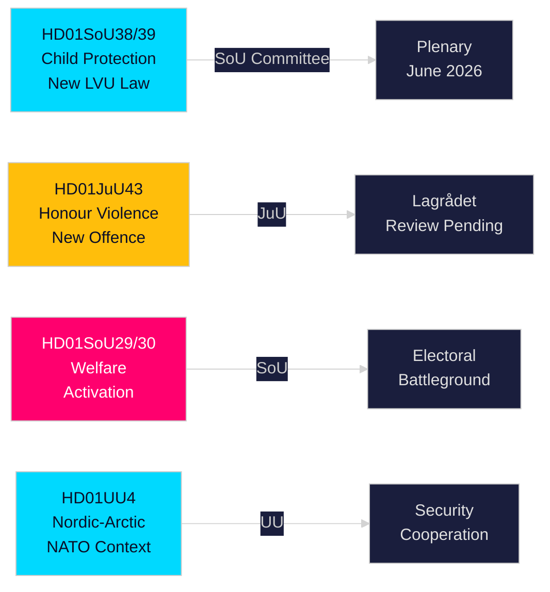

# Rapport de synthèse — Rapports des commissions du Riksdag suédois, 21 mai 2026

**Auteur** : Riksdagsmonitor Intelligence  
**Classification** : PUBLIC — GDPR Art. 9(2)(e,g)  
**Confiance** : HIGH [A1] protection de l'enfance / MEDIUM [B2] réforme sociale  
**ID d'exécution** : 26206467231

---

## 🎯 Synthèse

Le Riksdag suédois a publié douze rapports de commission le 20 mai 2026, dans la production journalière la plus substantielle du sprint pré-électoral de la session 2025/26. La grappe dominante est une double réforme de la protection de l'enfance — HD01SoU38 (nouvelle loi sur les soins obligatoires) et HD01SoU39 (mandat préventif des services sociaux) — représentant la législation la plus significative en matière de protection de l'enfance depuis deux décennies, avec un large soutien multipartite seize semaines avant les élections au Riksdag de septembre 2026. L'avancement simultané de la législation sur les violences fondées sur l'honneur (HD01JuU43) et les réformes contestées de l'aide sociale (HD01SoU29, HD01SoU30) complète la livraison de la plateforme électorale centrale de la coalition Tidö, tandis que l'éducation (HD01UbU30, HD01UbU21) et les affaires internationales (HD01UU3, HD01UU4, HD01MJU22) parachèvent une session législative dense. Le paquet d'activation du bien-être est l'élément le plus électoralement controversé — il affecte ~80 000 foyers et fournit à l'opposition S/MP/V leur principale arme de campagne.

## 🧭 3 Décisions que ce rapport soutient

| # | Décision | Pertinence | Horizon |
|---|----------|------------|---------|
| 1 | Surveiller l'examen par le Lagrådet des dispositions sur les violences d'honneur JuU43 pour les risques constitutionnels | Un avis négatif obligerait le gouvernement à réviser le texte et créerait un narratif de "loi inconstitutionnelle" pendant la campagne | T+14–30d |
| 2 | Suivre la position du Parti du Centre sur le vote en plénière SoU29/SoU30 sur l'activation sociale | C vote contre → le gouvernement gagne quand même 174-171 ; C s'abstient → mandat plus large ; C diffère → problème de campagne à l'automne | T+21–45d |
| 3 | Évaluer la capacité d'exécution municipale pour la législation de protection de l'enfance SoU38/SoU39 | Une mise en œuvre sous-financée pendant la période de campagne représente un risque électoral critique pour le bloc gouvernemental | T+30–90d |

## ⚡ Lecture en 60 secondes

- **Réforme de la protection de l'enfance** (HD01SoU38 + HD01SoU39) : Nouvelle loi sur les soins obligatoires centrée sur les droits + mandat préventif. La réforme législative la plus large des services à l'enfance suédois depuis 2003. Large soutien partisan. Vote en plénière estimé 3–9 juin 2026.
- **Violences d'honneur** (HD01JuU43) : Nouvelle catégorie pénale pour les violences fondées sur l'honneur. Mesure phare du SD. Examen du Lagrådet en attente. Risque ECHR article 14 gérable avec une rédaction soignée.
- **Activation sociale** (HD01SoU29 + HD01SoU30) : Exigences d'activité + plafonnement des prestations touchant ~80 000 foyers. Législation la plus contestée — S/MP/V fortement opposés ; C ambigu. Principal terrain de bataille électoral.
- **Friskola** (HD01UbU30) : Conditions d'exploitation plus strictes pour les écoles indépendantes ; crée des tensions internes dans le bloc M/KD/L sur les principes d'orientation de marché.
- **International** (HD01UU3, HD01UU4, HD01MJU22) : Redevabilité de l'aide, mandat nordique-arctique (post-OTAN), audit du financement climatique du Riksrevisionen. Les conclusions critiques de MJU22 offrent à l'opposition une occasion d'attaque sur le climat.

## 🔮 Principal déclencheur prospectif

**Avis du Lagrådet sur JuU43 (T+14–30d)** : Si le Lagrådet émet un avis négatif pour des raisons constitutionnelles, le bloc gouvernemental fait face à un narratif "législation inconstitutionnelle" en pleine campagne électorale. Sans avis négatif, la voie législative est dégagée pour adoption. Surveiller www.lagradet.se.

## Développements clés

### Réforme de la protection de l'enfance (HD01SoU38 + HD01SoU39) ★ CRITIQUE
Deux rapports de commission complémentaires créent une nouvelle architecture législative pour les soins obligatoires des enfants et des jeunes. SoU38 remplace les dispositions fondamentales du LVU par un cadre centré sur les droits ; SoU39 ajoute des pouvoirs préventifs lorsque les familles résistent à la coopération avec les services sociaux. Ensemble, ils représentent la réforme la plus substantielle du droit suédois de la protection de l'enfance depuis 2003. Le large soutien multipartite réduit le risque de retournement. Le risque d'exécution est significatif compte tenu des déficits budgétaires municipaux (SKR ~SEK 18 Md de déficit structurel).

### Honour: Violence fondée sur l'honneur — droit pénal renforcé (HD01JuU43)
La commission de la justice fait avancer une législation renforcée créant une catégorie pénale distincte pour les violences et oppressions fondées sur l'honneur. Comble les lacunes d'application documentées ; soutenu par les recherches de Barnafrid et du Länsstyrelsen Östergötland. Statut d'examen du Lagrådet en attente au 2026-05-21.

### Réforme de l'aide sociale — politiquement contestée (HD01SoU29 + HD01SoU30)
SoU29 (activité obligatoire) et SoU30 (plafonnement des prestations) font avancer le programme d'activation sociale. Opposition S/MP/V forte. ~80 000 foyers affectés (SCB). Rapports électoralement les plus décisifs de la session.

### Écoles indépendantes — conditions renforcées (HD01UbU30)
Conditions d'exploitation plus strictes pour les écoles indépendantes. Tension interne au sein du bloc M/KD/L sur les principes de marché.

### Cluster international (HD01UU3 + HD01UU4 + HD01MJU22)
UU3 (aide au développement), UU4 (mandat nordique-arctique post-OTAN), MJU22 (financement climatique Riksrevisionen) forment un narratif cohérent de responsabilisation internationale.

## Renseignements électoraux

À 16 semaines des élections de septembre 2026, le bloc gouvernemental livre sa législation phare. Protection de l'enfance et violences d'honneur offrent un consensus large. L'activation sociale (SoU29/SoU30) est un risque calculé avec potentiel de mobilisation de l'opposition.

**PIRs** : Avis Lagrådet JuU43 (T+14d) ; vote plénier SoU38/39 (T+14d) ; position C sur SoU29/30 (T+21d).

## Évaluation de la confiance

A1 : SoU38, SoU39, SoU29, SoU30, UU4 (texte intégral).  
B2 : JuU43, MJU22, UbU21, UbU30, UU3, SoU40, SoU41 (métadonnées).

<!-- source-sha: f930d5ccb5c3d5e7b85a164feccaacedd41f53b4 -->
