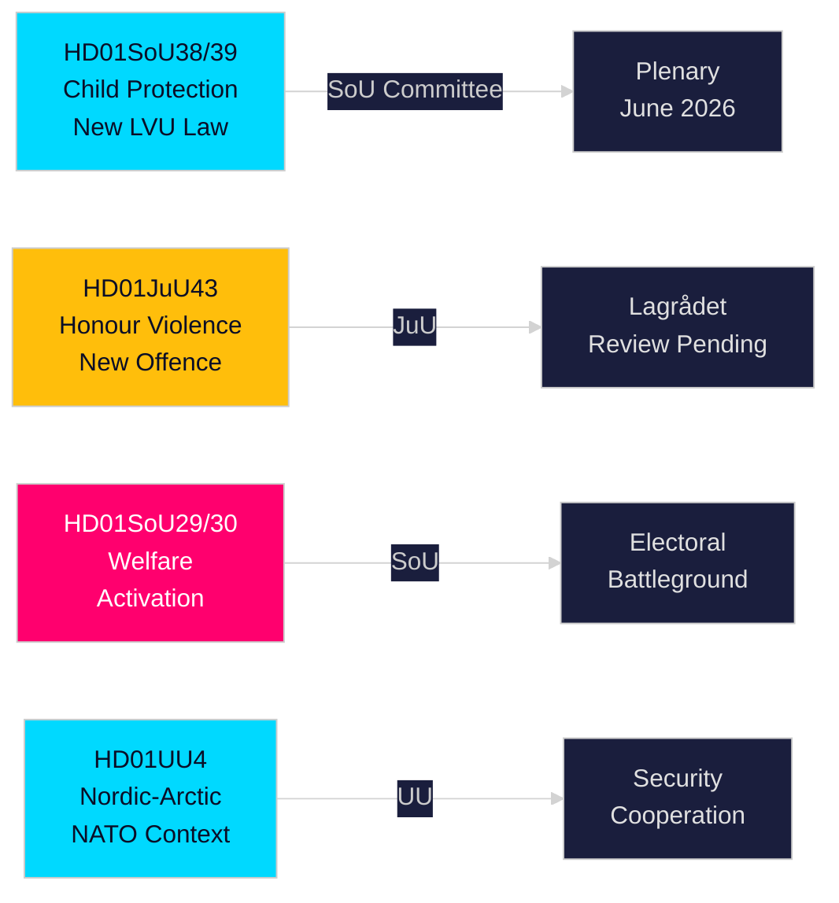

<!-- dir: rtl -->
# תקציר מנהלים — דוחות ועדות הריקסדאג השוודי, 21 במאי 2026

**מחבר**: Riksdagsmonitor Intelligence  
**סיווג**: PUBLIC — GDPR Art. 9(2)(e,g)  
**אמינות**: HIGH [A1] הגנת הילד / MEDIUM [B2] רפורמת רווחה  
**מזהה הרצה**: 26206467231

---

## 🎯 סיכום

הריקסדאג השוודי פרסם שנים עשר דוחות ועדות ב-20 במאי 2026, בתפוקה היומית המשמעותית ביותר של המירוץ הטרום-בחירותי בהפעלת הפגישה 2025/26. הצביר המרכזי הוא רפורמה כפולה להגנת הילד — HD01SoU38 (חוק טיפול כפוי חדש) ו-HD01SoU39 (מנדט שירותי רווחה מניעתי) — המייצגת את חקיקת רווחת הילד המשמעותית ביותר בשני עשורים, עם תמיכה רחבה מעל המחיצות המפלגתיות שישה עשר שבועות לפני בחירות הריקסדאג בספטמבר 2026. התקדמות מקבילה של חקיקת אלימות על כבוד (HD01JuU43) ורפורמות שנויות במחלוקת בסיוע סוציאלי (HD01SoU29, HD01SoU30) משלימה את מסירת הפלטפורמה הבחירותית המרכזית של קואליציית טידו, בעוד חינוך (HD01UbU30, HD01UbU21) וענייני חוץ (HD01UU3, HD01UU4, HD01MJU22) מסיימים מושב חקיקה עמוס. חבילת הפעלת הרווחה היא האלמנט השנוי במחלוקת ביותר מבחינה בחירותית — משפיעה על כ-80,000 משקי בית ומעניקה לאופוזיציה S/MP/V את נשק הקמפיין העיקרי שלה.

## 🧭 3 החלטות שתקציר זה תומך בהן

| # | החלטה | רלוונטיות | Horizon |
|---|-------|----------|------|
| 1 | לעקוב אחר בדיקת Lagrådet של סעיפי האלימות על כבוד JuU43 לאיתור סיכונים חוקתיים | חוות דעת שלילית תאלץ את הממשלה לתקן ותיצור נרטיב של "חוק לא חוקתי" בקמפיין הבחירות | T+14–30d |
| 2 | לעקוב אחר עמדת מפלגת המרכז בהצבעת המליאה על SoU29/SoU30 בנושא הפעלת רווחה | C מצביעה נגד → הממשלה ניצחת 174-171 בכל מקרה; C נמנעת → מנדט רחב יותר; C מעכבת → בעיית קמפיין סתיו | T+21–45d |
| 3 | להעריך את כושר היישום העירוני לחקיקת הגנת הילד SoU38/SoU39 | יישום תת-ממומן בתקופת הקמפיין הוא סיכון בחירותי קריטי עבור הגוש הממשלתי | T+30–90d |

## ⚡ קריאה של 60 שניות

- **רפורמת הגנת הילד** (HD01SoU38 + HD01SoU39): חוק טיפול כפוי חדש המבוסס על זכויות + מנדט מניעתי. הרפורמה החקיקתית הרחבה ביותר בשירותי הילד השוודיים מאז 2003. תמיכה רחבה. הצבעת מליאה משוערת 3–9 יוני 2026.
- **אלימות על כבוד** (HD01JuU43): קטגוריה פלילית חדשה לאלימות מבוססת כבוד. דגל SD. בדיקת Lagrådet ממתינה. סיכון ECHR סעיף 14 ניתן לניהול עם ניסוח זהיר.
- **הפעלת רווחה** (HD01SoU29 + HD01SoU30): דרישות פעילות + תקרת קצבאות משפיעות על כ-80,000 משקי בית. החקיקה השנויה ביותר במחלוקת — S/MP/V מתנגדים בחריפות; C עמומה. שדה קרב בחירותי מרכזי.
- **Friskola** (HD01UbU30): תנאי הפעלה מחמירים יותר לבתי ספר עצמאיים; יוצר מתחים פנימיים בגוש M/KD/L על עקרונות אוריינטציה שוקית.
- **בינלאומי** (HD01UU3, HD01UU4, HD01MJU22): אחריות סיוע, מנדט צפוני-ארקטי (לאחר נאטו), ביקורת מימון אקלים של Riksrevisionen. ממצאי MJU22 הביקורתיים נותנים לאופוזיציה הזדמנות תקיפה אקלימית.

## 🔮 הגורם המחולל העתידי החשוב ביותר

**חוות דעת Lagrådet על JuU43 (T+14–30d)**: אם Lagrådet יוציא חוות דעת שלילית מטעמים חוקתיים, הגוש הממשלתי יתמודד עם נרטיב "חקיקה לא חוקתית" בעיצומו של הקמפיין הבחירותי. ללא חוות דעת שלילית — הנתיב החקיקתי פתוח לאישור. עקוב אחר www.lagradet.se.

## התפתחויות מרכזיות

### רפורמת הגנת הילד (HD01SoU38 + HD01SoU39) ★ קריטי
שני דוחות ועדות משלימים יוצרים ארכיטקטורה חקיקתית חדשה לטיפול כפוי בילדים ובני נוער. SoU38 מחליף את הוראות הליבה של LVU במסגרת מבוססת-זכויות; SoU39 מוסיף סמכויות מניעתיות כאשר משפחות מתנגדות לשיתוף פעולה עם שירותי הרווחה. יחד הם מייצגים את הרפורמה המקיפה ביותר של חוק הגנת הילד השוודי מאז 2003. תמיכה רחבה מפחיתה את סיכון היפוך הנהלה. סיכון היישום משמעותי לנוכח גירעונות תקציב עירוניים (SKR כ-18 מיליארד SEK גירעון מבני).

### Honour: אלימות מבוססת כבוד — חיזוק חוק הפלילי (HD01JuU43)
ועדת המשפטים מקדמת חקיקה מחוזקת היוצרת קטגוריה פלילית נפרדת לאלימות ודיכוי מבוססי כבוד. סוגרת פרצות אכיפה מתועדות; נתמכת במחקרי Barnafrid ו-Länsstyrelsen Östergötland. מצב בדיקת Lagrådet ממתין נכון ל-2026-05-21.

### רפורמת הסיוע הסוציאלי — שנויה במחלוקת פוליטית (HD01SoU29 + HD01SoU30)
דרישות פעילות (SoU29) ותקרת קצבאות (SoU30) מקדמות את תוכנית הפעלת הרווחה של הגוש הממשלתי. מפלגות האופוזיציה (S/MP/V) מסמנות התנגדות חזקה. כ-80,000 משקי בית מושפעים ממנגנון התקרה (נתוני SCB). עם הבחירות 16 שבועות מכאן, אלה הדוחות בעלי ההשפעה הבחירותית הגבוהה ביותר בפגישה.

### בתי ספר עצמאיים — תנאים מחמירים (HD01UbU30)
דוח ועדת החינוך מציג תנאי הפעלה מחמירים יותר למגזר בתי הספר העצמאיים. יוצר מתח פנימי בגוש M/KD/L סביב עקרונות אוריינטציה שוקית.

### צביר בינלאומי: סיוע לפיתוח, צפוני-ארקטי, ביקורת אקלים
UU3 (דיווח מעמיק יותר על סיוע), UU4 (מנדט צפוני-ארקטי בהקשר לאחר נאטו), MJU22 (ממצאי Riksrevisionen על מימון אקלים) מגבשים נרטיב אחריות בינלאומי קוהרנטי.

## מודיעין בחירותי

עם בחירות הריקסדאג בספטמבר 2026 כ-16 שבועות קדימה, הגוש הממשלתי הקדים את החקיקה הניתנת ביותר ליישום. חבילות הגנת הילד ואלימות על כבוד מציעות ניצחונות בעלי קונצנזוס גבוה. הפעלת הרווחה (SoU29/SoU30) היא סיכון מחושב — פופולרי בקרב בסיס המצביעים של הגוש הממשלתי אך עלול לגייס מצביעי אופוזיציה.

**PIRs מרכזיים**: חוות דעת Lagrådet על JuU43 (T+14d); לוח זמנים להצבעת מליאה עבור SoU38/39 (T+14d); עמדת C על SoU29/30 (T+21d); סקרים לאחר הפגישה (T+14d).

## הערכת אמינות

אמינות גבוהה (A1): SoU38, SoU39, SoU29, SoU30, UU4 (אוחזר טקסט מלא).  
אמינות בינונית (B2): JuU43, MJU22, UbU21, UbU30, UU3, SoU40, SoU41 (מטא-נתונים בלבד).

<!-- source-sha: f930d5ccb5c3d5e7b85a164feccaacedd41f53b4 -->
