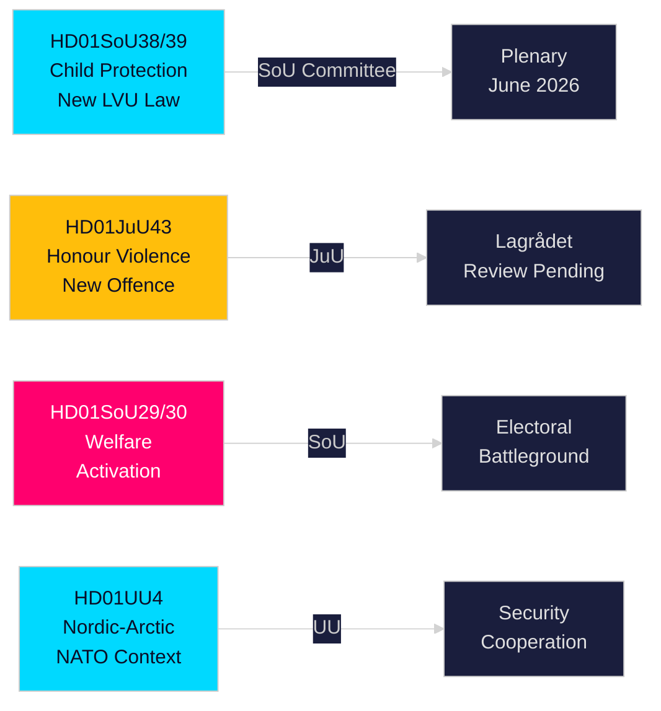

# エグゼクティブブリーフ — スウェーデン国会（リクスダーグ）委員会報告書、2026年5月21日

**著者**：Riksdagsmonitor Intelligence  
**分類**：PUBLIC — GDPR Art. 9(2)(e,g)  
**信頼度**：HIGH [A1] 児童保護 / MEDIUM [B2] 福祉改革  
**実行ID**：26206467231

---

## 🎯 結論

スウェーデン国会（リクスダーグ）は2026年5月20日に12件の委員会報告書を公表し、2025/26年会期の選挙前スプリントで最も実質的な1日の成果となった。主軸となるのは、児童保護に関する2本の改革 — HD01SoU38（新強制ケア法）とHD01SoU39（予防的社会サービス義務化）— であり、20年ぶりの最重要児童福祉立法として2026年9月の総選挙（リクスダーグ選挙）まで16週の時点で幅広い超党派支持を集めている。名誉暴力立法（HD01JuU43）と係争中の生活保護改革（HD01SoU29、HD01SoU30）の同時前進は、ティードー連立政権の核心選挙公約の達成を完成させ、教育（HD01UbU30、HD01UbU21）および国際問題（HD01UU3、HD01UU4、HD01MJU22）が密度の高い立法会期を締めくくる。福祉活性化パッケージは最も選挙的に論争的な要素であり、約8万世帯に影響を与え、野党S/MP/Vに主要な選挙キャンペーンの武器を提供する。

## 🧭 このブリーフが支援する3つの決定事項

| # | 決定事項 | 関連性 | Horizon |
|---|---------|--------|--------|
| 1 | JuU43の名誉暴力条項に関するLagrådets審査を憲法リスクの観点から監視する | 否定的意見は政府に改訂を強い、選挙キャンペーン中に「違憲立法」の物語を生み出す | T+14–30d |
| 2 | SoU29/SoU30福祉活性化の本会議採決に関する中央党（C）の立場を追う | Cが反対 → 政府は174-171で勝利；Cが棄権 → より広い委任；Cが遅延 → 秋の選挙キャンペーン問題 | T+21–45d |
| 3 | SoU38/SoU39児童保護立法に向けた自治体の実施能力を評価する | キャンペーン期間中の資金不足による実施は、与党ブロックにとって重大な選挙リスク | T+30–90d |

## ⚡ 60秒の要約

- **児童保護改革**（HD01SoU38 + HD01SoU39）：権利中心の新強制ケア法＋予防的義務。2003年以来最も広範なスウェーデン児童ケアの立法改革。幅広い党派支持。本会議採決は2026年6月3〜9日と推定。
- **名誉暴力**（HD01JuU43）：名誉に基づく暴力に関する新しい刑事カテゴリー。SDの旗艦政策。Lagrådets審査待ち。ECHR第14条リスクは慎重な法文作成で管理可能。
- **福祉活性化**（HD01SoU29 + HD01SoU30）：活動要件＋給付上限で約8万世帯に影響。最も論争的な立法 — S/MP/Vが強く反対；Cは曖昧。中心的な選挙戦争場。
- **Friskola**（HD01UbU30）：独立学校の運営条件の厳格化；市場原理をめぐりM/KD/Lブロック内で内部緊張を生む。
- **国際問題**（HD01UU3、HD01UU4、HD01MJU22）：開発援助の説明責任、北欧・北極圏委任（ポストNATO）、Riksrevisionenの気候金融監査。MJU22の批判的所見は野党に気候攻撃の機会を与える。

## 🔮 最重要の先行きトリガー

**LagrådetsのJuU43に関する意見（T+14–30d）**：Lagrådetsが憲法的理由から否定的な意見を出した場合、与党ブロックは選挙キャンペーン真っ只中に「違憲立法」の物語に直面する。否定的意見がなければ、立法の道は採択に向けて開かれている。www.lagradet.seを監視すること。

## 主要な進展

### 児童保護改革（HD01SoU38 + HD01SoU39）★ 重大
2つの補完的な委員会報告書が、子どもと若者の強制ケアに向けた新しい立法アーキテクチャを構築している。SoU38はLVUの核心規定を権利中心の枠組みで置き換え、SoU39は家族が社会サービスとの協力を拒む際の予防的権限を追加する。両者合わせて、2003年以来最も実質的なスウェーデン児童保護法の改革を体現する。幅広い超党派支持が逆転リスクを低減。自治体の財政赤字（SKR約180億SEKの構造的赤字）を考慮すると実施リスクは相当大きい。

### Honour: 名誉に基づく暴力 — 刑法強化（HD01JuU43）
司法委員会が、名誉に基づく暴力と抑圧に対する独立した刑事カテゴリーを創設する強化立法を推進。文書化された執行上のギャップを埋める；BarnafridおよびLänsstyrelsen Östergötlandの研究に支持されている。2026-05-21時点でLagrådets審査状況は待ち。

### 生活保護改革 — 政治的に論争的（HD01SoU29 + HD01SoU30）
活動要件（SoU29）と給付上限（SoU30）が与党ブロックの福祉活性化プログラムを推進。野党（S/MP/V）は強い抵抗を表明。約8万世帯が上限メカニズムの影響を受ける（SCBデータ）。選挙まで16週の時点で、これらは会期で最も選挙的に重要な報告書である。

### 独立学校 — 条件を強化（HD01UbU30）
教育委員会報告書が独立学校セクターに対してより厳格な運営条件を導入。市場原理をめぐりM/KD/Lブロック内で内部緊張を生む。

### 国際クラスター：開発援助、北欧・北極圏、気候監査
UU3（より深い援助報告）、UU4（ポストNATO文脈での北欧・北極圏委任）、MJU22（Riksrevisionenの気候金融に関する所見）が一貫した国際的説明責任の物語を形成する。

## 選挙インテリジェンス

2026年9月のリクスダーグ選挙まで約16週となった今、与党ブロックは最も実行可能な立法を前倒しした。児童保護と名誉暴力パッケージは高いコンセンサスの勝利をもたらす。福祉活性化（SoU29/SoU30）は計算されたリスク — 与党ブロックの支持基盤には人気だが、野党支持者を動員する可能性もある。

**主要PIR**：LagrådetsのJuU43に関する意見（T+14d）；SoU38/39の本会議採決スケジュール（T+14d）；CのSoU29/30に対する立場（T+21d）；会期後の世論調査（T+14d）。

## 信頼度評価

高い信頼度（A1）：SoU38、SoU39、SoU29、SoU30、UU4（全文取得済み）。  
中程度の信頼度（B2）：JuU43、MJU22、UbU21、UbU30、UU3、SoU40、SoU41（メタデータのみ）。

<!-- source-sha: f930d5ccb5c3d5e7b85a164feccaacedd41f53b4 -->
