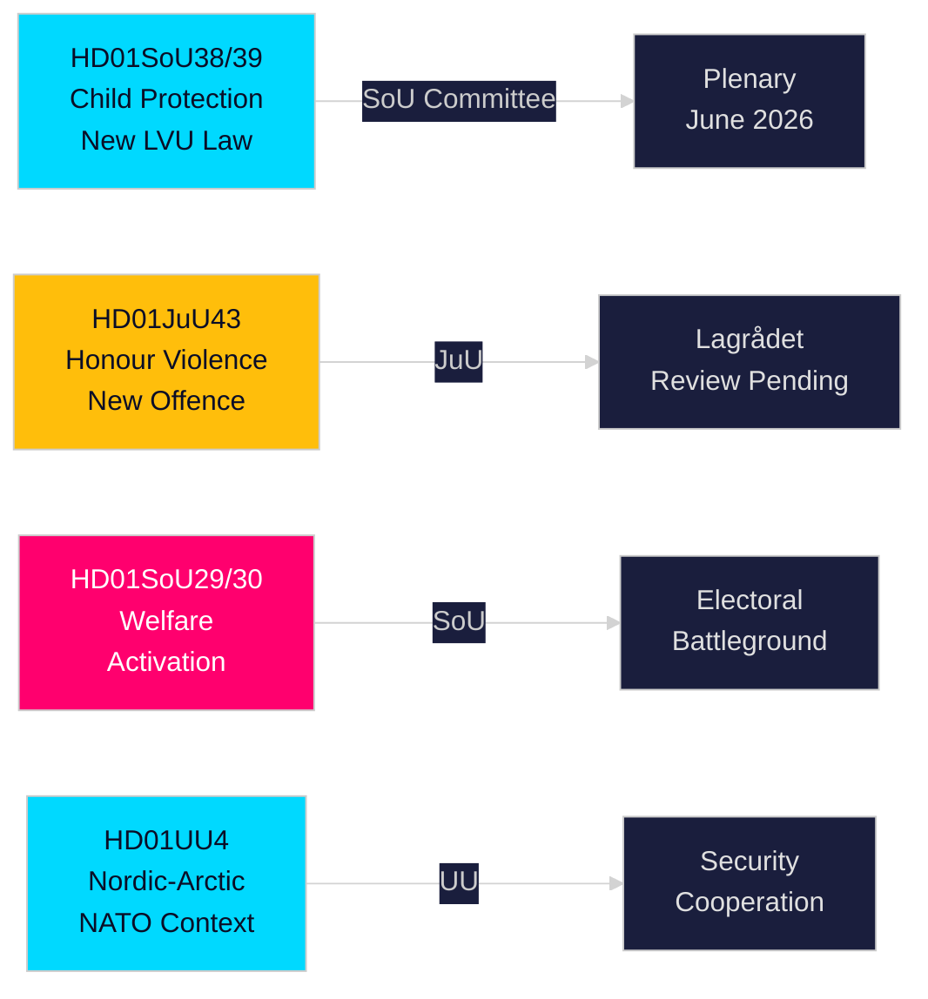

# 집행 브리핑 — 스웨덴 의회 상임위원회 보고서, 2026년 5월 21일

**저자**：Riksdagsmonitor Intelligence  
**분류**：PUBLIC — GDPR Art. 9(2)(e,g)  
**신뢰도**：HIGH [A1] 아동보호 / MEDIUM [B2] 복지개혁  
**실행 ID**：26206467231

---

## 🎯 결론

스웨덴 의회(Riksdag)는 2026년 5월 20일 12건의 상임위원회 보고서를 공표하며 2025/26 회기 선거 전 스프린트에서 가장 실질적인 하루치 결과물을 냈다. 핵심은 아동보호에 관한 두 가지 개혁 — HD01SoU38(새 강제 돌봄법)과 HD01SoU39(예방적 사회서비스 의무화) — 으로, 2026년 9월 총선(Riksdag 선거)까지 16주를 남긴 시점에 20년 만의 가장 중요한 아동복지 입법으로서 광범위한 초당파 지지를 얻고 있다. 명예폭력 법제(HD01JuU43)와 논쟁적인 생활보호 개혁(HD01SoU29, HD01SoU30)의 동시 진행은 티데(Tidö) 연립정부의 핵심 선거 공약 이행을 완성시키며, 교육(HD01UbU30, HD01UbU21) 및 국제 문제(HD01UU3, HD01UU4, HD01MJU22)가 밀도 높은 입법 회기를 마무리한다. 복지 활성화 패키지는 약 8만 가구에 영향을 미쳐 야당 S/MP/V에 주요 선거 무기를 제공하는 가장 선거적으로 논쟁적인 요소다.

## 🧭 이 브리핑이 지원하는 3가지 결정 사항

| # | 결정 사항 | 관련성 | Horizon |
|---|----------|--------|--------|
| 1 | JuU43 명예폭력 조항에 관한 Lagrådets 검토를 헌법 리스크 관점에서 모니터링 | 부정적 의견은 정부에 개정을 강요하고 선거 캠페인 중 '위헌 입법' 내러티브를 만듦 | T+14–30일 |
| 2 | SoU29/SoU30 복지 활성화 본회의 표결에 관한 중앙당(C)의 입장 추적 | C 반대 → 174-171 정부 승리; C 기권 → 더 넓은 위임; C 지연 → 가을 선거 캠페인 이슈 | T+21–45일 |
| 3 | SoU38/SoU39 아동보호 입법을 위한 지방자치단체 이행 능력 평가 | 캠페인 기간 중 자금 부족에 의한 이행은 여당 블록에 심각한 선거 리스크 | T+30–90일 |

## ⚡ 60초 요약

- **아동보호 개혁**(HD01SoU38 + HD01SoU39): 권리 중심 새 강제 돌봄법 + 예방적 의무. 2003년 이후 가장 포괄적인 스웨덴 아동 돌봄 입법 개혁. 광범위한 당파 지지. 본회의 표결 2026년 6월 3~9일 예상.
- **명예폭력**(HD01JuU43): 명예 기반 폭력에 관한 새 형사 카테고리. SD 핵심 정책. Lagrådets 검토 대기 중. ECHR 제14조 리스크는 신중한 법문 작성으로 관리 가능.
- **복지 활성화**(HD01SoU29 + HD01SoU30): 활동 요건 + 급여 상한으로 약 8만 가구 영향. 가장 논쟁적인 입법 — S/MP/V 강력 반대; C 모호. 핵심 선거 전쟁터.
- **Friskola**(HD01UbU30): 독립학교 운영 조건 강화; 시장 원리를 둘러싸고 M/KD/L 블록 내 내부 긴장 유발.
- **국제 클러스터**(HD01UU3, HD01UU4, HD01MJU22): 개발 원조 책임성, 북유럽·북극 위임(포스트 NATO), Riksrevisionen의 기후 금융 감사. MJU22의 비판적 소견은 야당에 기후 공격 기회를 줌.

## 🔮 최우선 선행 트리거

**Lagrådets의 JuU43에 관한 의견(T+14–30일)**: Lagrådets가 헌법적 이유로 부정적 의견을 낼 경우, 여당 블록은 선거 캠페인 한복판에서 '위헌 입법' 내러티브에 직면한다. 부정적 의견이 없으면 입법 경로는 채택을 향해 열린다. www.lagradet.se 모니터링 필요.

## 주요 진전 사항

### 아동보호 개혁(HD01SoU38 + HD01SoU39) ★ 중요
두 보완적 상임위원회 보고서가 아동·청소년 강제 돌봄을 위한 새로운 입법 아키텍처를 구축한다. SoU38은 LVU 핵심 조항을 권리 중심 프레임워크로 대체하고, SoU39는 가족이 사회서비스 협력을 거부할 때의 예방적 권한을 추가한다. 함께, 2003년 이후 가장 실질적인 스웨덴 아동보호법 개혁을 구현한다. 광범위한 초당파 지지가 역전 리스크를 낮춘다. SKR 약 180억 SEK의 구조적 적자를 고려하면 이행 리스크가 상당하다.

### Honour: 명예 기반 폭력 — 형법 강화(HD01JuU43)
사법위원회가 명예 기반 폭력·억압에 대한 독립적 형사 카테고리를 만드는 강화 입법을 추진. 문서화된 집행 격차를 해소; Barnafrid 및 Länsstyrelsen Östergötland 연구에 지지됨. 2026-05-21 기준 Lagrådets 검토 상태 대기 중.

### 생활보호 개혁 — 정치적으로 논쟁적(HD01SoU29 + HD01SoU30)
활동 요건(SoU29)과 급여 상한(SoU30)이 여당 블록의 복지 활성화 프로그램을 추진. 야당(S/MP/V)이 강한 저항 표명. 약 8만 가구가 상한 메커니즘의 영향을 받음(SCB 데이터). 총선까지 16주 시점에 회기의 가장 선거적으로 중요한 보고서들이다.

### 독립학교 — 조건 강화(HD01UbU30)
교육위원회 보고서가 독립학교 부문에 더 엄격한 운영 조건 도입. 시장 원리를 둘러싸고 M/KD/L 블록 내 내부 긴장 유발.

### 국제 클러스터: 개발 원조, 북유럽·북극, 기후 감사
UU3(더 깊은 원조 보고), UU4(포스트 NATO 맥락의 북유럽·북극 위임), MJU22(Riksrevisionen의 기후 금융 소견)이 일관된 국제 책임성 내러티브를 형성한다.

## 선거 인텔리전스

2026년 9월 Riksdag 선거까지 약 16주가 된 지금, 여당 블록은 가장 이행 가능한 입법을 앞당겼다. 아동보호·명예폭력 패키지는 높은 합의 승리를 가져온다. 복지 활성화(SoU29/SoU30)는 계산된 리스크다 — 여당 블록 지지층에는 인기지만 야당 지지자를 동원할 수 있다.

**주요 PIR**: Lagrådets의 JuU43 의견(T+14일); SoU38/39 본회의 표결 일정(T+14일); C의 SoU29/30 입장(T+21일); 회기 후 여론조사(T+14일).

## 신뢰도 평가

높은 신뢰도(A1): SoU38, SoU39, SoU29, SoU30, UU4(전문 취득).  
중간 신뢰도(B2): JuU43, MJU22, UbU21, UbU30, UU3, SoU40, SoU41(메타데이터만).

<!-- source-sha: f930d5ccb5c3d5e7b85a164feccaacedd41f53b4 -->
