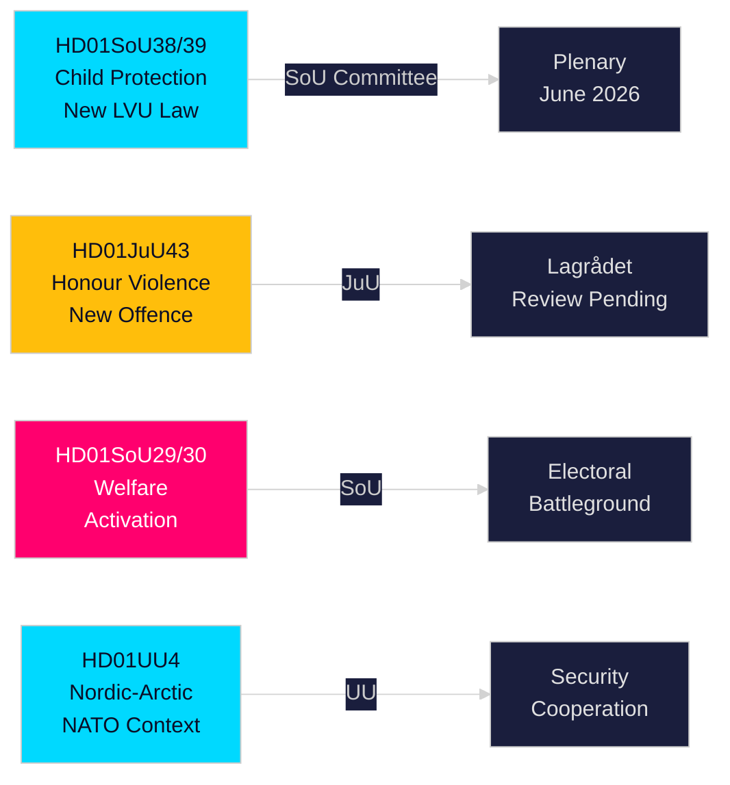

# Uitvoerend verslag — Commissierapporten van het Zweedse Riksdag, 21 mei 2026

**Auteur**: Riksdagsmonitor Intelligence  
**Classificatie**: PUBLIC — GDPR Art. 9(2)(e,g)  
**Vertrouwen**: HIGH [A1] kinderbescherming / MEDIUM [B2] hervorming welzijn  
**Uitvoerings-ID**: 26206467231

---

## 🎯 Samenvatting

Het Zweedse Riksdag publiceerde op 20 mei 2026 twaalf commissierapporten — de meest substantiële dagproductie van de pre-verkiezingsspurt van de sessie 2025/26. De dominante cluster is een dubbele kinderbeschermingshervorming — HD01SoU38 (nieuwe wet op verplichte zorg) en HD01SoU39 (preventief mandaat sociale dienstverlening) — die de meest significante kinderwelzijnswetgeving in twee decennia vertegenwoordigt, met brede meerpartijen-steun zestien weken voor de Riksdag-verkiezingen van september 2026. De gelijktijdige vooruitgang van wetgeving over eergerelateerd geweld (HD01JuU43) en betwiste hervormingen van de bijstand (HD01SoU29, HD01SoU30) voltooit de levering van de kernverkiezingsplatform van de Tidö-coalitie, terwijl onderwijs (HD01UbU30, HD01UbU21) en internationale zaken (HD01UU3, HD01UU4, HD01MJU22) een dichte wetgevingssessie afronden. Het welzijnsactiveringspakket is het meest electoraal controversiële element — het treft ~80.000 huishoudens en geeft de oppositie S/MP/V hun voornaamste campagnewapen.

## 🧭 3 Beslissingen die dit verslag ondersteunt

| # | Beslissing | Relevantie | Horizon |
|---|------------|------------|---------|
| 1 | Monitor de Lagrådet-toetsing van JuU43 eergeweld-bepalingen op constitutionele risico's | Een negatief advies dwingt de regering tot herziening en creëert een narratief van "ongrondwettelijke wetgeving" tijdens de campagne | T+14–30d |
| 2 | Volg de positie van de Centrumpartij bij de plenaire stemming SoU29/SoU30 over welzijnsactivering | C stemt tegen → de regering wint toch 174-171; C onthoudt zich → breder mandaat; C vertraagt → herfstcampagneprobleem | T+21–45d |
| 3 | Beoordeel de gemeentelijke uitvoeringskapaciteit voor SoU38/SoU39 kinderbeschermingswetgeving | Onderfinancierde uitvoering tijdens de campagneperiode is een kritiek electoraal risico voor het regeringsblok | T+30–90d |

## ⚡ 60-secondenlezing

- **Kinderbeschermingshervorming** (HD01SoU38 + HD01SoU39): Nieuwe op rechten gebaseerde wet op verplichte zorg + preventief mandaat. Meest omvangrijke wetgevingshervorming van Zweedse kinderzorg sinds 2003. Brede partijsteun. Plenaire stemming geschat 3–9 juni 2026.
- **Eergerelateerd geweld** (HD01JuU43): Nieuwe strafrechtelijke categorie voor eergebaseerd geweld. SD-vlaggenschip. Lagrådet-toetsing in afwachting. ECHR-artikel 14-risico beheersbaar met zorgvuldige formulering.
- **Welzijnsactivering** (HD01SoU29 + HD01SoU30): Activiteitseisen + uitkeringsplafond treft ~80.000 huishoudens. Meest betwiste wetgeving — S/MP/V sterk tegen; C dubbelzinnig. Centraal verkiezingsslagveld.
- **Friskola** (HD01UbU30): Strengere exploitatievoorwaarden voor vrije scholen; creëert interne spanning in M/KD/L-blok over marktoriëntatie-principes.
- **Internationaal** (HD01UU3, HD01UU4, HD01MJU22): Verantwoording ontwikkelingshulp, Noordelijk-Arctisch mandaat (post-NAVO), Riksrevisionens klimaatfinancieringsaudit. Kritische bevindingen MJU22 geven de oppositie een klimaataanvalsmogelijkheid.

## 🔮 Belangrijkste vooruitblikkende trigger

**Lagrådet-advies over JuU43 (T+14–30d)**: Als Lagrådet een negatief advies uitbrengt op constitutionele gronden, staat het regeringsblok voor een "ongrondwettelijke wetgeving"-narratief in de verkiezingscampagne. Geen negatief advies → wetgevingspad is vrij voor aanneming. Monitor www.lagradet.se.

## Belangrijke ontwikkelingen

### Kinderbeschermingshervorming (HD01SoU38 + HD01SoU39) ★ KRITIEK
Twee complementaire commissierapporten creëren een nieuwe wetgevingsarchitectuur voor verplichte zorg van kinderen en jongeren. SoU38 vervangt de kernbepalingen van de LVU door een op rechten gebaseerd kader; SoU39 voegt preventieve bevoegdheden toe wanneer gezinnen zich verzetten tegen samenwerking met sociale diensten. Samen vertegenwoordigen zij de meest ingrijpende hervorming van het Zweedse kinderbeschermingsrecht sinds 2003. Brede meerpartijen-steun vermindert het terugdraairisico. Het uitvoeringsrisico is aanzienlijk gezien de gemeentelijke begrotingstekorten (SKR ~SEK 18 mrd structureel tekort).

### Honour: Eergerelateerd geweld — strafrecht versterkt (HD01JuU43)
De justitiecommissie bevordert versterkte wetgeving die een afzonderlijke strafrechtelijke categorie schept voor eergebaseerd geweld en onderdrukking. Sluit gedocumenteerde handhavingslacunes; ondersteund door onderzoek van Barnafrid en Länsstyrelsen Östergötland. Lagrådet-toetsingsstatus in afwachting per 2026-05-21.

### Bijstandshervorming — politiek omstreden (HD01SoU29 + HD01SoU30)
Activiteitseisen (SoU29) en uitkeringsplafond (SoU30) bevorderen het welzijnsactiveringsprogramma van het regeringsblok. Oppositiepartijen (S/MP/V) signaleren sterke weerstand. ~80.000 huishoudens worden getroffen door het plafondmechanisme (SCB-data). Met de verkiezingen 16 weken weg zijn dit de electoraal meest beslissende rapporten van de sessie.

### Vrije scholen — voorwaarden aangescherpt (HD01UbU30)
Het rapport van de onderwijscommissie introduceert strengere exploitatievoorwaarden voor de vrije schoolsector. Creëert interne spanning in het M/KD/L-blok over marktoriëntatie-principes.

### Internationale cluster: ontwikkelingshulp, Noordelijk-Arctisch, klimaataudit
UU3 (diepere hulprapportage), UU4 (Noordelijk-Arctisch mandaat in post-NAVO-context), MJU22 (Riksrevisionens bevindingen over klimaatfinanciering) vormen een coherent internationaal verantwoordelijkheidsnarratief.

## Verkiezingsintelligentie

Met de Riksdag-verkiezingen van september 2026 op ca. 16 weken heeft het regeringsblok zijn meest leverbare wetgeving naar voren geplaatst. Kinderbeschermings- en eergeweldpakketten leveren hoog-consensus-winsten op. Welzijnsactivering (SoU29/SoU30) is een berekend risico — populair onder de kiezerbasis van het regeringsblok maar potentieel mobiliserend voor oppositiekiezers.

**Sleutel-PIRs**: Lagrådet-advies over JuU43 (T+14d); schema plenaire stemming voor SoU38/39 (T+14d); C-positie over SoU29/30 (T+21d); peilingen na de sessie (T+14d).

## Vertrouwensbeoordeling

Hoog vertrouwen (A1): SoU38, SoU39, SoU29, SoU30, UU4 (volledige tekst opgehaald).  
Gemiddeld vertrouwen (B2): JuU43, MJU22, UbU21, UbU30, UU3, SoU40, SoU41 (alleen metadata).

<!-- source-sha: f930d5ccb5c3d5e7b85a164feccaacedd41f53b4 -->
