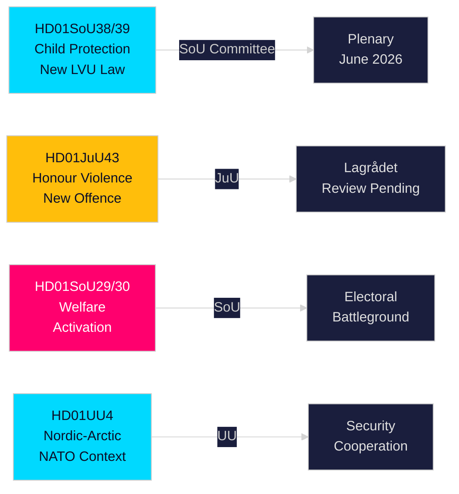

# Sammendrag — Det svenske Stortingets (Riksdags) komitérapporter, 21. mai 2026

**Forfatter**: Riksdagsmonitor Intelligence  
**Klassifisering**: PUBLIC — GDPR Art. 9(2)(e,g)  
**Tillit**: HIGH [A1] barnebeskyttelse / MEDIUM [B2] velferdsreform  
**Kjøre-ID**: 26206467231

---

## 🎯 Konklusjon

Det svenske Riksdaget offentliggjorde tolv komitérapporter (betänkanden) 20. mai 2026 i den mest substansielle endagsproduksjonen i 2025/26-sesjonens pre-valgspurt. Den dominerende klyngen er en tvillingreform om barnebeskyttelse — HD01SoU38 (ny tvangsomsorglov) og HD01SoU39 (forebyggende sosialservicemandat) — som representerer den mest betydningsfulle barnevelferdslovgivningen på to tiår og har bred tverrpolitisk støtte seksten uker før Riksdagsvalget i september 2026. Samtidig fremgang for Honour-based violence-lovgivning (HD01JuU43) og omstridte reformer av sosialhjelp (HD01SoU29, HD01SoU30) fullfører Tidö-koalisjonens kjernevalgplattform, mens utdanning (HD01UbU30, HD01UbU21) og internasjonale anliggender (HD01UU3, HD01UU4, HD01MJU22) avrunder en tett lovgivningssesjon. Velferdsaktiveringspa​kken er det mest valgpolitisk kontroversielle elementet — berører ~80 000 husholdninger og gir opposisjonen S/MP/V deres primære kampanjevåpen.

## 🧭 3 Beslutninger denne rapporten støtter

| # | Beslutning | Relevans | Horizon |
|---|------------|----------|----------|
| 1 | Overvåk Lagrådets gjennomgang av JuU43 æresvoldsparagrafene for konstitusjonell risiko | Negativ uttalelse tvinger regjeringen til revisjon og skaper narrativ om "grunnlovsstridig lov" i valgkampen | T+14–30d |
| 2 | Følg Senterpartiets (C) stilling i plenarvotering om SoU29/SoU30 velferdsaktivering | C stemmer mot → regjeringen vinner fortsatt 174-171; C avholder seg → bredere mandat; C utsetter → høstens kampanjeproblem | T+21–45d |
| 3 | Vurder kommunenes gjennomføringskapasitet for SoU38/SoU39 barnebeskyttelseslovgivning | Underfinansiert gjennomføring i kampanjeperioden er kritisk valgrisiko for regjeringsblokken | T+30–90d |

## ⚡ 60-sekunders lesning

- **Barnebeskyttelsesreform** (HD01SoU38 + HD01SoU39): Ny rettighetssentrert tvangsomsorglov + forebyggende mandat. Bredeste lovgivningsreform av svensk barnevern siden 2003. Bred partistøtte. Plenarvotering anslått 3.–9. juni 2026.
- **Honour-based violence** (HD01JuU43): Ny strafferettslig kategori for æresbasert vold. SDs flaggskip. Lagrådets gjennomgang avventes. ECHR-artikkel 14-risiko håndterbar med nøye utforming.
- **Velferdsaktivering** (HD01SoU29 + HD01SoU30): Aktivitetskrav + ytelsestak berører ~80 000 husholdninger. Mest omstridt lovgivning — S/MP/V sterkt imot; C tvetydig. Sentral valgkampfrontlinje.
- **Friskola** (HD01UbU30): Strengere driftsvilkår for friskoler; skaper intern spenning i M/KD/L-blokken om markedsorientering.
- **Internasjonalt** (HD01UU3, HD01UU4, HD01MJU22): Bistandsansvarlighet, nordisk-arktisk mandat (post-NATO), Riksrevisjonens klimafinansrevisjon. MJU22s kritiske funn gir opposisjonen en klimaangrepsmulighet.

## 🔮 Viktigste fremoverskuende utløser

**Lagrådets uttalelse om JuU43 (T+14–30d)**: Hvis Lagrådet avgir en negativ uttalelse på konstitusjonelt grunnlag, møter regjeringsblokken et "grunnlovsstridig lovgivning"-narrativ i valgkampen. Ingen negativ uttalelse → lovgivningsveien er klar for vedtakelse. Overvåk www.lagradet.se.

## Viktige utviklinger

### Barnebeskyttelsesreform (HD01SoU38 + HD01SoU39) ★ KRITISK
To komplementære komitérapporter skaper en ny lovgivningsmessig arkitektur for tvangsplassering av barn og unge. SoU38 erstatter kjernebestemmelsene i LVU med et rettighetssentrert rammeverk; SoU39 tilføyer forebyggende fullmakter når familier motsetter seg sosialvesenets samarbeid. Tilsammen representerer de den mest gjennomgripende reformen av svensk barnevernlovgivning siden 2003. Bred tverrpolitisk støtte reduserer risikoen for tilbakeslag. Gjennomføringsrisikoen er betydelig gitt kommunale budsjettunderskudd (SKR ~SEK 18 mrd. strukturelt underskudd).

### Honour: Æresbasert vold — straffeloven styrkes (HD01JuU43)
Justiskomiteen fremmer styrket lovgivning som oppretter en særskilt strafferettslig kategori for æresbasert vold og undertrykkelse. Lukker dokumenterte håndhevingshull; støttet av Barnafrid og Länsstyrelsen Östergötlands forskning. Lagrådets gjennomgangsstatus avventes per 2026-05-21.

### Sosialhjelpsreform — politisk omstridt (HD01SoU29 + HD01SoU30)
Aktivitetskrav (SoU29) og ytelsestak (SoU30) fremmer regjeringsblokens velferdsaktiveringsagenda. Opposisjonspartier (S/MP/V) signaliserer sterk motstand. ~80 000 husholdninger berøres av takmekanismen (SCB-data). Med valget 16 uker unna er dette de mest valgpolitisk avgjørende rapportene i sesjonen.

### Friskoler — vilkår strammes (HD01UbU30)
Utdanningskomiteens rapport innfører strengere driftsvilkår for friskolesektor. Skaper intern spenning i M/KD/L-blokken om markedsorientering.

### Internasjonal klynge: bistandsansvarlighet, nordisk-arktisk, klimarevisjon
UU3 (dypere bistandsrapportering), UU4 (nordisk-arktisk mandat i post-NATO-kontekst), MJU22 (Riksrevisjonens funn om klimafinansiering) danner et sammenhengende internasjonalt ansvarsnarrativ.

## Valgkampsetterretning

Med Riksdagsvalget i september 2026 ca. 16 uker unna har regjeringsblokken lagt sin mest leverbare lovgivning frem. Barnebeskyttelses- og æresvoldspakker gir høy-konsensus-gevinster. Velferdsaktivering (SoU29/SoU30) er en kalkulert risiko — populær hos regjeringsblokens velgerbasis men potensielt mobiliserende for opposisjonens velgere.

**Sentrale PIR-er**: Lagrådets uttalelse om JuU43 (T+14d); plenarvoteringsplan for SoU38/39 (T+14d); Cs stilling til SoU29/30 (T+21d); meningsmålinger etter sesjonen (T+14d).

## Tillitsvurdering

Høy tillit (A1): SoU38, SoU39, SoU29, SoU30, UU4 (fulltekst hentet).  
Middels tillit (B2): JuU43, MJU22, UbU21, UbU30, UU3, SoU40, SoU41 (kun metadata).

<!-- source-sha: f930d5ccb5c3d5e7b85a164feccaacedd41f53b4 -->
