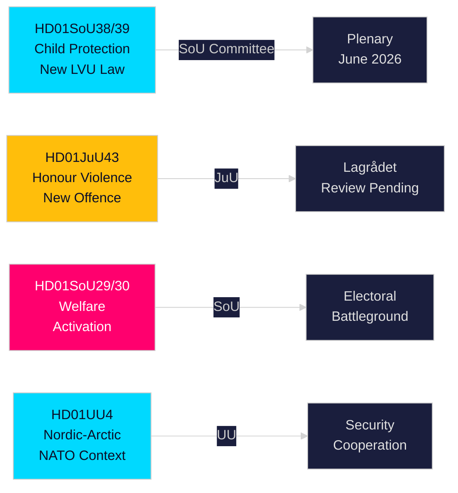

# Sammanfattning — Svenska riksdagens utskottsbetänkanden, 21 maj 2026

**Upphovsman**: Riksdagsmonitor Intelligence  
**Klassificering**: PUBLIC — GDPR Art. 9(2)(e,g)  
**Tillförlitlighet**: HIGH [A1] barnsskydd / MEDIUM [B2] välfärdsreform  
**Körnings-ID**: 26206467231

---

## 🎯 Slutsats

Sveriges riksdag publicerade tolv betänkanden den 20 maj 2026 i den mest substantiella endagsproduktionen under 2025/26 riksmötets valspurt. Centralt är en tvilling-barnsskyddsreform — HD01SoU38 (ny tvångsvårdslag) och HD01SoU39 (förebyggande socialservicemandat) — som utgör den mest betydande barnvälfärdslagstiftningen på två decennier med brett parlamentariskt stöd sexton veckor före riksdagsvalet i september 2026. Honour-based violence-lagstiftning (HD01JuU43) och omtvistade reformer av försörjningsstöd (HD01SoU29, HD01SoU30) fulländar Tidökoalitionens kärnlöften, medan utbildning (HD01UbU30, HD01UbU21) och utrikesärenden (HD01UU3, HD01UU4, HD01MJU22) kompletterar en tät lagstiftningssession. Välfärdsaktiveringspaketet är det mest electoralt kontroversiella inslaget — det berör ~80 000 hushåll och ger S/MP/V deras viktigaste kampanjvapen.

## 🧭 3 Beslut denna rapport stödjer

| # | Beslut | Relevans | Horizon |
|---|--------|----------|----------|
| 1 | Bevaka Lagrådets granskning av JuU43 hedervåldsparagraferna för konstitutionell risk | Negativt yttrande tvingar regeringen till revision och skapar narrativ om "grundlagsstridig lag" i valrörelsen | T+14–30d |
| 2 | Följ Centerpartiets ställningstagande i plenumomröstningen om SoU29/SoU30 välfärdsaktivering | C röstar emot → regeringen vinner ändå 174-171; C avstår → bredare mandat; C dröjer → höstens valrörelseproblem | T+21–45d |
| 3 | Bedöm kommunernas genomförandekapacitet för SoU38/SoU39 barnsskyddslagstiftning | Underfinansierad implementering under kampanjperioden är kritisk valrörelsrisk för regeringsblocket | T+30–90d |

## ⚡ 60-sekundersläsning

- **Barnsskyddsreform** (HD01SoU38 + HD01SoU39): Ny rättighetscentrerad tvångsvårdslag + förebyggande mandat. Bredaste lagstiftningsreformen av svensk barnvård sedan 2003. Bred partistöd. Plenumomröstning beräknas 3–9 juni 2026.
- **Honour-based violence** (HD01JuU43): Ny brottsrubricering för hedersbaserat våld. SD:s flaggskepp. Lagrådsgranskning pågår. ECHR-artikel 14-risk hanterbbar med noggrant formulerade regler.
- **Välfärdsaktivering** (HD01SoU29 + HD01SoU30): Aktivitetskrav + bidragstak berör ~80 000 hushåll. Mest omtvistad lagstiftning — S/MP/V starkt emot; C tveksamt. Central valrörelsebattleground.
- **Friskola** (HD01UbU30): Skärpta villkor för fristående skolor; skapar intern spänning hos M/KD/L.
- **Internationellt** (HD01UU3, HD01UU4, HD01MJU22): Biståndsansvarighet, nordisk-arktiskt mandat (post-NATO), Riksrevisionens klimatfinansrevision. MJU22:s kritiska slutsatser ger oppositionen ett klimatattackstillfälle.

## 🔮 Viktigaste framåtblickande utlösaren

**Lagrådets yttrande om JuU43 (T+14–30d)**: Om Lagrådet avger ett negativt yttrande på konstitutionell grund, ställs regeringsblocket inför ett "grundlagsstridig lagstiftning"-narrativ i valrörelsen. Om inget negativt yttrande utfärdas, är den lagstiftningsspåret klart för antagande. Bevaka www.lagradet.se.

## Viktiga händelseutvecklingar

### Barnsskyddsreform (HD01SoU38 + HD01SoU39) ★ KRITISKT
Två kompletterande betänkanden skapar en ny lagstiftningsarkitektur för tvångsvård av barn och unga. SoU38 ersätter kärnan i LVU-bestämmelserna med ett rättighetscentrerat ramverk; SoU39 lägger till förebyggande befogenheter när familjer motsätter sig socialtjänstens samarbete. Tillsammans utgör de den mest genomgripande reformen av svensk barnvårdslagstiftning sedan 2003. Brett partistöd minskar risken för bakslag. Genomföranderisken är betydande med hänsyn till kommunala underskott (SKR ~18 mdr kr strukturellt underskott).

### Honour-based violence — strafflagen stärks (HD01JuU43)
Justitieutskottet driver fram förstärkt lagstiftning som skapar en ny brottsrubricering för hedersbaserat våld och förtryck. Täpper igen dokumenterade tillämpningsluckor; stöds av Barnafrid och Länsstyrelsen Östergötlands forskning. Lagrådets granskningsstatus pågår per 2026-05-21.

### Socialbidrags reform — politiskt omtvistat (HD01SoU29 + HD01SoU30)
Aktivitetskrav (SoU29) och bidragstak (SoU30) driver på regeringsblockets välfärdsaktiveringsprogram. Oppositionspartier (S/MP/V) signalerar starkt motstånd. ~80 000 hushåll berörs av takmekanismen (SCB-data). Med valet 16 veckor bort är dessa de mest electoralt avgörande betänkandena i sessionen.

### Fristående skolor — villkor skärps (HD01UbU30)
Utbildningsutskottets betänkande inför striktare driftsvillkor för friskolesektorn. Skapar intern spänning inom M/KD/L-blocket kring marknadsorienterade principer.

### Internationellt kluster: biståndsansvarighet, nordisk-arktiskt, klimatrevision
UU3 (fördjupad biståndsrapportering), UU4 (nordisk-arktiskt mandat i post-NATO-kontext), MJU22 (Riksrevisionens slutsatser om klimatfinansiering) bildar ett sammanhängande internationellt ansvarighetsnarrativ.

## Valrörelsesunderrättelse

Med riksdagsvalet i september 2026 ungefär 16 veckor bort har regeringsblocket lagt sin mest levererbar lagstiftning i förväg. Barnsskydds- och hedersvåldspaket ger högkonsensuerade vinster. Välfärdsaktivering (SoU29/SoU30) är en kalkylerad risk — populär bland regeringsblockets väljarbas men potentiellt mobiliserande för oppositionsväljare.

**Nyckel-PIR:er**: Lagrådets yttrande om JuU43 (T+14d); schema för plenumomröstning om SoU38/39 (T+14d); C:s position om SoU29/30 (T+21d); opinionsundersökningar efter sessionen (T+14d).

## Tillförlitlighetsbedömning

Hög tillförlitlighet (A1): SoU38, SoU39, SoU29, SoU30, UU4 (fulltext hämtad).  
Medel tillförlitlighet (B2): JuU43, MJU22, UbU21, UbU30, UU3, SoU40, SoU41 (enbart metadata).

<!-- source-sha: f930d5ccb5c3d5e7b85a164feccaacedd41f53b4 -->
