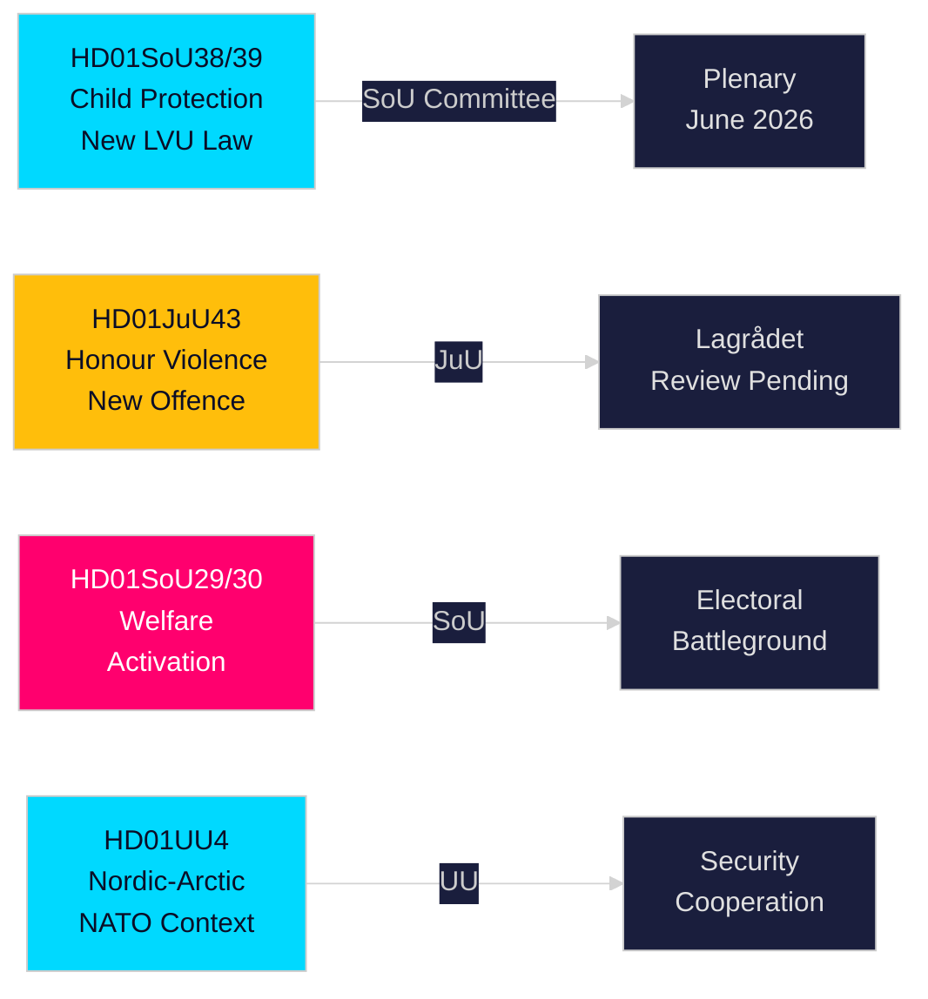

# 执行简报 — 瑞典议会（Riksdag）委员会报告，2026年5月21日

**作者**：Riksdagsmonitor Intelligence  
**分类**：PUBLIC — GDPR Art. 9(2)(e,g)  
**置信度**：HIGH [A1] 儿童保护 / MEDIUM [B2] 福利改革  
**执行ID**：26206467231

---

## 🎯 结论

2026年5月20日，瑞典议会（Riksdag）公布12份委员会报告，成为2025/26年度会期选举前冲刺阶段最具实质意义的单日成果。核心是两项儿童保护改革 — HD01SoU38（新强制照护法）和HD01SoU39（预防性社会服务义务化） — 这两项改革距2026年9月大选（Riksdag选举）还有16周，作为20年来最重要的儿童福利立法获得广泛跨党派支持。名誉暴力立法（HD01JuU43）与争议性社会救助改革（HD01SoU29、HD01SoU30）同步推进，完成了蒂德（Tidö）联合政府核心选举承诺的兑现，教育（HD01UbU30、HD01UbU21）和国际事务（HD01UU3、HD01UU4、HD01MJU22）为密集立法会期画上句点。福利激活方案是选举争议最大的要素，影响约8万户家庭，为反对党S/MP/V提供主要选举武器。

## 🧭 本简报支持的三项决策

| # | 决策 | 相关性 | Horizon |
|---|------|--------|---------|
| 1 | 从宪法风险角度监控Lagrådets对JuU43荣誉暴力条款的审查 | 负面意见将迫使政府修订，并在竞选期间制造"违宪立法"叙事 | T+14–30天 |
| 2 | 追踪中央党（C）对SoU29/SoU30福利激活全体会议表决的立场 | C反对→政府以174-171胜出；C弃权→更广授权；C拖延→秋季竞选议题 | T+21–45天 |
| 3 | 评估地方政府对SoU38/SoU39儿童保护立法的执行能力 | 竞选期间因资金不足导致的执行失败将给执政联盟带来严重选举风险 | T+30–90天 |

## ⚡ 60秒摘要

- **儿童保护改革**（HD01SoU38 + HD01SoU39）：权利中心的新强制照护法 + 预防性义务。2003年以来最全面的瑞典儿童照护立法改革。广泛党派支持。全体表决预计2026年6月3~9日。
- **名誉暴力**（HD01JuU43）：针对荣誉暴力的新刑事类别。SD旗舰政策。待Lagrådets审查。ECHR第14条风险通过谨慎起草可管控。
- **福利激活**（HD01SoU29 + HD01SoU30）：活动要求 + 福利上限，影响约8万户家庭。争议最大的立法 — S/MP/V强烈反对；C态度模糊。核心选举战场。
- **独立学校**（HD01UbU30）：对独立学校部门引入更严格的运营条件；围绕市场原则在M/KD/L联盟内部引发紧张。
- **国际组合**（HD01UU3、HD01UU4、HD01MJU22）：发展援助问责、北欧-北极圈授权（后北约背景）、Riksrevisionen气候金融审计。MJU22的批评性发现给反对党提供气候攻击机会。

## 🔮 最高优先级的先行触发因素

**Lagrådets就JuU43发表意见（T+14–30天）**：如Lagrådets以宪法理由提出负面意见，执政联盟将在竞选期间面临"违宪立法"叙事。无负面意见则立法通道向通过开放。监控 www.lagradet.se。

## 主要进展

### 儿童保护改革（HD01SoU38 + HD01SoU39）★ 重要
两份互补的委员会报告构建了儿童和青少年强制照护的新立法架构。SoU38以权利中心框架替换LVU核心条款，SoU39增加家庭拒绝与社会服务合作时的预防性权力。两者共同体现了2003年以来最实质性的瑞典儿童保护法改革。广泛的跨党派支持降低了逆转风险。考虑到SKR约180亿瑞典克朗的结构性赤字，执行风险相当大。

### Honour: 荣誉暴力 — 刑法强化（HD01JuU43）
司法委员会推进立法强化，为荣誉暴力和压迫创建独立刑事类别。填补已记录的执法缺口；获Barnafrid和Länsstyrelsen Östergötland研究支持。截至2026-05-21，Lagrådets审查状态待定。

### 社会救助改革 — 政治争议性（HD01SoU29 + HD01SoU30）
活动要求（SoU29）和福利上限（SoU30）推动执政联盟的福利激活方案。反对党（S/MP/V）表达强烈抵抗。约8万户家庭受上限机制影响（SCB数据）。距大选16周，这是本会期选举意义最重大的报告。

### 独立学校 — 强化条件（HD01UbU30）
教育委员会报告为独立学校部门引入更严格的运营条件。围绕市场原则在M/KD/L联盟内部引发紧张。

### 国际组合：发展援助、北欧-北极圈、气候审计
UU3（更深入的援助报告）、UU4（后北约背景下的北欧-北极圈授权）、MJU22（Riksrevisionen气候金融调查结果）共同构成一致的国际问责叙事。

## 选举情报

距2026年9月Riksdag选举约16周，执政联盟提前推进了最具可执行性的立法。儿童保护和名誉暴力方案带来高共识胜利。福利激活（SoU29/SoU30）是经过计算的风险 — 在执政联盟支持者中受欢迎，但可能动员反对党选民。

**主要PIR**：Lagrådets就JuU43发表意见（T+14天）；SoU38/39全体表决日程（T+14天）；C对SoU29/30的立场（T+21天）；会期后民调（T+14天）。

## 置信度评估

高置信度（A1）：SoU38、SoU39、SoU29、SoU30、UU4（全文已获取）。  
中等置信度（B2）：JuU43、MJU22、UbU21、UbU30、UU3、SoU40、SoU41（仅元数据）。

<!-- source-sha: f930d5ccb5c3d5e7b85a164feccaacedd41f53b4 -->
