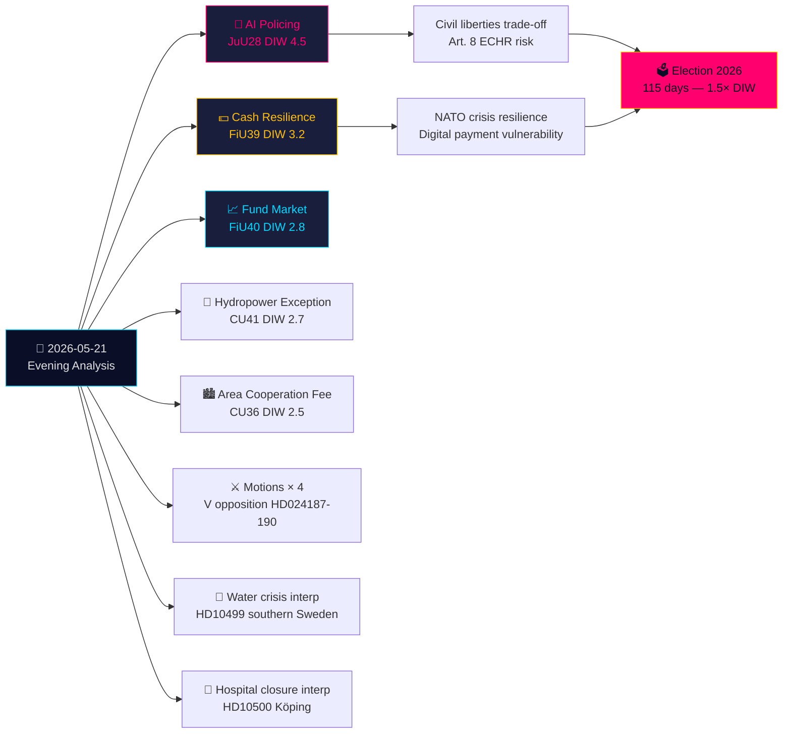

# Executive Brief — Evening Analysis 2026-05-21

**Classification**: Public OSINT · **Confidence**: HIGH · **Author**: Riksdagsmonitor Intelligence Pipeline  
**Cycle**: Evening Analysis · **Horizon**: T+72h → T+30d · **DIW multiplier**: 1.5× (115 days to election)

## 🎯 BLUF

Thursday 21 May 2026 closes with a defining civil-liberties watershed: the Justice Committee (JuU) approves **Sweden's first AI facial recognition legislation for police in real time** (HD01JuU28, betänkande 2025/26:JuU28). Simultaneously, FiU's **cash-resilience betänkande** (HD01FiU39) and FiU40's **fund market reform** reshape Sweden's financial infrastructure. Five betänkanden from JuU, FiU, and CU create an unusually broad cross-committee legislative footprint. Against this backdrop: opposition motions attack the government's security-threat expulsion regime and Skatteverket powers, while interpellations on southern Sweden's water crisis and hospital closures expose welfare-delivery failures. Written questions on Taiwan arms and Tibet signal Sweden's post-NATO diplomatic tensions remain unresolved.

## 🧭 3 Decisions This Brief Supports

1. **Civil society / legal**: File Lagrådet-review demand for JuU28 implementation regulations on AI facial recognition deployment protocols, data retention limits, and appeal rights. **Trigger**: Government bill for implementing ordinance, expected within 60 days of Riksdag vote. Confidence: **HIGH**.

2. **Financial institutions / Riksbank**: Assess operational readiness for FiU39 cash obligations — banks must maintain minimum cash service levels under the new regime. **Trigger**: Riksdag vote on FiU39 (expected plenary week of 25 May). Confidence: **HIGH**.

3. **Foreign policy desk**: Sweden has 48–72h window to clarify its Taiwan arms-sale position (HD11822) before the Trump/China arms-freeze narrative hardens into diplomatic fact. FM Malmer Stenergard's response will signal whether Sweden aligns with EU consensus or carves a pro-Taiwan-defense position. **Trigger**: Written question response deadline. Confidence: **MEDIUM-HIGH**.

## 60-second read

- **Highest significance**: JuU28 — AI real-time facial recognition for police. Sweden becomes one of the first EU member states to legislate explicit police AI biometrics. ECHR Article 8 and EU AI Act Category 1 high-risk implications. DIW 4.5 (election-proximity 1.5× applied).
- **Most economically consequential**: FiU40 (stronger fund market) — structural reform of Sweden's SEK 6 trillion fund industry. Long-term capital formation implications for pension savings.
- **Most geopolitically sensitive**: HD11822 (Taiwan arms) and HD11821 (Tibet-China) — written questions that expose Sweden's post-NATO diplomatic tightrope between Atlantic commitments and China/Russia relations.
- **Most welfare-system revealing**: HD10500 (Köping hospital) interpellation — government acknowledges hospital restructuring without a coherent rural healthcare framework.

## Tier-C cross-day synthesis

Today's committee output connects directly to yesterday's/this week's propositions and motions:
- JuU28 AI biometrics **follows** the government's security-threat expulsion proposition (HD03267, cited in propositions sibling) — together they form Sweden's most comprehensive security-state expansion since SÄPO reorganization in 2019.
- FiU39 cash resilience **extends** the digital governance theme from HD03250 (state e-ID, propositions sibling) — Sweden simultaneously expands digital identity AND mandates cash fallback.
- V's motions today (HD024188 against HD03267) **echo** V's systematic opposition pattern documented in the motions sibling analysis.

## Economic context

IMF WEO-2026-04: Sweden GDP growth forecast 2.1% (2026), inflation 2.0%, unemployment 8.4%. The fund market reform (FiU40) intersects with Sweden's SEK 6 trillion fund industry structural vulnerabilities identified in Riksbank Financial Stability Report 2025:2. Cash obligation (FiU39) has estimated banking-sector compliance cost of SEK 400–800m in capital expenditure (SBAB, Finansinspektionen estimates).

*economicProvenance: provider=imf, dataflow=WEO, vintage=WEO-2026-04, vintageAgeMonths=1, retrieved_at=2026-05-21*
