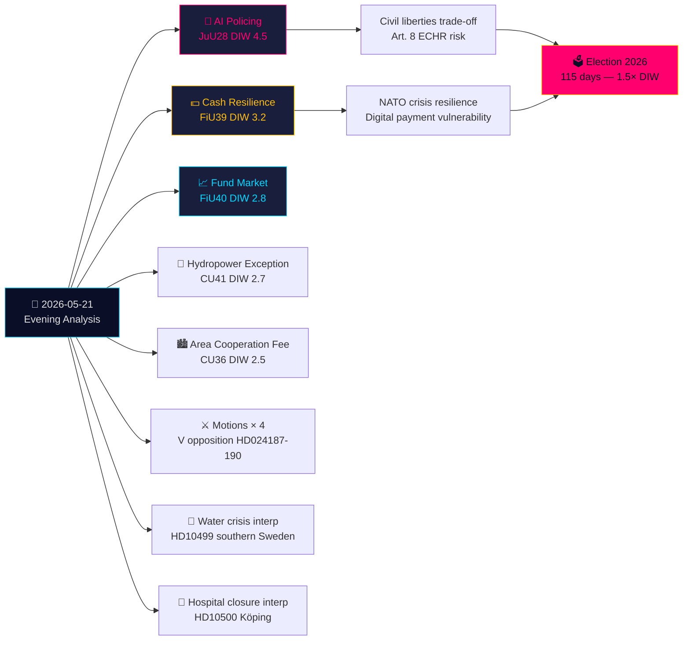

# ملخص تنفيذي — تحليل المساء 2026-05-21

**التصنيف**: OSINT عام · **مستوى الثقة**: عالٍ · **المؤلف**: تحليل الاستخبارات في Riksdagsmonitor  
**الدورة**: تحليل المساء · **الأفق الزمني**: T+72h → T+30d · **معامل DIW**: 1.5× (115 يومًا حتى الانتخابات)

## 🎯 الاستنتاج الرئيسي

يشهد يوم الخميس 21 مايو 2026 تحولًا قانونيًا بارزًا: تُقرّ لجنة العدل (JuU) **أول تشريع سويدي لتقنية التعرف على الوجه بالذكاء الاصطناعي للشرطة في الوقت الفعلي** (HD01JuU28, betänkande 2025/26:JuU28). في الوقت ذاته، يُعيد **betänkande مرونة النقد** الخاص بـ FiU (HD01FiU39) و**إصلاح سوق الصناديق** FiU40 تشكيل البنية التحتية المالية السويدية. تُشكّل خمسة betänkanden من JuU وFiU وCU بصمةً تشريعيةً متشعبة بين اللجان غير معتادة في اتساعها. على هذه الخلفية، تستهدف مواد المعارضة نظام ترحيل التهديدات الأمنية للحكومة وصلاحيات Skatteverket، فيما تكشف الاستجوابات حول أزمة المياه في جنوب السويد وإغلاق المستشفيات عن إخفاقات في منظومة الرعاية الاجتماعية. أما الأسئلة المكتوبة بشأن أسلحة تايوان والتبت، فتدلّ على استمرار التوترات الدبلوماسية السويدية غير المحلولة في مرحلة ما بعد الناتو.

## 🧭 3 قرارات يدعم هذا الملخص اتخاذها

1. **المجتمع المدني/القانوني**: تقديم طلب مراجعة إلى Lagrådet بشأن مراسيم تنفيذ JuU28 المتعلقة ببروتوكولات استخدام التعرف على الوجه بالذكاء الاصطناعي، وحدود الاحتفاظ بالبيانات، وحقوق الطعن. **المحفز**: مرسوم تنفيذي حكومي، يُتوقع صدوره في غضون 60 يومًا من تصويت Riksdag. مستوى الثقة: **عالٍ**.

2. **المؤسسات المالية/Riksbanken**: تقييم الاستعداد التشغيلي لالتزامات النقد في FiU39 — يتعين على البنوك الحفاظ على مستويات خدمة نقدية دنيا في ظل النظام الجديد. **المحفز**: تصويت Riksdag على FiU39 (متوقع في أسبوع الجلسة العامة 25 مايو). مستوى الثقة: **عالٍ**.

3. **الشؤون الخارجية**: لدى السويد نافذة 48-72 ساعة لتوضيح موقفها من صفقات الأسلحة مع تايوان (HD11822) قبل أن تتجمد رواية ترامب/الصين للتسلح في حقيقة دبلوماسية. ستكشف إجابة وزيرة الخارجية Malmer Stenergard ما إذا كانت السويد ستتبع توافق الاتحاد الأوروبي أم ستتبنى موقفًا مؤيدًا للتايوان في الدفاع. **المحفز**: الموعد النهائي للرد على السؤال المكتوب. مستوى الثقة: **متوسط-عالٍ**.

## 60 ثانية

- **الأهم**: JuU28 — التعرف على الوجه بالذكاء الاصطناعي في الوقت الفعلي للشرطة. تصبح السويد من أوائل الدول الأعضاء في الاتحاد الأوروبي التي تُشرّع صراحةً للقياسات الحيوية في الشرطة. تداعيات المادة 8 من الاتفاقية الأوروبية لحقوق الإنسان والفئة 1 عالية المخاطر من لائحة الذكاء الاصطناعي الأوروبية. DIW 4.5 (مضاعف اقتراب الانتخابات 1.5× مُطبَّق).
- **الأهم اقتصاديًا**: FiU40 (أسواق صناديق أقوى) — إصلاح هيكلي لأسواق الصناديق السويدية البالغة 6 تريليون كرونة. آثار طويلة الأمد على تطوير سوق رأس المال ومدخرات التقاعد.
- **الأكثر حساسية جيوسياسية**: HD11822 (أسلحة تايوان) و HD11821 (التبت-الصين) — أسئلة مكتوبة تكشف عن موازنة السويد الدبلوماسية في مرحلة ما بعد الناتو.
- **الكاشفة لمنظومة الرعاية الاجتماعية**: استجواب HD10500 (مستشفى كوبينج) — تُقرّ الحكومة بإعادة هيكلة المستشفيات دون إطار موحد للرعاية الصحية الريفية.

## التوليف المتقاطع بين الأيام — Tier-C

يرتبط إنتاج اللجان اليوم مباشرةً بالـ Propositioner والـ Motioner من أمس/هذا الأسبوع:
- القياسات الحيوية للذكاء الاصطناعي JuU28 **تتبع** اقتراح الحكومة بالترحيل بسبب التهديد الأمني (HD03267، مستشهد به في Propositioner الشقيقة) — معًا يُشكّلان أوسع توسع لمنظومة الأمن السويدية منذ إعادة تنظيم SÄPO عام 2019.
- مرونة النقد FiU39 **تُكمل** موضوع الحوكمة الرقمية في HD03250 (الهوية الرقمية الحكومية، Propositioner الشقيقة) — السويد تُوسّع الهوية الرقمية وتُلزم بدائل النقد في آنٍ واحد.
- Motioner الخاصة بـ V اليوم (HD024187 ضد HD03267) **تُعكس** نمط المعارضة المنهجية لـ V الموثّق في تحليل Motioner الشقيق.

## السياق الاقتصادي

صندوق النقد الدولي WEO-2026-04: توقعات نمو الناتج المحلي الإجمالي السويدي 2.1% (2026)، التضخم 2.0%، البطالة 8.4%. يعالج إصلاح سوق الصناديق (FiU40) ثغرات أسواق الصناديق السويدية البالغة 6 تريليون كرونة المُحددة في تقرير الاستقرار المالي لـ Riksbanken 2025:2. يتضمن التزام النقد (FiU39) تكاليف امتثال مقدّرة للقطاع المصرفي بقيمة 400-800 مليون كرونة من الاستثمارات الرأسمالية (SBAB، تقديرات Finansinspektionen).

*economicProvenance: provider=imf, dataflow=WEO, vintage=WEO-2026-04, vintageAgeMonths=1, retrieved_at=2026-05-21*

<!-- source-sha: 0a8d60e7f720acdade1c9d675ec956390d78f271 -->
