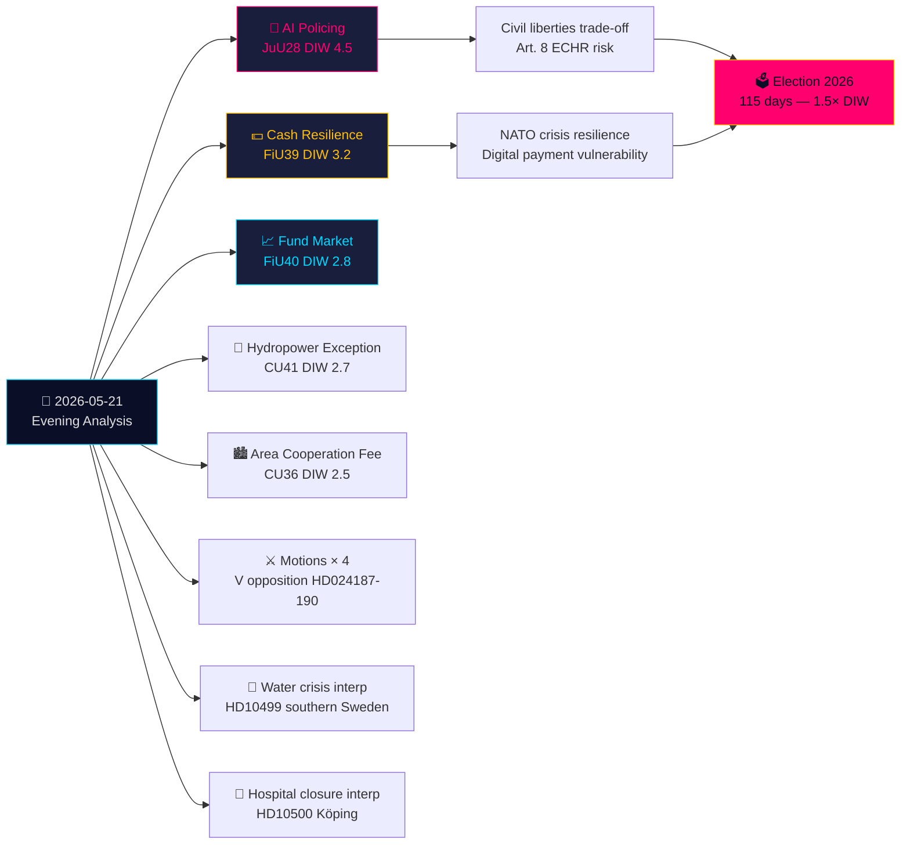

# Eksekutiv resumé — Aftenanalyse 2026-05-21

**Klassificering**: Offentlig OSINT · **Konfidens**: HØJ · **Forfatter**: Riksdagsmonitor Efterretningsanalyse  
**Cyklus**: Aftenanalyse · **Horisont**: T+72h → T+30d · **DIW-multiplikator**: 1,5× (115 dage til valg)

## 🎯 Konklusion i sammendrag

Torsdag den 21. maj 2026 afsluttes med en afgørende borgerrettighedsmæssig skillevand: Justitsudvalget (JuU) godkender **Sveriges første AI-ansigtsgenkendelseslovgivning for politiet i realtid** (HD01JuU28, betänkande 2025/26:JuU28). Samtidig omformer FiU's **kontantrobusthedsbetænkning** (HD01FiU39) og FiU40's **fondmarkedsreform** Sveriges finansinfrastruktur. Fem betænkninger fra JuU, FiU og CU skaber et usædvanligt bredt tværudvalgs lovgivningsmæssigt fodaftryk. Mod denne baggrund: oppositionsmotioner angriber regeringens sikkerhedstrusselsudsendelsesregime og Skatteverkets beføjelser, mens interpellationer om Sydsveriges vandkrise og sygehuslukkelser blotlægger svigt i velfærdslevering. Skriftlige spørgsmål om Taiwanvåben og Tibet signalerer, at Sveriges uløste post-NATO diplomatiske spændinger forbliver uafklarede.

## 🧭 3 Beslutninger dette notat understøtter

1. **Civilsamfund/juridisk**: Indsend krav om Lagrådets gennemgang af JuU28's implementeringsbekendtgørelser om AI-ansigtsgenkendelsesdriftsprotokoller, dataopbevaringsgrænser og klagerettigheder. **Udløser**: Lovpropositionsforordning til implementering, forventet inden 60 dage efter Riksdag-afstemning. Konfidens: **HØJ**.

2. **Finansinstitutter/Riksbanken**: Vurder operationel beredskab for FiU39's kontantforpligtelser — banker skal opretholde minimumsniveauer for kontantservice under den nye ordning. **Udløser**: Riksdag-afstemning om FiU39 (forventet plenumuge 25. maj). Konfidens: **HØJ**.

3. **Udenrigspolitisk enhed**: Sverige har 48–72-timers vindue til at præcisere sin holdning til Taiwanvåbensalg (HD11822), inden Trumps/Kinas våbenfrysningsnarrativ størkner til diplomatisk fakta. UM Malmer Stenergards svar signalerer, om Sverige tilslutter sig EU-konsensus eller udskærer en pro-Taiwan-forsvarsposition. **Udløser**: Svarsfrist for skriftligt spørgsmål. Konfidens: **MIDDEL-HØJ**.

## 60 sekunder

- **Højest signifikant**: JuU28 — AI realtidsansigtsgenkendelse til politiet. Sverige bliver en af de første EU-medlemsstater til at lovgive om eksplicit politimæssig AI-biometri. EMRK Artikel 8 og EU AI Act Kategori 1 høj-risiko implikationer. DIW 4,5 (valgproksimitetsmultiplikator 1,5× anvendt).
- **Mest økonomisk gennemgribende**: FiU40 (stærkere fondmarked) — strukturel reform af Sveriges SEK 6 billioner fondmarked. Langsigtede kapitalvækstimplikationer for pensionsopsparing.
- **Mest geopolitisk følsom**: HD11822 (Taiwanvåben) og HD11821 (Tibet-Kina) — skriftlige spørgsmål der blotlægger Sveriges post-NATO diplomatiske balancegang.
- **Mest afslørenede om velfærdssystemet**: HD10500 (Köping hospital) interpellation — regeringen erkender sygehusomstrukturering uden en sammenhængende ramme for landdistriktsydelser.

## Tier-C tværdagsanalyse

Dagens udvalgsproduktion forbinder sig direkte til gårsdagens/ugens propositioner og motioner:
- JuU28 AI-biometri **følger** regeringens sikkerhedstrusselsudsendelsesproposition (HD03267, citeret i propositionssøster) — tilsammen udgør de Sveriges mest omfattende sikkerhedsstatlige udvidelse siden SÄPO-omorganisationen i 2019.
- FiU39 kontantrobusthed **udvider** det digitale styringstema fra HD03250 (statlig e-ID, propositionssøster) — Sverige udvider samtidig digital identitet OG pålægger kontantfallback.
- V's motioner i dag (HD024188 mod HD03267) **ekkoer** V's systematiske oppositionsmønster dokumenteret i motionssøsteranalysen.

## Økonomisk kontekst

IMF WEO-2026-04: Sveriges BNP-vækstprognose 2,1 % (2026), inflation 2,0 %, arbejdsløshed 8,4 %. Fondmarkedsreformen (FiU40) skærer igennem Sveriges SEK 6 billioner fondmarkedssårbarhed identificeret i Riksbankens Finansiel stabilitetsrapport 2025:2. Kontantforpligtelsen (FiU39) har anslåede banksektorkomplianseomkostninger på SEK 400–800m i kapitalinvesteringer (SBAB, Finansinspektionens estimater).

*economicProvenance: provider=imf, dataflow=WEO, vintage=WEO-2026-04, vintageAgeMonths=1, retrieved_at=2026-05-21*

<!-- source-sha: 0a8d60e7f720acdade1c9d675ec956390d78f271 -->
