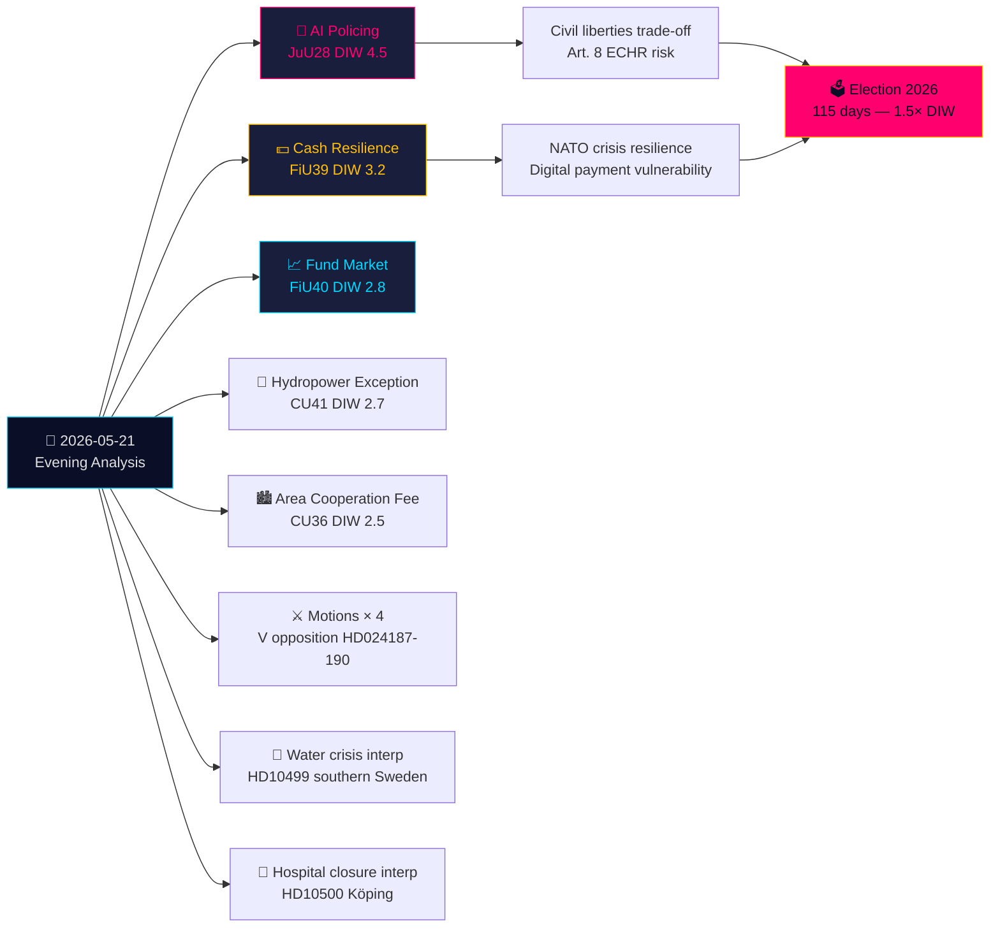

# Zusammenfassung für die Geschäftsführung — Abendanalyse 2026-05-21

**Klassifizierung**: Öffentliches OSINT · **Vertrauensniveau**: HOCH · **Autor**: Riksdagsmonitor Nachrichtendienstanalyse  
**Zyklus**: Abendanalyse · **Horizont**: T+72h → T+30d · **DIW-Faktor**: 1,5× (115 Tage bis zur Wahl)

## 🎯 Kernaussage

Donnerstag, 21. Mai 2026, bringt einen bedeutenden Rechtsstaatswandel: Der Rechtsausschuss (JuU) verabschiedet **Schwedens erstes KI-Gesichtserkennung-Gesetz für Polizei in Echtzeit** (HD01JuU28, betänkande 2025/26:JuU28). Gleichzeitig formen FiU's **Bargeldresilientz-betänkande** (HD01FiU39) und FiU40's **Fondsmarktreform** die schwedische Finanzinfrastruktur um. Fünf betänkanden von JuU, FiU und CU ergeben einen ungewöhnlich breiten ausschussübergreifenden Gesetzgebungsfußabdruck. Vor diesem Hintergrund greifen Oppositionsmotionen das Sicherheitsbedrohungs-Ausweisungssystem der Regierung und Skatteverkets Befugnisse an, während Interpellationen zur Wasserkrise Südschweden und Krankenhausschließungen Wohlfahrtsversagen aufdecken. Schriftliche Fragen zu Taiwan-Waffen und Tibet zeigen, dass ungelöste post-NATO-diplomatische Spannungen Schwedens anhalten.

## 🧭 3 Entscheidungen, die diese Zusammenfassung unterstützt

1. **Zivilgesellschaft/Rechtlich**: Stellen Sie eine Lagrådet-Prüfungsanfrage für JuU28's Durchführungsverordnungen zu KI-Gesichtserkennung-Verwendungsprotokollen, Datenspeichergrenzen und Beschwerderechten. **Auslöser**: Regierungs-Durchführungsverordnung, erwartet innerhalb von 60 Tagen nach Riksdag-Abstimmung. Vertrauensniveau: **HOCH**.

2. **Finanzinstitutionen/Riksbanken**: Bewerten Sie die operative Bereitschaft für FiU39's Bargeldverpflichtungen — Banken müssen Mindestdienstleistungsniveaus für Bargeld unter dem neuen System aufrechterhalten. **Auslöser**: Riksdag-Abstimmung über FiU39 (erwartet in Plenarsitzungswoche 25. Mai). Vertrauensniveau: **HOCH**.

3. **Außenpolitische Abteilung**: Schweden hat ein 48-72-Stunden-Fenster, um seine Position zu Taiwan-Waffenverkäufen (HD11822) zu klären, bevor die Trump/China-Abrüstungserzählung zur diplomatischen Tatsache gerinnt. FM Malmer Stenergards Antwort zeigt, ob Schweden dem EU-Konsens folgt oder eine pro-Taiwan-Verteidigungshaltung einnimmt. **Auslöser**: Antwortfrist für schriftliche Frage. Vertrauensniveau: **MITTEL-HOCH**.

## 60 Sekunden

- **Wichtigste**: JuU28 — KI-Gesichtserkennung in Echtzeit für die Polizei. Schweden wird zu einem der ersten EU-Mitgliedstaaten, der explizite polizeiliche Biometrie gesetzlich regelt. EMRK Artikel 8 und EU KI-Verordnung Kategorie 1 Hochrisiko-Implikationen. DIW 4,5 (Wahlan näherungsfaktor 1,5× angewendet).
- **Wirtschaftlich bedeutendste**: FiU40 (stärkere Fondsmärkte) — strukturelle Überholung von Schwedens 6-Billionen-SEK-Fondsmärkten. Langfristige Kapitalmarktentwicklungsauswirkungen auf Rentenersparnisse.
- **Geopolitisch sensibelste**: HD11822 (Taiwan-Waffen) und HD11821 (Tibet-China) — schriftliche Fragen, die Schwedens post-NATO-diplomatischen Balanceakt enthüllen.
- **Wohlfahrtssystem-Enthüllend**: HD10500 (Köping-Krankenhaus) Interpellation — Regierung gesteht Krankenhausumstrukturierung ohne einheitlichen ländlichen Gesundheitsversorgungsrahmen ein.

## Tier-C-Tagesübergreifende Synthese

Die heutige Ausschussleistung verknüpft sich direkt mit gestrigen/diese-Woche-Propositioner und Motioner:
- JuU28 KI-Biometrie **folgt auf** das Sicherheitsbedrohungs-Ausweisungspropositioner der Regierung (HD03267, zitiert in Propositioner-Geschwister) — zusammen bilden sie Schwedens breiteste Sicherheitsstaatserweiterung seit der SUPO-Neuorganisation 2019.
- FiU39 Bargeldresilieniz **erweitert** HD03250's (staatliche digitale Identität, Propositioner-Geschwister) digitales Governance-Thema — Schweden weitet gleichzeitig digitale Identität aus UND mandatiert Bargeldalternativen.
- V's Motioner heute (HD024187 gegen HD03267) **spiegeln** das systematische Oppositionsmuster von V wider, das in der Motioner-Geschwisteranalyse dokumentiert ist.

## Wirtschaftlicher Kontext

IMF WEO-2026-04: Schwedens BIP-Wachstumsprognose 2,1 % (2026), Inflation 2,0 %, Arbeitslosigkeit 8,4 %. Die Fondsmarktreform (FiU40) behebt Schwedens 6-Billionen-SEK-Fondsmarkt-Anfälligkeiten, die im Riksbanken-Finanzstabilitätsbericht 2025:2 identifiziert wurden. Bargeldverpflichtung (FiU39) umfasst geschätzte Banksektor-Compliance-Kosten von 400-800 Mio. SEK Kapitalinvestitionen (SBAB, Finansinspektionen-Schätzungen).

*economicProvenance: provider=imf, dataflow=WEO, vintage=WEO-2026-04, vintageAgeMonths=1, retrieved_at=2026-05-21*

<!-- source-sha: 0a8d60e7f720acdade1c9d675ec956390d78f271 -->
