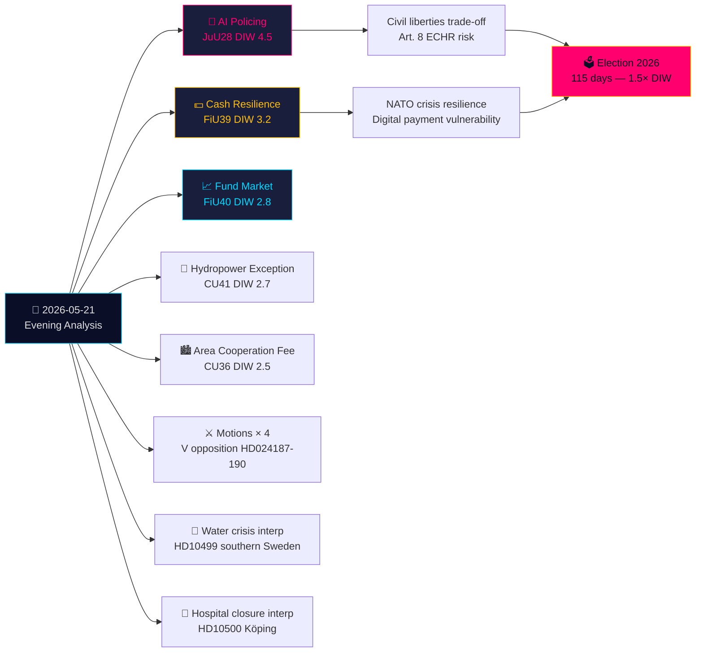

# Resumen Ejecutivo — Análisis Vespertino 2026-05-21

**Clasificación**: OSINT público · **Nivel de confianza**: ALTO · **Autor**: Análisis de Inteligencia Riksdagsmonitor  
**Ciclo**: Análisis vespertino · **Horizonte**: T+72h → T+30d · **Factor DIW**: 1,5× (115 días para las elecciones)

## 🎯 Conclusión principal

El jueves 21 de mayo de 2026 marca un hito significativo del Estado de derecho: la Comisión de Justicia (JuU) aprueba **la primera legislación sueca sobre reconocimiento facial con IA para la policía en tiempo real** (HD01JuU28, betänkande 2025/26:JuU28). Simultáneamente, el **betänkande de resiliencia del efectivo** de FiU (HD01FiU39) y la **reforma del mercado de fondos** FiU40 remodelan la infraestructura financiera sueca. Cinco betänkanden de JuU, FiU y CU constituyen una huella legislativa inter-comités inusualmente amplia. En este contexto, mociones de oposición atacan el sistema de expulsión por amenaza de seguridad del gobierno y las facultades del Skatteverket, mientras que interpelaciones sobre la crisis hídrica en el sur de Suecia y cierres de hospitales revelan fallos del Estado de bienestar. Preguntas escritas sobre armamento a Taiwán y el Tíbet indican que las tensiones diplomáticas post-OTAN no resueltas de Suecia persisten.

## 🧭 3 Decisiones que apoya este resumen

1. **Sociedad civil/Jurídico**: Presente una solicitud de revisión al Lagrådet sobre los decretos de implementación de JuU28 relativos a protocolos de uso del reconocimiento facial con IA, límites de retención de datos y derechos de apelación. **Disparador**: Decreto de implementación gubernamental, esperado en los 60 días siguientes a la votación del Riksdag. Nivel de confianza: **ALTO**.

2. **Instituciones financieras/Riksbanken**: Evalúe la preparación operativa para las obligaciones de efectivo de FiU39 — los bancos deberán mantener niveles mínimos de servicio de efectivo bajo el nuevo marco. **Disparador**: Votación del Riksdag sobre FiU39 (esperada en la semana plenaria del 25 de mayo). Nivel de confianza: **ALTO**.

3. **Servicio de Asuntos Exteriores**: Suecia tiene una ventana de 48 a 72 horas para aclarar su posición sobre las ventas de armas a Taiwán (HD11822) antes de que el discurso de desarme Trump/China se solidifique en hecho diplomático. La respuesta de la FM Malmer Stenergard mostrará si Suecia sigue el consenso de la UE o adopta una postura pro-Taiwán en defensa. **Disparador**: Plazo de respuesta a la pregunta escrita. Nivel de confianza: **MEDIO-ALTO**.

## 60 segundos

- **La más importante**: JuU28 — reconocimiento facial con IA en tiempo real para la policía. Suecia se convierte en uno de los primeros Estados miembros de la UE en legislar explícitamente sobre biometría policial. Implicaciones del CEDH Artículo 8 y categoría 1 de alto riesgo del Reglamento de IA de la UE. DIW 4,5 (factor de aproximación electoral 1,5× aplicado).
- **La más significativa económicamente**: FiU40 (mercados de fondos más fuertes) — reforma estructural de los mercados de fondos suecos de 6 billones de SEK. Efectos a largo plazo en el desarrollo del mercado de capitales y el ahorro para la jubilación.
- **La más sensible geopolíticamente**: HD11822 (armas Taiwán) y HD11821 (Tíbet-China) — preguntas escritas que revelan el equilibrio diplomático post-OTAN de Suecia.
- **Reveladora del sistema de bienestar**: HD10500 (hospital de Köping) interpelación — el gobierno admite la reestructuración hospitalaria sin un marco unificado de atención sanitaria rural.

## Síntesis inter-diaria Tier-C

La producción de comités de hoy se conecta directamente con las Propositioner y Motioner de ayer/esta semana:
- La biometría IA JuU28 **sigue a** la Proposition gubernamental de expulsión por amenaza de seguridad (HD03267, citada en la Proposition hermana) — juntas constituyen la mayor expansión del Estado de seguridad sueco desde la reorganización de la SÄPO en 2019.
- La resiliencia del efectivo FiU39 **amplía** el tema de gobernanza digital de HD03250 (identidad digital estatal, Proposition hermana) — Suecia amplía simultáneamente la identidad digital Y obliga a alternativas de efectivo.
- Las Motioner de V hoy (HD024187 contra HD03267) **se hacen eco** del patrón de oposición sistemática de V documentado en el análisis Motioner hermano.

## Contexto económico

FMI WEO-2026-04: Previsión de crecimiento del PIB sueco 2,1 % (2026), inflación 2,0 %, desempleo 8,4 %. La reforma del mercado de fondos (FiU40) aborda las vulnerabilidades de los mercados de fondos suecos de 6 billones de SEK identificadas en el Informe de Estabilidad Financiera del Riksbanken 2025:2. La obligación de efectivo (FiU39) incluye costes estimados de cumplimiento del sector bancario de 400-800 millones de SEK en inversiones de capital (SBAB, estimaciones de la Finansinspektionen).

*economicProvenance: provider=imf, dataflow=WEO, vintage=WEO-2026-04, vintageAgeMonths=1, retrieved_at=2026-05-21*

<!-- source-sha: 0a8d60e7f720acdade1c9d675ec956390d78f271 -->
