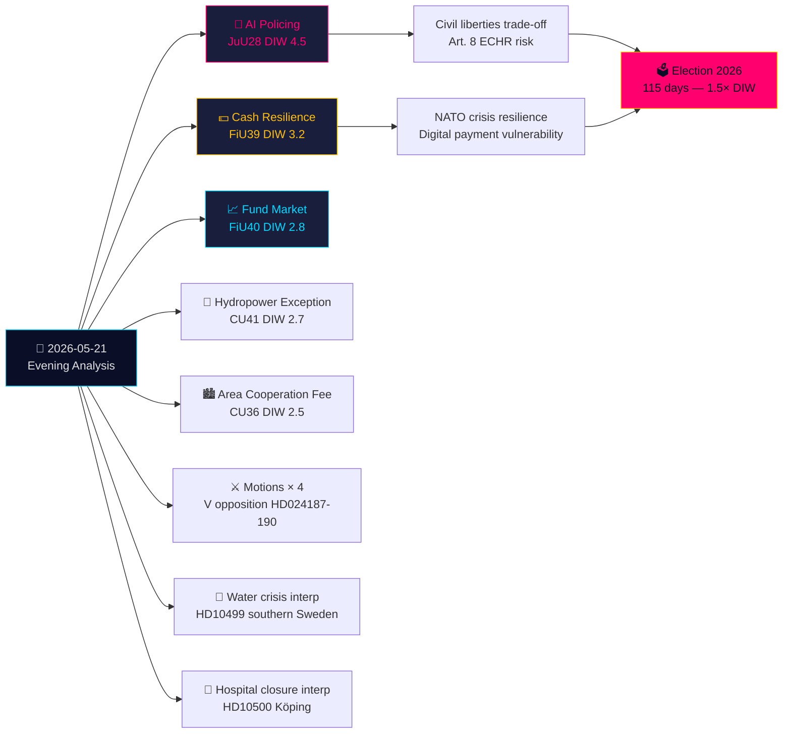

# Toimeenpaneva tiivistelmä — Iltaanalyysi 2026-05-21

**Luokittelu**: Julkinen OSINT · **Luottamustaso**: KORKEA · **Tekijä**: Riksdagsmonitor Tiedusteluanalyysi  
**Sykli**: Iltaanalyysi · **Horisontti**: T+72h → T+30d · **DIW-kerroin**: 1,5× (115 päivää vaaleihin)

## 🎯 Lyhyesti pääasiasta

Torstai 21. toukokuuta 2026 päättyy merkittävään oikeusvaltion käännekohtaan: Lakivaliokunta (JuU) hyväksyy **Ruotsin ensimmäisen tekoäly-kasvojentunnistuslainsäädännön poliisille reaaliajassa** (HD01JuU28, betänkande 2025/26:JuU28). Samalla FiU:n **käteisresilienssi-betänkande** (HD01FiU39) ja FiU40:n **rahastomarkkinauudistus** muokkaavat Ruotsin rahoitusinfrastruktuuria. Viisi betänkandea JuU:lta, FiU:lta ja CU:lta muodostavat epätavallisen laajan poikkivaliokunnallisen lainsäädäntöjalanjäljen. Tätä taustaa vasten: oppositiomootiot hyökkäävät hallituksen turvallisuusuhka-karkottamisjärjestelmää ja Skatteverketin valtuuksia vastaan, kun taas interpellaatiot Etelä-Ruotsin vesikrisistä ja sairaalanlukkuisista paljastavat hyvinvointipalveluiden epäonnistumisia. Kirjalliset kysymykset Taiwanin aseista ja Tiibetistä osoittavat, että Ruotsin ratkaisemattomat post-NATO-diplomaattiset jännitteet jatkuvat.

## 🧭 3 Päätöstä, joita tämä lyhennelmä tukee

1. **Kansalaisyhteiskunta/oikeudellinen**: Jätä Lagrådet-tarkastuspyyntö JuU28:n täytäntöönpanoasetuksista koskien tekoälykasvojentunnistuksen käyttöprotokolloja, tietosäilytysrajoja ja valitusoikeuksia. **Käynnistäjä**: Hallituksen täytäntöönpanoasetus, odotetaan 60 päivän sisällä riksdagäänestyksen jälkeen. Luottamustaso: **KORKEA**.

2. **Rahoituslaitokset/Riksbanken**: Arvioi operatiivinen valmius FiU39:n käteisvelvollisuuksiin — pankkien on ylläpidettävä vähimmäispalvelutasoja käteiselle uuden järjestelmän alla. **Käynnistäjä**: Riksdagin äänestys FiU39:stä (odotetaan täysistuntoviikolle 25. toukokuuta). Luottamustaso: **KORKEA**.

3. **Ulkopoliittinen osasto**: Ruotsilla on 48–72 tunnin ikkuna selventää kantansa Taiwanin asekauppoihin (HD11822) ennen kuin Trumpin/Kiinan aseistariisuntanarraatiivi kovettuu diplomaattiseksi tosiasiaksi. UM Malmer Stenergard vastaus osoittaa, noudattaako Ruotsi EU-konsensusta vai ottaako pro-Taiwan-puolustuskannan. **Käynnistäjä**: Kirjallisen kysymyksen vastausmääräaika. Luottamustaso: **KESKI-KORKEA**.

## 60 sekuntia

- **Merkittävin**: JuU28 — tekoälykasvojentunnistus reaaliajassa poliisille. Ruotsista tulee yksi ensimmäisistä EU-jäsenvaltioista, joka säätää eksplisiittisestä poliisibiometriasta. ECHR Artikla 8 ja EU:n tekoälyasetus Kategoria 1 korkean riskin implikaatiot. DIW 4,5 (vaalilähestymiskerroin 1,5× sovellettu).
- **Taloudellisesti merkittävin**: FiU40 (vahvemmat rahastomarkkinat) — Ruotsin 6 biljoonan SEK rahastomarkkinoiden rakenteellinen uudistus. Pitkän aikavälin pääomakehitysvaikutukset eläkesäästöihin.
- **Geopoliittisesti herkin**: HD11822 (Taiwanin aseet) ja HD11821 (Tiibet-Kiina) — kirjalliset kysymykset, jotka paljastavat Ruotsin post-NATO-diplomaattisen tasapainoilun.
- **Hyvinvointijärjestelmästä paljastava**: HD10500 (Köpingin sairaala) interpellaatio — hallitus myöntää sairaalan uudelleenjärjestelyä ilman yhtenäistä maaseutualueen terveydenhuollon viitekehystä.

## Tier-C-poikkipäiväsynteesi

Tämän päivän valiokuntatuotos yhdistyy suoraan eilisen/tämän viikon ehdotuksiin ja mootioihin:
- JuU28 tekoälybiometria **seuraa** hallituksen turvallisuusuhka-karkottamisehdotusta (HD03267, siteerattu ehdotussisaressa) — yhdessä ne muodostavat Ruotsin laajimman turvallisuusvaltion laajennuksen SUPO:n uudelleenorganisoinnin jälkeen vuonna 2019.
- FiU39 käteisresilienss **laajentaa** HD03250:n (valtion sähköinen henkilöllisyys, ehdotussisareen) digitaalista hallintoteemaa — Ruotsi laajentaa samaan aikaan digitaalista identiteettiä JA määrää käteisvaihtoehtoja.
- V:n mootiot tänään (HD024188 HD03267:ää vastaan) **kaikuvat** mootiosisaranalyysissa dokumentoitua V:n systemaattista oppositiokuviota.

## Taloudellinen konteksti

IMF WEO-2026-04: Ruotsin BKT-kasvuennuste 2,1 % (2026), inflaatio 2,0 %, työttömyys 8,4 %. Rahastomarkkinauudistus (FiU40) leikkaa Ruotsin 6 biljoonan SEK rahastomarkkinoiden haavoittuvuuksia, jotka on tunnistettu Riksbankenin Rahoitusvakausraportissa 2025:2. Käteisvelvollisuus (FiU39) sisältää arvioidut pankkisektorin vaatimustenmukaisuuskustannukset 400–800 miljoonaa SEK pääomainvestointeja (SBAB, Finansinspektionenin arviot).

*economicProvenance: provider=imf, dataflow=WEO, vintage=WEO-2026-04, vintageAgeMonths=1, retrieved_at=2026-05-21*

<!-- source-sha: 0a8d60e7f720acdade1c9d675ec956390d78f271 -->
