# Note de synthèse exécutive — Analyse du soir 2026-05-21

**Classification**: OSINT public · **Niveau de confiance**: ÉLEVÉ · **Auteur**: Analyse de renseignement Riksdagsmonitor  
**Cycle**: Analyse du soir · **Horizon**: T+72h → T+30d · **Facteur DIW**: 1,5× (115 jours avant les élections)

## 🎯 Conclusion principale

Le jeudi 21 mai 2026 marque un tournant majeur de l'État de droit : la Commission des lois (JuU) adopte **la première législation suédoise sur la reconnaissance faciale par IA pour la police en temps réel** (HD01JuU28, betänkande 2025/26:JuU28). Parallèlement, le **betänkande sur la résilience des espèces numériques** de FiU (HD01FiU39) et la **réforme du marché des fonds** FiU40 remodèlent l'infrastructure financière suédoise. Cinq betänkanden de JuU, FiU et CU constituent une empreinte législative inter-commissions inhabituellement large. Dans ce contexte, les motions d'opposition attaquent le système d'expulsion pour menace sécuritaire du gouvernement et les pouvoirs du Skatteverket, tandis que les interpellations sur la crise de l'eau en Suède méridionale et les fermetures d'hôpitaux révèlent des défaillances de l'État-providence. Des questions écrites sur les armements à Taiwan et le Tibet indiquent que les tensions diplomatiques post-OTAN non résolues de la Suède persistent.

```mermaid
flowchart LR
    A[📅 2026-05-21<br/>Evening Analysis] --> B[🔴 AI Policing<br/>JuU28 DIW 4.5]
    A --> C[💵 Cash Resilience<br/>FiU39 DIW 3.2]
    A --> D[📈 Fund Market<br/>FiU40 DIW 2.8]
    A --> E[🌿 Hydropower Exception<br/>CU41 DIW 2.7]
    A --> F[🏙️ Area Cooperation Fee<br/>CU36 DIW 2.5]
    A --> G[⚔️ Motions × 4<br/>V opposition HD024187-190]
    A --> H[🌊 Water crisis interp<br/>HD10499 southern Sweden]
    A --> I[🏥 Hospital closure interp<br/>HD10500 Köping]
    B --> B1[Civil liberties trade-off<br/>Art. 8 ECHR risk]
    C --> C1[NATO crisis resilience<br/>Digital payment vulnerability]
    B1 --> Z[🗳️ Election 2026<br/>115 days — 1.5× DIW]
    C1 --> Z
    style A fill:#0a0e27,stroke:#00d9ff,color:#e0e0e0
    style B fill:#1a1e3d,stroke:#ff006e,color:#ff006e
    style C fill:#1a1e3d,stroke:#ffbe0b,color:#ffbe0b
    style D fill:#1a1e3d,stroke:#00d9ff,color:#00d9ff
    style Z fill:#ff006e,stroke:#ffbe0b,color:#0a0e27
```

## 🧭 3 Décisions que cette synthèse éclaire

1. **Société civile/Juridique**: Déposez une demande d'examen au Lagrådet sur les ordonnances d'application de JuU28 concernant les protocoles d'utilisation de la reconnaissance faciale par IA, les limites de conservation des données et les droits de recours. **Déclencheur**: Ordonnance d'application gouvernementale, attendue dans les 60 jours suivant le vote du Riksdag. Niveau de confiance: **ÉLEVÉ**.

2. **Institutions financières/Riksbanken**: Évaluez la préparation opérationnelle aux obligations de FiU39 en matière d'espèces — les banques devront maintenir des niveaux de service minimaux pour les espèces dans le nouveau cadre. **Déclencheur**: Vote du Riksdag sur FiU39 (attendu lors de la semaine plénière du 25 mai). Niveau de confiance: **ÉLEVÉ**.

3. **Service des affaires étrangères**: La Suède dispose d'une fenêtre de 48 à 72 heures pour clarifier sa position sur les ventes d'armes à Taiwan (HD11822) avant que le récit de désarmement Trump/Chine ne se fige en fait diplomatique. La réponse de la FM Malmer Stenergard montrera si la Suède suit le consensus européen ou adopte une position pro-Taiwan en matière de défense. **Déclencheur**: Délai de réponse à la question écrite. Niveau de confiance: **MOYEN-ÉLEVÉ**.

## 60 secondes

- **La plus importante**: JuU28 — reconnaissance faciale par IA en temps réel pour la police. La Suède devient l'un des premiers États membres de l'UE à légiférer explicitement sur la biométrie policière. Implications CEDH Article 8 et catégorie 1 à haut risque du règlement IA de l'UE. DIW 4,5 (facteur d'approche électorale 1,5× appliqué).
- **La plus significative économiquement**: FiU40 (marchés de fonds plus forts) — refonte structurelle des marchés de fonds suédois de 6 000 milliards de SEK. Effets à long terme sur le développement du marché des capitaux et l'épargne-retraite.
- **La plus sensible géopolitiquement**: HD11822 (armes Taiwan) et HD11821 (Tibet-Chine) — questions écrites révélant l'équilibre diplomatique post-OTAN de la Suède.
- **Révélatrice du système de protection sociale**: HD10500 (hôpital de Köping) interpellation — le gouvernement concède la restructuration hospitalière sans cadre unifié de santé rurale.

## Synthèse inter-journalière Tier-C

La production en commission d'aujourd'hui se connecte directement aux Propositioner et Motioner d'hier/cette semaine :
- La biométrie IA JuU28 **fait suite à** la Proposition gouvernementale d'expulsion pour menace sécuritaire (HD03267, citée dans la Proposition sœur) — ensemble, elles constituent la plus large expansion de l'État sécuritaire suédois depuis la réorganisation de la SÄPO en 2019.
- La résilience des espèces FiU39 **complète** le thème de gouvernance numérique de HD03250 (identité numérique d'État, Proposition sœur) — la Suède étend simultanément l'identité numérique ET mandate des alternatives en espèces.
- Les Motioner de V aujourd'hui (HD024187 contre HD03267) **font écho** au schéma d'opposition systématique de V documenté dans l'analyse Motioner sœur.

## Contexte économique

FMI WEO-2026-04 : Prévision de croissance du PIB suédois 2,1 % (2026), inflation 2,0 %, chômage 8,4 %. La réforme du marché des fonds (FiU40) comble les vulnérabilités des marchés de fonds suédois de 6 000 milliards de SEK identifiées dans le Rapport de stabilité financière Riksbanken 2025:2. L'obligation d'espèces (FiU39) comprend des coûts de conformité estimés du secteur bancaire de 400 à 800 millions de SEK d'investissements en capital (SBAB, estimations de la Finansinspektionen).

*economicProvenance: provider=imf, dataflow=WEO, vintage=WEO-2026-04, vintageAgeMonths=1, retrieved_at=2026-05-21*

<!-- source-sha: 0a8d60e7f720acdade1c9d675ec956390d78f271 -->
