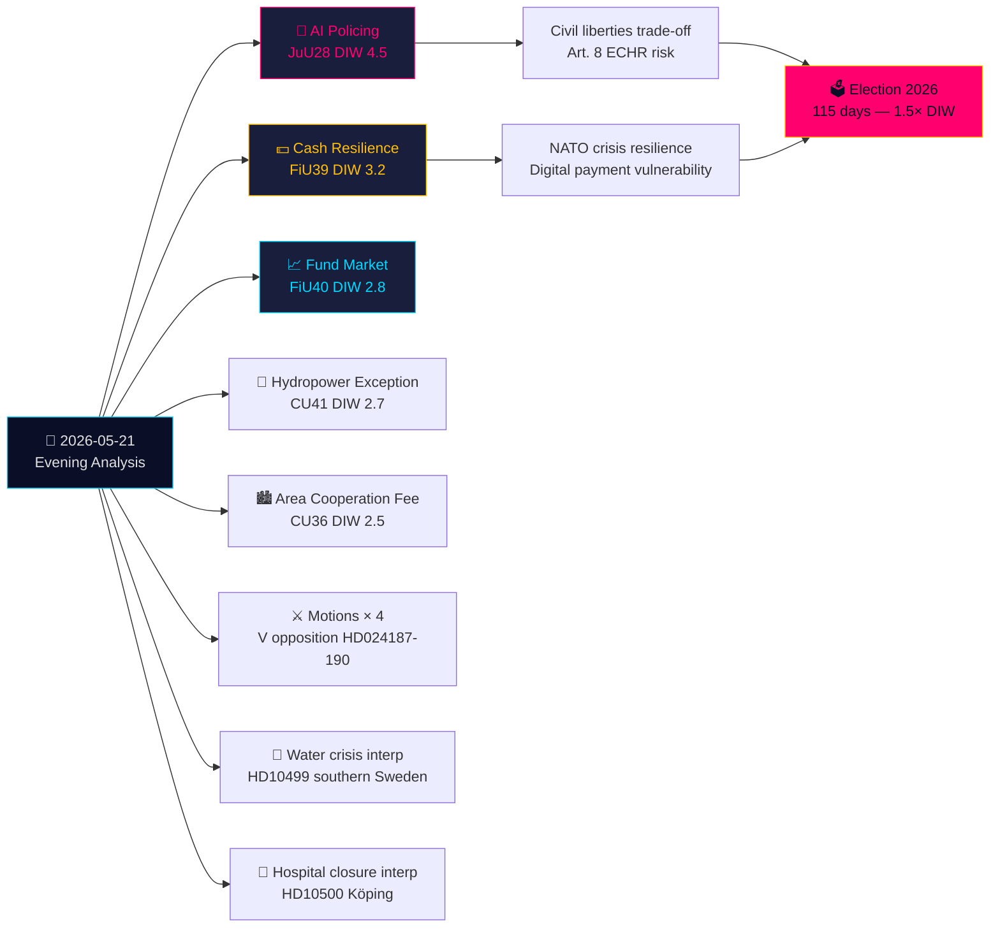

# סיכום מנהלים — ניתוח ערב 2026-05-21

**סיווג**: OSINT ציבורי · **רמת אמינות**: גבוהה · **מחבר**: ניתוח מודיעין Riksdagsmonitor  
**מחזור**: ניתוח ערב · **אופק**: T+72h → T+30d · **מקדם DIW**: 1.5× (115 ימים לבחירות)

## 🎯 ממצא מרכזי

יום חמישי, 21 במאי 2026, מסמן מפנה משמעותי בשלטון החוק: ועדת המשפטים (JuU) מאשרת את **החקיקה השוודית הראשונה לזיהוי פנים בבינה מלאכותית עבור המשטרה בזמן אמת** (HD01JuU28, betänkande 2025/26:JuU28). במקביל, מעצבים **betänkande חוסן המזומן** של FiU (HD01FiU39) ו**רפורמת שוק הקרנות** FiU40 מחדש את התשתית הפיננסית של שוודיה. חמישה betänkanden מ-JuU, FiU ו-CU מהווים טביעת רגל חקיקתית בין-ועדתית רחבה במיוחד. על רקע זה, הצעות חוק של האופוזיציה תוקפות את מערכת גירוש האיום הביטחוני של הממשלה ואת סמכויות ה-Skatteverket, בעוד שאינטרפלציות על משבר המים בדרום שוודיה וסגירות בתי חולים חושפות כשלים ברשת הרווחה. שאלות בכתב בנוגע לנשק לטייוואן ולטיבט מצביעות על כך שמתחים דיפלומטיים בלתי פתורים של שוודיה בעידן שלאחר נאט"ו נמשכים.

## 🧭 3 החלטות שסיכום זה תומך בהן

1. **חברה אזרחית/משפטי**: הגישו בקשת בדיקה ל-Lagrådet על תקנות היישום של JuU28 בנוגע לפרוטוקולי שימוש בזיהוי פנים בבינה מלאכותית, מגבלות שמירת נתונים וזכויות ערר. **טריגר**: תקנת יישום ממשלתית, צפויה תוך 60 יום מהצבעת ה-Riksdag. רמת אמינות: **גבוהה**.

2. **מוסדות פיננסיים/Riksbanken**: העריכו את המוכנות התפעולית לחובות המזומן של FiU39 — הבנקים יצטרכו לשמור על רמות שירות מינימליות למזומן תחת המסגרת החדשה. **טריגר**: הצבעת ה-Riksdag על FiU39 (צפויה בשבוע המליאה של 25 במאי). רמת אמינות: **גבוהה**.

3. **משרד החוץ**: לשוודיה חלון של 48-72 שעות להבהיר את עמדתה בנוגע למכירות נשק לטייוואן (HD11822) לפני שהנרטיב של טראמפ/סין לפירוק נשק מתגבש לעובדה דיפלומטית. תגובת שר החוץ Malmer Stenergard תגלה האם שוודיה תלך בעקבות הקונסנזוס האירופי או תאמץ עמדת הגנה פרו-טייוואנית. **טריגר**: המועד האחרון לתשובה על שאלה בכתב. רמת אמינות: **בינונית-גבוהה**.

## 60 שניות

- **החשובה ביותר**: JuU28 — זיהוי פנים בבינה מלאכותית בזמן אמת עבור המשטרה. שוודיה הופכת לאחת ממדינות האיחוד הראשונות לחוקק במפורש ביומטריה משטרתית. השלכות סעיף 8 ל-ECHR וקטגוריה 1 בסיכון גבוה של תקנת הבינה המלאכותית של האיחוד האירופי. DIW 4.5 (מקדם קרבה לבחירות 1.5× מיושם).
- **המשמעותית כלכלית ביותר**: FiU40 (שווקי קרנות חזקים יותר) — שיפוץ מבני של שווקי הקרנות השוודיים בשווי 6 טריליון SEK. השפעות ארוכות טווח על פיתוח שוק ההון וחיסכון לפנסיה.
- **הרגישה גיאופוליטית ביותר**: HD11822 (נשק טייוואן) ו-HD11821 (טיבט-סין) — שאלות בכתב החושפות את מאזן הדיפלומטיה השוודי בעידן שלאחר נאט"ו.
- **חושפת מערכת הרווחה**: אינטרפלציה HD10500 (בית חולים קופינג) — הממשלה מודה בארגון מחדש של בתי חולים ללא מסגרת אחידה לבריאות כפרית.

## סינתזה בין-יומית Tier-C

תפוקת הוועדות של היום מתחברת ישירות ל-Propositioner וה-Motioner של אתמול/השבוע הזה:
- ביומטריית הבינה המלאכותית JuU28 **באה בעקבות** ה-Propositioner הממשלתי לגירוש בשל איום ביטחוני (HD03267, מצוטט ב-Propositioner האחות) — ביחד הם מהווים את ההרחבה הרחבה ביותר של מדינת הביטחון השוודית מאז ארגון מחדש של SÄPO ב-2019.
- חוסן מזומן FiU39 **משלים** את נושא הממשל הדיגיטלי של HD03250 (זהות דיגיטלית ממלכתית, Propositioner אחות) — שוודיה מרחיבה זהות דיגיטלית ומחייבת חלופות מזומן בו זמנית.
- ה-Motioner של V היום (HD024187 נגד HD03267) **משקפות** את דפוס ההתנגדות השיטתי של V המתועד בניתוח Motioner האחות.

## הקשר כלכלי

IMF WEO-2026-04: תחזית צמיחת התוצר של שוודיה 2.1% (2026), אינפלציה 2.0%, אבטלה 8.4%. רפורמת שוק הקרנות (FiU40) מטפלת בפגיעויות בשווקי הקרנות השוודיים של 6 טריליון SEK שזוהו בדוח יציבות פיננסית של Riksbanken 2025:2. חובת מזומן (FiU39) כוללת עלויות ציות משוערות של המגזר הבנקאי בין 400-800 מיליון SEK השקעות הון (SBAB, הערכות Finansinspektionen).

*economicProvenance: provider=imf, dataflow=WEO, vintage=WEO-2026-04, vintageAgeMonths=1, retrieved_at=2026-05-21*

<!-- source-sha: 0a8d60e7f720acdade1c9d675ec956390d78f271 -->
