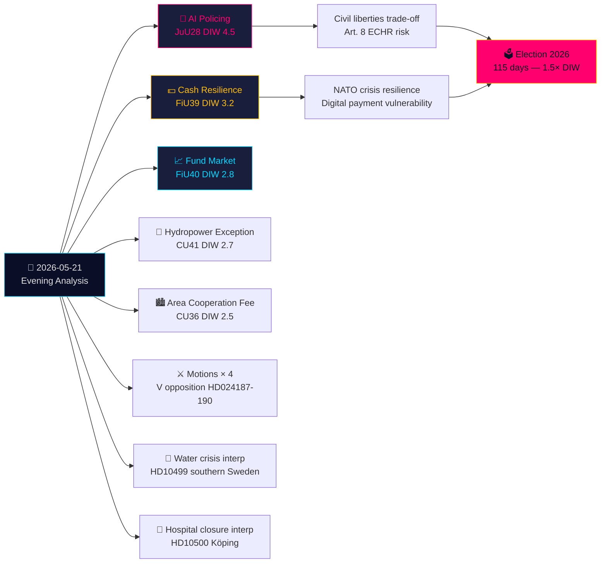

# エグゼクティブブリーフ — 夕刊分析 2026-05-21

**分類**: 公開OSINT · **信頼レベル**: 高 · **著者**: Riksdagsmonitor インテリジェンス分析  
**サイクル**: 夕刊分析 · **ホライズン**: T+72h → T+30d · **DIW係数**: 1.5×（選挙まで115日）

## 🎯 核心所見

2026年5月21日（木曜日）は法の支配における重要な転換点を迎える：司法委員会（JuU）が**スウェーデン初のリアルタイムAI顔認識警察立法**を可決する（HD01JuU28, betänkande 2025/26:JuU28）。同時に、FiUの**現金レジリエンスbetänkande**（HD01FiU39）とFiU40の**ファンド市場改革**がスウェーデンの金融インフラを再形成する。JuU、FiU、CUからの5つのbetänkandenが異例に広範な委員会横断的な立法の足跡を形成する。この背景のもと、野党動議が政府の安全保障脅威強制退去制度とSkatteverketの権限を攻撃し、南スウェーデンの水危機と病院閉鎖に関する質問が福祉制度の失敗を露わにしている。台湾の武器とチベットに関する書面質問は、スウェーデンのNATO加盟後における未解決の外交的緊張が続いていることを示している。

## 🧭 このブリーフが支援する3つの意思決定

1. **市民社会/法的**: AI顔認識利用プロトコル、データ保持制限、不服申立権に関するJuU28の施行規則についてLagrådet審査請求を提出する。**トリガー**: 政府施行規則、Riksdag投票後60日以内に予定。信頼レベル: **高**。

2. **金融機関/Riksbanken**: FiU39の現金義務に対する運用準備状況を評価する — 銀行は新制度下で最低限の現金サービス水準を維持する必要がある。**トリガー**: FiU39に対するRiksdagの投票（5月25日の本会議週に予定）。信頼レベル: **高**。

3. **外務省**: スウェーデンには48〜72時間のウィンドウがあり、台湾武器売却（HD11822）に関する立場を明確にしないと、トランプ/中国の軍縮ナラティブが外交的事実として固定化する。FM Malmer Stenergardの回答が、スウェーデンがEUコンセンサスに従うか、親台湾防衛姿勢をとるかを示す。**トリガー**: 書面質問の回答期限。信頼レベル: **中高**。

## 60秒サマリー

- **最重要**: JuU28 — 警察によるリアルタイムAI顔認識。スウェーデンは警察生体認証を明示的に立法するEU加盟国の一つとなる。ECHR第8条とEU AI規則カテゴリ1高リスクへの影響。DIW 4.5（選挙接近係数1.5×適用）。
- **経済的に最重要**: FiU40（ファンド市場強化）— スウェーデンの6兆SEKファンド市場の構造的改革。年金貯蓄への長期的な資本市場発展への影響。
- **地政学的に最も敏感**: HD11822（台湾武器）とHD11821（チベット・中国）— スウェーデンのNATO後外交バランスを露わにする書面質問。
- **福祉制度を露わにする**: HD10500（ケーピング病院）質問 — 政府は統一的な農村医療フレームワークなしに病院再編を認める。

## Tier-C 日間横断的総合

本日の委員会アウトプットは昨日/今週のPropositionerおよびMotionerと直接連結する：
- JuU28 AIバイオメトリクスは政府の安全保障脅威強制退去Propositioner（HD03267、Propositioner姉妹文書に引用）**に続く**—合わせると、2019年のSÄPO再編以来最も広範なスウェーデンの安全保障国家拡大を形成する。
- FiU39現金レジリエンスはHD03250（国家デジタルID、Propositioner姉妹文書）のデジタルガバナンステーマを**拡張する**—スウェーデンはデジタルIDを拡大しつつ現金代替手段を義務付けている。
- 本日VのMotioner（HD024187 vs HD03267）はMotioner姉妹分析に記録されたVの組織的な野党パターンを**反映する**。

## 経済的文脈

IMF WEO-2026-04：スウェーデンGDP成長予測2.1%（2026年）、インフレ2.0%、失業率8.4%。ファンド市場改革（FiU40）は、Riksbanken金融安定報告2025:2で確認されたスウェーデンの6兆SEKファンド市場の脆弱性に対処する。現金義務（FiU39）には、4億〜8億SEKの資本投資の推定銀行部門コンプライアンスコストが含まれる（SBAB、Finansinspektionen推計）。

*economicProvenance: provider=imf, dataflow=WEO, vintage=WEO-2026-04, vintageAgeMonths=1, retrieved_at=2026-05-21*

<!-- source-sha: 0a8d60e7f720acdade1c9d675ec956390d78f271 -->
