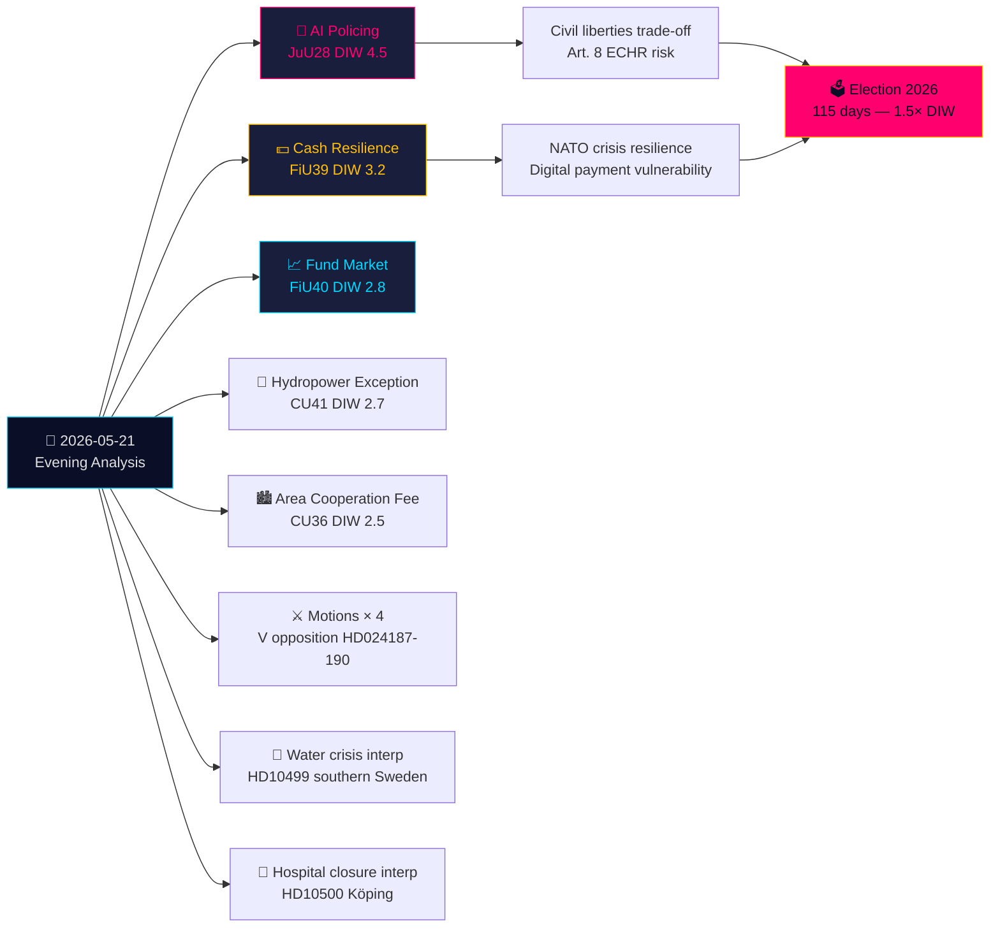

# 이그제큐티브 브리프 — 저녁 분석 2026-05-21

**분류**: 공개 OSINT · **신뢰 수준**: 높음 · **저자**: Riksdagsmonitor 정보 분석  
**주기**: 저녁 분석 · **지평선**: T+72h → T+30d · **DIW 계수**: 1.5×（선거까지 115일）

## 🎯 핵심 결론

2026년 5월 21일 목요일은 법치주의의 중요한 전환점을 맞이한다: 법사위원회(JuU)가 **스웨덴 최초의 실시간 AI 얼굴인식 경찰 입법**을 승인한다(HD01JuU28, betänkande 2025/26:JuU28). 동시에 FiU의 **현금 복원력 betänkande**(HD01FiU39)와 FiU40의 **펀드 시장 개혁**이 스웨덴의 금융 인프라를 재편한다. JuU, FiU, CU에서 나온 다섯 개의 betänkanden이 이례적으로 광범위한 위원회 간 입법 발자국을 형성한다. 이 맥락에서 야당 동의안들이 정부의 안보 위협 추방 시스템과 Skatteverket의 권한을 공격하는 반면, 남부 스웨덴 수위기와 병원 폐쇄에 관한 질의는 복지 시스템의 실패를 드러낸다. 대만 무기 및 티베트에 관한 서면 질의는 스웨덴의 미해결된 NATO 이후 외교적 긴장이 지속되고 있음을 보여준다.

## 🧭 이 브리프가 지원하는 3가지 결정

1. **시민사회/법적**: AI 얼굴인식 사용 프로토콜, 데이터 보유 한도, 이의제기권에 관한 JuU28 시행령에 대해 Lagrådet 검토 요청을 제출하라. **트리거**: 정부 시행령, Riksdag 투표 후 60일 이내 예정. 신뢰 수준: **높음**.

2. **금융기관/Riksbanken**: FiU39의 현금 의무에 대한 운영 준비 상태를 평가하라 — 은행들은 새 제도 하에서 최소한의 현금 서비스 수준을 유지해야 한다. **트리거**: FiU39에 대한 Riksdag 투표（5월 25일 본회의 주 예정). 신뢰 수준: **높음**.

3. **외무부**: 스웨덴은 트럼프/중국의 군축 내러티브가 외교적 사실로 굳어지기 전에 대만 무기 판매（HD11822）에 대한 입장을 명확히 할 48~72시간의 기회가 있다. FM Malmer Stenergard의 답변이 스웨덴이 EU 컨센서스를 따를지 친대만 방위 입장을 취할지를 보여준다. **트리거**: 서면 질의 답변 기한. 신뢰 수준: **중높음**.

## 60초 요약

- **가장 중요한**: JuU28 — 경찰을 위한 실시간 AI 얼굴인식. 스웨덴은 경찰 생체인식을 명시적으로 입법화하는 EU 회원국 중 하나가 된다. ECHR 제8조 및 EU AI 규정 카테고리 1 고위험 함의. DIW 4.5（선거 접근 계수 1.5× 적용).
- **경제적으로 가장 중요한**: FiU40（더 강한 펀드 시장）— 스웨덴 6조 SEK 펀드 시장의 구조적 개편. 연금 저축에 대한 장기적인 자본시장 발전 영향.
- **지정학적으로 가장 민감한**: HD11822（대만 무기）과 HD11821（티베트-중국）— 스웨덴의 NATO 이후 외교적 균형 행위를 드러내는 서면 질의.
- **복지 시스템을 드러내는**: HD10500（쾨핑 병원）질의 — 정부가 통합된 농촌 의료 프레임워크 없이 병원 구조조정을 인정한다.

## Tier-C 일간 교차 종합

오늘의 위원회 산출물은 어제/이번 주의 Propositioner와 Motioner와 직접 연결된다:
- JuU28 AI 생체인식은 정부의 안보 위협 추방 Propositioner（HD03267, Propositioner 자매 문서에 인용）**에 뒤따른다** — 함께 2019년 SÄPO 재편 이후 스웨덴의 가장 광범위한 안보국가 확장을 형성한다.
- FiU39 현금 복원력은 HD03250（국가 디지털 신원, Propositioner 자매 문서）의 디지털 거버넌스 테마를**확장한다** — 스웨덴은 디지털 신원을 확대하는 동시에 현금 대안을 의무화한다.
- 오늘 V의 Motioner（HD024187 vs HD03267）는 Motioner 자매 분석에 기록된 V의 체계적인 야당 패턴을 **반영한다**.

## 경제적 맥락

IMF WEO-2026-04: 스웨덴 GDP 성장 예측 2.1%（2026년), 인플레이션 2.0%, 실업률 8.4%. 펀드 시장 개혁（FiU40）은 Riksbanken 금융 안정 보고서 2025:2에서 확인된 스웨덴의 6조 SEK 펀드 시장 취약성을 해결한다. 현금 의무（FiU39）는 4억~8억 SEK 자본 투자의 추정 은행 부문 규정 준수 비용을 포함한다（SBAB, Finansinspektionen 추정치).

*economicProvenance: provider=imf, dataflow=WEO, vintage=WEO-2026-04, vintageAgeMonths=1, retrieved_at=2026-05-21*

<!-- source-sha: 0a8d60e7f720acdade1c9d675ec956390d78f271 -->
