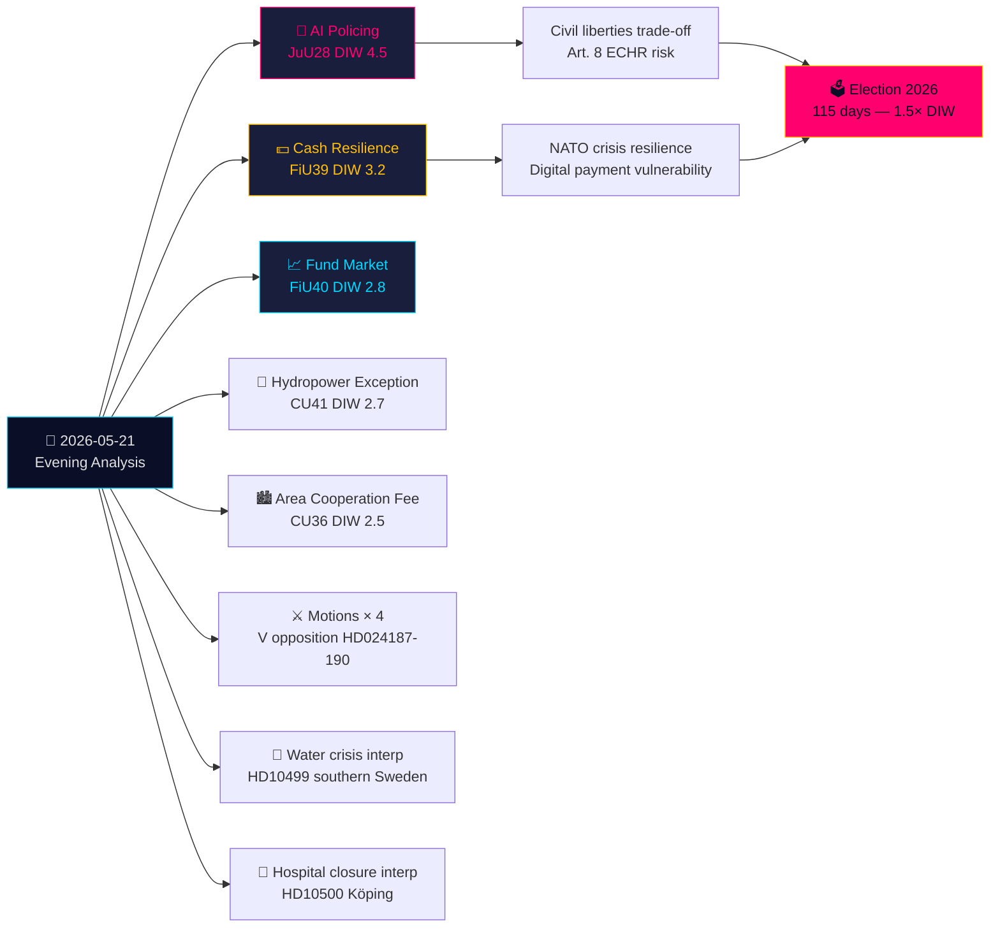

# Managementsamenvatting — Avondanalyse 2026-05-21

**Classificatie**: Openbaar OSINT · **Betrouwbaarheidsniveau**: HOOG · **Auteur**: Riksdagsmonitor Inlichtingenanalyse  
**Cyclus**: Avondanalyse · **Horizon**: T+72h → T+30d · **DIW-factor**: 1,5× (115 dagen tot de verkiezingen)

## 🎯 Kernbevinding

Donderdag 21 mei 2026 markeert een significante rechtsstaatwending: de Commissie voor Justitie (JuU) keurt **Zweden's eerste AI-gezichtsherkenningswetgeving voor politie in realtime** goed (HD01JuU28, betänkande 2025/26:JuU28). Tegelijkertijd hervormen FiU's **betänkande over contanteldresiliëntie** (HD01FiU39) en FiU40's **fondsmarkthervorming** de Zweedse financiële infrastructuur. Vijf betänkanden van JuU, FiU en CU vormen een ongewoon brede inter-commissiewetgevingsvoetafdruk. Tegen deze achtergrond vallen oppositionele moties het veiligheidsdreiging-uitzettingssysteem van de regering en de bevoegdheden van het Skatteverket aan, terwijl interpellaties over de watercrisis in Zuid-Zweden en ziekenhuissluitingen welzijnsstelselfouten blootleggen. Schriftelijke vragen over Taiwan-wapens en Tibet wijzen op voortdurende onopgeloste post-NAVO-diplomatieke spanningen.

## 🧭 3 Beslissingen die deze samenvatting ondersteunt

1. **Maatschappelijk middenveld/Juridisch**: Dien een Lagrådet-toetsingsverzoek in voor JuU28's uitvoeringsbesluiten over AI-gezichtsherkenning gebruiksprotocollen, gegevensbewaringslimieten en beroepsrechten. **Trigger**: Uitvoeringsbesluit overheid, verwacht binnen 60 dagen na Riksdag-stemming. Betrouwbaarheidsniveau: **HOOG**.

2. **Financiële instellingen/Riksbanken**: Evalueer de operationele gereedheid voor FiU39's contantverplichting — banken moeten minimale serviceniveaus voor contant geld handhaven onder het nieuwe stelsel. **Trigger**: Riksdag-stemming over FiU39 (verwacht in plenaire vergaderweek 25 mei). Betrouwbaarheidsniveau: **HOOG**.

3. **Buitenlandse Dienst**: Zweden heeft een venster van 48-72 uur om zijn positie over Taiwan-wapenleveranties (HD11822) te verduidelijken voordat het Trump/China-ontwapeningsnarratief stollt tot diplomatisch feit. FM Malmer Stenergards antwoord toont of Zweden EU-consensus volgt of een pro-Taiwan-defensiestandpunt inneemt. **Trigger**: Antwoorddeadline voor schriftelijke vraag. Betrouwbaarheidsniveau: **MIDDEL-HOOG**.

## 60 seconden

- **Belangrijkste**: JuU28 — AI-gezichtsherkenning in realtime voor politie. Zweden wordt een van de eerste EU-lidstaten die expliciet politiebiometrie wetgeeft. EVRM Artikel 8 en EU AI-verordening Categorie 1 hoog-risico implicaties. DIW 4,5 (verkiezingsnaderfactor 1,5× toegepast).
- **Economisch meest significant**: FiU40 (sterkere fondsmarkten) — structurele vernieuwing van Zweden's 6-biljoen-SEK-fondsmarkt. Langetermijneffecten op kapitaalmarktontwikkeling en pensioenbesparingen.
- **Geopolitiek gevoeligste**: HD11822 (Taiwan-wapens) en HD11821 (Tibet-China) — schriftelijke vragen die Zweden's post-NAVO-diplomatieke evenwichtsact blootleggen.
- **Onthullend voor welzijnsstelsel**: HD10500 (Köping-ziekenhuis) interpellatie — regering geeft ziekenhuisherstructurering toe zonder uniform plattelandsgezondheidszorgkader.

## Tier-C-Dag-overkoepelende Synthese

De commissieproductie van vandaag verbindt direct met gisteren/deze week's Propositioner en Motioner:
- JuU28 AI-biometrie **volgt op** het veiligheidsdreiging-uitzettingsPropositioner van de overheid (HD03267, geciteerd in Propositioner-zusje) — samen vormen ze Zweden's breedste veiligheidsstaatuitbreiding sinds de SÄPO-herorganisatie in 2019.
- FiU39 contantresilieniz **breidt** HD03250's (staatse digitale identiteit, Propositioner-zusje) digitale bestuursthema uit — Zweden breidt tegelijkertijd digitale identiteit uit EN verplicht contantalternatieven.
- V's Motioner vandaag (HD024187 tegen HD03267) **weerspiegelen** V's systematische oppositiepatroon gedocumenteerd in de Motioner-zusje analyse.

## Economische context

IMF WEO-2026-04: Prognose BBP-groei Zweden 2,1% (2026), inflatie 2,0%, werkloosheid 8,4%. De fondsmarkthervorming (FiU40) pakt de kwetsbaarheden van Zweden's 6-biljoen-SEK-fondsmarkt aan die geïdentificeerd zijn in het Riksbanken-rapport Financiële Stabiliteit 2025:2. Contantverplichting (FiU39) omvat geschatte banksektor-nalevingskosten van 400-800 miljoen SEK kapitaalinvesteringen (SBAB, Finansinspektionen-ramingen).

*economicProvenance: provider=imf, dataflow=WEO, vintage=WEO-2026-04, vintageAgeMonths=1, retrieved_at=2026-05-21*

<!-- source-sha: 0a8d60e7f720acdade1c9d675ec956390d78f271 -->
