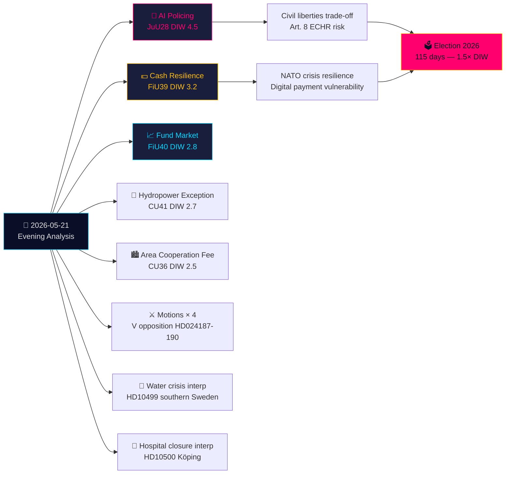

# Eksekutiv sammendrag — Kveldsanalyse 2026-05-21

**Klassifisering**: Offentlig OSINT · **Konfidens**: HØY · **Forfatter**: Riksdagsmonitor Etterretningsanalyse  
**Syklus**: Kveldsanalyse · **Horisont**: T+72h → T+30d · **DIW-multiplikator**: 1,5× (115 dager til valg)

## 🎯 Konklusjon i sammendrag

Torsdag 21. mai 2026 avsluttes med et avgjørende rettsstatlig vannskille: Justiskomiteen (JuU) godkjenner **Sveriges første AI-ansiktsgjenkjenningslovgivning for politiet i sanntid** (HD01JuU28, betänkande 2025/26:JuU28). Samtidig omformer FiU's **kontantrobusthetsbetänkande** (HD01FiU39) og FiU40's **fondmarkedsreform** Sveriges finansinfrastruktur. Fem betänkanden fra JuU, FiU og CU skaper et uvanlig bredt tverrkomité lovgivningsavtrykk. Mot denne bakgrunn: opposisjonsmosoner angriper regjeringens sikkerhetsekspulsjonsregime og Skatteverkets fullmakter, mens interpellasjoner om Sørvestlandets vannkrise og sykehuslukkinger avdekker svikt i velferdslevering. Skriftlige spørsmål om Taiwanvåpen og Tibet signalerer at Sveriges uløste post-NATO diplomatiske spenninger forblir uavklarte.

## 🧭 3 Beslutninger dette notatet støtter

1. **Sivilsamfunn/juridisk**: Send inn krav om Lagrådets gjennomgang av JuU28's implementeringsforskrifter om AI-ansiktsgjenkjenningsdriftsprotokoller, datalagringsbegrensninger og klagerettigheter. **Utløser**: Regjeringens lovproposisjon om gjennomføringsforordning, forventet innen 60 dager etter Riksdag-avstemning. Konfidens: **HØY**.

2. **Finansinstitusjoner/Riksbanken**: Vurder operasjonell beredskap for FiU39's kontantforpliktelser — banker må opprettholde minimumsservice­nivåer for kontant under den nye ordningen. **Utløser**: Riksdag-avstemning om FiU39 (forventet plenumuke 25. mai). Konfidens: **HØY**.

3. **Utenrikspolitisk seksjon**: Sverige har 48–72 timers vindu til å klargjøre sin posisjon om Taiwanvåpensalg (HD11822) innen Trumps/Kinas våpenfrysningsnarrativ størkner til diplomatisk fakta. UM Malmer Stenergards svar signaliserer om Sverige tilslutter seg EU-konsensus eller skjærer ut en pro-Taiwan-forsvarsposisjon. **Utløser**: Svarsfrist for skriftlig spørsmål. Konfidens: **MIDDELS-HØY**.

## 60 sekunder

- **Høyest signifikant**: JuU28 — AI sanntids ansiktsgjenkjenning for politiet. Sverige blir en av de første EU-medlemsstatene som lovfester eksplisitt politimessig AI-biometri. EMK Artikkel 8 og EU AI Act Kategori 1 høy-risiko implikasjoner. DIW 4,5 (valgproksimitetsmultiplikator 1,5× anvendt).
- **Mest økonomisk gjennomgripende**: FiU40 (sterkere fondmarked) — strukturell reform av Sveriges SEK 6 billioner fondmarked. Langsiktige kapitalvekstimplikasjoner for pensjonssparing.
- **Mest geopolitisk sensitiv**: HD11822 (Taiwanvåpen) og HD11821 (Tibet-Kina) — skriftlige spørsmål som avdekker Sveriges post-NATO diplomatiske balansegang.
- **Mest avslørende om velferdssystemet**: HD10500 (Köping sykehus) interpellasjon — regjeringen erkjenner sykehusomstrukturering uten et sammenhengende rammeverk for distriktshelsevesen.

## Tier-C tverrdagsanalyse

Dagens komitéresultater kobler direkte til gårsdagens/ukens proposisjoner og motsjoner:
- JuU28 AI-biometri **følger** regjeringens sikkerhetsekspulsjonsproposisjon (HD03267, sitert i proposisjonssøster) — til sammen utgjør de Sveriges mest omfattende sikkerhetsstatlige utvidelse siden SÄPO-omorganiseringen i 2019.
- FiU39 kontantrobusthet **utvider** det digitale styringstemaet fra HD03250 (statlig e-ID, proposisjonssøster) — Sverige utvider samtidig digital identitet OG påbyr kontantfallback.
- V's mosoner i dag (HD024188 mot HD03267) **ekkoer** V's systematiske opposisjonsmønster dokumentert i motjonssøsteranalysen.

## Økonomisk kontekst

IMF WEO-2026-04: Sveriges BNP-vekstprognose 2,1 % (2026), inflasjon 2,0 %, arbeidsledighet 8,4 %. Fondmarkedsreformen (FiU40) skjærer gjennom Sveriges SEK 6 billioner fondmarkedssårbarhet identifisert i Riksbankens Finansiell stabilitetsrapport 2025:2. Kontantforpliktelsen (FiU39) har anslåtte banksektorsamsvarsomkostninger på SEK 400–800m i kapitalinvesteringer (SBAB, Finansinspektionens estimater).

*economicProvenance: provider=imf, dataflow=WEO, vintage=WEO-2026-04, vintageAgeMonths=1, retrieved_at=2026-05-21*

<!-- source-sha: 0a8d60e7f720acdade1c9d675ec956390d78f271 -->
