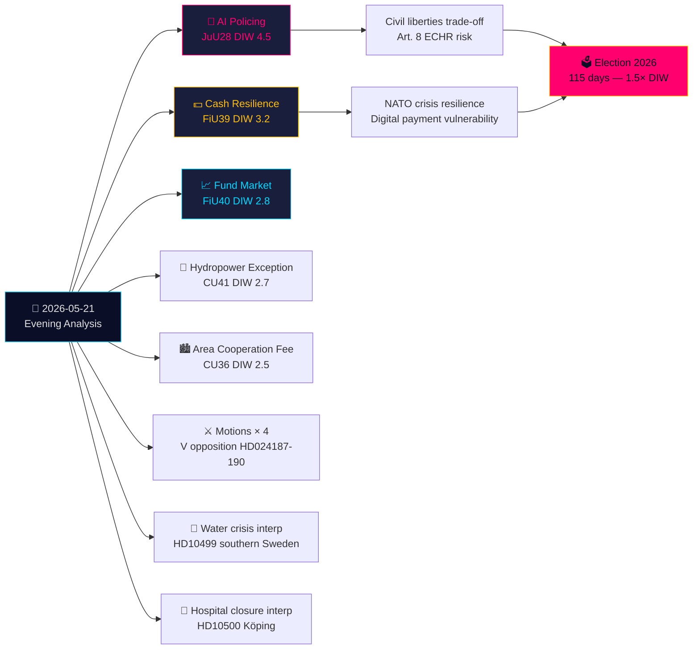

# Exekutiv sammanfattning — Kvällsanalys 2026-05-21

**Klassificering**: Offentlig OSINT · **Konfidensgrad**: HÖG · **Upphovsman**: Riksdagsmonitor Underrättelseanalys  
**Cykel**: Kvällsanalys · **Horisont**: T+72h → T+30d · **DIW-multiplikator**: 1,5× (115 dagar till val)

## 🎯 Slutsats i sammandrag

Torsdag 21 maj 2026 avslutas med ett avgörande rättsstatshistoriskt skifte: Justitieutskottet (JuU) godkänner **Sveriges första lagstiftning om AI-ansiktsigenkänning för polisen i realtid** (HD01JuU28, betänkande 2025/26:JuU28). Samtidigt omformar FiU:s **kontantresilienssbetänkande** (HD01FiU39) och FiU40:s **fondmarknadsreform** Sveriges finansinfrastruktur. Fem betänkanden från JuU, FiU och CU skapar ett ovanligt brett tvärutskottslgt lagstiftningsavtryck. Mot denna bakgrund: oppositionsmotioner angriper regeringens säkerhetshot-utvisningsregim och Skatteverkets befogenheter, medan interpellationer om Sydsveriges vattenkris och sjukhusläggningar blottlägger misslyckanden i välfärdsförsörjningen. Skriftliga frågor om Taiwanvapen och Tibet signalerar att Sveriges olösta post-NATO-diplomattika spänningar kvarstår.

## 🧭 3 Beslut som detta underlag stödjer

1. **Civilsamhälle/juridik**: Lämna in krav på Lagrådsgranskning av JuU28:s tillämpningsföreskrifter om AI-ansiktsigenkännings driftsprotokoll, datalagringstider och överklaganderätt. **Utlösare**: Regeringspropositionen om genomförandeförordning, förväntad inom 60 dagar efter riksdagsomröstning. Konfidensgrad: **HÖG**.

2. **Finansinstitut/Riksbanken**: Bedöm operativ beredskap för FiU39:s kontantskyldigheter — banker måste upprätthålla miniminivåer för kontantservice under den nya ordningen. **Utlösare**: Riksdagens omröstning om FiU39 (förväntas i plenum v. 25 maj). Konfidensgrad: **HÖG**.

3. **Utrikespolitisk avdelning**: Sverige har ett 48–72-timmarsfönster för att klargöra sin position om Taiwanvapenförsäljning (HD11822) innan Trumps/Kinas vapenfrysnarrativ fastnar som diplomatiskt faktum. UM Malmer Stenergards svar signalerar om Sverige ansluter sig till EU-konsensus eller skär ut en pro-Taiwan-försvarsposition. **Utlösare**: Svarsfrist för skriftlig fråga. Konfidensgrad: **MEDEL-HÖG**.

## 60 sekunder

- **Högst signifikant**: JuU28 — AI-ansiktsigenkänning i realtid för polisen. Sverige blir en av de första EU-länderna att lagstifta om explicita polisiära AI-biometrier. EKMR Artikel 8 och EU:s AI-förordning Kategori 1 högriskimplikationer. DIW 4,5 (valnärhetsmultiplikator 1,5× tillämpad).
- **Mest ekonomiskt genomgripande**: FiU40 (starkare fondmarknad) — strukturell reform av Sveriges fondmarknad på 6 biljoner SEK. Långsiktiga konsekvenser för kapitaltillväxt i pensionssparande.
- **Mest geopolitiskt känslig**: HD11822 (Taiwanvapen) och HD11821 (Tibet-Kina) — skriftliga frågor som blottlägger Sveriges post-NATO diplomatta balansgång mellan atlantiska åtaganden och Kina/Ryssland-relationer.
- **Mest avslöjande om välfärdssystemet**: HD10500 (Köping sjukhus) interpellation — regeringen medger sjukhusomstrukturering utan ett sammanhängande ramverk för landsbygdssjukvård.

## Tier-C tvärdagssyntes

Dagens utskottsproduktion kopplar direkt till gårdagens/veckans propositioner och motioner:
- JuU28 AI-biometri **följer** regeringens säkerhetshot-utvisningsproposition (HD03267, citerad i propositionssyskon) — tillsammans utgör de Sveriges mest omfattande säkerhetsstatliga expansion sedan SÄPO-omorganisationen 2019.
- FiU39 kontantresiliens **utvidgar** det digitala styrningstemat från HD03250 (statlig e-legitimation, propositionssyskon) — Sverige utökar simultant digital identitet OCH föreskriver kontantfallback.
- V:s motioner idag (HD024188 mot HD03267) **ekar** V:s systematiska oppositionsmönster dokumenterat i motionssyskonanalysen.

## Ekonomisk kontext

IMF WEO-2026-04: Sveriges BNP-tillväxt prognos 2,1 % (2026), inflation 2,0 %, arbetslöshet 8,4 %. Fondmarknadsreformen (FiU40) skär tvärs igenom Sveriges fondmarknadssårbarheter på 6 biljoner SEK som identifierats i Riksbankens Finansiell stabilitetsrapport 2025:2. Kontantskyldigheten (FiU39) har uppskattad banksektorkostnad för regelefterlevnad på 400–800 mn SEK i kapitalinvesteringar (SBAB, Finansinspektionens uppskattningar).

*economicProvenance: provider=imf, dataflow=WEO, vintage=WEO-2026-04, vintageAgeMonths=1, retrieved_at=2026-05-21*

<!-- source-sha: 0a8d60e7f720acdade1c9d675ec956390d78f271 -->
