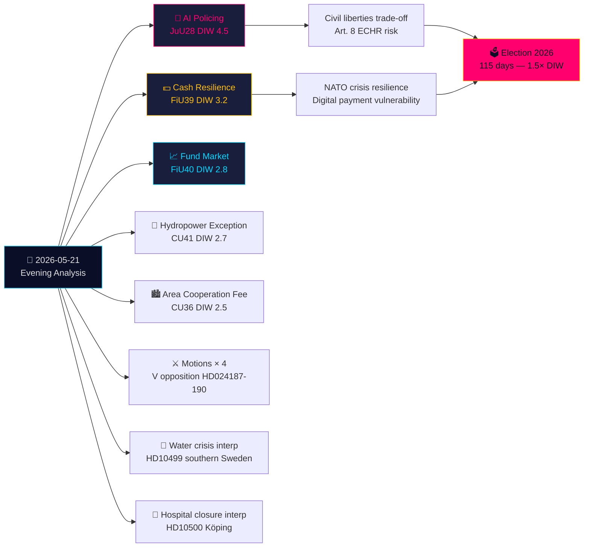

# 执行简报 — 晚间分析 2026-05-21

**分类**: 公开OSINT · **可信度**: 高 · **作者**: Riksdagsmonitor 情报分析  
**周期**: 晚间分析 · **时间范围**: T+72h → T+30d · **DIW系数**: 1.5×（距选举115天）

## 🎯 核心结论

2026年5月21日星期四迎来法治的重要转折点：司法委员会（JuU）批准**瑞典首部实时人工智能人脸识别警察立法**（HD01JuU28, betänkande 2025/26:JuU28）。与此同时，FiU的**现金韧性betänkande**（HD01FiU39）和FiU40的**基金市场改革**正在重塑瑞典的金融基础设施。来自JuU、FiU和CU的五项betänkanden形成了异常广泛的跨委员会立法足迹。在此背景下，反对党动议攻击政府的安全威胁驱逐体系和Skatteverket的权力，而关于南瑞典水危机和医院关闭的质询揭示了福利体系的失败。关于对台武器和西藏问题的书面质询表明，瑞典加入北约后悬而未决的外交紧张局势持续存在。

## 🧭 本简报支持的3项决策

1. **公民社会/法律**: 就JuU28关于人工智能人脸识别使用协议、数据保留限制和上诉权的实施法规向Lagrådet提出审查请求。**触发条件**: 政府实施法规，预计在Riksdag投票后60天内出台。可信度: **高**。

2. **金融机构/瑞典中央银行**: 评估FiU39现金义务的运营准备情况——银行必须在新制度下维持最低现金服务水平。**触发条件**: Riksdag对FiU39进行投票（预计在5月25日全体会议周）。可信度: **高**。

3. **外交部门**: 瑞典有48至72小时的窗口来明确其对台湾武器销售（HD11822）的立场，此后特朗普/中国的裁军叙事将固化为外交既成事实。外长Malmer Stenergard的回答将揭示瑞典是遵循欧盟共识还是采取亲台湾的防务立场。**触发条件**: 书面质询答复截止日期。可信度: **中高**。

## 60秒摘要

- **最重要**: JuU28——警察实时人工智能人脸识别。瑞典成为最早明确立法规范警察生物特征识别的欧盟成员国之一。欧洲人权公约第8条和欧盟人工智能法案第1类高风险影响。DIW 4.5（选举临近系数1.5×已应用）。
- **经济意义最重大**: FiU40（更强的基金市场）——对瑞典6万亿克朗基金市场的结构性改革。对养老金储蓄的长期资本市场发展影响。
- **地缘政治最敏感**: HD11822（台湾武器）和HD11821（西藏-中国）——揭示瑞典加入北约后外交平衡行为的书面质询。
- **揭示福利体系**: HD10500（科平医院）质询——政府承认在没有统一农村医疗框架的情况下进行医院重组。

## Tier-C跨日综合

今日委员会产出与昨天/本周的Propositioner和Motioner直接关联：
- JuU28人工智能生物特征识别**紧随**政府安全威胁驱逐Propositioner（HD03267，在Propositioner姊妹文件中引用）——共同构成2019年SÄPO重组以来瑞典最广泛的安全国家扩张。
- FiU39现金韧性**延伸**HD03250（国家数字身份，Propositioner姊妹文件）的数字治理主题——瑞典在扩展数字身份的同时还强制要求现金替代方案。
- 今日V的Motioner（HD024187反对HD03267）**映射**Motioner姊妹分析中记录的V系统性反对模式。

## 经济背景

IMF WEO-2026-04：瑞典GDP增长预测2.1%（2026年）、通胀2.0%、失业率8.4%。基金市场改革（FiU40）解决了Riksbanken金融稳定报告2025:2中确定的瑞典6万亿克朗基金市场脆弱性。现金义务（FiU39）包括估计银行业合规成本4亿至8亿克朗资本投资（SBAB、Finansinspektionen估计）。

*economicProvenance: provider=imf, dataflow=WEO, vintage=WEO-2026-04, vintageAgeMonths=1, retrieved_at=2026-05-21*

<!-- source-sha: 0a8d60e7f720acdade1c9d675ec956390d78f271 -->
