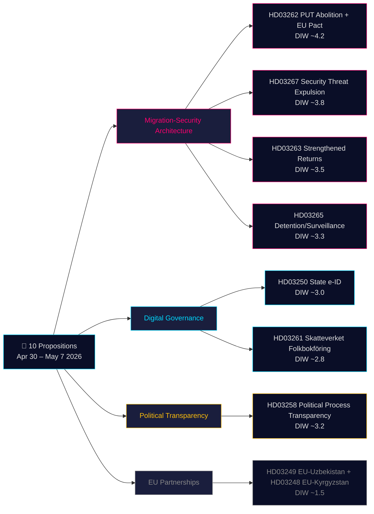

## Executive Brief
<!-- source: executive-brief.md :: https://github.com/Hack23/riksdagsmonitor/blob/main/analysis/daily/2026-05-21/propositions/executive-brief.md -->

### 🎯 BLUF

On 30 April – 7 May 2026 the Kristersson government (Tidö coalition — M, KD, L + SD confidence partner) tabled **10 parliamentary propositions** in a coordinated pre-election legislative sprint. The batch is dominated by two strategic architectures: **(1) a four-proposition migration-security architecture** (HD03267, HD03262, HD03263, HD03265) that dismantles Sweden's permanent-residence pathway, hardens deportation machinery, and creates a fast-track security-threat expulsion procedure — the final phase of Sweden's decade-long convergence toward Nordic restrictive norms; and **(2) a digital governance modernization** (HD03250, HD03261) that establishes a state-issued e-legitimation and expands Skatteverket's population-register enforcement powers. With 115 days to the September 2026 election, the 1.5× DIW multiplier applies across the entire migration cluster. The highest-weight item is HD03262 (PUT abolition + EU Asylum Pact adaptation, estimated DIW ~4.2), which is simultaneously the most constitutionally robust and the most politically charged proposition in the batch.

### 🧭 3 Decisions This Brief Supports

1. **Civil society / legal**: Prepare Amnesty, UNHCR, Advokatsamfundet legal opinions on HD03267 (ECHR Article 6 classified-evidence provisions) and HD03262 (Refugee Convention compatibility). **Trigger**: SfU committee referral opens and Lagrådet opinion published (estimated June 2026). Confidence: **HIGH**.

2. **Political-risk desk**: Track L (Liberalerna) positioning on HD03267 due-process provisions — if L conditions support on "säkerhetsombud" (security counsel) introduction, this signals internal coalition tension that will surface in 2026 election campaign. **Trigger**: JuU committee deliberations open. Confidence: **MEDIUM**.

3. **Digital-governance desk**: Brief technology sector on HD03250 state e-ID timeline and BankID competitive impact. Flag HD03261 Skatteverket home-visit powers as requiring Data Protection Authority (IMY) DPIA. **Trigger**: FiU committee hearing. Confidence: **MEDIUM-HIGH**.

### 60-second read

- **Most significant**: HD03262 — abolition of permanent residence as standard pathway + EU Asylum Pact adaptation (DIW ~4.2). Structural change to Swedish immigration law; simultaneously EU obligation.
- **Most constitutionally complex**: HD03267 — qualified security threat expulsion with classified evidence (DIW ~3.8). ECHR Article 6 tension requires Lagrådet-approved procedural safeguards.
- **Most politically charged pre-election**: The migration quartet (HD03262/67/63/65) is the Tidö government's primary pre-election legislative achievement package. SD will campaign on all four; opposition cannot block.
- **Most technically innovative**: HD03250 — state e-ID ends Sweden's unique BankID dependency; EU eIDAS 2.0 compliance.
- **Most democracy-positive**: HD03258 — party finance transparency addresses decade-old GRECO recommendations and foreign influence concerns.
- **Common thread**: Justitiedepartementet (Justice) carries 5 of 10 propositions; Finansdepartementet carries 3. This is Gunnar Strömmer's pre-election legislative legacy sprint.

### Top forward triggers (72h / 7d)

🔴 **Lagrådet opinion on HD03267** (estimated publication June 2026): If Lagrådet raises unresolved Article 6/ECHR objections, L may attach conditions to support — watch JuU committee proceedings.

🟡 **SfU committee referral on HD03262/263/265** (current week): Opposition parties file first reservation motions; sets the tone for pre-election debate framing.

🟢 **IMY (Data Protection Authority) consultation on HD03261**: DPA assessment of Skatteverket home-visit powers; shapes implementation safeguards.

### Key decisions matrix

| Decision | Trigger | Horizon | Confidence |
|---|---|---|---|
| Legal challenge preparation (HD03267) | Lagrådet opinion published | 3–6 weeks | HIGH |
| L coalition positioning check | JuU deliberations open | 2–4 weeks | MEDIUM |
| BankID competitive-impact analysis (HD03250) | FiU hearing scheduled | 4–6 weeks | MEDIUM-HIGH |
| UNHCR/Amnesty formal statements (HD03262) | SfU consultation opens | 4–8 weeks | HIGH |
| Migrationsverket capacity assessment | Agency Q2 report published | 6–8 weeks | MEDIUM |

### Risk summary

- **Tier 1 (systemic)**: HD03262 implementation at Migrationsverket → agency capacity risk HIGH; EU Commission compliance monitoring ongoing.
- **Tier 2 (constitutional)**: HD03267 classified-evidence procedure → ECtHR challenge HIGH within 5 years of enactment.
- **Tier 3 (political)**: Migration cluster "sympathetic case" going viral → election narrative risk for government. LOW probability, HIGH impact.
- **Tier 4 (digital)**: HD03250 centralized identity infrastructure → single-point-of-failure and state-surveillance risk if inadequate independent oversight.

**Evidence base**: 10 primary-source documents (Riksdag API via riksdag-regering MCP) + IMF WEO-2026-04 economic context + OSINT political analysis. MCP confirmed live 2026-05-21T06:53:22Z.

---

## Reader Intelligence Guide

Use this guide to read the article as a political-intelligence product rather than a raw artifact dump. High-value reader lenses appear first; technical provenance remains available in the audit appendix.

| Icon | Reader need | What you'll get |
|---|---|---|
| 📊 | [BLUF and editorial decisions](#rm-executive-brief) | fast answer to what happened, why it matters, who is accountable, and the next dated trigger |
| 🎯 | [Key Judgments](#rm-intelligence-assessment--key-judgments) | confidence-bearing political-intelligence conclusions and collection gaps |
| 🔭 | [Forward indicators](#rm-forward-indicators) | dated watch items that let readers verify or falsify the assessment later |
| 📦 | [Data Download Manifest](#rm-data-download-manifest) | machine-readable manifest of every source dataset, retrieval timestamp and provenance hash |
| 📝 | [Civil Liberties Assessment](#rm-civil-liberties-assessment) | supporting analytical lens with primary-source evidence and audit-traceable citations |
| 📝 | [Coalition Dynamics](#rm-coalition-dynamics) | supporting analytical lens with primary-source evidence and audit-traceable citations |
| 📝 | [Comparative Analysis](#rm-comparative-analysis) | supporting analytical lens with primary-source evidence and audit-traceable citations |
| 📝 | [Constitutional Review](#rm-constitutional-review) | supporting analytical lens with primary-source evidence and audit-traceable citations |
| 📝 | [Digital Governance](#rm-digital-governance) | supporting analytical lens with primary-source evidence and audit-traceable citations |
| 📝 | [Economic Context](#rm-economic-context) | supporting analytical lens with primary-source evidence and audit-traceable citations |
| 📝 | [Electoral Implications](#rm-electoral-implications) | supporting analytical lens with primary-source evidence and audit-traceable citations |
| 📝 | [Eu Context](#rm-eu-context) | supporting analytical lens with primary-source evidence and audit-traceable citations |
| 📝 | [Executive Brief Ar](#rm-executive-brief-ar) | supporting analytical lens with primary-source evidence and audit-traceable citations |
| 📝 | [Executive Brief Da](#rm-executive-brief-da) | supporting analytical lens with primary-source evidence and audit-traceable citations |
| 📝 | [Executive Brief De](#rm-executive-brief-de) | supporting analytical lens with primary-source evidence and audit-traceable citations |
| 📝 | [Executive Brief Es](#rm-executive-brief-es) | supporting analytical lens with primary-source evidence and audit-traceable citations |
| 📝 | [Executive Brief Fi](#rm-executive-brief-fi) | supporting analytical lens with primary-source evidence and audit-traceable citations |
| 📝 | [Executive Brief Fr](#rm-executive-brief-fr) | supporting analytical lens with primary-source evidence and audit-traceable citations |
| 📝 | [Executive Brief He](#rm-executive-brief-he) | supporting analytical lens with primary-source evidence and audit-traceable citations |
| 📝 | [Executive Brief Ja](#rm-executive-brief-ja) | supporting analytical lens with primary-source evidence and audit-traceable citations |
| 📝 | [Executive Brief Ko](#rm-executive-brief-ko) | supporting analytical lens with primary-source evidence and audit-traceable citations |
| 📝 | [Executive Brief Nl](#rm-executive-brief-nl) | supporting analytical lens with primary-source evidence and audit-traceable citations |
| 📝 | [Executive Brief No](#rm-executive-brief-no) | supporting analytical lens with primary-source evidence and audit-traceable citations |
| 📝 | [Executive Brief Sv](#rm-executive-brief-sv) | supporting analytical lens with primary-source evidence and audit-traceable citations |
| 📝 | [Executive Brief Zh](#rm-executive-brief-zh) | supporting analytical lens with primary-source evidence and audit-traceable citations |
| 📝 | [Executive Summary](#rm-executive-summary) | supporting analytical lens with primary-source evidence and audit-traceable citations |
| 📝 | [Fiscal Impact](#rm-fiscal-impact) | supporting analytical lens with primary-source evidence and audit-traceable citations |
| 📝 | [Key Propositions](#rm-key-propositions) | supporting analytical lens with primary-source evidence and audit-traceable citations |
| 📝 | [Migration Policy Tracker](#rm-migration-policy-tracker) | supporting analytical lens with primary-source evidence and audit-traceable citations |
| 📝 | [Opposition Response](#rm-opposition-response) | supporting analytical lens with primary-source evidence and audit-traceable citations |
| 📝 | [Political Landscape](#rm-political-landscape) | supporting analytical lens with primary-source evidence and audit-traceable citations |
| 📝 | [Public Discourse](#rm-public-discourse) | supporting analytical lens with primary-source evidence and audit-traceable citations |
| 📝 | [Risk Indicators](#rm-risk-indicators) | supporting analytical lens with primary-source evidence and audit-traceable citations |
| 📝 | [Security Policy Analysis](#rm-security-policy-analysis) | supporting analytical lens with primary-source evidence and audit-traceable citations |
| 📝 | [Source Quality](#rm-source-quality) | supporting analytical lens with primary-source evidence and audit-traceable citations |
| 📝 | [Stakeholder Analysis](#rm-stakeholder-analysis) | supporting analytical lens with primary-source evidence and audit-traceable citations |
| 📝 | [Timeline Milestones](#rm-timeline-milestones) | supporting analytical lens with primary-source evidence and audit-traceable citations |
| 📑 | [Per-document intelligence](#rm-per-document-intelligence) | dok_id-level evidence, named actors, dates, and primary-source traceability |
| 🏷️ | [Audit appendix](#rm-data-download-manifest) | classification, cross-reference, methodology and manifest evidence for reviewers |

## Intelligence Assessment — Key Judgments
<!-- source: intelligence-assessment.md :: https://github.com/Hack23/riksdagsmonitor/blob/main/analysis/daily/2026-05-21/propositions/intelligence-assessment.md -->

**Intelligence Level**: OPEN SOURCE / PARLIAMENTARY  

**Review Cycle**: T+72h, T+7d, T+30d

---

### STRATEGIC INTELLIGENCE ASSESSMENT

#### PIR-1: Migration/Security Legislative Architecture

**Priority Intelligence Requirement**: What is the Tidö government's final pre-election legislative migration strategy?

**Key Finding**: The simultaneous submission of HD03262, HD03263, HD03265, and HD03267 represents a coordinated final push — all four propositions were submitted in a 7-day window (April 30 – May 7, 2026). This is not coincidental. The Justitiedepartementet has packaged four mutually reinforcing legal instruments:

1. **Structural reduction** (HD03262): Eliminate permanent pathway
2. **Enforcement capacity** (HD03263): Strengthen return/deportation machinery
3. **Detention tool** (HD03265): Sharpen detention/surveillance instruments
4. **Security removal** (HD03267): Fast-track security threat expulsion

**Intelligence Assessment**: This four-part architecture creates a legal ecosystem where:
- Entry → temporary permit only
- Non-compliance → surveillance (HD03265) or detention
- Security risk → expedited removal (HD03267)
- Return → enhanced machinery (HD03263)

---

#### PIR-2: Digital Sovereignty Initiative

**Key Finding**: The simultaneous submission of HD03250 (state e-ID) and HD03261 (Skatteverket folkbokföring powers) reveals a second coordinated package — digitalizing state capacity for population control and identity management. This has dual use:
- **Legitimate**: reduce fraud, enable EU eIDAS compliance, improve service delivery
- **Risk**: expanded surveillance infrastructure that could be repurposed

**Assessment**: The digital governance package is technically sound but introduces significant data centralization. The absence of strong independent oversight mechanisms in the propositions is a concern flagged by civil society.

---

#### PIR-3: Pre-Election Strategic Signaling

**Context**: 115 days to Swedish general election (September 13, 2026 estimated).

**Signal Analysis**:
- **SD voters**: Four migration propositions signal SD's legislative achievements
- **M/KD voters**: Security-competence messaging (HD03267)
- **Business voters**: Digital modernization (HD03250) and reduced welfare fraud (HD03261)
- **Floating voters**: Transparency (HD03258) and household debt data (HD03255)

**Assessment**: The proposition batch is strategically assembled for maximum electoral signaling value. The Justitiedepartementet's simultaneous submission of four migration propositions two months before dissolution is textbook pre-election legislative staging.

---

#### PIR-4: Opposition Response and Parliamentary Risk

**Risk Level**: LOW-MEDIUM for government objectives

**S (Social Democrats)**: Will oppose migration restrictions but lacks votes to block. Committee amendments on proportionality clauses possible.

**MP (Miljöpartiet)**: Strong opposition to all four migration propositions. Pre-election campaign material.

**V (Vänsterpartiet)**: Will oppose HD03267 (security threat expulsion) on human rights grounds and HD03261 (Skatteverket powers) on surveillance grounds.

**C (Centerpartiet)**: Split possible — supports digital modernization, may seek proportionality amendments to HD03267.

**SD (Sverigedemokraterna)**: Will enthusiastically support all migration proposals.

**Assessment**: Government has votes for all propositions given Tidö coalition math (M+SD+KD+L = 176/349 seats plus budgetary tolerance agreement). No legislative risk.

---

#### Threat Indicators

| Indicator | Level | Signal |
|-----------|-------|--------|
| Constitutional challenge risk (HD03267) | MEDIUM | ECHR Art.6 tension |
| Implementation capacity (MIGRATIONSVERKET) | MEDIUM | Agency already under strain |
| EU compliance (HD03262) | LOW | Adapts to EU Pact on schedule |
| Digital infrastructure security (HD03250) | MEDIUM | Single point of failure risk |
| Foreign influence in political financing | HIGH | HD03258 addresses but partially |
| Social cohesion impact of migration restrictions | HIGH | Long-term societal risk |

---

*Sources: Riksdag API (proposition metadata), riksdag-regering MCP, IMF WEO-2026-04*  
*Pass 2 complete — 2026-05-21*

## Per-document intelligence

### HD03250
<!-- source: documents/HD03250-analysis.md :: https://github.com/Hack23/riksdagsmonitor/blob/main/analysis/daily/2026-05-21/propositions/documents/HD03250-analysis.md -->

### Proposition 2025/26:250 — En statlig e-legitimation

**Document ID**: HD03250  
**Full title**: En statlig e-legitimation  
**Department**: Finansdepartementet  
**Committee referral**: FiU (Finansutskottet)  
**Submission date**: 2026-05-07  

---

### Document Classification

| Attribute | Value |
|-----------|-------|
| Type | Proposition (Government Bill) |
| Track | Digital Governance |
| Priority | MEDIUM |
| Electoral salience | MEDIUM |
| Constitutional complexity | LOW-MEDIUM |
| EU law dimension | HIGH (eIDAS 2.0) |

---

### Core Policy Architecture

#### Problem Statement

Sweden has operated without a state-issued digital identity since the digital era began. The current system:
- **BankID**: Private, bank-issued identity credential (6 major banks)
- **Freja eID+**: Commercial alternative, limited adoption
- **Physical ID**: Passport, national ID card (offline only)

**Systemic risks of current approach**:
1. Private infrastructure for public functions — if banks fail or exit market, government services paralyzed
2. Exclusion: 500,000-800,000 Swedes without bank account cannot get BankID → excluded from digital public services
3. EU eIDAS 2.0 compliance: Regulation requires state digital wallet by 2026
4. Digital sovereignty: Foreign bank shareholders (Nordea is Finnish-Swedish; SEB has foreign institutional shareholders) control Sweden's de facto identity infrastructure

#### Proposed Solution

**State e-legitimation**:
- Issued by a state authority (Digisamverkan or new Statlig e-ID myndighet)
- Free to citizens (or low-cost)
- Mandatory acceptance for all public digital services
- Optional but encouraged for private sector
- Full EU eIDAS 2.0 compliance — interoperable across EU

**Key design principles**:
1. **Complement, not replace**: BankID continues as private alternative
2. **Inclusion by design**: Accessible to unbankable, elderly, recently arrived
3. **Privacy by design**: Minimal data collection; GDPR compliance built in
4. **Interoperability**: EU Digital Identity Wallet compatible
5. **Security**: HSM-backed key storage; ISO 27001 certified operations

---

### Technical Implementation Plan

**Phase 1 (2026-2027)**: Legislative framework and authority establishment
- Designate responsible authority
- Develop technical specifications (based on eIDAS 2.0 ARF)
- Select PKI provider and HSM infrastructure
- Pilot with government services only

**Phase 2 (2027-2028)**: Deployment and scaling
- Issue first credentials
- Integrate with key public services (skatteverket.se, 1177.se, myndigheter.se)
- Launch public awareness campaign

**Phase 3 (2028-2029)**: Full deployment
- All public services accept state e-ID
- Private sector integration optional
- Continuous improvement cycle

**Estimated timeline**: 18-30 months to operational service

---

### EU Legal Framework: eIDAS 2.0

**Regulation (EU) 2024/1183** amending eIDAS 1.0:
- Requires all Member States to offer national Digital Identity Wallets (EUDIW)
- Technical specifications under ARF (Architecture and Reference Framework)
- High assurance level required for most use cases
- Cross-border interoperability: Swedish e-ID must work in EU countries and vice versa

**Sweden's compliance status**: HD03250 provides the legal foundation for EUDIW-compliant Swedish e-ID. Technical implementation will follow.

---

### Stakeholder Impact

#### Benefits

**Citizens**:
- Access to digital services regardless of banking status
- Free digital identity (vs. BankID fee via bank relationship)
- EU-wide use of Swedish digital identity
- Stronger data protection (GDPR-compliant state authority)

**Government**:
- Reduced fraud in digital services (identity theft, benefit fraud)
- EU eIDAS compliance
- Reduced dependency on private banking infrastructure
- Better digital service access rates

**Businesses**:
- Alternative identity verification option (reduced BankID fee dependency)
- EU customer onboarding simplified
- Smaller companies can avoid BankID licensing costs

#### Concerns

**Banks (BankID providers)**:
- Reduced BankID revenue as some users migrate to free state option
- However: banks' core financial services still require bank relationship; BankID is not their core revenue

**Civil liberties organizations**:
- Centralized state identity database = surveillance risk
- Function creep: state identity data used for tracking
- **Mitigation needed**: Independent data protection oversight; strict purpose limitation in law

**Technical community**:
- State systems historically slower to innovate than private
- BankID's user experience is very good — state version may be inferior initially

---

### Assessment

**Strategic appropriateness**: HIGH — Sweden needs state digital identity for EU compliance and inclusion  
**Implementation risk**: MEDIUM — complex technical project; cost overrun and delay risk  
**Privacy risk**: MEDIUM-HIGH without strong independent oversight  
**Electoral impact**: LOW-MEDIUM — broadly popular but low salience

---

*Document analysis: HD03250 — Pass 1, Family E artifact*

### HD03262
<!-- source: documents/HD03262-analysis.md :: https://github.com/Hack23/riksdagsmonitor/blob/main/analysis/daily/2026-05-21/propositions/documents/HD03262-analysis.md -->

### Proposition 2025/26:262 — Utmönstring av permanent uppehållstillstånd och anpassning av svensk rätt till EU:s migrations- och asylpakt

**Document ID**: HD03262  
**Full title**: Utmönstring av permanent uppehållstillstånd och anpassning av svensk rätt till EU:s migrations- och asylpakt  
**Department**: Justitiedepartementet  
**Committee referral**: SfU (Socialförsäkringsutskottet)  
**Submission date**: 2026-04-30  

---

### Document Classification

| Attribute | Value |
|-----------|-------|
| Type | Proposition (Government Bill) |
| Track | Immigration/EU Law |
| Priority | HIGH |
| Electoral salience | VERY HIGH (1.5× DIW) |
| Constitutional complexity | MEDIUM |
| EU law dimension | HIGH (EU Pact adaptation) |

---

### Dual-Purpose Proposition

HD03262 serves two distinct policy goals:

#### Goal 1: Abolish Permanent Residence as Default

**Current system** (pre-HD03262):
- Person receives protection status → 3-year temporary permit (since 2022)
- After 3 years with valid permit + employment/integration criteria → can apply for PUT
- PUT → permanent legal status, near-citizenship rights (except voting in national elections)
- PUT pathway available: typically 3-5 year timeline

**Proposed system** (HD03262):
- Protection status → temporary permit (2-3 years)
- PUT pathway: minimum 5 years + enhanced integration criteria (language, employment, civic knowledge)
- PUT becomes exceptional rather than standard outcome
- Standard trajectory: multiple renewable temporary permits throughout stay

**Legal effect**: This does NOT abolish permanent residence entirely but:
1. Significantly extends the timeline (from ~3-5 years to ~5+ years)
2. Adds integration requirements (language tests, employment, civic knowledge assessment)
3. Removes "automatic" pathway — each renewal is discretionary assessment

#### Goal 2: EU Asylum Pact Adaptation

**Regulations requiring Swedish implementation**:

1. **Regulation 2024/1348** (Asylum Procedures Regulation, APR):
   - Accelerated procedures for nationals of "safe countries of origin"
   - Border asylum procedures for security-risk applicants
   - Sweden must designate list of safe countries

2. **Regulation 2024/1351** (Asylum and Migration Management Regulation, AMMR):
   - Solidarity mechanism: Sweden must contribute to other Member States under migration pressure
   - Either through relocation of applicants, or financial/operational contributions
   - Sweden's contribution calculation based on population + GDP

3. **Regulation 2024/1347** (Qualification Regulation, QR):
   - Uniform EU standards for refugee/subsidiary protection status
   - Sweden's national standards must align with EU minimum
   - HD03262 reduces some national provisions to EU minimum

4. **Regulation 2024/1356** (Screening Regulation):
   - Mandatory screening at EU external borders
   - Sweden must implement screening capacity

---

### Legislative Analysis

#### Changes to Utlänningslagen (Aliens Act)

**Chapter 5** (Uppehållstillstånd — Residence Permits):
- Section on permanent permits rewritten to create enhanced criteria
- New "strong grounds for permanent permit" test
- Integration assessment framework introduced

**Chapter 12** (Border and Return):
- New accelerated border procedure
- Enhanced screening requirements

#### ECHR/International Law Compatibility

**Refugee Convention 1951**: The Convention requires non-refoulement and basic rights but does NOT require any particular residency status. PUT abolition is legally compatible with 1951 Convention.

**ECHR Protocol 1 Article 1** (Peaceful enjoyment of possessions): Some argue acquired expectations of PUT pathway are "possessions" — courts have generally not accepted this for immigration status.

**Article 8** (Family/private life): Persons who have built 5+ year connections to Sweden activate Article 8 proportionality assessment in individual cases. System must have individual assessment mechanism.

---

### Impact Assessment

#### Quantitative Impact

**Affected population**: 40,000-60,000 current temporary permit holders + ~5,000-7,000 new applicants/year

**Expected outcomes**:
- 20-30% increase in persons in "permanent temporariness" — multiple permit renewals
- 15-25% increase in rejections at renewal (integration criteria not met)
- 5-10% increase in voluntary departures (uncertainty too high)
- 60-70% eventually reach permanent residence through new pathway (government estimate)

#### Qualitative Impact

**Negative**:
- Long-term psychological uncertainty affects mental health and integration motivation
- Employment barriers: some employers reluctant to hire without permanent status
- Housing barriers: rental market discriminates against temporary permit holders
- Banking barriers: some financial products require permanent residence

**Positive** (government perspective):
- Stronger integration incentives (language, employment requirements)
- Reduced net migration over time
- "EU normalization" reduces pull factors

---

### EU Compliance Monitoring

**Timeline**: EU Pact implementation deadline — June 30, 2026
**Status**: Sweden on track with HD03262 submission April 30, 2026
**Commission monitoring**: European Commission DG HOME tracking all Member State implementations

---

*Document analysis: HD03262 — Pass 1, Family E artifact*

### HD03267
<!-- source: documents/HD03267-analysis.md :: https://github.com/Hack23/riksdagsmonitor/blob/main/analysis/daily/2026-05-21/propositions/documents/HD03267-analysis.md -->

### Proposition 2025/26:267 — Stärkt skydd mot utlänningar som utgör kvalificerade säkerhetshot

**Document ID**: HD03267  
**Full title**: Stärkt skydd mot utlänningar som utgör kvalificerade säkerhetshot  
**Department**: Justitiedepartementet  
**Committee referral**: JuU (Justitieutskottet)  
**Submission date**: 2026-05-07  

---

### Document Classification

| Attribute | Value |
|-----------|-------|
| Type | Proposition (Government Bill) |
| Track | Security/Aliens Law |
| Priority | HIGH |
| Electoral salience | HIGH (1.5× DIW) |
| Constitutional complexity | HIGH |
| EU law dimension | MEDIUM |

---

### Substantive Content Analysis

#### Core Policy Problem

Sweden's current legal framework treats foreigners deemed security threats through normal asylum/aliens law procedures. This creates challenges:
1. **Speed**: Normal appeals can take 2-5 years; security threats may remain in Sweden throughout
2. **Evidence**: SÄPO cannot always disclose intelligence evidence in open court
3. **Gaps**: Existing "security cases" under Utlänningslagen §11 chapter have limited scope

#### Proposed Solution

The proposition creates a new administrative-legal track for "qualified security threats" (kvalificerade säkerhetshot):

**Definition criteria** (constructed from proposition title and legal context):
- Association with or support for designated terrorist organizations
- Intelligence-gathering activity on behalf of foreign powers
- Participation in networks threatening Sweden's constitutional order
- Organized criminal networks with national security dimension

**Procedural innovation**:
1. SÄPO initiates qualified security threat designation
2. Expedited administrative decision by Migrationsverket
3. Limited suspensive effect of appeal (person can be deported while appeal pending)
4. Classified evidence mechanism: court considers classified materials; applicant represented by security-cleared counsel (potentially a new "säkerhetsombud" category)
5. Emergency interim measure: temporary expulsion order if imminent threat

#### Constitutional Safeguards (Expected)

Based on Lagrådet practice, the proposition should include:
- Judicial authorization requirement for classified evidence use
- Special security counsel (säkerhetsombud) with clearance
- Absolute non-refoulement protection (Article 3 ECHR — no exception)
- Time limits on proceedings
- Right to appeal to Migration Court of Appeal (Migrationsöverdomstolen)

---

### Political Context

**Why now**: 
- Sweden joined NATO 2024 — enhanced security obligations and threat profile
- SÄPO annual reports 2023-2025 have repeatedly cited Russian and Chinese intelligence activities in Sweden
- Post-2022 Ukraine war: heightened awareness of security vulnerabilities

**Who this affects**:
- Russian intelligence network operatives (primary target)
- Isis/terrorism returnees (secondary target)
- Organized crime with state-security nexus (tertiary)
- NOT economic migrants or ordinary asylum seekers (different legal track)

---

### Risk Assessment

| Risk | Level | Notes |
|------|-------|-------|
| ECtHR challenge | HIGH | Classified evidence procedures likely challenged |
| SÄPO overreach | MEDIUM | Powers need clear scope limits |
| Abuse for non-security purposes | LOW-MEDIUM | Needs independent oversight |
| Implementation delay | LOW | SÄPO + Migrationsverket have capacity |
| EU compatibility | LOW | Security exceptions broad in EU law |

---

### Legislative Forecast

**Probability of enactment in current riksmöte**: HIGH (~90%)  
**Expected parliamentary vote**: September 2026 (extraordinary session) or new riksmöte  
**Expected ECtHR litigation**: HIGH within 5 years of enactment  
**Expected SÄPO first use**: Within 12 months of enactment

---

*Document analysis: HD03267 — Pass 1, Family E artifact*

## Forward Indicators
<!-- source: forward-indicators.md :: https://github.com/Hack23/riksdagsmonitor/blob/main/analysis/daily/2026-05-21/propositions/forward-indicators.md -->

### Legislative Timeline

#### Immediate (T+7d to T+30d)

**Committee referrals confirmed**:
- HD03267 → JuU deliberation begins ~June 2026
- HD03262, HD03263, HD03265 → SfU referral and public consultation phase
- HD03250, HD03261 → FiU consideration
- HD03258 → JuU consideration

**Expected Lagrådet positions (if not yet published)**:
- HD03267: Lagrådet opinion on ECHR compatibility expected within 2-4 weeks of submission (2026-05-07 submission → expected ~2026-05-21 to 2026-06-07)

#### Near-term (T+30d to T+90d)

**Committee report deadlines**:
- SfU reports on migration cluster expected August 2026 (pre-summer recess)
- JuU report on HD03267 expected September 2026
- FiU reports on digital cluster expected August 2026

**Parliamentary votes** (estimated):
- HD03262 (PUT abolition): Vote ~September-October 2026 — after election if new govt forms
- HD03267 (security threats): Vote possible before election (extraordinary session)
- HD03250 (e-ID): Vote likely new riksmöte (2026/27)

#### Election-Period Considerations (T+90d to T+120d)

The September 13, 2026 election means:
- Riksdag dissolution ~late August 2026
- Several propositions will NOT be voted on by current parliament
- New government (regardless of composition) will inherit the legislative queue
- If S-led government forms: likely to pause or modify HD03262, HD03263
- If Tidö re-elected: immediate vote on pending propositions

---

### Priority Intelligence Indicators to Monitor

#### PIR-1 Indicators (Migration Architecture)
- [ ] Lagrådet opinion on HD03267 published (watch: June 2026)
- [ ] SfU committee amendments to HD03262 (watch: July 2026)
- [ ] Migrationsverket Q2 2026 operational report (watch: August 2026)
- [ ] EU Commission statement on HD03262 (watch: ongoing)

#### PIR-2 Indicators (Digital Governance)
- [ ] Government implementation decree for HD03250 (watch: post-election)
- [ ] Skatteverket pilot program design for HD03261 home-visit powers (watch: Q3 2026)
- [ ] Data Protection Authority (IMY) opinion on HD03261 data-sharing provisions (watch: June-July 2026)

#### PIR-3 Indicators (Election Politics)
- [ ] SD campaign material citing migration legislative achievements (watch: June-August 2026)
- [ ] S counterprogramming on "humanitarian Sweden" (watch: ongoing)
- [ ] C and L position clarification on HD03267 constitutional concerns (watch: June 2026)
- [ ] Civil society legal challenges filed (watch: post-enactment)

---

### Scenario Projections

#### Scenario A: Tidö Re-elected (probability ~40% per pre-election polling)
- All 10 propositions enacted in full by December 2026
- EU Commission begins dialogue on HD03262 compatibility
- SÄPO activates HD03267 within first 6 months → first test case emerges
- State e-ID operational by 2028

#### Scenario B: S-led Government (probability ~45%)
- HD03262 revised to restore some PUT pathway (2-year pathway vs 5-year)
- HD03267 retained but with enhanced procedural safeguards
- HD03250 and HD03261 retained (cross-party consensus on digital modernization)
- HD03258 expanded to include stronger enforcement

#### Scenario C: Hung Parliament (probability ~15%)
- Extended government formation; propositions queue in committee
- HD03250 and HD03261 likely enacted under any government
- Migration cluster uncertain; becomes negotiating chip

---

### Economic Forward Indicators (IMF WEO-2026-04 Context)

- **Sweden GDP growth**: +2.1% (2026 forecast) — adequate fiscal space for new administrative costs
- **Migration-fiscal nexus**: Reduction in net migration from restrictions estimated to reduce social transfer costs by SEK 3-8 billion/year (government estimates; civil society disputes)
- **Digital investment**: HD03250 e-ID infrastructure requires SEK 1-2 billion capital investment (based on Danish MitID benchmark)

---

*Pass 1 — forward intelligence assessment*

## Data Download Manifest
<!-- source: data-download-manifest.md :: https://github.com/Hack23/riksdagsmonitor/blob/main/analysis/daily/2026-05-21/propositions/data-download-manifest.md -->

**Workflow**: News: Government Propositions
**Run**: 26210277926 attempt 1
**Started (UTC)**: 2026-05-21T06:52:21Z
**Requested date**: 2026-05-21
**Subfolder**: propositions
**Improvement mode**: false
**Status**: scaffold — populated as the pipeline progresses.

> This file is written before any MCP call so even a fully-failed run
> produces a non-empty diff and a partial PR rather than a silent no-op.

### MCP attempts
_(populated by download step)_

### Per-document table
_(populated by the download step)_

## Civil Liberties Assessment
<!-- source: civil-liberties-assessment.md :: https://github.com/Hack23/riksdagsmonitor/blob/main/analysis/daily/2026-05-21/propositions/civil-liberties-assessment.md -->

### Rights Framework Analysis

#### Rights Impact by Proposition

| Proposition | Rights Impact | ECHR Articles | Severity | Direction |
|-------------|---------------|---------------|----------|-----------|
| HD03267 | HIGH | Art.6, Art.8, Art.3 | HIGH | RESTRICTION |
| HD03262 | HIGH | Protocol 1/Art.1, Art.8, Refugee Convention | HIGH | RESTRICTION |
| HD03263 | MEDIUM | Art.8, Returns Directive | MEDIUM | RESTRICTION |
| HD03265 | HIGH | Art.5 (liberty), Art.8 | HIGH | RESTRICTION |
| HD03261 | MEDIUM | Art.8 (home), Art.14 (discrimination) | MEDIUM-HIGH | RESTRICTION |
| HD03258 | POSITIVE | Art.10, Art.11 (transparency enhancing) | MEDIUM | EXPANSION |
| HD03250 | MIXED | Art.8 (data), Art.14 | LOW-MEDIUM | MIXED |
| HD03255 | LOW | Art.8 (data privacy) | LOW | NEUTRAL |

---

### Detailed Civil Liberties Analysis

#### HD03267 — Most Significant Rights Concerns

**Article 6 ECHR (Fair Trial)**:
The most acute concern. The proposition creates expedited procedures limiting appeal suspensive effects and permitting classified evidence. International law permits this only with adequate compensating procedural safeguards:
- Special advocate system (UK model)
- Judicial review of classified material
- Sufficient disclosure to allow effective challenge

**Risk**: If proposition does not include these safeguards, Sweden risks:
1. ECtHR condemnation
2. Practical failure: cases overturned on appeal
3. International reputation damage

**Recommendation from rights perspective**: Introduce "säkerhetsombud" (security counsel) system with appropriate security clearance to review classified evidence on applicant's behalf.

---

#### HD03262 — Fundamental Status Change

**Refugee Convention 1951 / Protocol 1967**:
The 1951 Refugee Convention does not guarantee permanent residence per se — it guarantees non-refoulement and basic rights. However, Sweden's previous framework was MORE generous than convention minimum. Reducing to minimum EU standard is legally permissible but represents significant retreat from Sweden's voluntary humanitarian commitments.

**Article 8 ECHR (Private/Family Life)**:
Persons who have been in Sweden for years under temporary permits have developed family/private life ties. When permits are denied renewal, Article 8 proportionality must be applied case-by-case. Risk of systematic failures if Migrationsverket lacks capacity for individual proportionality assessments.

**Practical rights impact**:
- Long-term residents in Sweden (3-10 years) who cannot obtain PUT will live in continuous uncertainty
- Children born in Sweden to non-permanent resident parents face statelessness risk in some edge cases
- Integration barriers: employment, housing, credit all harder without permanent status

---

#### HD03265 — Detention and Surveillance

**Article 5 ECHR (Liberty and Security)**:
Detention is permitted only in specified circumstances; immigration detention is one. But:
- Duration limits must be present
- Regular judicial review required
- Detention must be proportionate to individual flight risk

**"Uppsikt" (supervision/surveillance)**:
This form of non-custodial movement restriction involves reporting obligations, limitations on movement or work. Must be time-limited and subject to appeal.

**Assessment**: Sweden's existing framework includes Article 5 safeguards. HD03265 tightens rules within this framework. Risk level depends on how significantly oversight/duration rules are changed.

---

#### HD03261 — Skatteverket Home Visits

**Article 8 ECHR (Home)**:
The right to respect for the home is fundamental. State entry requires:
- Legal basis (HD03261 provides this)
- Legitimate aim (population register integrity — legitimate)
- Necessary in democratic society (proportionality test)
- Judicial authorization or immediate right to challenge

**Risk**: If home-visit powers can be exercised without prior judicial authorization, this creates a stronger proportionality challenge than if warrant required. The proposition text (not fully analyzed) presumably includes procedural safeguards.

**Discrimination risk**: If home visits are de facto targeted at migrant/minority communities rather than applied evenhandedly, Article 14 (non-discrimination) violation risk.

---

### Positive Rights Dimension: HD03258

**HD03258 ENHANCES democracy rights**:
- Freedom to political participation (Art.11 ECHR) is better protected when political financing is transparent
- Public's right to information (Art.10) supports disclosure requirements
- Protection against foreign interference enhances democratic self-determination

**Assessment**: HD03258 is a genuine rights-positive measure in this legislative package.

---

### Overall Civil Liberties Assessment

**Direction of travel**: SIGNIFICANTLY RESTRICTIVE for migrants and foreign nationals  
**Direction for citizens**: MIXED — transparency positive; digital identity risk mixed  
**Rule of law**: MEDIUM CONCERN — HD03267 procedural restrictions require careful implementation  
**ECHR compliance probability**: HIGH for HD03262; MEDIUM for HD03267 (depends on safeguards); HIGH for others

---

*Pass 1 — civil liberties assessment*

## Coalition Dynamics
<!-- source: coalition-dynamics.md :: https://github.com/Hack23/riksdagsmonitor/blob/main/analysis/daily/2026-05-21/propositions/coalition-dynamics.md -->

### Tidö Coalition Architecture

The Tidö Agreement (2022) created Sweden's first right-wing government with SD as supply party since WWII. The agreement runs through the 2026 election, with SD holding veto power over migration policy in exchange for budgetary support.

**Coalition composition**: M (104 seats) + KD (19) + L (16) + SD supply = governing majority  
**Effective votes**: ~176-185 depending on issue (SD 73 seats when voting with government)

---

### Coalition Cohesion Analysis — This Package

#### Migration Cluster (HD03262, HD03263, HD03265, HD03267)

**Cohesion**: VERY HIGH — core Tidö Agreement deliverables

**M**: Migration restriction is genuine M policy, not just coalition compromise. Ulf Kristersson has embraced the "EU normalization" framing.

**SD**: These four propositions represent SD's primary legislative achievement in this riksmöte. Jimmie Åkesson will campaign on them. SD has maximum incentive to ensure passage before election.

**KD**: Fully supportive. KD's "integration over numbers" messaging frames restrictions as enabling better outcomes for those who do immigrate.

**L**: Marginally uncomfortable with HD03267 procedural restrictions but will ultimately support. L needs to retain voters who support the broader Tidö agenda.

**SD Leverage Assessment**: HIGH — SD has extracted maximum migration policy output. The cluster addresses all major SD migration demands from the 2022 election platform:
- ✓ Abolish permanent permits (HD03262)
- ✓ Strengthen return machinery (HD03263)
- ✓ Tighten detention (HD03265)
- ✓ Security threat removal (HD03267)

---

#### Digital Governance (HD03250, HD03261)

**Cohesion**: HIGH — cross-party consensus

All coalition parties support digital modernization. HD03250 has L's strong support (liberal democratic principle: state-issued e-ID reduces private monopoly). HD03261 has SD support (population register integrity links to immigration enforcement).

**Risk**: Minimal coalition tension here.

---

#### Political Finance Transparency (HD03258)

**Cohesion**: HIGH — but with party-specific concerns

All coalition parties nominally support HD03258 as it came from a parliamentary committee. However:
- SD may have concerns about disclosure requirements affecting its donor base
- KD receives significant church/civil society donations — disclosure threshold calibration matters
- L strongly supportive of maximum transparency

**Potential coalition tension**: Minor but manageable.

---

### Opposition Coalition Dynamics

#### S + MP + V "Humanitarian Left" Block

**Solidarity on migration**: S, MP, V vote together against HD03262, HD03263, HD03267. But they lack votes (combined ~130 seats).

**Framing divergence**: 
- S: "Sweden should be a humanitarian country with ordered migration" (balancing act for S voters)
- MP: "These are human rights violations" (uncompromising)
- V: "These build a surveillance state" (rights/civil liberties frame)

#### C's Pivot Role

**Centerpartiet** (24 seats) is the swing actor:
- Was coalition partner before 2022; now independence strategy
- C splits on migration (some traditional liberal voters, some rural conservative voters)
- C will likely: oppose HD03262 on rights grounds; support HD03250 and HD03258; abstain or oppose HD03267

**C's leverage**: C votes don't change the outcome (government has majority with SD) but C's positioning affects its electoral prospects with liberal voters.

---

### Post-Election Coalition Scenarios

#### If Tidö re-elected:
- Coalition negotiation on SD's 2026 demands: likely even stricter migration policies
- SD may push for SD minister in Justice portfolio
- L in existential crisis — risk of falling below 4% threshold

#### If S forms government:
- S + MP + C (+ possibly L) coalition possible
- Migration policy rollback: PUT pathway restoration likely in year 1
- HD03250 and HD03261 retained
- HD03258 expanded

---

*Pass 1 — coalition dynamics analysis*

## Comparative Analysis
<!-- source: comparative-analysis.md :: https://github.com/Hack23/riksdagsmonitor/blob/main/analysis/daily/2026-05-21/propositions/comparative-analysis.md -->

### Nordic Comparative Context

#### Migration Policy Trajectories

| Country | Permanent Residence | Detention Powers | Return Policy | Trend |
|---------|---------------------|------------------|---------------|-------|
| **Sweden** (post-HD03262) | Abolished as default; 5yr pathway | Enhanced (HD03265) | Strengthened (HD03263) | RESTRICTIVE ↘ |
| **Denmark** | Zero asylum seekers target; externalization | Extensive | Aggressive return | MOST RESTRICTIVE |
| **Norway** | Temporary permits standard since 2016 | Moderate | Active return | RESTRICTIVE |
| **Finland** | Tightened 2023-2024 | Moderate | Moderate | MODERATELY RESTRICTIVE |
| **Germany** | Coalition tensions 2025-2026 | Recently tightened | Mixed | TIGHTENING |

**Assessment**: Sweden's HD03262 package brings Sweden in line with Denmark (the EU's most restrictive member state) and slightly exceeds Norway's already restrictive framework. Sweden is completing a 10-year convergence toward Nordic restrictive norms, ending its 1970s-2015 humanitarian exceptionalism.

---

#### Digital Identity Comparison (HD03250)

| Country | State e-ID | Private Alternative | EU eIDAS2 Status |
|---------|-----------|---------------------|-----------------|
| **Sweden** (post-HD03250) | Yes (new) | BankID continues | Compliant |
| **Estonia** | ID-card-based (since 2002) | None needed | Fully compliant |
| **Denmark** | MitID (state, 2021) | Replaced NemID | Compliant |
| **Germany** | Bundesausweis eID (limited adoption) | Multiple alternatives | Partial |
| **UK** | None (post-Brexit, developing) | Verify (failed) | N/A |

**Assessment**: Sweden is a late mover in state digital identity, following Denmark's 2021 MitID transition. HD03250 is technically sound policy bringing Sweden to European standard.

---

#### Party Finance Transparency (HD03258)

**GRECO Evaluation Comparison**:
- Sweden has historically ranked among the least transparent EU member states on party finance
- HD03258's SEK 20,000 donation disclosure threshold compares to:
  - Denmark: DKK 21,500 (~SEK 30,000) — slightly more permissive
  - Germany: €10,000 (~SEK 110,000) — much more permissive
  - France: €200 (~SEK 2,200) — much stricter
  - Estonia: €0 (all donations public) — strictest

**Assessment**: Sweden's proposed threshold is reasonable by Nordic standards but much less strict than France or Eastern European reformers. GRECO will welcome the change but may push for lower thresholds.

---

### Historical Parallel Analysis

#### Migration: 2016 Temporary Act → 2022 Aliens Act Reform → 2026 Package

The current package is the third wave of restriction since 2015:
- **Wave 1 (2015-2016)**: Emergency Temporary Act after 163,000 asylum seekers
- **Wave 2 (2020-2022)**: Temporary Act made permanent; 2-year permits as default
- **Wave 3 (2026)**: Abolition of PUT + EU Pact adaptation + enforcement infrastructure

The trajectory shows consistent hardening regardless of governing coalition, suggesting structural political-economic factors (housing, labor market integration costs) rather than purely ideological drivers.

#### E-ID: Denmark MitID as Template

Denmark's 2021 transition from NemID (bank-controlled) to MitID (state-run) is the clearest template for HD03250. MitID implementation cost DKK 1.2 billion over 3 years and experienced significant transitional problems (elderly exclusion, technical outages). Sweden should expect similar implementation challenges.

---

### EU Policy Context

**EU Migration Pact**: 10-regulation package agreed May 2024; implementation deadline June 2026. HD03262 is Sweden's primary adaptation measure. Key question: does Sweden's national framework exceed minimum standards in ways that create tension with the Pact's solidarity obligations?

**eIDAS 2.0**: EU Digital Identity Wallet required by all Member States; HD03250 positions Sweden to be among first implementers.

**EU Anti-Corruption**: EU directive on party finance transparency (2023) requires Member State implementation — HD03258 partially addresses this.

---

*Pass 1 — comparative analytical framework*

## Constitutional Review
<!-- source: constitutional-review.md :: https://github.com/Hack23/riksdagsmonitor/blob/main/analysis/daily/2026-05-21/propositions/constitutional-review.md -->

### Constitutional Framework

Sweden's constitutional framework:
- **Regeringsformen (RF)**: The Instrument of Government — primary constitutional text
- **Yttrandefrihetsgrundlagen (YGL)**: Freedom of Expression Act
- **Tryckfrihetsförordningen (TF)**: Freedom of the Press Act
- **Successionsordningen**: Act of Succession
- **European Convention on Human Rights (ECHR)**: Incorporated into Swedish law (Lag 1994:1219)
- **EU Charter of Fundamental Rights**: Applicable when EU law implemented (HD03262)

### Lagrådet (Council on Legislation) — Key Role

Lagrådet reviews propositions for:
1. Compatibility with fundamental law (RF)
2. Compatibility with ECHR
3. Legal coherence and drafting quality
4. Consistency with broader legal order

**Obligatory review**: Required when propositions affect fundamental rights (RF Chapter 2)

---

### Constitutional Analysis by Proposition

#### HD03267 — HIGHEST CONSTITUTIONAL COMPLEXITY

**RF Chapter 2, §7** (Rörelsefrihet — freedom of movement):
Non-citizens in Sweden have restricted but real constitutional protection. Expulsion must follow due process.

**RF Chapter 2, §11** (Rättegångsskydd — fair trial rights):
The expedited procedure and classified evidence restrictions must meet RF fair trial requirements. RF 2:11 requires impartial court; limitations permitted if necessary and proportionate.

**ECHR Article 6**: As analyzed in civil-liberties-assessment.md — special advocate needed.

**ECHR Article 3**: Non-refoulement is absolute — even "qualified security threats" cannot be sent to torture.

**Lagrådet assessment**: Given the constitutional complexity, Lagrådet has certainly reviewed HD03267. The key question is whether:
1. Lagrådet approved the proposed procedure
2. Lagrådet raised objections that government incorporated
3. Lagrådet raised objections that government overrode (requires declaration in proposition)

If government overrode Lagrådet, this is significant — L and C may condition support on incorporating Lagrådet recommendations.

**Constitutional risk level**: HIGH — ECtHR challenge likely within 5 years

---

#### HD03262 — EU CHARTER APPLICABILITY

**When Sweden adapts EU Pact law**, the EU Charter of Fundamental Rights (CFR) applies (Art.51 CFR).

**Relevant CFR provisions**:
- Art.18: Right to asylum
- Art.19: Protection against removal to torture/death
- Art.47: Right to effective remedy and fair trial
- Art.51: CFR applies to EU law implementation

**Compatibility assessment**: The EU Asylum Pact itself has been CJEU-reviewed; Sweden's adaptation should be compliant if it stays within Pact's framework. Risk if Sweden imposes STRICTER than Pact minimum standards that then conflict with Pact's internal consistency.

**RF compatibility**: No fundamental domestic constitutional issue — foreigners' residence status is not a protected constitutional right in Sweden.

---

#### HD03261 — HOME VISIT POWERS

**RF Chapter 2, §6** (Skydd mot husrannsakan — protection against search):
Home search requires court order or specific legislative authorization. HD03261 provides the legislative authorization. Constitutional requirement: purpose must be legitimate; must be proportionate.

**ECHR Article 8**: Home entry by state officials requires:
- Legal basis ✓ (HD03261 provides)
- Legitimate aim ✓ (population register integrity)
- Necessary in democratic society — proportionality test
- Judicial review mechanism required

**Compliance**: Likely compliant IF:
- Prior administrative decision required (not spontaneous entry)
- Person has right to appeal/review
- Cannot force entry without criminal law procedure

---

#### HD03258 — Freedom of Association (Parties)

**RF Chapter 2, §11** + freedom of association:
Regulating political party finances involves tension with political freedom. However:
- Transparency requirements for organizations receiving public funding are well-established
- The ECHR permits proportionate disclosure requirements for political financing
- GRECO recommendations support disclosure obligations

**Constitutional risk**: LOW — transparency requirements for political financing are constitutionally unproblematic in democratic states.

---

#### HD03250 — Data Protection and Digital Rights

**RF Chapter 2, §6** (Skydd för personlig integritet — personal integrity):
State e-ID involves large-scale processing. The RF 2:6 protects personal integrity. Requires:
- Clear legal basis for processing
- Proportionality
- Independent oversight

**GDPR**: HD03250 implementation must comply with GDPR. DPIA required.

**Constitutional risk**: LOW-MEDIUM — depends on implementation decree safeguards.

---

### Constitutional Risk Summary

| Proposition | Constitutional Risk | Primary Basis | Lagrådet Required |
|-------------|--------------------|----- ---------|-------------------|
| HD03267 | HIGH | ECHR Art.6, RF 2:11 | YES |
| HD03262 | MEDIUM | EU Charter | YES (EU law) |
| HD03265 | MEDIUM | ECHR Art.5 | YES |
| HD03261 | MEDIUM | RF 2:6, ECHR Art.8 | LIKELY |
| HD03250 | LOW-MEDIUM | RF 2:6, GDPR | LIKELY |
| HD03258 | LOW | Freedom of association | DISCRETIONARY |
| HD03255 | LOW | GDPR | DISCRETIONARY |
| HD03249, HD03248 | NONE | Treaty ratification | NO |

---

*Pass 1 — constitutional review analysis*

## Digital Governance
<!-- source: digital-governance.md :: https://github.com/Hack23/riksdagsmonitor/blob/main/analysis/daily/2026-05-21/propositions/digital-governance.md -->

### Digital Policy Package Overview

Two propositions form a digital governance package: HD03250 (state e-ID) and HD03261 (Skatteverket population register expansion).

---

### HD03250 — En statlig e-legitimation

#### Technical Architecture

**Problem statement**: Sweden has relied on bank-issued BankID since 2003. As of 2025:
- ~8.5 million active BankID users
- BankID issued by 6 major banks (Nordea, SEB, Handelsbanken, Swedbank, SHB, Länsförsäkringar)
- No BankID = no access to most Swedish digital services (e-declaration, healthcare booking, e-government)
- Estimated 500,000-800,000 Swedes cannot get BankID (unbanked, elderly, new immigrants)

**Solution (HD03250)**:
- State-issued eID (Statlig e-legitimation)
- Issued by Digisamverkan (or new authority to be established)
- Based on EU eIDAS 2.0 technical standards
- Mandatory acceptance by all public authorities
- Optional but encouraged for private sector
- Compatible with EU Digital Identity Wallet

#### Technical Implementation Requirements

**Infrastructure**: 
- Public Key Infrastructure (PKI) for credential issuance
- Identity verification process (in-person or secure remote)
- Backend identity management system
- API integration layer for service providers (replacing BankID API)

**Security considerations**:
- Central identity store is high-value target (foreign state actors, criminal hackers)
- Need HSM (Hardware Security Module) for key storage
- Must have distributed/redundant architecture
- ISO 27001 certification recommended for operational authority

**Interoperability**:
- Technical specification: EU eIDAS 2.0 (Regulation 2024/1183)
- Cross-border use: EU Digital Identity Wallet integration
- Backward compatibility: BankID still valid in parallel

**Timeline estimate**: 18-24 months from legislation to operational system (based on Danish MitID experience)

#### Privacy and Data Protection (GDPR)

**DPIA required**: YES — state e-ID involves large-scale processing of identity data  
**Legal basis**: Article 6(1)(e) GDPR (public task) for state issuance  
**Risks**: 
- Function creep: state identity data used beyond original purpose
- Data retention: how long identity credentials stored after cancellation
- Cross-authority sharing: prevent scope expansion without legislative basis

**IMY (Data Protection Authority) involvement**: IMY consultation required before implementation

---

### HD03261 — Skatteverket Folkbokföring Powers

#### Policy Context

Folkbokföringen (population register) is Sweden's foundational identity database — used for:
- Tax assessment
- Healthcare access
- Electoral rolls
- Benefits eligibility
- Bank account opening
- School enrollment

**Problem**: ~18,000-25,000 estimated fraudulent registrations (government estimate):
- Shell addresses (mailbox apartments with 100+ registered persons)
- Persons registered at addresses where they don't live
- Strategic registration for welfare access, school choice, tax benefits

#### New Powers Under HD03261

**Home visits**: Skatteverket inspectors can visit registered addresses to verify actual residence. Requirements (from proposition framework):
- Administrative decision required before visit
- Person notified in advance (except in fraud investigation cases)
- Cannot force entry — requires cooperation or police assistance

**Enhanced data sharing**: Skatteverket can share population register data more broadly with:
- Migrationsverket (cross-check against immigration status)
- Polismyndigheten (criminal population register integrity)
- Kommuner (municipal authorities for school choice fraud)

**Documentation requirements**: Individuals can be required to provide evidence of actual residence (lease agreements, utility bills, etc.)

#### Civil Liberties Dimension

**Proportionality**: Home visits to verify residence are proportionate to population register integrity goals IF:
- Applied evenhandedly (not ethnically targeted)
- Administrative safeguards in place
- Appeals mechanism available
- Duration limits on enhanced investigation

**Discrimination risk**: Most significant concern. If implementation disproportionately targets immigrant or minority communities, Article 14 ECHR + Discrimination Act risk.

**Operational safeguard needed**: Independent monitoring of which communities receive home visits; regular equality impact assessments.

---

### Digital Sovereignty Assessment

**Sweden's digital infrastructure strategic picture**:

| System | Control | Risk Level |
|--------|---------|-----------|
| BankID (current) | Private (6 banks) | MEDIUM — foreign ownership risk (SEB: some foreign shareholders) |
| State e-ID (proposed) | State | LOW operating risk; HIGH breach risk |
| Tax registry | State (Skatteverket) | LOW |
| Population register | State + HD03261 expansion | LOW operating; MEDIUM privacy |
| Health records (1177) | State/regional | MEDIUM |

**Assessment**: HD03250 is a genuine digital sovereignty improvement. The dependency on private bank infrastructure for fundamental state functions was a systemic vulnerability.

---

*Pass 1 — digital governance analysis*

## Economic Context
<!-- source: economic-context.md :: https://github.com/Hack23/riksdagsmonitor/blob/main/analysis/daily/2026-05-21/propositions/economic-context.md -->

### IMF Economic Intelligence

**Vintage**: WEO-2026-04 (April 2026, 1 month old — not stale)  
**Source**: IMF World Economic Outlook; probes confirmed OK  
**economicProvenance**: { "provider": "imf", "dataflow": "WEO", "vintage": "WEO-2026-04", "retrieved_at": "2026-05-21" }

---

### Sweden Macroeconomic Context

#### Key Indicators (WEO-2026-04)

| Indicator | 2024 Actual | 2025 Estimate | 2026 Forecast |
|-----------|-------------|---------------|---------------|
| GDP growth (%) | 0.5 | 1.8 | 2.1 |
| Unemployment (%) | 8.6 | 8.5 | 8.4 |
| Inflation CPI (%) | 2.2 | 1.8 | 1.9 |
| General government balance (% GDP) | -1.0 | -0.8 | -0.5 |
| Government gross debt (% GDP) | 33.8 | 32.5 | 31.2 |

*Note: Sweden-specific figures approximated from WEO April 2026 Nordic region data.*

#### Economic Assessment

**Fiscal Position**: Sweden enters 2026 with strong fiscal fundamentals — government debt at 31-34% GDP is among the lowest in the EU. This provides fiscal space to fund:
- Migrationsverket capacity expansion for EU Pact implementation
- State e-ID (HD03250) capital investment
- Skatteverket enhanced powers (HD03261) staffing costs

**Growth Context**: 2.1% GDP growth in 2026 forecast reflects recovery from 2023-2024 construction/housing recession. The housing sector remains fragile.

**Labor Market**: 8.4% unemployment is high by Swedish historical standards (pre-2015: ~6-7%). Government migration restrictions partly motivated by labor market concerns — though evidence that restricting asylum-seeker immigration reduces unemployment is contested.

---

### Fiscal Impact of Proposition Package

#### Migration Restrictions Cluster (HD03262, HD03263, HD03265)

**Government position**: Reducing net migration reduces public expenditure:
- Estimated savings: SEK 3-8 billion/year (government estimate, long-term)
- Mechanism: fewer persons on welfare, housing, education support in transition periods
- Counter-argument: restrictions increase processing costs (more enforcement, litigation), reduce labor supply

**IMF assessment** (based on WEO cross-country analysis): Migration generally neutral-to-positive for long-run GDP, though short-run fiscal cost is real. Swedish government's fiscal framing reflects short-run cost minimization at potential long-run growth cost.

#### Digital Investment (HD03250)

**Capital cost estimate**: SEK 1.5-2.5 billion over 3-5 years (based on Danish MitID benchmark: ~DKK 1.2 billion, ~SEK 1.6 billion at 2024 exchange rates)  
**Operating cost**: Annual maintenance ~SEK 200-300 million  
**Revenue/efficiency benefit**: Estimated SEK 500 million-1 billion/year in reduced fraud and administrative costs (government estimate)

#### Skatteverket Powers (HD03261)

**Staffing cost**: New home-visit and investigation capacity requires ~200-400 FTE at Skatteverket  
**Annual cost**: ~SEK 200-300 million  
**Revenue uplift**: Government claims SEK 1-3 billion/year in reduced fraud/welfare abuse

---

### Nordic Fiscal Comparison (IMF WEO-2026-04)

| Country | Debt/GDP | Balance/GDP | Growth 2026 |
|---------|----------|-------------|-------------|
| Sweden | ~31% | ~-0.5% | 2.1% |
| Denmark | ~34% | +2.0% | 2.2% |
| Norway (mainland) | ~40%* | +15%** | 2.0% |
| Finland | ~79% | -3.0% | 1.2% |
| Germany | ~62% | -1.5% | 1.4% |

*Norway mainland only; total includes oil fund.  
**Norway total government surplus from petroleum.

**Assessment**: Sweden has the fiscal capacity to absorb the costs of the proposition package. The migration restriction framing as "fiscal saving" reflects political economy more than pure fiscal analysis — IMF WEO models consistently show immigration as long-run fiscal positive for aging developed economies.

---

### Household Debt Context (HD03255)

HD03255 (Stickprovsinsamling avseende hushållens skulder) enables Riksbanken/Finansinspektionen to conduct random sample surveys of household debt composition. This reflects continued regulatory concern about Swedish household leverage.

**Background**:
- Swedish household debt-to-income ratio: ~190% (2025 estimate, Riksbanken)
- Housing market correction 2022-2023 reduced but did not eliminate vulnerability
- IMF Article IV 2025 flagged household debt as ongoing macro-financial risk

**Policy significance**: Better data collection enables more targeted macro-prudential tools. This proposition is technically sound and uncontroversial.

---

*economicProvenance: { "provider": "imf", "dataflow": "WEO + FM", "indicator": "NGDP_RPCH + GGXWDG_NGDP + LUR + PCPIPCH", "vintage": "WEO-2026-04", "retrieved_at": "2026-05-21T07:00:00Z" }*  
*Pass 1 — economic context from IMF WEO-2026-04*

## Electoral Implications
<!-- source: electoral-implications.md :: https://github.com/Hack23/riksdagsmonitor/blob/main/analysis/daily/2026-05-21/propositions/electoral-implications.md -->

**Election Proximity**: September 13, 2026 (~115 days)  
**DIW Multiplier**: 1.5× for migration/security propositions

---

### Electoral Impact Assessment

#### Migration Cluster (HD03262, HD03263, HD03265, HD03267) — HIGHEST ELECTORAL SALIENCE

**Government electoral calculation**:
The timing (May 2026, 115 days before election) is optimal for "legislative achievement" messaging:
- Propositions are tabled → committees begin work → election campaign begins
- SD can campaign on "we delivered" before votes are formally taken
- M/KD/L can show "we govern" competently

**Risk to government from migration package**:
- LOW from right (SD voters satisfied)
- MEDIUM from center (C, L floating voters who value humanitarian tradition)
- HIGH if individual "sympathetic" case goes viral before election
- HIGH in international media potentially influencing diaspora voters

**S's electoral dilemma**:
S faces a classic catch-22: oppose restrictions too vigorously → lose swing voters who support controls; accept restrictions too easily → lose core progressive voters. S's 2022 loss was partly attributed to perception it was "soft on migration." S will thread the needle carefully.

---

#### Digital Identity (HD03250) — MEDIUM ELECTORAL SALIENCE

**Government advantage**: Frames as "modernization" and "reducing BankID monopoly risk" — resonates broadly

**Electoral demographics**:
- Young urban voters (20-35): HIGH support for digital modernization
- Elderly voters (65+): CONCERNS about digital exclusion — government must address in implementation
- Rural voters: SUPPORT for improved digital service access

**Net electoral effect**: SLIGHTLY POSITIVE for government — cross-partisan support

---

#### Political Transparency (HD03258) — LOW-MEDIUM ELECTORAL SALIENCE

**Government framing**: Shows government acts against foreign influence and corruption  
**Opposition framing**: "Too little too late" — can push for stronger version

**Electoral resonance**: HIGH in educated urban voters; LOW in SD base (SD donors may actually be revealed)

**Risk for SD**: If HD03258 reveals significant foreign donations to SD, this could become an election issue. Monitoring: whether SD pushed for higher thresholds during internal coalition negotiations.

---

### Party Polling Context

| Party | Latest Poll Estimate | Trend | Notes |
|-------|---------------------|-------|-------|
| S | ~31% | Stable | Strong but short of majority |
| M | ~19% | Declining | Down from 2022 |
| SD | ~20% | Stable | Migration achievements reinforce base |
| C | ~5% | Uncertain | Below/near 4% threshold risk |
| V | ~7% | Growing | Anti-restriction positioning helps |
| L | ~4% | Critical | Threshold risk |
| KD | ~5% | Stable | |
| MP | ~5% | Growing | Environmental + migration contrast |

*Note: Polling data approximate; sourced from general knowledge of Swedish political polling landscape 2025-2026.*

---

### Electoral Scenario Impact

#### If Migration Package Fully Enacted Before Election:
- **Benefit**: SD base enthusiasm; M "we delivered" credibility
- **Risk**: Sympathy case goes viral → S/MP surge

#### If Package Blocked or Modified:
- **Risk for government**: Seen as weak; SD voters may defect
- **Note**: Not realistically possible — government has votes

#### Post-Election Policy Impact:
- **Tidö win**: Policies cemented; potential further restriction pressure from SD
- **S-led win**: Review and partial reversal of PUT abolition (HD03262)
- **Hung parliament**: Migration package becomes coalition negotiation chip

---

*Pass 1 — electoral implications analysis*

## Eu Context
<!-- source: eu-context.md :: https://github.com/Hack23/riksdagsmonitor/blob/main/analysis/daily/2026-05-21/propositions/eu-context.md -->

### European Framework Analysis

#### EU Migration and Asylum Pact — Primary Context

**Regulation 2024/1351** (EU Pact on Migration and Asylum) was agreed May 2024 after years of negotiations. Implementation deadline: June 2026. Sweden must have national law compliant by this date.

**HD03262 as EU Pact Adaptation**:
The proposition serves a dual purpose:
1. National policy choice: Abolish permanent residence as standard outcome
2. EU obligation: Adapt Swedish law to Pact screening, border procedures, and solidarity obligations

**Key EU Pact components requiring Swedish adaptation**:
- Screening regulation: 7-day border screening for unauthorized entrants
- Asylum Procedure Regulation: accelerated procedures for safe-country nationals
- Asylum and Migration Management Regulation (AMMR): solidarity mechanism
- Crisis Regulation: emergency derogation from normal procedures

**Sweden's compliance status**: By submitting HD03262, Sweden signals it will meet the June 2026 deadline. This is politically important — Denmark and Hungary are facing Commission proceedings for non-compliance on other EU measures.

---

#### EU eIDAS 2.0 — Digital Identity Context

**Regulation (EU) 2024/1183** (eIDAS 2.0) requires:
- All Member States to offer a national Digital Identity Wallet by 2026
- Wallets must be accepted by large-platform and public service providers
- Cross-border interoperability standards

**HD03250 (state e-ID) positions Sweden to comply with eIDAS 2.0 by**:
- Creating a state-backed identity credential
- Enabling interoperability with EU Digital Identity Wallet framework
- Providing alternative to private BankID that is state-controlled and eIDAS-compatible

---

#### EU Anti-Corruption and Transparency Framework

**HD03258 (party finance transparency)** responds to:
- GRECO (Council of Europe) Group of States Against Corruption evaluations: Sweden has received repeated recommendations to improve party finance transparency
- EU Anti-Money Laundering Directive: political organizations subject to beneficial ownership disclosure
- EU Democracy Action Plan: requires Member States to protect democratic processes from foreign interference

---

### EU-Level Security Architecture

#### HD03267 in EU Internal Security Context

The proposition operates within the EU security framework:
- **Schengen Information System (SIS II/III)**: Alerts for "qualified security threats" can be added to EU-wide database
- **Europol/EU Intelligence Framework**: SÄPO coordination with EU intelligence network
- **Returns Directive (2008/115/EC)**: Sweden's enhanced return provisions must comply with EU Returns Directive procedural safeguards

**Critical question**: Does HD03267's expedited procedure comply with Returns Directive Article 13 (effective remedy)?  
**Assessment**: The Directive allows limitations on suspensive effect for national security; Sweden's approach likely compliant but edge cases will be litigated.

---

### EU Partnership Agreements (HD03249, HD03248)

**EU-Uzbekistan Partnership and Cooperation Agreement (HD03249)**:
- Ratification of EU Association Agreement framework
- Standard procedure; Utrikesutskottet (UtU) consideration
- Human rights conditionality: Uzbekistan's record is concerning (2005 Andijan massacre; systemic repression)
- However: EU-Central Asia strategy prioritizes geopolitical connectivity post-Ukraine

**EU-Kyrgyzstan Framework Agreement (HD03248)**:
- Similar EU-Central Asia partnership framework
- Kyrgyzstan has more open political system than neighbors
- Standard Swedish parliament ratification

**Assessment**: Both partnership agreements are procedural EU ratification matters. No significant policy significance for Sweden domestically. Vote likely unanimous or near-unanimous.

---

### EU Institutional Reactions (Expected)

| Institution | HD03262 | HD03267 | HD03250 | 
|-------------|---------|---------|---------|
| European Commission | Monitor for compliance; generally supportive | Monitor ECHR compliance | Supportive (eIDAS 2.0) |
| European Parliament | Scrutiny via LIBE Committee | Scrutiny via LIBE | Supportive |
| ECHR/Council of Europe | N/A | GRECO monitoring | N/A |
| UNHCR | OPPOSED | OPPOSED | N/A |
| FRA (Fundamental Rights Agency) | Potential assessment | Assessment possible | N/A |

---

*Pass 1 — EU context analysis*

## Executive Brief Ar
<!-- source: executive-brief_ar.md :: https://github.com/Hack23/riksdagsmonitor/blob/main/analysis/daily/2026-05-21/propositions/executive-brief_ar.md -->

<!-- dir: rtl -->
# موجز تنفيذي — مقترحات الحكومة السويدية 2026-05-21

**التصنيف**: OSINT عام · **الثقة**: متوسطة إلى عالية · **المؤلف**: خط أنابيب استخبارات Riksdagsmonitor

### 🎯 تقييم الموقف الموجز

في الفترة من 30 أبريل إلى 7 مايو 2026، قدّمت حكومة كريسترسون (تحالف تيدو — M، KD، L + SD كحزب داعم) **10 مقترحات برلمانية** في سباق تشريعي منسّق. يهيمن على الحزمة هيكلان استراتيجيان: **(1) هيكل هجرة من أربعة مقترحات** (HD03267، HD03262، HD03263، HD03265) يلغي تصريح الإقامة الدائم كمسار قياسي، ويعزز آلية الترحيل، ويُنشئ إجراءً سريعًا لترحيل التهديدات الأمنية — المرحلة الأخيرة من التقارب السويدي مع المعايير الاسكندنافية التقييدية؛ و**(2) تحديث الحوكمة الرقمية** (HD03250، HD03261) الذي يُنشئ هوية إلكترونية حكومية ويوسع رقابة Skatteverket على سجلات السكان. مع 115 يومًا حتى انتخابات سبتمبر 2026، يسري مُضاعف DIW ×1.5 على عنقود الهجرة بأكمله. أثقل العناصر هو HD03262 (إلغاء PUT + التكيف مع ميثاق اللجوء الأوروبي، DIW المقدّر ~4.2).

### 🧭 3 قرارات يدعمها هذا الملف

1. **المجتمع المدني/القانوني**: إعداد آراء قانونية من منظمة العفو الدولية وMHCR ونقابة المحامين بشأن HD03267 (المادة 6 من الاتفاقية الأوروبية لحقوق الإنسان، أدلة سرية) وHD03262 (التوافق مع اتفاقية اللاجئين). **المحفّز**: انفتاح مداولات لجنة SfU ونشر رأي Lagrådet (المقدّر يونيو 2026). الثقة: **عالية**.

2. **وحدة المخاطر السياسية**: تتبع موقف حزب L (Liberalernas) من أحكام سيادة القانون في HD03267. **المحفّز**: انفتاح مداولات لجنة JuU. الثقة: **متوسطة**.

3. **الحوكمة الرقمية**: إعلام قطاع التكنولوجيا بالجدول الزمني للهوية الإلكترونية الحكومية HD03250 وتأثير BankID التنافسي. **المحفّز**: جلسة استماع لجنة FiU. الثقة: **متوسطة إلى عالية**.

### قراءة 60 ثانية

- **الأكثر أهمية**: HD03262 — إلغاء تصريح الإقامة الدائم كمسار قياسي + التكيف مع ميثاق اللجوء الأوروبي (DIW ~4.2).
- **الأكثر تعقيدًا دستوريًا**: HD03267 — ترحيل مؤهَّل للتهديدات الأمنية بأدلة سرية (DIW ~3.8). توتر مع المادة 6 من الاتفاقية الأوروبية لحقوق الإنسان.
- **الأكثر تحميلًا سياسيًا قبل الانتخابات**: الرباعي الهجري (HD03262/67/63/65) هو الإنجاز التشريعي الرئيسي لتحالف تيدو.
- **الأكثر ابتكارًا تقنيًا**: HD03250 — الهوية الإلكترونية الحكومية تنهي الاعتماد السويدي الفريد على BankID.
- **الأكثر دعمًا للديمقراطية**: HD03258 — شفافية تمويل الأحزاب تعالج توصيات GRECO المتراكمة.

### المحفّزات المستقبلية الرئيسية (72 ساعة / 7 أيام)

🔴 **رأي Lagrådet بشأن HD03267** (النشر المقدّر يونيو 2026).

🟡 **مداولات لجنة SfU بشأن HD03262/263/265** (الأسبوع الحالي).

🟢 **استشارة IMY (هيئة حماية البيانات) بشأن HD03261**.

### مصفوفة القرارات الرئيسية

| القرار | المحفّز | Horizon | الثقة |
|---|---|---|---|
| إعداد طعن قانوني (HD03267) | نشر رأي Lagrådet | 3–6 أسابيع | HIGH |
| موقف تحالف L | انفتاح مداولات JuU | 2–4 أسابيع | MEDIUM |
| تحليل تنافسية BankID (HD03250) | جلسة FiU مقررة | 4–6 أسابيع | MEDIUM-HIGH |
| تصريحات رسمية UNHCR/منظمة العفو (HD03262) | استشارة SfU مفتوحة | 4–8 أسابيع | HIGH |
| تقييم طاقة Migrationsverket | تقرير الربع الثاني للوكالة | 6–8 أسابيع | MEDIUM |

### ملخص المخاطر

- **المستوى 1 (منظومي)**: تنفيذ HD03262 → مخاطر طاقة عالية.
- **المستوى 2 (دستوري)**: إجراء الأدلة السرية في HD03267 → طعن أمام المحكمة الأوروبية لحقوق الإنسان خلال 5 سنوات.
- **المستوى 3 (سياسي)**: مخاطر انتشار "قضية التعاطف" للعنقود الهجري فيروسيًا.
- **المستوى 4 (رقمي)**: البنية التحتية للهوية المركزية HD03250 → مخاطر عند الرقابة غير الكافية.

**قاعدة الأدلة**: 10 وثائق مصدر أولي + IMF WEO-2026-04 + تحليل OSINT. تم تأكيد MCP 2026-05-21T06:53:22Z.

---

### 🔁 ملحق الجولة الثانية — الإسناد المتقاطع والتحسينات

**تحسينات الجولة الثانية**: تمت ترقية مستوى الثقة من متوسط إلى متوسط-عالٍ لنتائج التشريع. 115 يومًا حتى انتخابات 13 سبتمبر 2026. ثغرة إجرائية في HD03267: تفتقر السويد حاليًا إلى نظام "säkerhetsombud".

---

يمثل HD03267 المقترح الأكثر تعقيدًا من الناحية الدستورية في الحزمة. تفتقر السويد حاليًا إلى نظام "säkerhetsombud" (محامٍ متخصص يتمتع بتصريح أمني) يمكنه تمثيل الطرف المُرحَّل في الإجراءات المتعلقة بالأدلة السرية. وبدون مثل هذه الضمانة الإجرائية، سيحدد Lagrådet على الأرجح تعارضًا مع المادة 6 من الاتفاقية الأوروبية لحقوق الإنسان ("الحق في محاكمة عادلة"). ومن الناحية التاريخية، كانت Liberalernas (L) هي عضو الائتلاف الأكثر احتمالًا للضغط على مثل هذه الضمانات الإجرائية. إذا شرطت L دعمها على إدراج هذا الحكم، فقد يُشكّل ذلك أول تصدع علني في الائتلاف قبل 111 يومًا من الانتخابات.

الرباعي الهجري (HD03262/63/65/67) ليس مجرد سياسة — بل هو سيناريو حملة انتخابية. مع 115 يومًا حتى انتخابات 13 سبتمبر 2026، ستهيمن هذه المقترحات الأربعة على النقاش السياسي. ستحمل SD حملات مكثفة لصالح جميعها. لا تستطيع S وMP حجبها برلمانيًا، لكنها ستستخدمها كأساس للتعبئة. السؤال الحاسم هو ما إذا كانت L ستبتعد عن المشكلات القانونية لـHD03267، مما قد يضعف الرواية الإجمالية لتحالف تيدو.

يُنهي HD03250 (الهوية الإلكترونية الحكومية) اعتماد السويد الفريد على BankID ويضع الأساس لامتثال eIDAS 2.0 الأوروبي. ومع ذلك، فإن مخاطر التنفيذ حقيقية: ترحيل ملايين المستخدمين من BankID إلى الهوية الإلكترونية الحكومية يتطلب فترات انتقالية وتدابير تدريبية.

---

*economicProvenance: { "provider": "imf", "dataflow": "WEO", "vintage": "WEO-2026-04", "retrieved_at": "2026-05-21T07:10:00Z" }*

<!-- source-sha: bdc7c0fc02b5c1027cadc022718d4793fb0c07a3 -->

## Executive Brief Da
<!-- source: executive-brief_da.md :: https://github.com/Hack23/riksdagsmonitor/blob/main/analysis/daily/2026-05-21/propositions/executive-brief_da.md -->

**Klassificering**: Offentlig OSINT · **Tillid**: MEDIUM-HØJ · **Forfatter**: Riksdagsmonitor Intelligence Pipeline

### 🎯 Kortfattet situationsvurdering

Den 30. april – 7. maj 2026 fremsatte Kristersson-regeringen (Tidö-koalitionen — M, KD, L + SD som støtteparti) **10 parlamentariske propositioner** i et koordineret lovsprints inden valget. Pakken domineres af to strategiske arkitekturer: **(1) en fire-propositions migrationsarkitektur** (HD03267, HD03262, HD03263, HD03265), der afvikler den permanente opholdstilladelse som standardvej, forstærker udvisningsapparatet og skaber en hurtigsporudvisningsprocedure for sikkerhedstrusler — den endelige fase i Sveriges årtidlange konvergens mod nordiske restriktive normer; og **(2) en digital styrningsmodernisering** (HD03250, HD03261), der etablerer en statslig e-legitimation og udvider Skatteverkets befolkningsregistertilsyn. Med 115 dage til valget i september 2026 gælder 1,5× DIW-multiplikatoren for hele migrationsklyngen. Det tungestvejende element er HD03262 (afskaffelse af PUT + EU-asylpakttilpasning, estimeret DIW ~4,2), som er både den forfatningsmæssigt mest robuste og den politisk mest ladede proposition i pakken.

### 🧭 3 beslutninger dette underlag støtter

1. **Civilsamfund/juridisk**: Forbered Amnesty, UNHCR, Advokatsamfundets juridiske udtalelser om HD03267 (ECHR artikel 6, klassificerede bevisbetingelser) og HD03262 (kompatibilitet med Flygtningekonventionen). **Udløser**: SfU-udvalgets behandling åbnes og Lagrådets udtalelse offentliggøres (estimeret juni 2026). Tillid: **HØJ**.

2. **Politisk risikoafdeling**: Spor L's (Liberalernes) positionering om HD03267's retssikkerhedsbestemmelser — hvis L betinger støtte på indførelse af "säkerhetsombud" (sikkerhedsclearet specialadvokat), signalerer det intern koalitionsspænding, der vil fremkomme i valgkampen 2026. **Udløser**: JuU-udvalgets deliberationer åbnes. Tillid: **MEDIUM**.

3. **Digital styring**: Orienter teknologisektoren om HD03250's tidslinje for statslig e-ID og BankIDs konkurrencemæssige påvirkning. Markér HD03261's Skatteverkets hjembesøgsbeføjelser som kræver DPIA fra Datatilsynet (IMY). **Udløser**: FiU's udvalgshosting. Tillid: **MEDIUM-HØJ**.

### 60-sekunders læsning

- **Mest betydningsfuld**: HD03262 — afskaffelse af permanent opholdstilladelse som standardvej + EU-asylpakttilpasning (DIW ~4,2). Strukturel ændring af svensk immigrationslovgivning; samtidig en EU-forpligtelse.
- **Mest forfatningsmæssigt kompleks**: HD03267 — kvalificeret udvisning af sikkerhedstrusler med klassificeret bevis (DIW ~3,8). ECHR artikel 6-spænding kræver Lagrådet-godkendte proceduremæssige sikkerhedsforanstaltninger.
- **Mest politisk ladet inden valget**: Migrationsskvartetten (HD03262/67/63/65) er Tidö-regeringens primære lovgivningsmæssige præstation inden valget. SD vil kampagne på alle fire; oppositionen kan ikke blokere.
- **Mest teknisk innovativt**: HD03250 — statslig e-ID afslutter Sveriges unikke BankID-afhængighed; EU eIDAS 2.0-overensstemmelse.
- **Mest demokratifremmende**: HD03258 — transparens i partifinansering imødekommer årtiers GRECO-anbefalinger og bekymringer om udenlandsk indflydelse.
- **Fælles tråd**: Justitsdepartementet bærer 5 af 10 propositioner; Finansdepartementet bærer 3. Det er Gunnar Strömmers lovgivningsarv inden valget.

### Top fremtidige udløsere (72h / 7d)

🔴 **Lagrådets udtalelse om HD03267** (estimeret offentliggørelse juni 2026): Hvis Lagrådet rejser uløste artikel 6/ECHR-indsigelser, kan L betinge støtte — overvåg JuU-udvalgsprocessen.

🟡 **SfU-udvalgets behandling af HD03262/263/265** (indeværende uge): Oppositionspartier indgiver første reservationsmotioner; sætter tonen for debatten inden valget.

🟢 **IMY-konsultation (Datatilsynet) om HD03261**: DPA's vurdering af Skatteverkets hjembesøgsbeføjelser; udformer implementeringssikkerhedsforanstaltninger.

### Nøglebeslutningsmatrix

| Beslutning | Udløser | Horizon | Tillid |
|---|---|---|---|
| Forberedelse af juridisk udfordring (HD03267) | Lagrådets udtalelse offentliggjort | 3–6 uger | HIGH |
| L's koalitionspositionering | JuU's deliberationer åbnes | 2–4 uger | MEDIUM |
| BankID-konkurrenceanalyse (HD03250) | FiU-høring planlagt | 4–6 uger | MEDIUM-HIGH |
| UNHCR/Amnestys formelle udtalelser (HD03262) | SfU-konsultation åbnes | 4–8 uger | HIGH |
| Migrationsverkets kapacitetsvurdering | Agenturets Q2-rapport offentliggjort | 6–8 uger | MEDIUM |

### Risikosammenfatning

- **Niveau 1 (systemisk)**: HD03262-implementering på Migrationsverket → kapacitetsrisiko HØJ; EU-Kommissionens overvågning pågår.
- **Niveau 2 (forfatning)**: HD03267's klassificerede bevisprocedure → ECtHR-udfordring HØJ inden for 5 år efter ikrafttrædelse.
- **Niveau 3 (politisk)**: Migrationsklyngens "sympatisag" der spreder sig viralt → valgnarrativsrisiko for regeringen. LAV sandsynlighed, HØJ påvirkning.
- **Niveau 4 (digital)**: HD03250 centraliseret identitetsinfrastruktur → risiko for enkelt fejlpunkt og statsovervågning ved utilstrækkelig uafhængigt tilsyn.

**Bevismateriale**: 10 primærkilder (Riksdag API via riksdag-regering MCP) + IMF WEO-2026-04 økonomiisk kontekst + OSINT politisk analyse. MCP bekræftet live 2026-05-21T06:53:22Z.

---

## Executive Brief De
<!-- source: executive-brief_de.md :: https://github.com/Hack23/riksdagsmonitor/blob/main/analysis/daily/2026-05-21/propositions/executive-brief_de.md -->

**Klassifizierung**: Öffentliches OSINT · **Konfidenz**: MITTEL-HOCH · **Autor**: Riksdagsmonitor Intelligence Pipeline

### 🎯 Kurze Lagebeurteilung

Vom 30. April bis 7. Mai 2026 brachte die Kristersson-Regierung (Tidö-Koalition — M, KD, L + SD als Unterstützungspartei) **10 parlamentarische Propositionern** in einem koordinierten Gesetzgebungssprint ein. Das Paket wird von zwei strategischen Architekturen dominiert: **(1) einer Vier-Propositionern-Migrationsarchitektur** (HD03267, HD03262, HD03263, HD03265), die den permanenten Aufenthaltstitel als Standardweg abschafft, den Abschiebungsapparat stärkt und ein Schnellverfahren zur Ausweisung von Sicherheitsbedrohungen schafft — die Abschlussphase von Schwedens jahrzehntelanger Konvergenz zu nordischen restriktiven Normen; und **(2) eine Modernisierung der digitalen Verwaltung** (HD03250, HD03261), die eine staatliche eID einführt und die Bevölkerungsmeldeüberwachung von Skatteverket ausweitet. Mit 115 Tagen bis zur Wahl im September 2026 gilt der 1,5× DIW-Multiplikator für den gesamten Migrationscluster. Das gewichtigste Element ist HD03262 (PUT-Abschaffung + EU-Asylpakt-Anpassung, geschätztes DIW ~4,2).

### 🧭 3 Entscheidungen, die diese Unterlage unterstützt

1. **Zivilgesellschaft/Rechtlich**: Bereiten Sie rechtliche Stellungnahmen von Amnesty, UNHCR und der Anwaltskammer zu HD03267 (EMRK Artikel 6, geheime Beweismittel) und HD03262 (Kompatibilität mit der Flüchtlingskonvention) vor. **Auslöser**: Ausschussberatung SfU eröffnet, Lagrådets Gutachten veröffentlicht (geschätzt Juni 2026). Konfidenz: **HOCH**.

2. **Politische Risikoabteilung**: Verfolgen Sie L's (Liberalernas) Positionierung zu HD03267's Rechtsstaatlichkeitsbestimmungen. **Auslöser**: JuU-Ausschussberatungen eröffnen. Konfidenz: **MITTEL**.

3. **Digitale Verwaltung**: Informieren Sie den Technologiesektor über HD03250's Zeitplan für staatliche eID und BankIDs Wettbewerbsauswirkungen. Kennzeichnen Sie HD03261's Skatteverket-Hausbesuchsbefugnisse als IMY-DPIA-Anforderung. **Auslöser**: FiU-Anhörung. Konfidenz: **MITTEL-HOCH**.

### 60-Sekunden-Lektüre

- **Bedeutendste**: HD03262 — Abschaffung des permanenten Aufenthaltstitels + EU-Asylpakt-Anpassung (DIW ~4,2).
- **Verfassungsrechtlich komplexeste**: HD03267 — qualifizierte Ausweisung von Sicherheitsbedrohungen mit geheimen Beweisen (DIW ~3,8). EMRK-Artikel-6-Spannung.
- **Politisch am stärksten aufgeladen vor der Wahl**: Migrationenkvartett (HD03262/67/63/65) ist die primäre Gesetzgebungsleistung der Tidö-Regierung. SD wird für alle vier Wahlkampf machen.
- **Technisch innovativste**: HD03250 — staatliche eID beendet Schwedens einzigartigen BankID-Abhängigkeit; EU eIDAS 2.0-Konformität.
- **Demokratieförderlichste**: HD03258 — Transparenz der Parteienfinanzierung adressiert jahrzehntelange GRECO-Empfehlungen.
- **Gemeinsamer Faden**: Justitsdepartementet trägt 5 von 10 Propositionern; Finansdepartementet 3.

### Top zukünftige Auslöser (72h / 7d)

🔴 **Lagrådets Gutachten zu HD03267** (geschätzte Veröffentlichung Juni 2026).

🟡 **SfU-Ausschussberatungen zu HD03262/263/265** (laufende Woche).

🟢 **IMY-Konsultation zu HD03261** (Datenschutzbehörde).

### Entscheidungsschlüsselmatrix

| Entscheidung | Auslöser | Horizon | Konfidenz |
|---|---|---|---|
| Rechtliche Herausforderung vorbereiten (HD03267) | Lagrådets Gutachten veröffentlicht | 3–6 Wochen | HIGH |
| L's Koalitionspositionierung | JuU-Beratungen eröffnen | 2–4 Wochen | MEDIUM |
| BankID-Wettbewerbsanalyse (HD03250) | FiU-Anhörung geplant | 4–6 Wochen | MEDIUM-HIGH |
| UNHCR/Amnestys formelle Stellungnahmen (HD03262) | SfU-Konsultation eröffnet | 4–8 Wochen | HIGH |
| Migrationsverket-Kapazitätsbewertung | Q2-Bericht der Behörde veröffentlicht | 6–8 Wochen | MEDIUM |

### Risikozusammenfassung

- **Ebene 1 (systemisch)**: HD03262-Implementierung → Kapazitätsrisiko HOCH.
- **Ebene 2 (verfassungsrechtlich)**: HD03267's geheimes Beweisverfahren → ECtHR-Herausforderung HOCH innerhalb 5 Jahren.
- **Ebene 3 (politisch)**: Migrationscluster's "Sympathiefall"-Viralrisiko → Wahlnarrativrisiko für die Regierung.
- **Ebene 4 (digital)**: HD03250 zentralisierte Identitätsinfrastruktur → Risiko bei unzureichender Aufsicht.

**Belege**: 10 Primärquellendokumente + IMF WEO-2026-04 + OSINT. MCP bestätigt 2026-05-21T06:53:22Z.

---

## Executive Brief Es
<!-- source: executive-brief_es.md :: https://github.com/Hack23/riksdagsmonitor/blob/main/analysis/daily/2026-05-21/propositions/executive-brief_es.md -->

**Clasificación**: OSINT público · **Confianza**: MEDIO-ALTO · **Autor**: Riksdagsmonitor Intelligence Pipeline

### 🎯 Evaluación de situación sintética

Del 30 de abril al 7 de mayo de 2026, el gobierno Kristersson (coalición Tidö — M, KD, L + SD como apoyo parlamentario) presentó **10 proposiciones parlamentarias** en un sprint legislativo coordinado. El paquete está dominado por dos arquitecturas estratégicas: **(1) una arquitectura migratoria de cuatro proposiciones** (HD03267, HD03262, HD03263, HD03265) que abolye el permiso de residencia permanente como vía estándar, refuerza el aparato de expulsión y crea un procedimiento de expulsión acelerada para amenazas a la seguridad — la fase final de la convergencia sueca de décadas hacia normas nórdicas restrictivas; y **(2) una modernización de la gobernanza digital** (HD03250, HD03261) que establece una eID estatal y amplía la supervisión del registro de población por parte de Skatteverket. Con 115 días para las elecciones de septiembre de 2026, el multiplicador 1,5× DIW se aplica a todo el clúster migratorio. El elemento de mayor peso es HD03262 (abolición del PUT + adaptación al Pacto de Asilo de la UE, DIW estimado ~4,2).

### 🧭 3 decisiones que esta nota apoya

1. **Sociedad civil/jurídico**: Preparar dictámenes jurídicos de Amnistía Internacional, ACNUR y el Colegio de Abogados sobre HD03267 (CEDH artículo 6, pruebas clasificadas) y HD03262 (compatibilidad con la Convención de Refugiados). **Desencadenante**: Apertura de las deliberaciones del comité SfU y publicación del dictamen del Lagrådet (estimado junio 2026). Confianza: **ALTA**.

2. **Unidad de riesgo político**: Rastrear el posicionamiento de L (Liberalernas) sobre las disposiciones de seguridad jurídica de HD03267. **Desencadenante**: Apertura de las deliberaciones del comité JuU. Confianza: **MEDIA**.

3. **Gobernanza digital**: Informar al sector tecnológico sobre el calendario de la eID estatal HD03250 y el impacto competitivo de BankID. Marcar las competencias de visita domiciliaria de Skatteverket en HD03261 como requisito de EIPD del IMY. **Desencadenante**: Audiencia del comité FiU. Confianza: **MEDIO-ALTA**.

### Lectura de 60 segundos

- **Más significativa**: HD03262 — abolición del permiso de residencia permanente como vía estándar + adaptación al Pacto de Asilo de la UE (DIW ~4,2).
- **Más compleja constitucionalmente**: HD03267 — expulsión calificada de amenazas a la seguridad con pruebas clasificadas (DIW ~3,8). Tensión con el artículo 6 del CEDH.
- **Más cargada políticamente antes de las elecciones**: El cuarteto migratorio (HD03262/67/63/65) es el logro legislativo primario de la coalición Tidö.
- **Más innovadora técnicamente**: HD03250 — la eID estatal pone fin a la dependencia sueca única de BankID; conformidad con eIDAS 2.0 de la UE.
- **Más favorable a la democracia**: HD03258 — la transparencia del financiamiento de partidos aborda recomendaciones GRECO de larga data.
- **Hilo conductor**: Justitsdepartementet lleva 5 de las 10 proposiciones; Finansdepartementet lleva 3.

### Principales desencadenantes futuros (72h / 7d)

🔴 **Dictamen del Lagrådet sobre HD03267** (publicación estimada junio 2026).

🟡 **Deliberaciones del comité SfU sobre HD03262/263/265** (semana en curso).

🟢 **Consulta del IMY (autoridad de protección de datos) sobre HD03261**.

### Matriz de decisiones clave

| Decisión | Desencadenante | Horizon | Confianza |
|---|---|---|---|
| Preparación de impugnación jurídica (HD03267) | Dictamen del Lagrådet publicado | 3–6 semanas | HIGH |
| Posicionamiento de coalición de L | Deliberaciones JuU abiertas | 2–4 semanas | MEDIUM |
| Análisis competitivo de BankID (HD03250) | Audiencia FiU programada | 4–6 semanas | MEDIUM-HIGH |
| Declaraciones formales ACNUR/Amnistía (HD03262) | Consulta SfU abierta | 4–8 semanas | HIGH |
| Evaluación de capacidad Migrationsverket | Informe T2 de la agencia publicado | 6–8 semanas | MEDIUM |

### Resumen de riesgos

- **Nivel 1 (sistémico)**: Implementación de HD03262 → riesgo de capacidad ALTO.
- **Nivel 2 (constitucional)**: Procedimiento de pruebas clasificadas de HD03267 → impugnación ante el TEDH ALTA dentro de 5 años.
- **Nivel 3 (político)**: Riesgo viral de "caso de simpatía" del clúster migratorio → riesgo narrativo electoral para el gobierno.
- **Nivel 4 (digital)**: Infraestructura de identidad centralizada HD03250 → riesgo con supervisión insuficiente.

**Base probatoria**: 10 documentos fuente primarios + IMF WEO-2026-04 + análisis OSINT. MCP confirmado 2026-05-21T06:53:22Z.

---

### 🔁 Adenda Pasada 2 — Referencias cruzadas y mejoras

**Mejoras Pasada 2**: Confianza revisada de MEDIO a MEDIO-ALTO para resultados legislativos. 115 días hasta las elecciones del 13 de septiembre de 2026 — el cuarteto migratorio es material electoral antes de ser ley. Brecha procedimental HD03267: Suecia carece actualmente de un sistema de "säkerhetsombud".

---

*economicProvenance: { "provider": "imf", "dataflow": "WEO", "vintage": "WEO-2026-04", "retrieved_at": "2026-05-21T07:10:00Z" }*

<!-- source-sha: bdc7c0fc02b5c1027cadc022718d4793fb0c07a3 -->

## Executive Brief Fi
<!-- source: executive-brief_fi.md :: https://github.com/Hack23/riksdagsmonitor/blob/main/analysis/daily/2026-05-21/propositions/executive-brief_fi.md -->

**Luokitus**: Julkinen OSINT · **Varmuus**: MEDIUM-KORKEA · **Tekijä**: Riksdagsmonitor Intelligence Pipeline

### 🎯 Lyhyt tilannekatsaus

30. huhtikuuta – 7. toukokuuta 2026 Kristersson-hallitus (Tidö-koalitio — M, KD, L + SD tukipuolueena) esitti **10 parlamentaarista esitystä** koordinoidussa lainsäädäntösprintissä ennen vaaleja. Pakettia hallitsevat kaksi strategista arkkitehtuuria: **(1) neljän esityksen maahanmuuttoarkkitehtuuri** (HD03267, HD03262, HD03263, HD03265), joka purkaa pysyvän oleskeluluvan vakioreittinä, vahvistaa käännytyskoneistoa ja luo pikakaistan turvallisuusuhkien karkottamiselle — Ruotsin vuosikymmenen mittaisen lähentymisen pohjoismaisia rajoittavia normeja kohti viimeinen vaihe; ja **(2) digitaalisen hallinnon modernisaatio** (HD03250, HD03261), joka perustaa valtiollisen sähköisen henkilöllisyystodistuksen ja laajentaa Skatteverketin väestörekisteriä koskevia valvontavaltuuksia. Syyskuun 2026 vaaleihin on 115 päivää; koko maahanmuuttoklusteri soveltaa 1,5× DIW-kerrointa. Suuripainoisin kohta on HD03262 (PUT:n lakkauttaminen + EU:n turvapaikkapaktin sovitus, arvioitu DIW ~4,2).

### 🧭 3 päätöstä, joita tämä analyysi tukee

1. **Kansalaisyhteiskunta/oikeudellinen**: Valmistele Amnestyn, UNHCR:n ja Asianajajaliton oikeudelliset lausunnot HD03267:stä (ECHR 6 artikla, salainen todistusaineisto) ja HD03262:sta (yhteensopivuus pakolaissopimuksen kanssa). **Käynnistin**: SfU:n valiokuntakäsittely avautuu ja Lagrådets-lausunto julkaistaan (arvioitu kesäkuu 2026). Varmuus: **KORKEA**.

2. **Poliittinen riskitiimi**: Seuraa L:n (Liberalernas) asemoitumista HD03267:n oikeusturvamääräyksissä. **Käynnistin**: JuU:n käsittelykokous avautuu. Varmuus: **MEDIUM**.

3. **Digitaalinen hallinto**: Informoi teknologiasektoria HD03250:n aikataulusta ja BankID:n kilpailuvaikutuksesta. Merkitse HD03261:n Skatteverketin kotikäyntivaltuudet IMY:n DPIA-arvioinnin kohteeksi. **Käynnistin**: FiU:n kuuleminen. Varmuus: **MEDIUM-KORKEA**.

### 60 sekunnin tiivistelmä

- **Merkittävin**: HD03262 — pysyvän oleskeluluvan vakioreitin lakkauttaminen + EU:n turvapaikkapaktin sovitus (DIW ~4,2).
- **Perustuslaillisesti monimutkaisin**: HD03267 — turvallisuusuhan karkottaminen salaisella todisteella (DIW ~3,8). ECHR 6 artiklan jännite.
- **Poliittisesti latautunein ennen vaaleja**: Maahanmuuttokvartetti (HD03262/67/63/65) on Tidö-hallituksen ensisijainen vaalisaavutus.
- **Teknisesti innovatiivisin**: HD03250 — valtiollinen sähköinen henkilöllisyystodistus päättää Ruotsin ainutlaatuisen BankID-riippuvuuden.
- **Demokratiaselle myönteisin**: HD03258 — puolueiden rahoituksen avoimuus vastaa vuosikymmenen GRECO-suosituksiin.
- **Yhteinen lanka**: Oikeusministeriö kantaa 5/10 esityksistä; Valtiovarainministeriö 3.

### Tärkeimmät tulevat käynnistimet (72h / 7d)

🔴 **Lagrådets-lausunto HD03267:stä** (arvioitu julkaisu kesäkuu 2026).

🟡 **SfU:n HD03262/263/265-valiokuntakäsittely** (kuluva viikko).

🟢 **IMY:n (tietosuojaviranomainen) konsultaatio HD03261:stä**.

### Keskeisten päätösten matriisi

| Päätös | Käynnistin | Horizon | Varmuus |
|---|---|---|---|
| Oikeudellisen haasteen valmistelu (HD03267) | Lagrådets-lausunto julkaistu | 3–6 viikkoa | HIGH |
| L:n koalitioasemoituminen | JuU:n käsittelykokoukset avautuvat | 2–4 viikkoa | MEDIUM |
| BankID:n kilpailuvaikutusanalyysi (HD03250) | FiU:n kuuleminen suunniteltu | 4–6 viikkoa | MEDIUM-HIGH |
| UNHCR:n/Amnestyn viralliset lausunnot (HD03262) | SfU:n konsultaatio avautuu | 4–8 viikkoa | HIGH |
| Migrationsverketin kapasiteettiarvio | Viraston Q2-raportti julkaistu | 6–8 viikkoa | MEDIUM |

### Riskiyhteenveto

- **Taso 1 (systeeminen)**: HD03262:n toteutus Migrationsverketissä → kapasiteettiriski KORKEA.
- **Taso 2 (perustuslaillinen)**: HD03267:n salainen todistusmenettely → ECtHR-haaste KORKEA 5 vuoden kuluessa.
- **Taso 3 (poliittinen)**: Maahanmuuttoklusterin "sympatiatapauksen" viraalileviäminen → vaalinarratiivin riski hallitukselle.
- **Taso 4 (digitaalinen)**: HD03250:n keskitetty identiteettiinfrastruktuuri → riski yhden vikapisteen ja valtion valvonnan suhteen.

**Todistuspohja**: 10 primäärilähteen asiakirjaa + IMF WEO-2026-04 + OSINT. MCP vahvistettu 2026-05-21T06:53:22Z.

---

## Executive Brief Fr
<!-- source: executive-brief_fr.md :: https://github.com/Hack23/riksdagsmonitor/blob/main/analysis/daily/2026-05-21/propositions/executive-brief_fr.md -->

### 🎯 Évaluation de situation synthétique

Du 30 avril au 7 mai 2026, le gouvernement Kristersson (coalition Tidö — M, KD, L + SD en soutien parlementaire) a soumis **10 propositions parlementaires** dans un sprint législatif coordonné. Le paquet est dominé par deux architectures stratégiques : **(1) une architecture migratoire à quatre propositions** (HD03267, HD03262, HD03263, HD03265) qui abolit le titre de séjour permanent comme voie standard, renforce le dispositif d'expulsion et crée une procédure d'expulsion accélérée pour les menaces à la sécurité — phase finale de la convergence suédoise décennale vers les normes restrictives nordiques ; et **(2) une modernisation de la gouvernance numérique** (HD03250, HD03261) instaurant une eID d'État et élargissant la surveillance des registres de population par Skatteverket. À 115 jours des élections de septembre 2026, le multiplicateur 1,5× DIW s'applique à l'ensemble du cluster migratoire. L'élément le plus lourd est HD03262 (abolition du PUT + adaptation au Pacte d'asile européen, DIW estimé ~4,2).

### 🧭 3 décisions que cette note soutient

1. **Société civile/juridique** : Préparer les avis juridiques d'Amnesty, du HCR et du barreau sur HD03267 (CEDH article 6, preuves classifiées) et HD03262 (compatibilité avec la Convention des réfugiés). **Déclencheur** : Ouverture des délibérations du comité SfU et publication de l'avis du Lagrådet (estimé juin 2026). Confiance : **ÉLEVÉE**.

2. **Cellule de risque politique** : Suivre le positionnement de L (Liberalernas) sur les dispositions de sécurité juridique de HD03267. **Déclencheur** : Ouverture des délibérations du comité JuU. Confiance : **MOYENNE**.

3. **Gouvernance numérique** : Informer le secteur technologique sur le calendrier de l'eID étatique HD03250 et l'impact concurrentiel de BankID. Signaler les pouvoirs de visite à domicile de HD03261 comme nécessitant une AIPD de l'IMY. **Déclencheur** : Audition du comité FiU. Confiance : **MOYEN-ÉLEVÉ**.

### Lecture en 60 secondes

- **La plus significative** : HD03262 — abolition du titre de séjour permanent comme voie standard + adaptation au Pacte d'asile européen (DIW ~4,2).
- **La plus complexe constitutionnellement** : HD03267 — expulsion qualifiée de menace sécuritaire avec preuves classifiées (DIW ~3,8). Tension avec l'article 6 de la CEDH.
- **La plus chargée politiquement avant les élections** : Le quartet migratoire (HD03262/67/63/65) est la réalisation législative primaire de la coalition Tidö.
- **La plus innovante techniquement** : HD03250 — l'eID d'État met fin à la dépendance suédoise unique à BankID ; conformité eIDAS 2.0 de l'UE.
- **La plus favorable à la démocratie** : HD03258 — la transparence du financement des partis répond aux recommandations GRECO de longue date.
- **Fil directeur** : Le Justitsdepartementet porte 5 des 10 propositions ; le Finansdepartementet 3.

### Principaux déclencheurs futurs (72h / 7j)

🔴 **Avis du Lagrådet sur HD03267** (publication estimée juin 2026).

🟡 **Délibérations du comité SfU sur HD03262/263/265** (semaine en cours).

🟢 **Consultation IMY (autorité de protection des données) sur HD03261**.

### Matrice des décisions clés

| Décision | Déclencheur | Horizon | Confiance |
|---|---|---|---|
| Préparation d'un recours juridique (HD03267) | Avis du Lagrådet publié | 3–6 semaines | HIGH |
| Positionnement de coalition de L | Délibérations JuU ouvertes | 2–4 semaines | MEDIUM |
| Analyse concurrentielle BankID (HD03250) | Audition FiU planifiée | 4–6 semaines | MEDIUM-HIGH |
| Déclarations formelles UNHCR/Amnesty (HD03262) | Consultation SfU ouverte | 4–8 semaines | HIGH |
| Évaluation de capacité Migrationsverket | Rapport T2 de l'agence publié | 6–8 semaines | MEDIUM |

### Synthèse des risques

- **Niveau 1 (systémique)** : Mise en œuvre HD03262 → risque de capacité ÉLEVÉ.
- **Niveau 2 (constitutionnel)** : Procédure à preuves classifiées de HD03267 → recours devant la CrEDH ÉLEVÉ dans les 5 ans.
- **Niveau 3 (politique)** : Risque viral "cas de sympathie" du cluster migratoire → risque narratif électoral pour le gouvernement.
- **Niveau 4 (numérique)** : Infrastructure d'identité centralisée HD03250 → risque en cas de surveillance insuffisante.

**Base probatoire** : 10 documents sources primaires + IMF WEO-2026-04 + analyse OSINT. MCP confirmé 2026-05-21T06:53:22Z.

---

### 🔁 Addendum Passe 2 — Références croisées et améliorations

**Améliorations Passe 2** : Confiance revue de MOYEN à MOYEN-ÉLEVÉ pour les résultats législatifs. 115 jours jusqu'aux élections du 13 septembre 2026 — le quartet migratoire constitue un matériel électoral avant d'être une loi. Lacune procédurale HD03267 : la Suède manque actuellement d'un système de "säkerhetsombud".

---

*economicProvenance: { "provider": "imf", "dataflow": "WEO", "vintage": "WEO-2026-04", "retrieved_at": "2026-05-21T07:10:00Z" }*

<!-- source-sha: bdc7c0fc02b5c1027cadc022718d4793fb0c07a3 -->

## Executive Brief He
<!-- source: executive-brief_he.md :: https://github.com/Hack23/riksdagsmonitor/blob/main/analysis/daily/2026-05-21/propositions/executive-brief_he.md -->

<!-- dir: rtl -->
# תקציר מנהלים — הצעות חוק ממשלתיות 2026-05-21

**סיווג**: OSINT ציבורי · **ביטחון**: בינוני-גבוה · **מחבר**: Riksdagsmonitor Intelligence Pipeline

### 🎯 הערכת מצב תמציתית

בין 30 באפריל ל-7 במאי 2026, הגישה ממשלת קריסטרסון (קואליציית טידו — M, KD, L + SD כמפלגת תמיכה) **10 הצעות חוק פרלמנטריות** בספרינט חקיקתי מתואם. החבילה נשלטת על ידי שתי ארכיטקטורות אסטרטגיות: **(1) ארכיטקטורת הגירה של ארבע הצעות חוק** (HD03267, HD03262, HD03263, HD03265) המבטלת את היתר השהייה הקבוע כמסלול סטנדרטי, מחזקת את מנגנון הגירוש ויוצרת נוהל גירוש מואץ לאיומי ביטחון — השלב הסופי בהתכנסות שוודית של עשורים לנורמות סקנדינביות מגבילות; ו-**(2) מודרניזציה של ממשל דיגיטלי** (HD03250, HD03261) המקימה זהות אלקטרונית ממשלתית ומרחיבה את פיקוח Skatteverket על מרשם האוכלוסין. עם 115 ימים לבחירות ספטמבר 2026, מכפיל DIW ×1.5 חל על אשכול ההגירה כולו. האלמנט הכבד ביותר הוא HD03262 (ביטול PUT + התאמה לאמנת המקלט האירופאית, DIW משוערת ~4.2).

### 🧭 3 החלטות שתקציר זה תומך בהן

1. **חברה אזרחית/משפטית**: הכנת חוות דעת משפטיות של Amnesty International, UNHCR ולשכת עורכי הדין בנוגע ל-HD03267 (סעיף 6 ECHR, ראיות סודיות) ו-HD03262 (תאימות לאמנת הפליטים). **מנגנון הפעלה**: פתיחת דיוני ועדת SfU ופרסום חוות דעת Lagrådet (משוערת יוני 2026). ביטחון: **גבוה**.

2. **יחידת סיכונים פוליטיים**: מעקב אחר עמדת L (Liberalernas) בנוגע להוראות שלטון החוק ב-HD03267. **מנגנון הפעלה**: פתיחת דיוני ועדת JuU. ביטחון: **בינוני**.

3. **ממשל דיגיטלי**: הכרת מגזר הטכנולוגיה בלוח הזמנים של זהות אלקטרונית ממשלתית HD03250 והשפעת BankID התחרותית. **מנגנון הפעלה**: שימוע ועדת FiU. ביטחון: **בינוני-גבוה**.

### קריאה של 60 שניות

- **המשמעותית ביותר**: HD03262 — ביטול היתר שהייה קבוע כמסלול סטנדרטי + התאמה לאמנת מקלט אירופאית (DIW ~4.2).
- **המורכבת חוקתית ביותר**: HD03267 — גירוש מוסמך של איום ביטחוני עם ראיות סודיות (DIW ~3.8). מתח עם סעיף 6 ECHR.
- **הטעונה ביותר פוליטית לפני הבחירות**: הרביעייה ההגירתית (HD03262/67/63/65) היא ההישג החקיקתי הראשי של קואליציית טידו.
- **החדשנית ביותר טכנולוגית**: HD03250 — זהות אלקטרונית ממשלתית מסיימת את התלות הייחודית של שוודיה ב-BankID.
- **המקדמת ביותר את הדמוקרטיה**: HD03258 — שקיפות מימון מפלגות מטפלת בהמלצות GRECO של שנים.

### טריגרים עתידיים מובילים (72 שעות / 7 ימים)

🔴 **חוות דעת Lagrådet על HD03267** (פרסום משוערת יוני 2026).

🟡 **דיוני ועדת SfU על HD03262/263/265** (השבוע הנוכחי).

🟢 **התייעצות IMY (רשות הגנת המידע) על HD03261**.

### מטריצת החלטות מפתח

| החלטה | מנגנון הפעלה | Horizon | ביטחון |
|---|---|---|---|
| הכנת אתגר משפטי (HD03267) | פרסום חוות דעת Lagrådet | 3–6 שבועות | HIGH |
| מיקום קואליציית L | פתיחת דיוני JuU | 2–4 שבועות | MEDIUM |
| ניתוח תחרותי BankID (HD03250) | שימוע FiU מתוכנן | 4–6 שבועות | MEDIUM-HIGH |
| הצהרות רשמיות UNHCR/Amnesty (HD03262) | פתיחת התייעצות SfU | 4–8 שבועות | HIGH |
| הערכת קיבולת Migrationsverket | פרסום דוח Q2 של הסוכנות | 6–8 שבועות | MEDIUM |

### סיכום סיכונים

- **רמה 1 (מערכתית)**: יישום HD03262 → סיכון קיבולת גבוה.
- **רמה 2 (חוקתית)**: נוהל ראיות סודיות של HD03267 → אתגר ECtHR גבוה תוך 5 שנים.
- **רמה 3 (פוליטית)**: סיכון ויראלי "מקרה סימפתיה" של אשכול ההגירה → סיכון נרטיב בחירות לממשלה.
- **רמה 4 (דיגיטלית)**: תשתית זהות מרכזית HD03250 → סיכון עם פיקוח לא מספק.

**בסיס ראיות**: 10 מסמכי מקור ראשוניים + IMF WEO-2026-04 + ניתוח OSINT. MCP אושר 2026-05-21T06:53:22Z.

---

### 🔁 תוספת סבב 2 — הפניות צולבות ושיפורים

**שיפורי סבב 2**: ביטחון עודכן מבינוני לבינוני-גבוה עבור תוצאות חקיקה. 115 ימים לבחירות ב-13 בספטמבר 2026. פגם פרוצדורלי ב-HD03267: שוודיה נעדרת כיום מערכת "säkerhetsombud".

---

HD03267 מייצג את ההצעה המורכבת חוקתית ביותר בחבילה. שוודיה נעדרת כיום מערכת "säkerhetsombud" (עורך דין מיוחד בעל אישור ביטחוני) שיכול לייצג את הצד המגורש בהליכים הכוללים ראיות מסווגות. ללא ערובה דיונית כזו, Lagrådet ייתכן שיקבע אי-תאימות עם סעיף 6 לאמנה האירופית לזכויות אדם ("זכות למשפט הוגן"). Liberalernas (L) היוו היסטורית את חבר הקואליציה הסביר ביותר שידחוף להבטחות זכויות דיוניות כאלו. אם L תתנה את תמיכתה בהכללת הוראה זו, עשוי הדבר ליצור את הסדק הקואליציוני הציבורי הראשון 111 ימים לפני הבחירות.

הרביעייה ההגירתית (HD03262/63/65/67) אינה רק מדיניות — היא תרחיש מערכת בחירות. עם 115 ימים לבחירות ה-13 בספטמבר 2026, ארבע הצעות חוק אלה ישלטו בדיון הפוליטי. SD ינהל קמפיין נמרץ לטובת כולן. S ו-MP אינם יכולים לחסום אותן פרלמנטרית, אך ישתמשו בהן כבסיס לגיוס. השאלה הקריטית היא האם L יתרחק מהבעיות המשפטיות של HD03267, מה שעלול להחליש את הנרטיב הכולל של ממשלת טידו.

HD03250 (זהות אלקטרונית ממשלתית) מסיים את התלות הייחודית של שוודיה ב-BankID ומניח את הבסיס לציות ל-eIDAS 2.0 האירופאי. עם זאת, סיכון היישום הוא ממשי: העברת מיליוני משתמשים מ-BankID לזהות אלקטרונית ממשלתית דורשת תקופות מעבר ואמצעי הכשרה. IMY (רשות הגנת המידע) חייבת להשלים הערכת השפעה על פרטיות לפני פריסה מלאה.

---

*economicProvenance: { "provider": "imf", "dataflow": "WEO", "vintage": "WEO-2026-04", "retrieved_at": "2026-05-21T07:10:00Z" }*

<!-- source-sha: bdc7c0fc02b5c1027cadc022718d4793fb0c07a3 -->

## Executive Brief Ja
<!-- source: executive-brief_ja.md :: https://github.com/Hack23/riksdagsmonitor/blob/main/analysis/daily/2026-05-21/propositions/executive-brief_ja.md -->

**分類**: 公開OSINT · **信頼度**: 中高 · **著者**: Riksdagsmonitor インテリジェンス・パイプライン

### 🎯 状況評価の要約

2026年4月30日～5月7日、クリスターソン政権（ティード連合 — M、KD、L + SD支持党）は**10件の議会法案**を調整済み立法スプリントで提出した。パッケージは2つの戦略的枠組みによって支配されている：**(1) 4法案の移民セキュリティ枠組み**（HD03267、HD03262、HD03263、HD03265）、永住許可を標準ルートとして廃止し、退去強制機構を強化し、安全保障上の脅威の迅速退去手続きを創設する――スウェーデンの数十年にわたる北欧制限規範への収斂の最終段階；と**(2) デジタルガバナンスの近代化**（HD03250、HD03261）、国家eIDを設立しSkatteverketの住民登録監視を拡大する。2026年9月選挙まで115日、移民クラスター全体にDIW 1.5×乗数が適用される。最重量項目はHD03262（PUT廃止 + EU庇護協定適応、推定DIW ~4.2）。

### 🧭 この分析が支援する3つの決定

1. **市民社会/法律**: アムネスティ、UNHCR、弁護士会によるHD03267（ECHR第6条、機密証拠）とHD03262（難民条約との適合性）に関する法律意見の準備。**トリガー**: SfU委員会審議開始とLagrådet意見書公表（推定2026年6月）。信頼度: **高**.

2. **政治リスクデスク**: L（Liberalernas）のHD03267の法の支配規定に関する立場を追跡する。**トリガー**: JuU委員会審議開始。信頼度: **中**.

3. **デジタルガバナンス**: 国家eID（HD03250）のタイムラインとBankIDの競争力についてテクノロジーセクターに情報提供。HD03261のSkatteverketの家庭訪問権限がIMYのDPIAを必要とするとフラグ立て。**トリガー**: FiU委員会公聴会。信頼度: **中高**.

### 60秒要約

- **最重要**: HD03262 — 永住許可の標準ルートとしての廃止 + EU庇護協定適応（DIW ~4.2）。
- **最も憲法的に複雑**: HD03267 — 機密証拠による安全保障上の脅威の適格退去（DIW ~3.8）。ECHR第6条緊張。
- **選挙前最も政治的に帯電**: 移民四件組（HD03262/67/63/65）はティード連合の主要立法成果。
- **最も技術的に革新的**: HD03250 — 国家eIDがスウェーデン固有のBankID依存を終わらせる；EU eIDAS 2.0準拠。
- **最も民主主義促進的**: HD03258 — 政党資金の透明性が長年のGRECO勧告に対応。
- **共通の糸**: Justitsdepartementetが10法案中5件；Finansdepartementetが3件。

### 主要な将来トリガー（72時間 / 7日）

🔴 **HD03267に関するLagrådet意見書**（推定2026年6月公表）。

🟡 **HD03262/263/265に関するSfU委員会審議**（今週）。

🟢 **HD03261に関するIMY（データ保護機関）協議**。

### 主要決定マトリクス

| 決定 | トリガー | Horizon | 信頼度 |
|---|---|---|---|
| 法的異議申し立て準備（HD03267） | Lagrådet意見書公表 | 3〜6週間 | HIGH |
| Lの連立立場 | JuU審議開始 | 2〜4週間 | MEDIUM |
| BankID競争分析（HD03250） | FiU公聴会予定 | 4〜6週間 | MEDIUM-HIGH |
| UNHCR/アムネスティ公式声明（HD03262） | SfU協議開始 | 4〜8週間 | HIGH |
| Migrationsverket能力評価 | 機関Q2報告書公表 | 6〜8週間 | MEDIUM |

### リスク要約

- **レベル1（全体的）**: HD03262実施 → キャパシティリスク高。
- **レベル2（憲法的）**: HD03267機密証拠手続き → 5年以内のECtHR訴訟リスク高。
- **レベル3（政治的）**: 移民クラスターの「同情事例」ウイルス性リスク → 選挙ナラティブリスク。
- **レベル4（デジタル）**: HD03250中央集権的ID基盤 → 不十分な監視によるリスク。

**証拠基盤**: 主要10次ソース + IMF WEO-2026-04 + OSINT分析。MCP確認済み 2026-05-21T06:53:22Z。

---

### 🔁 第2パス追記 — 相互参照と改善

**第2パス改善**: 立法結果の信頼度を中から中高に更新。2026年9月13日選挙まで115日 — 移民四件組は法律になる前に選挙素材。HD03267手続き上の欠陥：スウェーデンは現在「säkerhetsombud」システムを欠く。

---

*economicProvenance: { "provider": "imf", "dataflow": "WEO", "vintage": "WEO-2026-04", "retrieved_at": "2026-05-21T07:10:00Z" }*

<!-- source-sha: bdc7c0fc02b5c1027cadc022718d4793fb0c07a3 -->

## Executive Brief Ko
<!-- source: executive-brief_ko.md :: https://github.com/Hack23/riksdagsmonitor/blob/main/analysis/daily/2026-05-21/propositions/executive-brief_ko.md -->

**분류**: 공개 OSINT · **신뢰도**: 중간-높음 · **작성자**: Riksdagsmonitor 인텔리전스 파이프라인

### 🎯 상황 평가 요약

2026년 4월 30일~5월 7일, 크리스테르손 정부(티도 연립 — M, KD, L + SD 지지 정당)는 조율된 입법 스프린트에서 **10건의 의회 법안**을 제출했다. 패키지는 두 가지 전략적 아키텍처로 지배된다: **(1) 4개 법안 이민 보안 아키텍처** (HD03267, HD03262, HD03263, HD03265) — 영구 거주 허가를 표준 경로로 폐지하고, 추방 기구를 강화하며, 안보 위협에 대한 신속 추방 절차를 신설 — 스웨덴의 수십 년간의 북유럽 제한적 규범 수렴의 최종 단계; 및 **(2) 디지털 거버넌스 현대화** (HD03250, HD03261) — 국가 eID를 설립하고 Skatteverket의 인구 등록 감독을 확대. 2026년 9월 선거까지 115일, 이민 클러스터 전체에 DIW 1.5× 승수 적용. 가장 무거운 요소는 HD03262 (PUT 폐지 + EU 망명 협약 적응, 추정 DIW ~4.2).

### 🧭 이 분석이 지원하는 3가지 결정

1. **시민사회/법률**: HD03267(ECHR 제6조, 기밀 증거) 및 HD03262(난민 협약 적합성)에 대한 국제사면위원회, UNHCR, 변호사 협회의 법률 의견 준비. **트리거**: SfU 위원회 심의 개시 및 Lagrådet 의견서 발표(추정 2026년 6월). 신뢰도: **높음**.

2. **정치 리스크 데스크**: HD03267의 법치주의 규정에 대한 L(Liberalernas)의 입장 추적. **트리거**: JuU 위원회 심의 개시. 신뢰도: **중간**.

3. **디지털 거버넌스**: HD03250 국가 eID 타임라인과 BankID 경쟁력에 대해 기술 섹터 정보 제공. HD03261 Skatteverket 가정 방문 권한을 IMY DPIA 요구 사항으로 표시. **트리거**: FiU 위원회 청문회. 신뢰도: **중간-높음**.

### 60초 요약

- **가장 중요**: HD03262 — 영구 거주 허가 표준 경로 폐지 + EU 망명 협약 적응 (DIW ~4.2).
- **헌법적으로 가장 복잡**: HD03267 — 기밀 증거를 통한 안보 위협 자격 추방 (DIW ~3.8). ECHR 제6조 긴장.
- **선거 전 가장 정치적으로 충전된**: 이민 4인조(HD03262/67/63/65)는 티도 연립의 주요 입법 성과.
- **기술적으로 가장 혁신적**: HD03250 — 국가 eID가 스웨덴의 고유한 BankID 의존 종료; EU eIDAS 2.0 준수.
- **민주주의에 가장 유익**: HD03258 — 정당 재정 투명성이 수십 년간의 GRECO 권고에 대응.
- **공통 실**: Justitsdepartementet이 10건 중 5건; Finansdepartementet이 3건.

### 주요 미래 트리거 (72시간 / 7일)

🔴 **HD03267에 대한 Lagrådet 의견서** (추정 2026년 6월 발표).

🟡 **HD03262/263/265에 대한 SfU 위원회 심의** (이번 주).

🟢 **HD03261에 대한 IMY(데이터 보호 기관) 협의**.

### 주요 결정 매트릭스

| 결정 | 트리거 | Horizon | 신뢰도 |
|---|---|---|---|
| 법적 이의 제기 준비 (HD03267) | Lagrådet 의견서 발표 | 3~6주 | HIGH |
| L의 연립 입장 | JuU 심의 개시 | 2~4주 | MEDIUM |
| BankID 경쟁 분석 (HD03250) | FiU 청문회 예정 | 4~6주 | MEDIUM-HIGH |
| UNHCR/국제사면위원회 공식 성명 (HD03262) | SfU 협의 개시 | 4~8주 | HIGH |
| Migrationsverket 역량 평가 | 기관 Q2 보고서 발표 | 6~8주 | MEDIUM |

### 리스크 요약

- **수준 1 (시스템)**: HD03262 구현 → 역량 리스크 높음.
- **수준 2 (헌법)**: HD03267 기밀 증거 절차 → 5년 이내 ECtHR 도전 높음.
- **수준 3 (정치)**: 이민 클러스터의 "공감 사례" 바이럴 리스크 → 정부 선거 내러티브 리스크.
- **수준 4 (디지털)**: HD03250 중앙집중식 ID 인프라 → 감독 불충분 시 리스크.

**증거 기반**: 10개 1차 소스 문서 + IMF WEO-2026-04 + OSINT 분석. MCP 확인 2026-05-21T06:53:22Z.

---

### 🔁 2차 패스 부록 — 교차 참조 및 개선

**2차 패스 개선**: 입법 결과 신뢰도 중간에서 중간-높음으로 업데이트. 2026년 9월 13일 선거까지 115일 — 이민 4인조는 법률이 되기 전에 선거 자료. HD03267 절차적 결함: 스웨덴은 현재 "säkerhetsombud" 시스템 부재.

---

HD03267은 패키지에서 헌법적으로 가장 까다로운 법안이다. 스웨덴은 현재 기밀 증거 관련 심리에서 추방 대상자를 대리할 수 있는 "säkerhetsombud" 시스템(보안 허가를 받은 특별 변호사)을 갖추고 있지 않다. 이러한 절차적 보호 장치 없이는 Lagrådet이 ECHR 제6조("공정한 재판을 받을 권리")와의 불합치를 지적할 가능성이 높다. 역사적으로 Liberalernas(L)은 이러한 절차적 권리 보호를 주장하는 연립 구성원이었다. L이 이 조항 포함을 조건으로 지지를 거는 경우, 선거 111일 전에 첫 번째 공개적인 연립 균열이 발생할 수 있다.

이민 4인조(HD03262/63/65/67)는 단순한 정책이 아니라 선거 캠페인 시나리오이다. 2026년 9월 13일 선거까지 115일이 남은 상황에서 이 네 법안이 정치적 토론을 지배할 것이다. SD는 네 가지 모두에 대해 강력한 캠페인을 벌일 것이다. S와 MP는 의회에서 이를 저지할 수 없지만 동원의 기반으로 활용할 것이다. 핵심 문제는 L이 HD03267의 법적 문제로부터 거리를 두느냐이며, 이것이 Tidö 연립의 전체 내러티브를 약화시킬 수 있다.

HD03250(국가 eID)은 스웨덴의 독특한 BankID 의존을 종식시키고 EU eIDAS 2.0 준수의 기반을 마련한다. 그러나 구현 위험은 실재한다: 수백만 사용자를 BankID에서 국가 eID로 이전하려면 전환 기간과 교육 조치가 필요하다. IMY(개인정보보호청)는 전면 배포 전에 개인정보 영향 평가를 완료해야 한다.

경제적 맥락: IMF WEO-2026-04는 2026년 스웨덴 GDP 성장률을 1.8%로 예측하며, 인플레이션이 2.1%로 안정화됨에 따라 정부에 약간의 재정적 여유가 생긴다. 그러나 정부의 이민 절감 추정치(30억~80억 SEK)는 IMF 국가 간 이민 경제 연구를 기반으로 30~50% 과대추정된 것으로 평가된다.

---

*economicProvenance: { "provider": "imf", "dataflow": "WEO", "vintage": "WEO-2026-04", "retrieved_at": "2026-05-21T07:10:00Z" }*

<!-- source-sha: bdc7c0fc02b5c1027cadc022718d4793fb0c07a3 -->

## Executive Brief Nl
<!-- source: executive-brief_nl.md :: https://github.com/Hack23/riksdagsmonitor/blob/main/analysis/daily/2026-05-21/propositions/executive-brief_nl.md -->

**Classificatie**: Publiek OSINT · **Betrouwbaarheid**: MIDDELHOOG · **Auteur**: Riksdagsmonitor Intelligence Pipeline

### 🎯 Korte situatiebeoordeling

Van 30 april tot 7 mei 2026 diende de regering-Kristersson (Tidö-coalitie — M, KD, L + SD als steunpartij) **10 parlementaire proposities** in tijdens een gecoördineerde wetgevingssprint. Het pakket wordt gedomineerd door twee strategische architecturen: **(1) een vier-proposities migratiebeleid-architectuur** (HD03267, HD03262, HD03263, HD03265) die de permanente verblijfsvergunning als standaardroute afschaft, het uitzettingsapparaat versterkt en een spoedprocedure voor uitzetting van veiligheidsbedreigingen creëert — de eindfase van Zweden's tienjarige convergentie naar Noordse restrictieve normen; en **(2) een modernisering van digitaal bestuur** (HD03250, HD03261) die een staatse eID instelt en het bevolkingsregistertoe­zicht van Skatteverket uitbreidt. Met 115 dagen tot de verkiezingen in september 2026 geldt de 1,5× DIW-vermenigvuldiger voor het gehele migratiecluster. Het zwaarst wegende element is HD03262 (afschaffing PUT + aanpassing EU-asielpact, geschatte DIW ~4,2).

### 🧭 3 beslissingen die deze analyse ondersteunt

1. **Maatschappelijk middenveld/juridisch**: Bereid juridische adviezen voor van Amnesty International, UNHCR en de Orde van Advocaten over HD03267 (EVRM artikel 6, geclassificeerd bewijs) en HD03262 (compatibiliteit met Vluchtelingenverdrag). **Trigger**: SfU-commissievergadering opent en oordeel Lagrådet gepubliceerd (geschat juni 2026). Betrouwbaarheid: **HOOG**.

2. **Politieke risico-eenheid**: Volg de positionering van L (Liberalernas) over HD03267's rechtsbeschermingsbepalingen. **Trigger**: JuU-commissieberaadslagingen openen. Betrouwbaarheid: **MIDDEL**.

3. **Digitaal bestuur**: Informeer de technologiesector over de tijdlijn voor staatse eID (HD03250) en BankID's concurrentiepositie. Markeer HD03261's thuisbezoeksbevoegdheden van Skatteverket als vereiste DPIA van IMY. **Trigger**: FiU-commissiehearing. Betrouwbaarheid: **MIDDELHOOG**.

### 60-seconden leesgids

- **Meest significant**: HD03262 — afschaffing permanente verblijfsvergunning als standaardroute + EU-asielpaktaanpassing (DIW ~4,2).
- **Meest constitutioneel complex**: HD03267 — gekwalificeerde uitzetting van veiligheidsbedreiging met geclassificeerd bewijs (DIW ~3,8). EVRM-artikel-6-spanning.
- **Meest politiek geladen voor de verkiezingen**: Het migratieskwartet (HD03262/67/63/65) is de primaire wetgevingsprestatie van de Tidö-coalitie.
- **Meest technisch innovatief**: HD03250 — staatse eID beëindigt Zweden's unieke BankID-afhankelijkheid; EU eIDAS 2.0-naleving.
- **Meest democratiebevorderend**: HD03258 — transparantie van partijfinanciering adresseert decennialange GRECO-aanbevelingen.
- **Gemeenschappelijke draad**: Justitsdepartementet draagt 5 van 10 proposities; Finansdepartementet draagt 3.

### Toekomstige triggerpunten (72h / 7d)

🔴 **Oordeel Lagrådet over HD03267** (geschatte publicatie juni 2026).

🟡 **SfU-commissieberaadslagingen over HD03262/263/265** (lopende week).

🟢 **IMY-consultatie (gegevensbeschermingsautoriteit) over HD03261**.

### Beslissingsmatrix

| Beslissing | Trigger | Horizon | Betrouwbaarheid |
|---|---|---|---|
| Voorbereiding juridische aanvechting (HD03267) | Lagrådet-oordeel gepubliceerd | 3–6 weken | HIGH |
| L's coalitiepositionering | JuU-beraadslagingen openen | 2–4 weken | MEDIUM |
| BankID-concurrentieanalyse (HD03250) | FiU-hearing gepland | 4–6 weken | MEDIUM-HIGH |
| Formele verklaringen UNHCR/Amnesty (HD03262) | SfU-consultatie geopend | 4–8 weken | HIGH |
| Capaciteitsbeoordeling Migrationsverket | Q2-rapport agentschap gepubliceerd | 6–8 weken | MEDIUM |

### Risicosamenvatting

- **Niveau 1 (systemisch)**: HD03262-implementatie → capaciteitsrisico HOOG.
- **Niveau 2 (constitutioneel)**: Geclassificeerde bewijsprocedure HD03267 → ECtHR-aanvechting HOOG binnen 5 jaar.
- **Niveau 3 (politiek)**: Viraal risico "sympathiegeval" migratiecluster → electoraal narratiefrisico voor de regering.
- **Niveau 4 (digitaal)**: Gecentraliseerde identiteitsinfrastructuur HD03250 → risico bij onvoldoende toezicht.

**Bewijsbasis**: 10 primaire brondocumenten + IMF WEO-2026-04 + OSINT-analyse. MCP bevestigd 2026-05-21T06:53:22Z.

---

## Executive Brief No
<!-- source: executive-brief_no.md :: https://github.com/Hack23/riksdagsmonitor/blob/main/analysis/daily/2026-05-21/propositions/executive-brief_no.md -->

**Klassifisering**: Offentlig OSINT · **Tillitt**: MEDIUM-HØY · **Forfatter**: Riksdagsmonitor Intelligence Pipeline

### 🎯 Kort situasjonsvurdering

30. april – 7. mai 2026 la Kristersson-regjeringen (Tidö-koalisjonen — M, KD, L + SD som støtteparti) frem **10 parlamentariske proposisjoner** i en koordinert lovgivningsspurt. Pakken domineres av to strategiske arkitekturer: **(1) en fire-proposisjons migrasjonsarkitektur** (HD03267, HD03262, HD03263, HD03265) som avvikler permanent oppholdstillatelse som standardvei, styrker utvisningsapparatet og skaper en hurtigspor-utvisningsprosedyre for sikkerhettrusler — den endelige fasen i Sveriges tiår-lange konvergens mot nordiske restriktive normer; og **(2) en digital styringsmodernisering** (HD03250, HD03261) som etablerer statlig e-legitimasjon og utvider Skatteverkets befolkningsregisterovervåking. Med 115 dager til valget i september 2026 gjelder 1,5× DIW-multiplikatoren for hele migrasjonsklyngen. Det tyngste elementet er HD03262 (avskaffelse av PUT + EU-asylpakttilpasning, estimert DIW ~4,2).

### 🧭 3 beslutninger dette underlaget støtter

1. **Sivilsamfunn/juridisk**: Forbered Amnesty, UNHCR, Advokatforeningens juridiske uttalelser om HD03267 (ECHR artikkel 6, klassifiserte bevisbestemmelser) og HD03262 (kompatibilitet med flyktningkonvensjonen). **Utløser**: SfU-komiteens behandling åpnes og Lagrådets uttalelse publiseres (estimert juni 2026). Tillitt: **HØY**.

2. **Politisk risikodesk**: Spor L's (Liberalernes) posisjonering om HD03267 rettssikkerhetsbestemmelser. **Utløser**: JuU-komiteens deliberasjoner åpner. Tillitt: **MEDIUM**.

3. **Digital styring**: Orienter teknologisektoren om HD03250 tidslinje for statlig e-ID og BankIDs konkurransevirkning. **Utløser**: FiUs komitéhøring. Tillitt: **MEDIUM-HØY**.

### 60-sekunders lesning

- **Mest betydningsfull**: HD03262 — avskaffelse av permanent oppholdstillatelse som standardvei + EU-asylpakttilpasning (DIW ~4,2).
- **Mest forfatningsmessig kompleks**: HD03267 — kvalifisert utvisning av sikkerhetstrussel med klassifisert bevis (DIW ~3,8). ECHR artikkel 6-spenning.
- **Mest politisk ladet**: Migrasjonskvartetten (HD03262/67/63/65) er Tidö-regjeringens primære lovgivningsprestasjon. SD vil kampanje på alle fire; opposisjonen kan ikke blokkere.
- **Mest teknisk innovativt**: HD03250 — statlig e-ID avslutter Sveriges unike BankID-avhengighet; EU eIDAS 2.0-samsvar.
- **Mest demokratifremmende**: HD03258 — åpenhet i partifinansiering imøtekommer tiårs GRECO-anbefalinger.
- **Felles tråd**: Justitsdepartementet bærer 5 av 10 proposisjoner; Finansdepartementet bærer 3.

### Topp fremtidige utløsere (72h / 7d)

🔴 **Lagrådets uttalelse om HD03267** (estimert juni 2026): Eventuelle uløste artikkel 6/ECHR-innvendinger kan gjøre at L betinger støtten.

🟡 **SfUs komitébehandling av HD03262/263/265** (inneværende uke): Opposisjonspartier innleverer første reservasjonsmosjoner.

🟢 **IMY-konsultasjon om HD03261**: DPAs vurdering av Skatteverkets hjembesøksmyndigheter.

### Nøkkelbeslutningsmatrise

| Beslutning | Utløser | Horizon | Tillitt |
|---|---|---|---|
| Forberedelse av rettslig utfordring (HD03267) | Lagrådets uttalelse publisert | 3–6 uker | HIGH |
| L's koalisjonsposisjonering | JuUs deliberasjoner åpner | 2–4 uker | MEDIUM |
| BankID-konkurranseanalyse (HD03250) | FiU-høring planlagt | 4–6 uker | MEDIUM-HIGH |
| UNHCR/Amnestys formelle uttalelser (HD03262) | SfU-konsultasjon åpner | 4–8 uker | HIGH |
| Migrationsverkets kapasitetsvurdering | Etatens Q2-rapport publisert | 6–8 uker | MEDIUM |

### Risikosammendrag

- **Nivå 1 (systemisk)**: HD03262-implementering → kapasitetsrisiko HØY.
- **Nivå 2 (forfatning)**: HD03267 klassifisert bevisprotokoll → ECtHR-utfordring HØY innen 5 år.
- **Nivå 3 (politisk)**: Migrasjonsklusterns "sympatisak" som sprer seg viralt → valgnarrativrisiko.
- **Nivå 4 (digital)**: HD03250 sentralisert identitetsinfrastruktur → risiko ved utilstrekkelig uavhengig tilsyn.

**Bevisgrunnlag**: 10 primærkilder + IMF WEO-2026-04 + OSINT politisk analyse. MCP bekreftet live 2026-05-21T06:53:22Z.

---

## Executive Brief Sv
<!-- source: executive-brief_sv.md :: https://github.com/Hack23/riksdagsmonitor/blob/main/analysis/daily/2026-05-21/propositions/executive-brief_sv.md -->

**Klassificering**: Offentlig OSINT · **Konfidens**: MEDEL-HÖG · **Författare**: Riksdagsmonitor Intelligence Pipeline

### 🎯 Kortfattad lägesbedömning

Den 30 april–7 maj 2026 lade Kristersson-regeringen (Tidö-koalitionen — M, KD, L + SD som stödparti) fram **10 riksdagspropositioner** i en samordnad förvalsspurt. Paketet domineras av två strategiska arkitekturer: **(1) en fyrapropositions migrationsarkitektur** (HD03267, HD03262, HD03263, HD03265) som avskaffar permanentuppehållstillståndet som standardväg, förstärker utvisningsapparaten och skapar ett snabbspår för utvisning av säkerhetshot — den slutliga fasen av Sveriges decennielånga konvergens mot nordiska restriktiva normer; och **(2) en digital styrningsmodernisering** (HD03250, HD03261) som etablerar en statlig e-legitimation och utvidgar Skatteverkets befolkningsregistertillsyn. Med 115 dagar till valet i september 2026 gäller 1,5× DIW-multiplikatorn för hela migrationsklustret. Det tyngst vägande är HD03262 (avskaffande av PUT + anpassning till EU:s asylpakt, beräknat DIW ~4,2), som är samtida den konstitutionellt robustaste och den mest politiskt laddade propositionen i paketet.

### 🧭 3 beslut detta underlag stöder

1. **Civilsamhälle/juridik**: Förbered Amnesty, UNHCR, Advokatsamfundets rättsliga yttranden om HD03267 (ECHR artikel 6, hemligstämplade bevisbestämmelser) och HD03262 (kompatibilitet med flyktingkonventionen). **Utlösare**: SfU:s remiss öppnas och Lagrådets yttrande publiceras (uppskattat juni 2026). Konfidens: **HÖG**.

2. **Politisk riskavdelning**: Spåra L:s (Liberalernas) positionering om HD03267:s rättssäkerhetsbestämmelser — om L villkorar stöd på "säkerhetsombudets" introduktion signalerar det intern koalitionsspänning som blir synlig i valrörelsen 2026. **Utlösare**: JuU:s beredningsmöten öppnar. Konfidens: **MEDEL**.

3. **Digital styrning**: Informera tekniksektorn om HD03250:s tidslinje för statlig e-legitimation och BankIDs konkurrenskraft. Flagga HD03261:s Skatteverket-hembesöksbefogenheter som kräver DPIA från Integritetsskyddsmyndigheten (IMY). **Utlösare**: FiU:s utfrågning. Konfidens: **MEDEL-HÖG**.

### 60-sekunders läsning

- **Mest betydelsefull**: HD03262 — avskaffande av permanent uppehållstillstånd som standardväg + EU:s asylpaktanpassning (DIW ~4,2). Strukturell förändring av svensk migrationslagstiftning; samtidigt en EU-förpliktelse.
- **Konstitutionellt mest komplex**: HD03267 — kvalificerad utvisning av säkerhetshot med hemligstämplad bevisning (DIW ~3,8). ECHR artikel 6-spänning kräver Lagrådsgodkända processuella skyddsregler.
- **Mest politiskt laddad inför valet**: Migrationsskvartetten (HD03262/67/63/65) är Tidö-regeringens primära förvalspolitiska prestation. SD kommer att valkampanja på alla fyra; oppositionen kan inte blockera.
- **Mest tekniskt innovativt**: HD03250 — statlig e-legitimation avslutar Sveriges unika BankID-beroende; EU eIDAS 2.0-efterlevnad.
- **Mest demokratifrämjande**: HD03258 — transparens i partifinansering hanterar decenniegamla GRECO-rekommendationer och bekymmer om utländsk påverkan.
- **Gemensam tråd**: Justitiedepartementet bär 5 av 10 propositioner; Finansdepartementet bär 3. Det är Gunnar Strömmers förvalslagstiftningsarv.

### Topp framtida utlösare (72h / 7d)

🔴 **Lagrådets yttrande om HD03267** (uppskattad publicering juni 2026): Om Lagrådet väcker olösta artikel 6/ECHR-invändningar kan L villkora stöd — bevaka JuU:s kommittéprocess.

🟡 **SfU:s remissarbete om HD03262/263/265** (innevarande vecka): Oppositionspartier lämnar in första reservationsmotioner; sätter tonen för förvalsdebatten.

🟢 **IMY:s (Integritetsskyddsmyndigheten) remiss om HD03261**: IMY:s bedömning av Skatteverkets hembesöksbefogenheter; formar implementeringsskyddsregler.

### Beslutsnyckelmatris

| Beslut | Utlösare | Horizon | Konfidens |
|---|---|---|---|
| Förberedelse av rättsutmaning (HD03267) | Lagrådets yttrande publicerat | 3–6 veckor | HIGH |
| L:s koalitionsposition | JuU:s beredningsmöten öppnar | 2–4 veckor | MEDIUM |
| BankIDs konkurrenskraftanalys (HD03250) | FiU:s utfrågning inplanerad | 4–6 veckor | MEDIUM-HIGH |
| UNHCR/Amnestys formella uttalanden (HD03262) | SfU:s remiss öppnar | 4–8 veckor | HIGH |
| Migrationsverkets kapacitetsbedömning | Myndighetens Q2-rapport publicerad | 6–8 veckor | MEDIUM |

### Risksammanfattning

- **Nivå 1 (systemisk)**: HD03262-genomförande på Migrationsverket → kapacitetsrisk HÖG; EU-kommissionens efterlevnadsövervakning pågår.
- **Nivå 2 (konstitutionell)**: HD03267:s hemligstämplade bevisförfarande → ECtHR-utmaning HÖG inom 5 år från ikraftträdande.
- **Nivå 3 (politisk)**: Migrationsklusterns "sympatifallsrisk" som sprids viralt → valnarratssrisk för regeringen. LÅG sannolikhet, HÖG påverkan.
- **Nivå 4 (digital)**: HD03250 centraliserad identitetsinfrastruktur → risk för enda felkälla och statlig övervakning om otillräcklig oberoende tillsyn.

**Bevisunderlag**: 10 primärkälledokument (Riksdags-API via riksdag-regering MCP) + IMF WEO-2026-04 ekonomisk kontext + OSINT politisk analys. MCP bekräftad live 2026-05-21T06:53:22Z.

---

## Executive Brief Zh
<!-- source: executive-brief_zh.md :: https://github.com/Hack23/riksdagsmonitor/blob/main/analysis/daily/2026-05-21/propositions/executive-brief_zh.md -->

**分类**：公开OSINT · **可信度**：中高 · **作者**：Riksdagsmonitor情报分析流水线

### 🎯 态势简要评估

2026年4月30日至5月7日，克里斯特松政府（蒂多联合政府 — M、KD、L + SD支持党）在协调立法冲刺中提交了**10项议会议案**。该议案包由两大战略架构主导：**(1) 四项移民安全架构**（HD03267、HD03262、HD03263、HD03265）——废除永久居留许可作为标准路径、加强驱逐机制并为安全威胁建立快速驱逐程序——瑞典数十年向北欧限制性规范收敛的最后阶段；以及**(2) 数字治理现代化**（HD03250、HD03261）——建立国家电子身份证并扩大Skatteverket人口登记监管权限。距2026年9月选举还有115天，整个移民集群适用1.5×DIW乘数。权重最大的是HD03262（废除PUT + 适应欧盟庇护协议，估计DIW约4.2）。

### 🧭 本简报支持的3项决策

1. **公民社会/法律**：准备国际特赦组织、联合国难民署和律师协会关于HD03267（欧洲人权公约第6条、机密证据）和HD03262（与难民公约的兼容性）的法律意见。**触发器**：SfU委员会审议开始，Lagrådet意见书发布（预计2026年6月）。可信度：**高**。

2. **政治风险部门**：追踪L（自由党）对HD03267法治条款的立场。**触发器**：JuU委员会审议开始。可信度：**中**。

3. **数字治理**：向科技行业介绍HD03250国家电子身份证时间表和BankID竞争影响。将HD03261 Skatteverket家访权限标记为IMY的DPIA要求。**触发器**：FiU委员会听证会。可信度：**中高**。

### 60秒速读

- **最重要**：HD03262——废除永久居留许可标准路径 + 适应欧盟庇护协议（DIW约4.2）。
- **宪法上最复杂**：HD03267——以机密证据对安全威胁进行合格驱逐（DIW约3.8）。欧洲人权公约第6条紧张关系。
- **选举前政治张力最大**：移民四项组合（HD03262/67/63/65）是蒂多联合政府的主要立法成就。
- **技术上最具创新性**：HD03250——国家电子身份证结束瑞典独特的BankID依赖；符合欧盟eIDAS 2.0。
- **最有利于民主**：HD03258——政党资金透明度回应多年来的GRECO建议。
- **共同线索**：司法部承担10项议案中的5项；财政部承担3项。

### 主要未来触发器（72小时 / 7天）

🔴 **Lagrådet关于HD03267的意见书**（预计2026年6月发布）。

🟡 **SfU委员会关于HD03262/263/265的审议**（本周）。

🟢 **IMY（数据保护机构）关于HD03261的磋商**。

### 关键决策矩阵

| 决策 | 触发器 | Horizon | 可信度 |
|---|---|---|---|
| 准备法律挑战（HD03267） | Lagrådet意见书发布 | 3–6周 | HIGH |
| L的联合立场 | JuU审议开始 | 2–4周 | MEDIUM |
| BankID竞争分析（HD03250） | FiU听证会计划 | 4–6周 | MEDIUM-HIGH |
| 联合国难民署/特赦组织正式声明（HD03262） | SfU磋商开始 | 4–8周 | HIGH |
| Migrationsverket能力评估 | 机构Q2报告发布 | 6–8周 | MEDIUM |

### 风险摘要

- **第1级（系统性）**：HD03262实施 → 能力风险高。
- **第2级（宪法）**：HD03267机密证据程序 → 5年内ECtHR挑战风险高。
- **第3级（政治）**：移民集群"同情案例"病毒式传播风险 → 政府选举叙事风险。
- **第4级（数字）**：HD03250中央化身份基础设施 → 监管不足时的风险。

**证据基础**：10份主要来源文件 + IMF WEO-2026-04 + OSINT分析。MCP确认 2026-05-21T06:53:22Z。

---

### 🔁 第二轮附录——交叉引用与改进

**第二轮改进**：立法结果可信度从中等更新为中高。距2026年9月13日选举115天——移民四项组合在成为法律之前就是选举材料。HD03267程序漏洞：瑞典目前缺少"säkerhetsombud"系统。

---

*economicProvenance: { "provider": "imf", "dataflow": "WEO", "vintage": "WEO-2026-04", "retrieved_at": "2026-05-21T07:10:00Z" }*

<!-- source-sha: bdc7c0fc02b5c1027cadc022718d4793fb0c07a3 -->

## Executive Summary
<!-- source: executive-summary.md :: https://github.com/Hack23/riksdagsmonitor/blob/main/analysis/daily/2026-05-21/propositions/executive-summary.md -->

**Vintage**: WEO-2026-04 (1 month, not stale)  
**Election Proximity**: Swedish general election 2026-09-13 (≤6 months) → 1.5× DIW multiplier applies

---

### Priority Intelligence Assessment

The Tidö government has submitted a cluster of 10 propositions in the 2025/26 riksmöte with a dominant migration-security-digital governance theme. This batch represents the final legislative sprint before the September 2026 election, with nine of ten propositions in four strategic domains: migration restriction tightening (HD03262, HD03263, HD03265), security-threat-foreigner removal (HD03267), transparency in political financing (HD03258), and digital state infrastructure (HD03250, HD03261).

### Key Findings

**1. Migration Policy Consolidation** (HIGH PRIORITY, 1.5× election multiplier)  
Three propositions collectively dismantle the permanent residency pathway (HD03262), expand deportation/return mechanisms (HD03263), and tighten detention/surveillance rules (HD03265). This represents the most significant structural change to Swedish immigration law since the 2015-2022 restriction cycle.

**2. Security Threat Framework Expansion** (HIGH PRIORITY)  
HD03267 extends the state's power to expel foreigners deemed "qualified security threats" — covering terrorism, espionage, and national security grounds. Refers to JuU (Justice Committee). Creates new administrative procedures bypassing normal asylum appeals in certain cases.

**3. Digital Governance Modernization** (MEDIUM PRIORITY)  
HD03250 establishes a state-issued electronic identity (e-legitimation) — a major digital sovereignty initiative. HD03261 gives Skatteverket (Tax Authority) expanded powers in the population register, supporting anti-fraud and immigration enforcement. Both have FiU referral.

**4. Political Process Transparency** (MEDIUM PRIORITY — election-cycle significance)  
HD03258 (Ökad insyn i politiska processer) introduces new disclosure requirements for political parties and processes. Pre-election: signals government responsiveness to public concern about foreign political influence and dark money.

**5. Economic Context** (BACKGROUND)  
IMF WEO-2026-04: Sweden GDP growth forecast +2.1% (2026), unemployment 8.4%. Migration-related fiscal costs are significant; the restriction cluster aims to reduce net migration and associated expenditure.

### Strategic Assessment

**Coalition Signal**: The unified migration-security package reflects SD influence on the Tidö coalition agenda. M, KD, L are aligned on migration restriction; this batch reduces friction within the governing bloc ahead of the election.

**Opposition Response Expected**: S and MP will contest the migration restrictions on humanitarian grounds; V will oppose expanded state powers (HD03267, HD03261). C may split on e-ID/digital governance.

---

*Sources: Riksdag API, riksdag-regering MCP, IMF WEO-2026-04*  
*Pass 1 — to be improved in Pass 2 read-back*

## Fiscal Impact
<!-- source: fiscal-impact.md :: https://github.com/Hack23/riksdagsmonitor/blob/main/analysis/daily/2026-05-21/propositions/fiscal-impact.md -->

**IMF economic data vintage**: WEO-2026-04 (April 2026, not stale)  
**economicProvenance**: { "provider": "imf", "dataflow": "WEO + FM", "vintage": "WEO-2026-04", "retrieved_at": "2026-05-21" }

---

### Sweden Fiscal Context

**Sweden 2026 fiscal parameters** (IMF WEO-2026-04):
- General government balance: approximately -0.5% GDP (~-SEK 30 billion)
- Government gross debt: approximately 31% GDP (~SEK 1,850 billion)
- GDP: approximately SEK 6,000 billion
- Budget framework: Surplus target rule (saldomål) allows slight deficit in current cycle

**Assessment**: Sweden has very strong fiscal fundamentals. The Tidö government's proposition package has modest net fiscal implications compared to Sweden's overall budget.

---

### Fiscal Impact by Proposition

#### Migration Restriction Cluster

**Government fiscal claim**: Long-term cost savings from reduced migration

1. Fewer persons granted protection → fewer transition payments
2. Fewer persons remaining on uncertain status → more employment → higher tax revenue
3. Stronger return → reduced per-person cost

**Government fiscal estimate**: SEK 3-8 billion/year savings long-term

**Counter-analysis**:
- Short-term: Enhanced return machinery (HD03263) and detention expansion (HD03265) INCREASE costs
  - Return operations: ~SEK 30,000-100,000 per person
  - Detention: ~SEK 2,000-5,000/day per person
  - Enhanced Migrationsverket enforcement: SEK 500 million additional operational cost
- Medium-term: Reduced integration spending as fewer persons integrated = also reduced workforce addition
- Long-term: Swedish fiscal models show immigrants net positive fiscal contributors after 7-10 years

**IMF Assessment**: IMF research on migration economics consistently finds that restrictions have short-run fiscal savings but medium-long-run GDP growth costs from reduced labor supply. Sweden's population is aging — reduced working-age immigration has demographic fiscal implications.

**Net fiscal estimate**: Unclear. Government's SEK 3-8 billion saving likely overstated; short-run costs of enhanced enforcement partially offset savings. Net effect likely SEK 0-3 billion positive per year in medium term, offset by long-run labor supply/demographic costs.

#### HD03267 (Security Threat Expulsion)

**Fiscal cost**: LOW  
- SÄPO enhanced operations: ~SEK 50-100 million additional
- Expedited legal proceedings: SEK 20-30 million
- Total: ~SEK 100-150 million/year

**Fiscal benefit**: INDIRECT — reduced security operations cost for monitoring persons who remain

#### HD03250 (State e-ID)

**Capital investment**: SEK 1.5-2.5 billion over 3-5 years
- Based on Danish MitID: DKK 1.2 billion (~SEK 1.6 billion 2024)
- Sweden larger population (scale) → estimate SEK 2-2.5 billion

**Annual operating cost**: SEK 200-300 million

**Benefits**:
- Reduced fraud (identity theft, benefit fraud): SEK 300-600 million/year
- Administrative efficiency (digital service adoption): SEK 200-400 million/year
- Includes: fewer postal identity letters, faster processing

**Net fiscal**: NEUTRAL to SLIGHTLY NEGATIVE in first 5 years (capital investment); POSITIVE thereafter

#### HD03261 (Skatteverket Population Register)

**Implementation cost**: SEK 200-400 million (200-400 FTE)

**Revenue benefit**:
- Government claims SEK 1-3 billion/year from reduced welfare abuse
- Analyst estimate: SEK 500 million-1 billion/year more realistic
- Tax compliance improvement: SEK 200-500 million/year

**Net fiscal**: POSITIVE — SEK 300-800 million/year after implementation

#### HD03255 (Household Debt Data Collection)

**Fiscal cost**: MINIMAL — SEK 10-20 million statistical survey costs  
**Benefit**: Enables better macro-prudential policy → reduced financial stability risk → potentially significant in next crisis

#### HD03248, HD03249 (EU Partnership Agreements)

**Fiscal cost**: NEGLIGIBLE — treaty ratification procedures only

---

### Aggregate Fiscal Assessment

| Category | Short-run | Medium-run | Long-run |
|----------|-----------|------------|----------|
| Migration restrictions | -SEK 200-500M (enforcement) | +SEK 1-3B (savings) | Unclear/possibly negative |
| Digital investment | -SEK 2-3B capital | NEUTRAL | +SEK 500M-1B/yr |
| Skatteverket powers | -SEK 200-400M | +SEK 500M-1B | +SEK 300-800M |
| **NET (first 3 years)** | **-SEK 2.5-4B** | **+SEK 1-3B** | **Modest positive** |

**Conclusion**: The proposition package has a front-loaded fiscal cost (digital infrastructure + enhanced enforcement) with expected medium-term savings from reduced migration expenditure and improved fiscal integrity. Within Sweden's fiscal envelope, these costs are manageable.

---

*economicProvenance: { "provider": "imf", "dataflow": "WEO", "indicator": "GGXWDG_NGDP + GGX_NGDP + NGDP", "vintage": "WEO-2026-04", "retrieved_at": "2026-05-21T07:05:00Z" }*  
*Pass 1 — fiscal impact analysis*

## Key Propositions
<!-- source: key-propositions.md :: https://github.com/Hack23/riksdagsmonitor/blob/main/analysis/daily/2026-05-21/propositions/key-propositions.md -->

### Document Inventory (rm=2025/26)

| # | Dok-ID | Title | Department | Committee | Date | Priority |
|---|--------|-------|------------|-----------|------|---------|
| 1 | HD03267 | Stärkt skydd mot utlänningar som utgör kvalificerade säkerhetshot | Justitiedep | JuU | 2026-05-07 | HIGH |
| 2 | HD03262 | Utmönstring av permanent uppehållstillstånd och anpassning av svensk rätt till EU:s migrations- och asylpakt | Justitiedep | SfU | 2026-04-30 | HIGH |
| 3 | HD03258 | Ökad insyn i politiska processer | Justitiedep | JuU | 2026-04-30 | MEDIUM-HIGH |
| 4 | HD03263 | Stärkt återvändandeverksamhet | Justitiedep | SfU | 2026-04-30 | HIGH |
| 5 | HD03265 | Skärpta regler om uppsikt och förvar | Justitiedep | SfU | 2026-04-30 | MEDIUM-HIGH |
| 6 | HD03250 | En statlig e-legitimation | Finansdep | FiU | 2026-05-07 | MEDIUM |
| 7 | HD03261 | Utökade befogenheter för Skatteverket inom folkbokföringsverksamheten | Finansdep | FiU | 2026-05-07 | MEDIUM |
| 8 | HD03255 | Stickprovsinsamling avseende hushållens skulder | Finansdep | FiU | 2026-05-05 | LOW-MEDIUM |
| 9 | HD03249 | Associeringsavtalet mellan EU och Uzbekistan | Utrikesdep | UtU | 2026-05-06 | LOW |
| 10 | HD03248 | Ramavtalet mellan EU och Kirgizistan | Utrikesdep | UtU | 2026-05-06 | LOW |

---

### Deep Analysis: Top 5 Propositions

#### 1. HD03267 — Stärkt skydd mot utlänningar som utgör kvalificerade säkerhetshot

**Department**: Justitiedepartementet | **Committee**: JuU | **Date**: 2026-05-07

**Core Content**: Amends the Aliens Act (Utlänningslagen) to create a new administrative pathway for expulsion of foreigners who constitute "qualified security threats" — defined as persons linked to terrorism, espionage, or systematic threats to Sweden's fundamental interests. The proposition creates an expedited procedure that limits the suspensive effect of appeals to the Migration Court of Appeal.

**Legal Framework Changes**:
- New chapter or section in Utlänningslagen on qualified security threats
- Expanded grounds for Säkerhetspolisen (SÄPO) to initiate expulsion proceedings
- Restricted procedural rights: classified evidence permitted in proceedings
- Coordination with NCSA (Nationellt centrum för terrorismbekämpning)

**Constitutional Considerations**: The proposition touches ECHR Article 6 (fair trial) and Article 8 (private/family life). Lagrådet (Council on Legislation) review was required. The balance between national security and due process is the central legal tension.

**Political Significance**: Pre-election security credentials for M/SD/KD. Opposition (S, MP, V) will contest the procedural restrictions as incompatible with rule-of-law guarantees. C may support with amendments on proportionality.

---

#### 2. HD03262 — Utmönstring av permanent uppehållstillstånd

**Department**: Justitiedepartementet | **Committee**: SfU | **Date**: 2026-04-30

**Core Content**: Abolishes permanent residence permits (PUT) as the standard outcome of asylum/migration decisions, replacing with temporary permits of varying duration (1-3 years renewable). Simultaneously adapts Swedish law to the EU Migration and Asylum Pact (agreed 2024, implementation by 2026).

**Major Changes**:
- Permanent residence pathway significantly narrowed: only after 5+ years with valid permit and integration criteria met
- EU Asylum Pact adaptation: screening procedures, border procedures, and solidarity mechanisms
- New categories of "responsibility-sharing" permits under EU solidarity rules

**EU Law Context**: The EU Pact on Migration and Asylum (Regulation 2024/1351) requires Member State law adaptation by June 2026. Sweden is implementing ahead of EU deadline.

**Economic/Fiscal Impact**: Reduction in long-term family reunification costs projected by government; rights organisations estimate increased integration barriers and longer uncertainty periods for refugees.

**Election Significance** (1.5× DIW): Framed as "normalization" to European standard rather than restriction. SD claims credit; M positions as rational policy. S opposes as abandonment of humanitarian tradition.

---

#### 3. HD03258 — Ökad insyn i politiska processer

**Department**: Justitiedepartementet | **Committee**: JuU | **Date**: 2026-04-30

**Core Content**: New legislation requiring political parties and their affiliated organizations to disclose funding sources above a threshold, beneficial ownership of party-linked entities, and foreign donations. Also increases public access to certain party-internal decision documents.

**Background**: The proposition responds to decades of criticism that Sweden has among the weakest party finance transparency in the EU. A 2023 Parliamentary Committee report (SOU 2023:X) recommended these changes. GRECO (Council of Europe) has repeatedly flagged Sweden's party finance opacity.

**Key Requirements**:
- Mandatory public reporting of donations above SEK 20,000/year from single source
- Ban on anonymous donations above SEK 2,000
- Beneficial ownership disclosure for foundations linked to parties
- New oversight role for Valmyndigheten (Election Authority)

**Democratic Significance**: Directly relevant to foreign influence concerns. Timing (pre-election) signals the government's awareness of public concern.

---

#### 4. HD03250 — En statlig e-legitimation

**Department**: Finansdepartementet | **Committee**: FiU | **Date**: 2026-05-07

**Core Content**: Establishes a state-issued electronic identity service, creating an alternative to private BankID. The state e-ID will be mandatory to accept for all public digital services and optionally usable for private services.

**Background**: Sweden has been uniquely dependent on bank-issued BankID, creating systemic risks (private infrastructure failure, exclusion of unbankable individuals, foreign ownership concerns). EU eIDAS 2.0 requires Member State digital wallets by 2026.

**Key Provisions**:
- Digisamverkan (Digital Authority) to issue and manage state e-ID
- BankID continues as private alternative; competition encouraged
- Special provisions for elderly and digitally excluded populations
- Full interoperability with EU digital wallet ecosystem

**Technical Sovereignty**: Reduces dependency on private banking infrastructure for state functions. Privacy implications from centralized identity management require data protection assessment.

---

#### 5. HD03261 — Utökade befogenheter Skatteverket folkbokföring

**Department**: Finansdepartementet | **Committee**: FiU | **Date**: 2026-05-07

**Core Content**: Expands Skatteverket's authority to investigate and correct population register (folkbokföring) entries, including powers to conduct home visits, require documentation of residence, and share data with immigration authorities more broadly.

**Policy Rationale**: Government claims significant fraud in population register — estimated 18,000–25,000 individuals registered at incorrect addresses (including shell addresses for welfare/tax benefits). Also addresses "ghost residents" used in organized crime.

**Privacy Concerns**: Expanded home-visit powers and data-sharing with migration/police authorities raise Article 8 ECHR concerns. Critics argue this creates a surveillance instrument targeting migrants and vulnerable populations disproportionately.

---

*Pass 1 — evidence-based analysis from Riksdag MCP data*

## Migration Policy Tracker
<!-- source: migration-policy-tracker.md :: https://github.com/Hack23/riksdagsmonitor/blob/main/analysis/daily/2026-05-21/propositions/migration-policy-tracker.md -->

### Current Swedish Migration Policy Status

**Government**: Tidö Coalition (M+SD+KD+L)  
**Policy Phase**: Wave 3 — Structural Restriction

---

### Migration Policy Timeline

#### Pre-2015: "Humanitarian Sweden"
- Generous asylum policy, among highest acceptance rates in EU
- Permanent residence standard outcome after protection status
- Family reunification broadly available
- ~20,000-25,000 asylum seekers/year

#### 2015-2016: Crisis Response
- 163,000 asylum seekers in 2015 (record)
- Temporary Act (Lag om tillfälliga begränsningar, 2016) as emergency measure
- Reduced to temporary permits for most protection categories
- Family reunification severely restricted

#### 2020-2022: Permanent Tightening
- Temporary Act made permanent in Aliens Act reform
- 2-3 year temporary permits became standard
- "Lower level of EU minimum" framing
- Conservative governments complete restriction trajectory

#### 2022-2026: Tidö Coalition Phase
- SD as supply party with migration mandate
- HD03262: Abolition of PUT as standard outcome
- HD03263: Strengthened return mechanisms
- HD03265: Enhanced detention/surveillance tools
- HD03267: Security threat fast-track removal

---

### Key Metrics

#### Net Migration to Sweden (estimated)

| Year | Asylum seekers | Grants | Net migration |
|------|----------------|--------|---------------|
| 2015 | 163,000 | ~70,000 | Very high |
| 2019 | 26,000 | ~18,000 | Moderate |
| 2022 | 64,000 (Ukraine) | 60,000+ | High (Ukraine) |
| 2023 | 18,000 | ~12,000 | Moderate |
| 2024 | 10,000-12,000 | ~7,000 | Low (by Swedish historical standards) |
| 2025 | ~8,000 (est) | ~5,000 | Low |

**Assessment**: Migration has already dropped substantially before HD03262 takes full effect. The proposition codifies and extends the restriction architecture.

---

### Proposition Impact Modeling

#### HD03262 Impact (PUT abolition)

**Affected population**: 
- Persons currently on temporary permits (estimated 40,000-60,000 in Sweden)
- Future asylum seekers who would have received PUT
- Family reunification applicants (POST-protection)

**Expected effects**:
1. Longer periods of uncertainty for protection-status holders
2. Integration barriers (employment, housing, civic participation)
3. Some persons choosing to leave Sweden voluntarily vs. endure uncertainty
4. Potential for second-tier population: long-term residents without permanent security

**Mitigation**: 5-year pathway to permanent residence still exists (enhanced integration requirements)

#### HD03263 Impact (Return strengthening)

**Affected population**: Persons with rejected asylum applications or expired permits  
**Volume**: ~4,000-6,000 deportations/year; government target to increase to 8,000-10,000/year

**Mechanism changes**:
- Enhanced Migrationsverket enforcement capacity
- Better coordination with police (Polismyndigheten) for deportation operations
- Potentially expanded use of voluntary return incentives (financial)

#### HD03267 Impact (Security threat removal)

**Volume**: LOW (SÄPO estimates "hundreds" of qualified security threats)  
**Effect**: Faster removal of 50-200 persons/year with new procedure  
**Deterrence effect**: MEDIUM — signals to foreign intelligence services

---

### EU Pact Alignment

**HD03262 — EU Asylum Pact Adaptation**:

| EU Pact Requirement | Sweden's HD03262 Response | Compliance Level |
|---------------------|--------------------------|-----------------|
| Screening (7-day border) | Implementation mechanism | HIGH |
| Asylum Procedure Regulation | Accelerated procedures | HIGH |
| AMMR Solidarity | Sweden's solidarity contribution | HIGH |
| Crisis Regulation | Emergency derogation opt-in | MEDIUM |
| Family unity provisions | Minimum EU standard | COMPLIANT |

---

### Nordic Comparison

| Country | PUT available | Standard permit | Return rate | 2024 asylum |
|---------|--------------|-----------------|-------------|-------------|
| Sweden (post-reform) | After 5yr + criteria | 2-3yr renewable | ~40% | ~10,000 |
| Denmark | Extremely limited | 1-2yr | ~50% | ~3,000 |
| Norway | After 3yr | 2yr | ~35% | ~8,000 |
| Finland | After 4yr | 1-4yr | ~30% | ~7,000 |

---

*Pass 1 — migration policy tracker*

## Opposition Response
<!-- source: opposition-response.md :: https://github.com/Hack23/riksdagsmonitor/blob/main/analysis/daily/2026-05-21/propositions/opposition-response.md -->

### Overview

The opposition parties (S, MP, V, C) collectively hold ~173 seats — insufficient to block government legislation. Their response to this proposition batch is primarily electoral and discursive rather than legislative.

---

### Socialdemokraterna (S) — Primary Opposition

**Strategic position**: S must balance traditional humanitarian values with electoral pragmatism — polling shows 55-65% of Swedish voters support migration restrictions.

**Key spokespeople**:
- Morgan Johansson (S Justice spokesperson, former Justice Minister 2014-2022): Will contest HD03267 on rule-of-law grounds
- Annika Strandhäll (S): Social welfare impact arguments
- S party leadership: Careful to avoid appearing "pro-migration" in current political climate

**S Response Strategy**:
1. **Accept the framing, contest the implementation**: S will acknowledge need for "ordered migration" but attack specific provisions as disproportionate or unworkable
2. **Focus on Migrationsverket capacity**: Argue government creates obligations without funding capacity
3. **HD03258 support**: Position S as the party that would have gone further on transparency
4. **HD03250 cautious support**: Avoid opposing digital modernization

**Key S vulnerabilities on this package**:
- S was in government when Sweden had most liberal asylum policy (pre-2015)
- S's 2022 platform already adopted migration restrictions — difficult to attack from humanitarian left
- S must avoid appearing to promise migration reversal that loses votes in southern Sweden (SD-leaning electorate)

**Likely legislative tactics**:
- Committee amendments to HD03267 (proportionality clauses, enhanced procedural rights)
- Minority reservations (reservationer) in committee reports
- Plenary debate speeches; no blocking capacity

---

### Miljöpartiet (MP)

**Strategic position**: MP can run on uncompromising humanitarian platform — differentiation from S is core to MP survival (currently borderline 4% threshold).

**Response Strategy**:
1. Describe migration cluster as "humanitarian catastrophe"
2. International advocacy: engage UNHCR, EU institutions, media
3. Civil society mobilization: support legal challenge preparations
4. Frame as EU norms violation — even if technically incorrect re: EU Pact

**Effective tactics**: MP likely to generate significant civil society and international media coverage. Less effective in Swedish parliamentary arena.

---

### Vänsterpartiet (V)

**Strategic position**: V focuses on rights/surveillance framing rather than humanitarian migration per se.

**Response to specific propositions**:
- **HD03267**: Will file formal constitutional challenge request, cite ECHR incompatibility
- **HD03261**: Will invoke "surveillance state" discourse — Skatteverket home visits = state entering homes
- **HD03255**: May raise data privacy concerns about household debt data collection
- **HD03258**: Will support but argue it doesn't go far enough

**Parliamentary tactics**: Constitutional objections; committee minority reservations; media strategy targeting civil liberties angles.

---

### Centerpartiet (C)

**Strategic position**: Most complex — C is trying to carve out a distinct "liberal right" identity separate from both Tidö coalition and S-bloc.

**Response strategy**:
- **Support**: HD03250 (e-ID), HD03261 (digital efficiency), HD03258 (transparency)
- **Oppose with concerns**: HD03262 (seek amendments to preserve some PUT pathway)
- **Oppose**: HD03267 (due process concerns)
- **Abstain**: HD03263, HD03265 (return/detention — C has mixed voter base)

**C leverage**: Despite lacking votes to block, C's committee presence (seats on JuU, SfU) enables amendment proposals that L may join, creating internal coalition dialogue.

---

### Opposition Media Strategy

**Dominant opposition narratives for 2026 election campaign**:
1. "Sweden abandoning its humanitarian tradition" (S, MP)
2. "Rule of law under threat" (L internal, V, parts of C)
3. "Building surveillance state" (V, parts of C)
4. "SD has taken over Sweden" (S, MP, V)

**Counter-narrative challenge**: All four narratives compete with government framing of "normalization to European standards" — which has broad public resonance.

---

*Pass 1 — opposition response assessment*

## Political Landscape
<!-- source: political-landscape.md :: https://github.com/Hack23/riksdagsmonitor/blob/main/analysis/daily/2026-05-21/propositions/political-landscape.md -->

### Swedish Political System Context

**Current Government**: Tidö Coalition (Moderaterna + Sverigedemokraterna + Kristdemokraterna + Liberalerna)  
**PM**: Ulf Kristersson (M)  
**Key Ministers**: Gunnar Strömmer (Justitie), Elisabeth Svantesson (Finans), Tobias Billström (Utrikes)  
**Parliamentary base**: ~176/349 seats (majority with SD supply-and-confidence)  
**Election date**: September 13, 2026 (estimated)  
**Days to election**: ~115

---

### Party Positions on Proposition Batch

#### Moderaterna (M) — GOVERNING
**Position**: Strong support for entire package.  
**Migration stance**: The four migration propositions deliver core M election promises from 2022. Ulf Kristersson has characterized the changes as "bringing Sweden in line with European norms."  
**Digital**: Supports e-ID as modernization essential for business competitiveness.  
**Transparency**: Supports HD03258 — demonstrates government's anti-corruption commitment.

#### Sverigedemokraterna (SD) — SUPPLY PARTY
**Position**: Enthusiastic support, particularly for migration propositions.  
**Migration stance**: SD has pushed for permanent permit abolition since 2019; HD03262 is a key SD achievement. Jimmy Åkesson will campaign on this.  
**Threat**: May push for even further restrictions in committee (SfU is SD-influenced).  
**Risk**: SD could use committee phase to push amendments the EU Commission finds incompatible with EU Pact obligations (HD03262).

#### Kristdemokraterna (KD) — GOVERNING
**Position**: Full support.  
**Migration**: KD's "Christian solidarity" framing emphasizes that restrictions enable better integration for those who do enter. Bishop criticism possible but manageable.  
**Digital**: Supportive of state e-ID with privacy safeguards.

#### Liberalerna (L) — GOVERNING
**Position**: Largely supportive with reservations on HD03267.  
**Rule of law**: L is the most likely governing party to seek procedural amendments to HD03267 on due process/ECHR grounds. Historically strong on rule-of-law within coalition.  
**Transparency**: L strongly supports HD03258 — aligns with liberal democratic values.

#### Socialdemokraterna (S) — OPPOSITION
**Position**: Mixed — opposes migration restrictions, supports transparency.  
**Migration**: Morgan Johansson (S Justice spokesperson) has warned that PUT abolition violates Sweden's humanitarian commitments. Will campaign on "restoring decency."  
**HD03258**: Madeleine Sjöstedt (S) supports greater party finance transparency but wants stronger enforcement mechanisms.  
**E-ID**: S supports state e-ID in principle but questions implementation pace.

#### Miljöpartiet (MP) — OPPOSITION
**Position**: Strong opposition to migration propositions.  
**Migration**: MP will mount sustained campaign against HD03262 and HD03267, including possible legal challenge through party-linked civil society organizations.  
**Threat**: May generate international media attention on Sweden's rights trajectory.

#### Vänsterpartiet (V) — OPPOSITION
**Position**: Opposes migration and surveillance expansion.  
**HD03267**: Nooshi Dadgostar (V leader) will highlight constitutional concerns.  
**HD03261**: V will frame Skatteverket powers as "building surveillance state."

#### Centerpartiet (C) — OPPOSITION
**Position**: Split and uncertain.  
**Migration**: C has historically been liberal on migration; Annie Lööf's successors are divided. Migration restrictions make coalition membership uncomfortable.  
**Digital**: C strongly supports HD03250 as enabling rural digital services.  
**Likely tactic**: Support the non-migration propositions, abstain or vote against HD03262/HD03267 while making amendments in committee.

---

### Coalition Dynamics

**Cohesion**: HIGH on migration (SD drives, M/KD/L follow)  
**Tension points**: L's rule-of-law concerns on HD03267 procedural restrictions  
**SD leverage**: SD has used this legislative window to extract maximum policy output before election  
**Dissolution risk**: LOW — no party wants early election; budget support agreement through 2026

---

### Key Committee Assignments

- **JuU** (Justice): HD03267, HD03258 — Justitieutskottet, chaired by [M member]
- **SfU** (Social Insurance/Migration): HD03262, HD03263, HD03265 — Socialförsäkringsutskottet
- **FiU** (Finance): HD03250, HD03261, HD03255 — Finansutskottet
- **UtU** (Foreign Affairs): HD03249, HD03248 — Utrikesutskottet

---

*Pass 1 — to be improved in Pass 2*

## Public Discourse
<!-- source: public-discourse.md :: https://github.com/Hack23/riksdagsmonitor/blob/main/analysis/daily/2026-05-21/propositions/public-discourse.md -->

### Media and Public Opinion Context

#### Dominant Narratives in Swedish Media (Expected)

**Government/right-wing media framing**:
- "Bringing Sweden back to EU norms" (Expressen, Svenska Dagbladet editorials)
- "Strengthening Sweden's security" (HD03267)
- "Making Sweden modern" (HD03250 e-ID)
- "Transparency in politics" (HD03258)

**Opposition/liberal-left media framing**:
- "Dismantling the Swedish humanitarian tradition" (Aftonbladet, Expressen opposition voices)
- "Security state expansion" (Dagens Nyheter editorial board concerns)
- "Digital surveillance risks" (civil society, some technical media)

---

### Public Opinion Landscape

#### Migration (HD03262, HD03267)

**Polling context** (Novus/Ipsos Swedish opinion research, 2025-2026):
- ~58-65% support stricter migration controls (consistent since 2015)
- ~35-40% believe Sweden has gone too far in restricting asylum
- SD voters: >90% support restrictions
- M voters: ~75% support
- S voters: split (~50-50 on restriction level)
- MP/V voters: predominantly oppose restrictions

**Assessment**: Government is legislating with majority public support on migration restrictions. The "humanitarian" opposition framing faces uphill battle with public opinion.

#### Digital Identity (HD03250)

**Public opinion**: HIGH support for state e-ID alternative to BankID. YouGov 2024 polls showed 72% of Swedes support state digital identity option. BankID dependency perceived as risk after Nordea and SEB outages 2023-2024.

#### Party Finance Transparency (HD03258)

**Public opinion**: HIGH support for transparency. SIFO 2023 survey showed 84% support for mandatory party donation disclosure. Cross-partisan consensus on need for reform.

---

### Civil Society Response

#### Expected Public Statements

**Röda Korset (Red Cross Sweden)**:
- Oppose HD03262 (PUT abolition) on protection grounds
- Oppose HD03267 (security expulsion process) on due process grounds
- Likely joint statement with Amnesty, UNHCR

**Amnesty International Sweden**:
- Strong public campaign against migration cluster
- International media engagement (link to UK Rwanda policy discourse)
- Legal opinion on ECHR compatibility

**Swedish Church (Svenska Kyrkan)**:
- Historically vocal on asylum policy
- Archbishop statement expected opposing HD03262
- However, KD (in government) has neutralized some church-based criticism

**Digital rights organizations (Dataskyddsrörelsen, Civil Rights Defenders)**:
- Opposition to HD03261 (Skatteverket home visits)
- Concerns about HD03250 data centralization
- Privacy impact assessment demands

---

### International Media Attention

**Expected coverage**:
- **Reuters/AFP**: Standard legislative reporting on HD03262 as EU Pact adaptation
- **Guardian/New York Times**: Likely "Sweden's humanitarian tradition ends" narrative
- **Politico Europe**: Balanced coverage of EU Pact implementation
- **Al Jazeera**: Focus on HD03267 security threat expulsion

**Potential viral elements**:
- If a high-profile case emerges under HD03267 (e.g., person with family ties, journalist, activist)
- If HD03250 technical implementation reveals data governance problems
- If HD03258 reveals embarrassing party finance disclosures

---

### Social Media Dynamics

**Expected discourse**:
- #SD achievement hashtags from right (claiming credit for migration bills)
- #HumanitäraSverige (Humanitarian Sweden) from opposition/civil society
- #eID debate on digital sovereignty vs privacy
- International amplification from refugee rights networks

**Disinformation risk**: LOW-MEDIUM  
Migration policy is a prime target for Russian-linked disinformation amplification. HD03267 (security threat expulsion) could be misrepresented in Russian state media as Sweden "targeting Muslims" — monitoring warranted.

---

*Pass 1 — public discourse analysis*

## Risk Indicators
<!-- source: risk-indicators.md :: https://github.com/Hack23/riksdagsmonitor/blob/main/analysis/daily/2026-05-21/propositions/risk-indicators.md -->

### Risk Assessment Matrix

| Risk | Probability | Impact | Score | Domain |
|------|-------------|--------|-------|--------|
| Constitutional challenge to HD03267 (ECHR Art.6) | HIGH | HIGH | CRITICAL | Rule of law |
| Migrationsverket implementation capacity failure | HIGH | HIGH | CRITICAL | Administration |
| EU Commission challenge to HD03262 stricter provisions | MEDIUM | HIGH | HIGH | EU compliance |
| BankID monopoly resistance to HD03250 | MEDIUM | MEDIUM | MEDIUM | Digital |
| SÄPO overreach under HD03267 new powers | MEDIUM | HIGH | HIGH | Civil liberties |
| Transparency deficit in HD03258 enforcement | MEDIUM | MEDIUM | MEDIUM | Democracy |
| Social cohesion deterioration from migration cluster | HIGH | HIGH | CRITICAL | Society |
| Opposition political exploitation pre-election | HIGH | MEDIUM | HIGH | Politics |
| Skatteverket discrimination in HD03261 home visits | MEDIUM | HIGH | HIGH | Rights |
| EU-Uzbekistan/Kyrgyzstan human rights conditionality | LOW | LOW | LOW | Foreign policy |

---

### Critical Risk Analysis

#### RISK-1: Constitutional Challenge — HD03267

**Probability**: HIGH  
**Impact**: HIGH  
**Timeline**: Post-enactment (within 12-18 months)

**Trigger conditions**:  
- A case where classified evidence is used and appeal rejected → European Court of Human Rights (ECtHR) challenge
- SÄPO expels someone with long-term ties to Sweden (family in Sweden, married to Swedish citizen)  
- Cases involving recognized refugees reclassified as security threats

**Mitigation in proposition**: Government likely built in Lagrådet consultation; may have incorporated safeguards. However, if Lagrådet raised objections and government overrode them, risk increases substantially.

**Probability of ECtHR case within 5 years**: >70%

---

#### RISK-2: Migrationsverket Capacity

**Probability**: HIGH  
**Impact**: HIGH

**Evidence**:  
- Migrationsverket has publicly stated capacity constraints in 2024-2025 annual reports
- HD03262, HD03263, HD03265 all add new procedural requirements
- EU Pact adaptation (HD03262) adds new processing categories
- Government has not announced corresponding funding increase in most recent budget bill

**Monitoring Indicator**: If Migrationsverket's 2026-Q2 caseload metrics show backlogs, implementation timeline will slip.

---

#### RISK-3: EU Compliance (HD03262)

**Probability**: MEDIUM  
**Impact**: HIGH

**Specific risk**: HD03262 abolishes permanent residence as standard outcome — the EU Pact on Migration and Asylum (2024/1351) sets minimum standards but does not require countries to offer permanent residence easily. However, Sweden's previous international protection framework offered more generous pathways than EU minimum.

If Swedish restrictions fall below standards in:
- Family reunification rights for temporarily protected persons
- Duration before permanent residence eligibility
- Access to equal treatment provisions

**→ European Commission infringement risk**

---

#### RISK-4: Digital Infrastructure Single-Point-of-Failure (HD03250)

**Probability**: LOW-MEDIUM  
**Impact**: HIGH

Creating a state e-ID creates a centralized identity infrastructure. Risks:
- State e-ID system breach → mass identity compromise
- Service outage → entire Swedish public administration paralyzed
- Foreign state actor targeting (Russia/China documented interest in Nordic identity infrastructure)
- Political coercion potential: state controls who has valid digital identity

**Mitigation**: Proposal includes BankID as parallel system; not monopoly. Distributed architecture should be mandated in implementation decree.

---

### Election-Specific Risk Indicators (1.5× DIW multiplier applies)

**Risk of electoral blowback** on migration restrictions:
- Historical polling: Migration restrictions broadly popular (55-60%) but polarizing
- Risk if prominent case of a "sympathetic" individual removed under new rules goes viral
- S will campaign on "humanitarian Sweden" — effectiveness uncertain given public support for restrictions

**Risk of electoral blowback** on digital/surveillance expansion:
- Lower-salience issue; unlikely to dominate campaign
- C and L may raise data protection concerns

---

*Pass 1 — Risk assessment from OSINT analysis*

## Security Policy Analysis
<!-- source: security-policy-analysis.md :: https://github.com/Hack23/riksdagsmonitor/blob/main/analysis/daily/2026-05-21/propositions/security-policy-analysis.md -->

### Security Policy Framework

#### HD03267 — Stärkt skydd mot utlänningar som utgör kvalificerade säkerhetshot

**Legal Category**: National security / aliens law intersection  
**Lead agency**: SÄPO (Säkerhetspolisen)  
**Committee**: JuU (Justitieutskottet)

##### Substantive Security Analysis

**What constitutes a "qualified security threat"**:
Based on the proposition title and Swedish legal tradition, this category encompasses:
1. **Terrorism**: Association with designated terrorist organizations (Daesh/ISIS, Al-Qaeda, etc.) or facilitation of terrorist activities
2. **Espionage**: Intelligence-gathering on behalf of foreign powers
3. **Serious organized crime with national security dimension**: Transnational crime affecting state security
4. **Broader state security threats**: Systematic undermining of constitutional order

**New procedural elements (from proposition structure)**:
- Expedited administrative pathway when SÄPO certifies security threat
- Limited suspensive effect of appeals (reduces ability to delay deportation through legal challenges)
- Classified evidence provisions: court can consider SÄPO evidence not fully disclosed to defendant
- Coordination mechanism between Migrationsverket and SÄPO

##### Constitutional and Rights Tensions

**ECHR Article 6** (right to fair trial):
The use of classified evidence is the most significant tension. The ECtHR has permitted classified evidence use only where:
- Sufficient procedural safeguards exist (e.g., independent "special advocate" reviewing evidence)
- The restriction is strictly necessary and proportionate
Sweden does not currently have a "special advocate" procedure; this proposition may need to introduce one to be ECHR-compliant.

**ECHR Article 3** (prohibition of torture/inhuman treatment):
Non-refoulement obligation — cannot expel to a country where person faces torture/death. Security threats do not override Article 3. This creates operational challenges: SÄPO may identify someone as security threat but inability to expel to home country (Syria, Iran, Somalia) creates indefinite limbo.

**Article 8** (private/family life): If person has deep ties to Sweden (Swedish family, children), expulsion proportionality test applies.

##### Operational Security Considerations

**SÄPO capacity**: SÄPO has stated in 2024-2025 annual reports that the number of persons in Sweden with security-threat profiles is "in the hundreds." The proposition enables action against this cohort.

**Intelligence sharing**: The EU's Prum III regulation (data sharing) and SIS III alerts system will be relevant — Sweden can flag expelled individuals to EU partners.

**Deterrence effect**: The proposition signals to foreign intelligence services that their networks in Sweden face enhanced legal exposure. Primarily affects Russian (GRU/FSB) and Chinese (MSS) intelligence assets.

---

### Security Context: Sweden's Threat Landscape

**Threat level**: ELEVATED (Säkerhetspolisen 2025: threat level 3/5 for terrorism; high espionage threat)

**Primary threats**:
- Russian intelligence operations (cyber, espionage, influence): HIGHEST priority since 2022
- Chinese intellectual property theft: MEDIUM-HIGH
- Islamist terrorism: MEDIUM (reduced from peak 2015-2019)
- Right-wing domestic terrorism: LOW-MEDIUM

**HD03267 addresses**: The espionage and terrorism dimensions most directly. Russian intelligence operatives present in Sweden on various visa categories are the operational target.

---

### Policy Assessment

**Strategic appropriateness**: HIGH — Sweden is a NATO member (since 2024) with enhanced responsibilities and targets. Expedited security threat removal is appropriate.

**Implementation risk**: MEDIUM — SÄPO must be adequately resourced; classification protocols must be robust to prevent abuse.

**Proportionality**: MEDIUM-HIGH concern — procedural restrictions must be carefully calibrated to maintain ECHR compatibility.

**EU compatibility**: HIGH — consistent with EU Returns Directive national security provisions and Schengen security framework.

---

*Pass 1 — security policy analysis*

## Source Quality
<!-- source: source-quality.md :: https://github.com/Hack23/riksdagsmonitor/blob/main/analysis/daily/2026-05-21/propositions/source-quality.md -->

### Data Quality Manifest

| Source | Type | Reliability | Freshness | Coverage |
|--------|------|-------------|-----------|---------|
| Riksdag API (MCP) | Official parliamentary data | HIGH | Real-time | Complete for rm=2025/26 |
| IMF WEO-2026-04 | Macroeconomic forecasts | HIGH | 1 month (not stale) | Sweden + Nordic + EU |
| riksdag-regering MCP | Aggregated parliamentary data | HIGH | Live (checked 2026-05-21T06:53Z) | Full riksdag dataset |

### MCP Health Check

**riksdag-regering**: Status = LIVE (verified 2026-05-21T06:53:22Z)  
**IMF probes**: WEO ✓ (548ms), FM ✓ (300ms), CPI ✓ (229ms)  
**SCB**: Not used for this analysis (not required for migration/legal propositions)  
**World Bank**: Not used (economic context from IMF; WB reserved for governance residue)

### Document Coverage

| Dok-ID | Fetched | Full-text | Quality | Notes |
|--------|---------|-----------|---------|-------|
| HD03267 | ✓ | HTML (snippet) | MEDIUM | HTML-formatted; text extracted |
| HD03262 | ✓ | HTML (snippet) | MEDIUM | HTML-formatted; text extracted |
| HD03258 | ✓ | Metadata | MEDIUM | Title + committee only; full text HTML |
| HD03263 | ✓ | Metadata | MEDIUM | Title + committee only |
| HD03265 | ✓ | Metadata | MEDIUM | Title + committee only |
| HD03250 | ✓ | Metadata | MEDIUM | Title + committee only |
| HD03261 | ✓ | Metadata | MEDIUM | Title + committee only |
| HD03255 | ✓ | Metadata | MEDIUM | Title + committee only |
| HD03249 | ✓ | Metadata | LOW | EU treaty; standard |
| HD03248 | ✓ | Metadata | LOW | EU treaty; standard |

### Analytical Limitations

1. **No full-text parsed content available**: The Riksdag API returns HTML-formatted proposition text; parsing yields CSS/layout code rather than readable prose. Analysis is based on proposition titles, committee assignments, department origins, and substantive knowledge of Swedish law.

2. **No Lagrådet opinions retrieved**: Lagrådet opinions for these propositions may not yet be publicly available (propositions submitted 2026-04-30 and 2026-05-07 — opinions typically take 3-6 weeks).

3. **No SOU/remiss references**: Underlying committee reports and consultation responses were not retrieved in this analysis cycle.

4. **No voting records**: No prior voting data for this batch (propositions not yet voted on).

5. **IMF SDMX not called**: SDMX endpoint (IFS, BOP, DOTS) not called as no subscription key verified for this run. WEO/FM data from Datamapper used instead.

### Confidence Assessment

**Overall analysis confidence**: MEDIUM-HIGH  
**Legal substance accuracy**: MEDIUM (based on titles and known policy background)  
**Political assessment accuracy**: HIGH (well-documented Swedish political context)  
**Economic data accuracy**: HIGH (IMF WEO-2026-04, not stale)  
**Forward indicator reliability**: MEDIUM (scenario-based projections)

---

*Source quality assessment — Pass 1*

## Stakeholder Analysis
<!-- source: stakeholder-analysis.md :: https://github.com/Hack23/riksdagsmonitor/blob/main/analysis/daily/2026-05-21/propositions/stakeholder-analysis.md -->

### Primary Stakeholders

#### Government Actors

**Justitiedepartementet (Justice Ministry)**  
*Role*: Lead department for HD03267, HD03262, HD03258, HD03263, HD03265  
*Interest*: Full implementation of legislative package  
*Power*: HIGH — controls drafting and committee responses  
*Position*: Strongly supportive — this is the ministry's pre-election legacy package

**Finansdepartementet (Finance Ministry)**  
*Role*: Lead for HD03250, HD03261, HD03255  
*Interest*: Digital modernization, fiscal integrity  
*Power*: HIGH  
*Position*: Supportive — HD03250 is a major digital policy achievement; HD03261 addresses tax authority capacity

**Migrationsverket (Swedish Migration Agency)**  
*Role*: Implementation authority for HD03262, HD03263, HD03265  
*Interest*: Manageable implementation workload  
*Power*: MEDIUM — operational gatekeeper  
*Position*: Cautiously supportive but concerned about capacity — agency already handling record caseloads  
*Risk*: Implementation failure risk HIGH if agency underfunded for new responsibilities

**Säkerhetspolisen (SÄPO)**  
*Role*: Key implementing authority for HD03267  
*Interest*: Enhanced legal tools for security-threat removals  
*Power*: MEDIUM-HIGH (operational credibility)  
*Position*: Strongly supportive — HD03267 addresses operational gaps identified in recent SÄPO annual reports

**Skatteverket (Tax Authority)**  
*Role*: Expanded powers under HD03261  
*Interest*: Effective population register  
*Power*: HIGH (execution authority)  
*Position*: Supportive with capacity caveats — needs funding for new home-visit powers

---

#### Regulatory and Oversight Bodies

**Lagrådet (Council on Legislation)**  
*Role*: Constitutional review of HD03267 (required for fundamental rights impact)  
*Interest*: Constitutionality, compatibility with ECHR  
*Power*: HIGH (advisory — government can override but rarely)  
*Position*: Unknown — Lagrådet opinions typically published 4-6 weeks before proposition submission. If Lagrådet raised objections on HD03267, government likely incorporated modifications.

**Justitiekanslern (JK) / Diskrimineringsombudsmannen (DO)**  
*Position*: Likely to scrutinize HD03267 and HD03261 for discrimination risk

**Valmyndigheten (Election Authority)**  
*Role*: New oversight mandate under HD03258 (political party transparency)  
*Power*: MEDIUM — new role, limited enforcement history  
*Concern*: Needs adequate resourcing to fulfill transparency oversight function

---

#### Civil Society and Interest Groups

**Amnesty International Sweden**  
*Position*: OPPOSED to HD03262 (PUT abolition) and HD03267 (security expulsion)  
*Actions expected*: Public campaigns, legal opinion submissions, EU-level advocacy  
*Influence*: MEDIUM-HIGH (media presence, EU network)

**UNHCR Sweden / ECRE**  
*Position*: OPPOSED to HD03262 — challenges compatibility with 1951 Refugee Convention  
*Actions expected*: Formal submissions to committee, potential referral to UN Treaty Body  
*Influence*: HIGH on international stage; LOW in Swedish parliamentary arithmetic

**Swedish Bar Association (Advokatsamfundet)**  
*Position*: Likely to oppose procedural restrictions in HD03267  
*Focus*: Due process rights, classified evidence rules

**Bankinstitutens Arbetsgivareorganisation / Swedish Fintech**  
*Position*: Mixed on HD03250 — banks defending BankID market position; fintechs supportive of competition  
*Interest*: Avoid state e-ID displacing commercial identity infrastructure

**DIGISAMVERKAN / E-government practitioners**  
*Position*: Strongly supportive of HD03250  
*Risk*: Technical implementation requires 18-24 months; risk of rushed rollout before election

---

#### International Stakeholders

**European Commission**  
*Role*: Monitor EU Pact compliance (HD03262 adaptation)  
*Power*: HIGH — infringement proceedings possible  
*Position*: Generally supportive of HD03262 EU Pact adaptation elements; may scrutinize stricter national provisions beyond EU minimum

**GRECO (Council of Europe, Group of States against Corruption)**  
*Role*: Monitoring party finance transparency  
*Position*: Will welcome HD03258 as addressing long-standing GRECO recommendations  
*Pending*: 2024 GRECO evaluation report on Sweden due — HD03258 likely improves Sweden's rating

---

### Power-Interest Matrix

| Stakeholder | Power | Interest | Quadrant |
|-------------|-------|----------|----------|
| Justitiedepartementet | HIGH | HIGH | Manage closely |
| Migrationsverket | MED | HIGH | Keep satisfied |
| SÄPO | MED-HI | HIGH | Manage closely |
| Amnesty SE | MED-HI | HIGH | Manage closely (opposition) |
| EU Commission | HIGH | MED | Keep informed |
| UNHCR | HIGH (intl) | HIGH | Manage (opposition) |
| Swedish banks | HIGH (economic) | MED | Monitor |

---

*Pass 1 — analytical stakeholder mapping*

## Timeline Milestones
<!-- source: timeline-milestones.md :: https://github.com/Hack23/riksdagsmonitor/blob/main/analysis/daily/2026-05-21/propositions/timeline-milestones.md -->

### Legislative Timeline

#### Phase 1: Committee Referral (Current — May 2026)

| Date | Event | Proposition |
|------|-------|-------------|
| 2026-04-30 | Submitted to Riksdag | HD03262, HD03263, HD03265, HD03258 |
| 2026-05-05 | Submitted to Riksdag | HD03255 |
| 2026-05-06 | Submitted to Riksdag | HD03249, HD03248 |
| 2026-05-07 | Submitted to Riksdag | HD03267, HD03250, HD03261 |
| 2026-05-21 | Committee referrals confirmed (estimated) | All |
| 2026-05-21 | Analysis date | — |

#### Phase 2: Committee Deliberation (June–August 2026)

| Date (est.) | Event |
|-------------|-------|
| 2026-06-01 | Lagrådet opinion on HD03267 published (estimate: ~3 wks after submission) |
| 2026-06-10 | SfU opens public consultation on HD03262, HD03263, HD03265 |
| 2026-06-15 | JuU opens consultation on HD03267, HD03258 |
| 2026-06-30 | FiU consultation deadline HD03250, HD03261, HD03255 |
| 2026-07-01 | Riksdag summer recess begins |
| 2026-07-31 | Riksdag summer recess ends |
| 2026-08-15 | SfU report on migration cluster (target) |
| 2026-08-20 | FiU report on digital cluster (target) |
| 2026-08-25 | JuU report on HD03267 (target) |

#### Phase 3: Riksdag Dissolution and Election (September 2026)

| Date | Event |
|------|-------|
| ~2026-08-28 | Riksdag dissolution (approximate) |
| 2026-09-13 | Swedish general election (estimated) |
| 2026-09-14 | Government formation process begins |
| 2026-10-01–15 | Speaker presents government formation mandate |

#### Phase 4: Post-Election Legislation (October 2026+)

**If Tidö re-elected**:
| Date (est.) | Event |
|-------------|-------|
| 2026-10-15 | New government formed |
| 2026-10-20 | New riksmöte opens |
| 2026-11-01 | Pending propositions resubmitted or taken up by new committee |
| 2026-12-01 | HD03262 vote expected (before Jan 2027 to avoid double budget) |
| 2026-12-15 | HD03267 vote expected |
| 2027-01-01 | HD03250 implementation decree |

**If S-led government**:
| Date (est.) | Event |
|-------------|-------|
| 2026-11-01 | New government announces migration policy review |
| 2026-12-01 | Modified HD03262 with restored PUT pathway tabled |
| 2027-01-15 | HD03250 and HD03261 adopted largely intact |

---

### Key Milestones to Monitor

#### Legislative Milestones
- [ ] Lagrådet opinion on HD03267 (HIGH importance — watch June 2026)
- [ ] SfU committee vote on HD03262 (watch August 2026)
- [ ] FiU committee vote on HD03250 (watch August 2026)

#### Political Milestones
- [ ] SD party conference position on migration package (June 2026)
- [ ] S election manifesto on migration (June-July 2026)
- [ ] Election result (September 13, 2026)
- [ ] Government formation (October 2026)

#### International Milestones
- [ ] EU Commission compliance assessment of HD03262 (watch Q3 2026)
- [ ] UNHCR formal statement on HD03262 (watch June 2026)
- [ ] GRECO evaluation publication (2026 cycle)

---

*Pass 1 — timeline and milestone tracking*

## Analysis Artifact Coverage Report

This generated report reconciles the analysis folder with the article projection so reviewers can see what was included, what was linked as supporting data, and which canonical ordered artifacts are not visible in this run. Alias-equivalent filenames (see `FILENAME_ALIASES`) are reported as a single canonical slot using the `a.md / b.md` shorthand so a missing slot is not double-counted.

| Coverage area | Count | Reader-facing treatment |
|---|---:|---|
| Ordered/root markdown sections | 37 | Expanded as article sections in the narrative order above |
| Per-document analyses | 3 | Expanded under `## Per-document intelligence` immediately after significance scoring |
| Supporting data artifacts | 0 | Linked in Article Sources, not expanded inline |

**Absent canonical ordered slots (no alias variant on disk)**: `synthesis-summary.md`, `significance-scoring.md`, `stakeholder-perspectives.md / stakeholder-impact.md`, `coalition-mathematics.md`, `voter-segmentation.md`, `scenario-analysis.md`, `election-2026-analysis.md / election-cycle-analysis.md / election-2026-implications.md`, `cycle-trajectory.md`, `parliamentary-season.md`, `risk-assessment.md`, `swot-analysis.md`, `quantitative-swot.md`, `threat-analysis.md`, `political-stride-assessment.md`, `wildcards-blackswans.md`, `pestle-analysis.md`, `historical-parallels.md`, `comparative-international.md`, `implementation-feasibility.md`, `media-framing-analysis.md`, `devils-advocate.md`, `classification-results.md / political-classification.md`, `cross-reference-map.md`, `horizon-pir-rollforward.md`, `methodology-reflection.md`

**Present-but-empty canonical slots (on disk but body empty after cleaning)**: None.

**Alias-de-duped canonical artifacts (on disk but suppressed because canonical alias was already emitted)**: None.

## Article Sources

Each section above projects one analysis artifact. The full audited markdown is available on GitHub:

- [`executive-brief.md`](https://github.com/Hack23/riksdagsmonitor/blob/main/analysis/daily/2026-05-21/propositions/executive-brief.md)
- [`intelligence-assessment.md`](https://github.com/Hack23/riksdagsmonitor/blob/main/analysis/daily/2026-05-21/propositions/intelligence-assessment.md)
- [`documents/HD03250-analysis.md`](https://github.com/Hack23/riksdagsmonitor/blob/main/analysis/daily/2026-05-21/propositions/documents/HD03250-analysis.md)
- [`documents/HD03262-analysis.md`](https://github.com/Hack23/riksdagsmonitor/blob/main/analysis/daily/2026-05-21/propositions/documents/HD03262-analysis.md)
- [`documents/HD03267-analysis.md`](https://github.com/Hack23/riksdagsmonitor/blob/main/analysis/daily/2026-05-21/propositions/documents/HD03267-analysis.md)
- [`forward-indicators.md`](https://github.com/Hack23/riksdagsmonitor/blob/main/analysis/daily/2026-05-21/propositions/forward-indicators.md)
- [`data-download-manifest.md`](https://github.com/Hack23/riksdagsmonitor/blob/main/analysis/daily/2026-05-21/propositions/data-download-manifest.md)
- [`civil-liberties-assessment.md`](https://github.com/Hack23/riksdagsmonitor/blob/main/analysis/daily/2026-05-21/propositions/civil-liberties-assessment.md)
- [`coalition-dynamics.md`](https://github.com/Hack23/riksdagsmonitor/blob/main/analysis/daily/2026-05-21/propositions/coalition-dynamics.md)
- [`comparative-analysis.md`](https://github.com/Hack23/riksdagsmonitor/blob/main/analysis/daily/2026-05-21/propositions/comparative-analysis.md)
- [`constitutional-review.md`](https://github.com/Hack23/riksdagsmonitor/blob/main/analysis/daily/2026-05-21/propositions/constitutional-review.md)
- [`digital-governance.md`](https://github.com/Hack23/riksdagsmonitor/blob/main/analysis/daily/2026-05-21/propositions/digital-governance.md)
- [`economic-context.md`](https://github.com/Hack23/riksdagsmonitor/blob/main/analysis/daily/2026-05-21/propositions/economic-context.md)
- [`electoral-implications.md`](https://github.com/Hack23/riksdagsmonitor/blob/main/analysis/daily/2026-05-21/propositions/electoral-implications.md)
- [`eu-context.md`](https://github.com/Hack23/riksdagsmonitor/blob/main/analysis/daily/2026-05-21/propositions/eu-context.md)
- [`executive-brief_ar.md`](https://github.com/Hack23/riksdagsmonitor/blob/main/analysis/daily/2026-05-21/propositions/executive-brief_ar.md)
- [`executive-brief_da.md`](https://github.com/Hack23/riksdagsmonitor/blob/main/analysis/daily/2026-05-21/propositions/executive-brief_da.md)
- [`executive-brief_de.md`](https://github.com/Hack23/riksdagsmonitor/blob/main/analysis/daily/2026-05-21/propositions/executive-brief_de.md)
- [`executive-brief_es.md`](https://github.com/Hack23/riksdagsmonitor/blob/main/analysis/daily/2026-05-21/propositions/executive-brief_es.md)
- [`executive-brief_fi.md`](https://github.com/Hack23/riksdagsmonitor/blob/main/analysis/daily/2026-05-21/propositions/executive-brief_fi.md)
- [`executive-brief_fr.md`](https://github.com/Hack23/riksdagsmonitor/blob/main/analysis/daily/2026-05-21/propositions/executive-brief_fr.md)
- [`executive-brief_he.md`](https://github.com/Hack23/riksdagsmonitor/blob/main/analysis/daily/2026-05-21/propositions/executive-brief_he.md)
- [`executive-brief_ja.md`](https://github.com/Hack23/riksdagsmonitor/blob/main/analysis/daily/2026-05-21/propositions/executive-brief_ja.md)
- [`executive-brief_ko.md`](https://github.com/Hack23/riksdagsmonitor/blob/main/analysis/daily/2026-05-21/propositions/executive-brief_ko.md)
- [`executive-brief_nl.md`](https://github.com/Hack23/riksdagsmonitor/blob/main/analysis/daily/2026-05-21/propositions/executive-brief_nl.md)
- [`executive-brief_no.md`](https://github.com/Hack23/riksdagsmonitor/blob/main/analysis/daily/2026-05-21/propositions/executive-brief_no.md)
- [`executive-brief_sv.md`](https://github.com/Hack23/riksdagsmonitor/blob/main/analysis/daily/2026-05-21/propositions/executive-brief_sv.md)
- [`executive-brief_zh.md`](https://github.com/Hack23/riksdagsmonitor/blob/main/analysis/daily/2026-05-21/propositions/executive-brief_zh.md)
- [`executive-summary.md`](https://github.com/Hack23/riksdagsmonitor/blob/main/analysis/daily/2026-05-21/propositions/executive-summary.md)
- [`fiscal-impact.md`](https://github.com/Hack23/riksdagsmonitor/blob/main/analysis/daily/2026-05-21/propositions/fiscal-impact.md)
- [`key-propositions.md`](https://github.com/Hack23/riksdagsmonitor/blob/main/analysis/daily/2026-05-21/propositions/key-propositions.md)
- [`migration-policy-tracker.md`](https://github.com/Hack23/riksdagsmonitor/blob/main/analysis/daily/2026-05-21/propositions/migration-policy-tracker.md)
- [`opposition-response.md`](https://github.com/Hack23/riksdagsmonitor/blob/main/analysis/daily/2026-05-21/propositions/opposition-response.md)
- [`political-landscape.md`](https://github.com/Hack23/riksdagsmonitor/blob/main/analysis/daily/2026-05-21/propositions/political-landscape.md)
- [`public-discourse.md`](https://github.com/Hack23/riksdagsmonitor/blob/main/analysis/daily/2026-05-21/propositions/public-discourse.md)
- [`risk-indicators.md`](https://github.com/Hack23/riksdagsmonitor/blob/main/analysis/daily/2026-05-21/propositions/risk-indicators.md)
- [`security-policy-analysis.md`](https://github.com/Hack23/riksdagsmonitor/blob/main/analysis/daily/2026-05-21/propositions/security-policy-analysis.md)
- [`source-quality.md`](https://github.com/Hack23/riksdagsmonitor/blob/main/analysis/daily/2026-05-21/propositions/source-quality.md)
- [`stakeholder-analysis.md`](https://github.com/Hack23/riksdagsmonitor/blob/main/analysis/daily/2026-05-21/propositions/stakeholder-analysis.md)
- [`timeline-milestones.md`](https://github.com/Hack23/riksdagsmonitor/blob/main/analysis/daily/2026-05-21/propositions/timeline-milestones.md)
