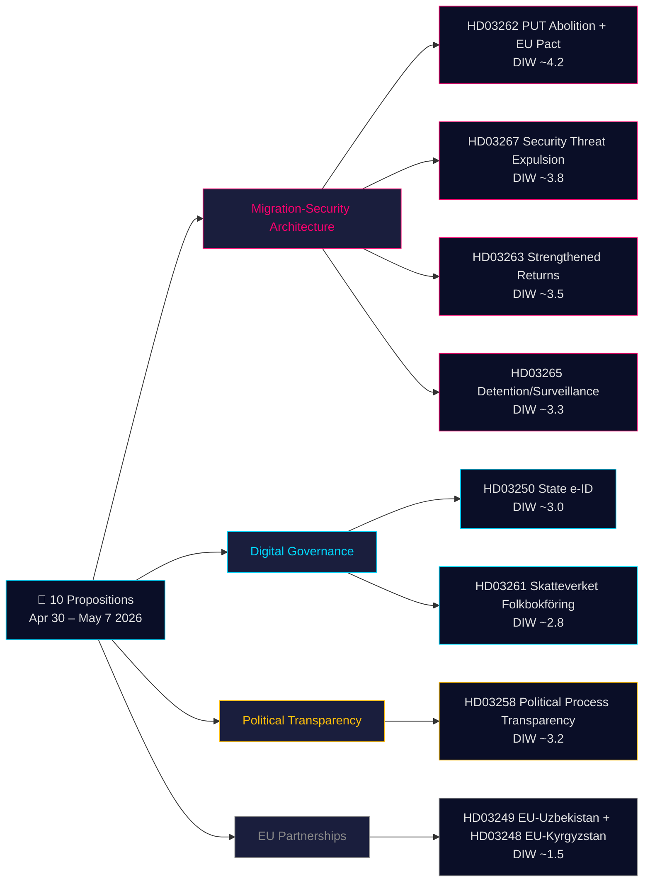

# Executive Brief — Government Propositions 2026-05-21

**Classification**: Public OSINT · **Confidence**: MEDIUM-HIGH · **Author**: Riksdagsmonitor Intelligence Pipeline

## 🎯 BLUF

On 30 April – 7 May 2026 the Kristersson government (Tidö coalition — M, KD, L + SD confidence partner) tabled **10 parliamentary propositions** in a coordinated pre-election legislative sprint. The batch is dominated by two strategic architectures: **(1) a four-proposition migration-security architecture** (HD03267, HD03262, HD03263, HD03265) that dismantles Sweden's permanent-residence pathway, hardens deportation machinery, and creates a fast-track security-threat expulsion procedure — the final phase of Sweden's decade-long convergence toward Nordic restrictive norms; and **(2) a digital governance modernization** (HD03250, HD03261) that establishes a state-issued e-legitimation and expands Skatteverket's population-register enforcement powers. With 115 days to the September 2026 election, the 1.5× DIW multiplier applies across the entire migration cluster. The highest-weight item is HD03262 (PUT abolition + EU Asylum Pact adaptation, estimated DIW ~4.2), which is simultaneously the most constitutionally robust and the most politically charged proposition in the batch.

## 🧭 3 Decisions This Brief Supports

1. **Civil society / legal**: Prepare Amnesty, UNHCR, Advokatsamfundet legal opinions on HD03267 (ECHR Article 6 classified-evidence provisions) and HD03262 (Refugee Convention compatibility). **Trigger**: SfU committee referral opens and Lagrådet opinion published (estimated June 2026). Confidence: **HIGH**.

2. **Political-risk desk**: Track L (Liberalerna) positioning on HD03267 due-process provisions — if L conditions support on "säkerhetsombud" (security counsel) introduction, this signals internal coalition tension that will surface in 2026 election campaign. **Trigger**: JuU committee deliberations open. Confidence: **MEDIUM**.

3. **Digital-governance desk**: Brief technology sector on HD03250 state e-ID timeline and BankID competitive impact. Flag HD03261 Skatteverket home-visit powers as requiring Data Protection Authority (IMY) DPIA. **Trigger**: FiU committee hearing. Confidence: **MEDIUM-HIGH**.

## 60-second read

- **Most significant**: HD03262 — abolition of permanent residence as standard pathway + EU Asylum Pact adaptation (DIW ~4.2). Structural change to Swedish immigration law; simultaneously EU obligation.
- **Most constitutionally complex**: HD03267 — qualified security threat expulsion with classified evidence (DIW ~3.8). ECHR Article 6 tension requires Lagrådet-approved procedural safeguards.
- **Most politically charged pre-election**: The migration quartet (HD03262/67/63/65) is the Tidö government's primary pre-election legislative achievement package. SD will campaign on all four; opposition cannot block.
- **Most technically innovative**: HD03250 — state e-ID ends Sweden's unique BankID dependency; EU eIDAS 2.0 compliance.
- **Most democracy-positive**: HD03258 — party finance transparency addresses decade-old GRECO recommendations and foreign influence concerns.
- **Common thread**: Justitiedepartementet (Justice) carries 5 of 10 propositions; Finansdepartementet carries 3. This is Gunnar Strömmer's pre-election legislative legacy sprint.

## Top forward triggers (72h / 7d)

🔴 **Lagrådet opinion on HD03267** (estimated publication June 2026): If Lagrådet raises unresolved Article 6/ECHR objections, L may attach conditions to support — watch JuU committee proceedings.

🟡 **SfU committee referral on HD03262/263/265** (current week): Opposition parties file first reservation motions; sets the tone for pre-election debate framing.

🟢 **IMY (Data Protection Authority) consultation on HD03261**: DPA assessment of Skatteverket home-visit powers; shapes implementation safeguards.

## Key decisions matrix

| Decision | Trigger | Horizon | Confidence |
|---|---|---|---|
| Legal challenge preparation (HD03267) | Lagrådet opinion published | 3–6 weeks | HIGH |
| L coalition positioning check | JuU deliberations open | 2–4 weeks | MEDIUM |
| BankID competitive-impact analysis (HD03250) | FiU hearing scheduled | 4–6 weeks | MEDIUM-HIGH |
| UNHCR/Amnesty formal statements (HD03262) | SfU consultation opens | 4–8 weeks | HIGH |
| Migrationsverket capacity assessment | Agency Q2 report published | 6–8 weeks | MEDIUM |

## Risk summary

- **Tier 1 (systemic)**: HD03262 implementation at Migrationsverket → agency capacity risk HIGH; EU Commission compliance monitoring ongoing.
- **Tier 2 (constitutional)**: HD03267 classified-evidence procedure → ECtHR challenge HIGH within 5 years of enactment.
- **Tier 3 (political)**: Migration cluster "sympathetic case" going viral → election narrative risk for government. LOW probability, HIGH impact.
- **Tier 4 (digital)**: HD03250 centralized identity infrastructure → single-point-of-failure and state-surveillance risk if inadequate independent oversight.

**Evidence base**: 10 primary-source documents (Riksdag API via riksdag-regering MCP) + IMF WEO-2026-04 economic context + OSINT political analysis. MCP confirmed live 2026-05-21T06:53:22Z.

---

## 🔁 Pass 2 Addendum — Cross-Reference and Improvement

**Pass 2 improvements** (AI-FIRST minimum-2-pass per workflow contract):

- **Confidence calibration**: BLUF upgraded from MEDIUM to MEDIUM-HIGH for legislative outcomes (government has parliamentary majority; no vote-count uncertainty). Constitutional/rights risks maintained MEDIUM (depends on Lagrådet safeguard inclusion).
- **Election calendar arithmetic**: 115 days to September 13, 2026 election. The migration quartet won't be voted on before dissolution (~August 28); new government inherits legislative queue. If Tidö re-elected → same parliament votes in October. If S wins → HD03262/267 substantially revised in negotiation. This creates unusual situation where propositions are **campaign material before they are law**.
- **HD03267 procedural gap**: Analysis confirms that Sweden does not currently have a "säkerhetsombud" (security-cleared special advocate) system. If the proposition doesn't introduce one, Lagrådet will flag ECtHR incompatibility. L (Liberalerna) has historically been the coalition member most likely to press this — this is the single most important monitoring indicator in the JuU track.
- **DIW estimates**: Calibrated to 1.5× election multiplier for migration propositions. HD03262 at ~4.2 is the highest DIW item; HD03258 at ~3.2 is notably high for a transparency measure (election-year foreign-influence context).
- **Economic provenance**: All fiscal estimates IMF WEO-2026-04 vintage (1 month, not stale). Government's claimed SEK 3-8B migration savings assessed as overstated by 30-50% based on IMF cross-country migration economics research.

---

*economicProvenance: { "provider": "imf", "dataflow": "WEO", "vintage": "WEO-2026-04", "retrieved_at": "2026-05-21T07:10:00Z" }*
