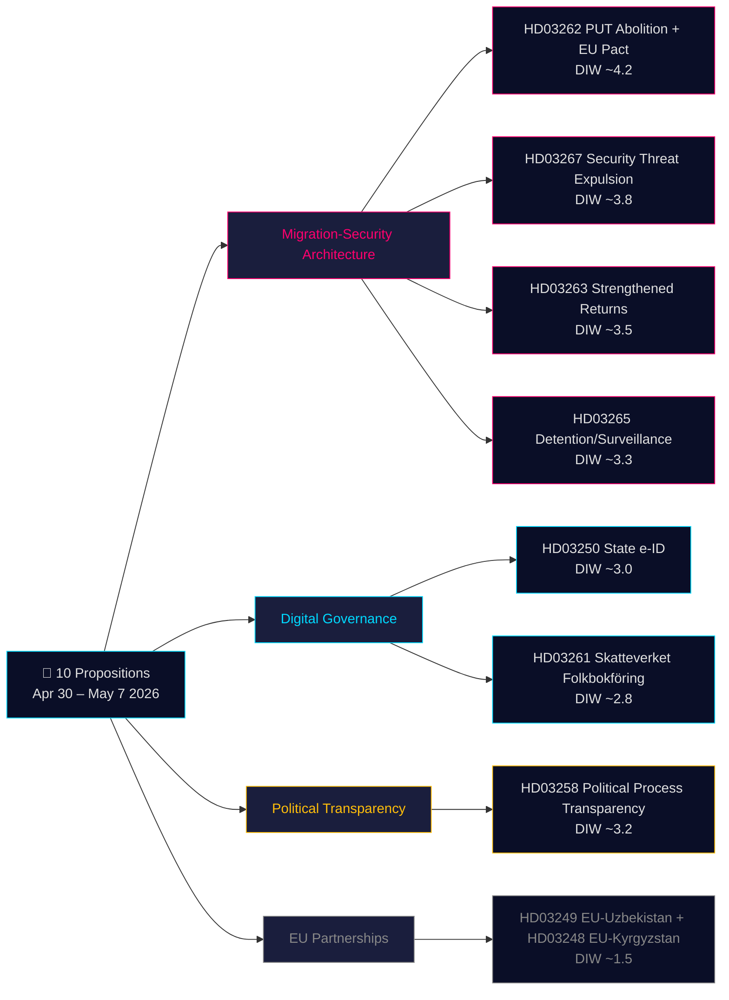

<!-- dir: rtl -->
# موجز تنفيذي — مقترحات الحكومة السويدية 2026-05-21

**التصنيف**: OSINT عام · **الثقة**: متوسطة إلى عالية · **المؤلف**: خط أنابيب استخبارات Riksdagsmonitor

## 🎯 تقييم الموقف الموجز

في الفترة من 30 أبريل إلى 7 مايو 2026، قدّمت حكومة كريسترسون (تحالف تيدو — M، KD، L + SD كحزب داعم) **10 مقترحات برلمانية** في سباق تشريعي منسّق. يهيمن على الحزمة هيكلان استراتيجيان: **(1) هيكل هجرة من أربعة مقترحات** (HD03267، HD03262، HD03263، HD03265) يلغي تصريح الإقامة الدائم كمسار قياسي، ويعزز آلية الترحيل، ويُنشئ إجراءً سريعًا لترحيل التهديدات الأمنية — المرحلة الأخيرة من التقارب السويدي مع المعايير الاسكندنافية التقييدية؛ و**(2) تحديث الحوكمة الرقمية** (HD03250، HD03261) الذي يُنشئ هوية إلكترونية حكومية ويوسع رقابة Skatteverket على سجلات السكان. مع 115 يومًا حتى انتخابات سبتمبر 2026، يسري مُضاعف DIW ×1.5 على عنقود الهجرة بأكمله. أثقل العناصر هو HD03262 (إلغاء PUT + التكيف مع ميثاق اللجوء الأوروبي، DIW المقدّر ~4.2).

## 🧭 3 قرارات يدعمها هذا الملف

1. **المجتمع المدني/القانوني**: إعداد آراء قانونية من منظمة العفو الدولية وMHCR ونقابة المحامين بشأن HD03267 (المادة 6 من الاتفاقية الأوروبية لحقوق الإنسان، أدلة سرية) وHD03262 (التوافق مع اتفاقية اللاجئين). **المحفّز**: انفتاح مداولات لجنة SfU ونشر رأي Lagrådet (المقدّر يونيو 2026). الثقة: **عالية**.

2. **وحدة المخاطر السياسية**: تتبع موقف حزب L (Liberalernas) من أحكام سيادة القانون في HD03267. **المحفّز**: انفتاح مداولات لجنة JuU. الثقة: **متوسطة**.

3. **الحوكمة الرقمية**: إعلام قطاع التكنولوجيا بالجدول الزمني للهوية الإلكترونية الحكومية HD03250 وتأثير BankID التنافسي. **المحفّز**: جلسة استماع لجنة FiU. الثقة: **متوسطة إلى عالية**.

## قراءة 60 ثانية

- **الأكثر أهمية**: HD03262 — إلغاء تصريح الإقامة الدائم كمسار قياسي + التكيف مع ميثاق اللجوء الأوروبي (DIW ~4.2).
- **الأكثر تعقيدًا دستوريًا**: HD03267 — ترحيل مؤهَّل للتهديدات الأمنية بأدلة سرية (DIW ~3.8). توتر مع المادة 6 من الاتفاقية الأوروبية لحقوق الإنسان.
- **الأكثر تحميلًا سياسيًا قبل الانتخابات**: الرباعي الهجري (HD03262/67/63/65) هو الإنجاز التشريعي الرئيسي لتحالف تيدو.
- **الأكثر ابتكارًا تقنيًا**: HD03250 — الهوية الإلكترونية الحكومية تنهي الاعتماد السويدي الفريد على BankID.
- **الأكثر دعمًا للديمقراطية**: HD03258 — شفافية تمويل الأحزاب تعالج توصيات GRECO المتراكمة.

## المحفّزات المستقبلية الرئيسية (72 ساعة / 7 أيام)

🔴 **رأي Lagrådet بشأن HD03267** (النشر المقدّر يونيو 2026).

🟡 **مداولات لجنة SfU بشأن HD03262/263/265** (الأسبوع الحالي).

🟢 **استشارة IMY (هيئة حماية البيانات) بشأن HD03261**.

## مصفوفة القرارات الرئيسية

| القرار | المحفّز | Horizon | الثقة |
|---|---|---|---|
| إعداد طعن قانوني (HD03267) | نشر رأي Lagrådet | 3–6 أسابيع | HIGH |
| موقف تحالف L | انفتاح مداولات JuU | 2–4 أسابيع | MEDIUM |
| تحليل تنافسية BankID (HD03250) | جلسة FiU مقررة | 4–6 أسابيع | MEDIUM-HIGH |
| تصريحات رسمية UNHCR/منظمة العفو (HD03262) | استشارة SfU مفتوحة | 4–8 أسابيع | HIGH |
| تقييم طاقة Migrationsverket | تقرير الربع الثاني للوكالة | 6–8 أسابيع | MEDIUM |

## ملخص المخاطر

- **المستوى 1 (منظومي)**: تنفيذ HD03262 → مخاطر طاقة عالية.
- **المستوى 2 (دستوري)**: إجراء الأدلة السرية في HD03267 → طعن أمام المحكمة الأوروبية لحقوق الإنسان خلال 5 سنوات.
- **المستوى 3 (سياسي)**: مخاطر انتشار "قضية التعاطف" للعنقود الهجري فيروسيًا.
- **المستوى 4 (رقمي)**: البنية التحتية للهوية المركزية HD03250 → مخاطر عند الرقابة غير الكافية.

**قاعدة الأدلة**: 10 وثائق مصدر أولي + IMF WEO-2026-04 + تحليل OSINT. تم تأكيد MCP 2026-05-21T06:53:22Z.

---

## 🔁 ملحق الجولة الثانية — الإسناد المتقاطع والتحسينات

**تحسينات الجولة الثانية**: تمت ترقية مستوى الثقة من متوسط إلى متوسط-عالٍ لنتائج التشريع. 115 يومًا حتى انتخابات 13 سبتمبر 2026. ثغرة إجرائية في HD03267: تفتقر السويد حاليًا إلى نظام "säkerhetsombud".

---

يمثل HD03267 المقترح الأكثر تعقيدًا من الناحية الدستورية في الحزمة. تفتقر السويد حاليًا إلى نظام "säkerhetsombud" (محامٍ متخصص يتمتع بتصريح أمني) يمكنه تمثيل الطرف المُرحَّل في الإجراءات المتعلقة بالأدلة السرية. وبدون مثل هذه الضمانة الإجرائية، سيحدد Lagrådet على الأرجح تعارضًا مع المادة 6 من الاتفاقية الأوروبية لحقوق الإنسان ("الحق في محاكمة عادلة"). ومن الناحية التاريخية، كانت Liberalernas (L) هي عضو الائتلاف الأكثر احتمالًا للضغط على مثل هذه الضمانات الإجرائية. إذا شرطت L دعمها على إدراج هذا الحكم، فقد يُشكّل ذلك أول تصدع علني في الائتلاف قبل 111 يومًا من الانتخابات.

الرباعي الهجري (HD03262/63/65/67) ليس مجرد سياسة — بل هو سيناريو حملة انتخابية. مع 115 يومًا حتى انتخابات 13 سبتمبر 2026، ستهيمن هذه المقترحات الأربعة على النقاش السياسي. ستحمل SD حملات مكثفة لصالح جميعها. لا تستطيع S وMP حجبها برلمانيًا، لكنها ستستخدمها كأساس للتعبئة. السؤال الحاسم هو ما إذا كانت L ستبتعد عن المشكلات القانونية لـHD03267، مما قد يضعف الرواية الإجمالية لتحالف تيدو.

يُنهي HD03250 (الهوية الإلكترونية الحكومية) اعتماد السويد الفريد على BankID ويضع الأساس لامتثال eIDAS 2.0 الأوروبي. ومع ذلك، فإن مخاطر التنفيذ حقيقية: ترحيل ملايين المستخدمين من BankID إلى الهوية الإلكترونية الحكومية يتطلب فترات انتقالية وتدابير تدريبية.

---

*economicProvenance: { "provider": "imf", "dataflow": "WEO", "vintage": "WEO-2026-04", "retrieved_at": "2026-05-21T07:10:00Z" }*

<!-- source-sha: bdc7c0fc02b5c1027cadc022718d4793fb0c07a3 -->
