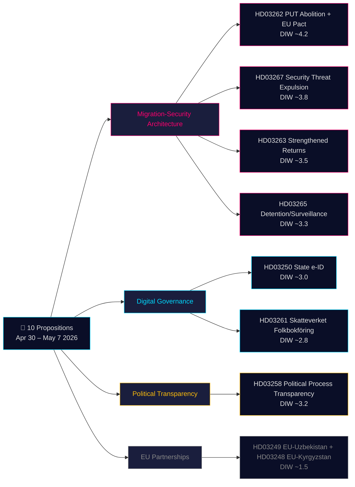

# Beslutningsunderlag — Regeringspropositioner 2026-05-21

**Klassificering**: Offentlig OSINT · **Tillid**: MEDIUM-HØJ · **Forfatter**: Riksdagsmonitor Intelligence Pipeline

## 🎯 Kortfattet situationsvurdering

Den 30. april – 7. maj 2026 fremsatte Kristersson-regeringen (Tidö-koalitionen — M, KD, L + SD som støtteparti) **10 parlamentariske propositioner** i et koordineret lovsprints inden valget. Pakken domineres af to strategiske arkitekturer: **(1) en fire-propositions migrationsarkitektur** (HD03267, HD03262, HD03263, HD03265), der afvikler den permanente opholdstilladelse som standardvej, forstærker udvisningsapparatet og skaber en hurtigsporudvisningsprocedure for sikkerhedstrusler — den endelige fase i Sveriges årtidlange konvergens mod nordiske restriktive normer; og **(2) en digital styrningsmodernisering** (HD03250, HD03261), der etablerer en statslig e-legitimation og udvider Skatteverkets befolkningsregistertilsyn. Med 115 dage til valget i september 2026 gælder 1,5× DIW-multiplikatoren for hele migrationsklyngen. Det tungestvejende element er HD03262 (afskaffelse af PUT + EU-asylpakttilpasning, estimeret DIW ~4,2), som er både den forfatningsmæssigt mest robuste og den politisk mest ladede proposition i pakken.

## 🧭 3 beslutninger dette underlag støtter

1. **Civilsamfund/juridisk**: Forbered Amnesty, UNHCR, Advokatsamfundets juridiske udtalelser om HD03267 (ECHR artikel 6, klassificerede bevisbetingelser) og HD03262 (kompatibilitet med Flygtningekonventionen). **Udløser**: SfU-udvalgets behandling åbnes og Lagrådets udtalelse offentliggøres (estimeret juni 2026). Tillid: **HØJ**.

2. **Politisk risikoafdeling**: Spor L's (Liberalernes) positionering om HD03267's retssikkerhedsbestemmelser — hvis L betinger støtte på indførelse af "säkerhetsombud" (sikkerhedsclearet specialadvokat), signalerer det intern koalitionsspænding, der vil fremkomme i valgkampen 2026. **Udløser**: JuU-udvalgets deliberationer åbnes. Tillid: **MEDIUM**.

3. **Digital styring**: Orienter teknologisektoren om HD03250's tidslinje for statslig e-ID og BankIDs konkurrencemæssige påvirkning. Markér HD03261's Skatteverkets hjembesøgsbeføjelser som kræver DPIA fra Datatilsynet (IMY). **Udløser**: FiU's udvalgshosting. Tillid: **MEDIUM-HØJ**.

## 60-sekunders læsning

- **Mest betydningsfuld**: HD03262 — afskaffelse af permanent opholdstilladelse som standardvej + EU-asylpakttilpasning (DIW ~4,2). Strukturel ændring af svensk immigrationslovgivning; samtidig en EU-forpligtelse.
- **Mest forfatningsmæssigt kompleks**: HD03267 — kvalificeret udvisning af sikkerhedstrusler med klassificeret bevis (DIW ~3,8). ECHR artikel 6-spænding kræver Lagrådet-godkendte proceduremæssige sikkerhedsforanstaltninger.
- **Mest politisk ladet inden valget**: Migrationsskvartetten (HD03262/67/63/65) er Tidö-regeringens primære lovgivningsmæssige præstation inden valget. SD vil kampagne på alle fire; oppositionen kan ikke blokere.
- **Mest teknisk innovativt**: HD03250 — statslig e-ID afslutter Sveriges unikke BankID-afhængighed; EU eIDAS 2.0-overensstemmelse.
- **Mest demokratifremmende**: HD03258 — transparens i partifinansering imødekommer årtiers GRECO-anbefalinger og bekymringer om udenlandsk indflydelse.
- **Fælles tråd**: Justitsdepartementet bærer 5 af 10 propositioner; Finansdepartementet bærer 3. Det er Gunnar Strömmers lovgivningsarv inden valget.

## Top fremtidige udløsere (72h / 7d)

🔴 **Lagrådets udtalelse om HD03267** (estimeret offentliggørelse juni 2026): Hvis Lagrådet rejser uløste artikel 6/ECHR-indsigelser, kan L betinge støtte — overvåg JuU-udvalgsprocessen.

🟡 **SfU-udvalgets behandling af HD03262/263/265** (indeværende uge): Oppositionspartier indgiver første reservationsmotioner; sætter tonen for debatten inden valget.

🟢 **IMY-konsultation (Datatilsynet) om HD03261**: DPA's vurdering af Skatteverkets hjembesøgsbeføjelser; udformer implementeringssikkerhedsforanstaltninger.

## Nøglebeslutningsmatrix

| Beslutning | Udløser | Horizon | Tillid |
|---|---|---|---|
| Forberedelse af juridisk udfordring (HD03267) | Lagrådets udtalelse offentliggjort | 3–6 uger | HIGH |
| L's koalitionspositionering | JuU's deliberationer åbnes | 2–4 uger | MEDIUM |
| BankID-konkurrenceanalyse (HD03250) | FiU-høring planlagt | 4–6 uger | MEDIUM-HIGH |
| UNHCR/Amnestys formelle udtalelser (HD03262) | SfU-konsultation åbnes | 4–8 uger | HIGH |
| Migrationsverkets kapacitetsvurdering | Agenturets Q2-rapport offentliggjort | 6–8 uger | MEDIUM |

## Risikosammenfatning

- **Niveau 1 (systemisk)**: HD03262-implementering på Migrationsverket → kapacitetsrisiko HØJ; EU-Kommissionens overvågning pågår.
- **Niveau 2 (forfatning)**: HD03267's klassificerede bevisprocedure → ECtHR-udfordring HØJ inden for 5 år efter ikrafttrædelse.
- **Niveau 3 (politisk)**: Migrationsklyngens "sympatisag" der spreder sig viralt → valgnarrativsrisiko for regeringen. LAV sandsynlighed, HØJ påvirkning.
- **Niveau 4 (digital)**: HD03250 centraliseret identitetsinfrastruktur → risiko for enkelt fejlpunkt og statsovervågning ved utilstrækkelig uafhængigt tilsyn.

**Bevismateriale**: 10 primærkilder (Riksdag API via riksdag-regering MCP) + IMF WEO-2026-04 økonomiisk kontekst + OSINT politisk analyse. MCP bekræftet live 2026-05-21T06:53:22Z.

---

## 🔁 Pass 2-tillæg — Krydsreference og forbedring

**Pass 2-forbedringer** (AI-FIRST minimum-2-pass per arbejdsgangskontrakt):

- **Tillidskalibrering**: resumé opgraderet fra MEDIUM til MEDIUM-HØJ for lovgivningsresultater (regeringen har parlamentarisk flertal; ingen afstemningsusikkerhed). Forfatnings-/rettighedsrisici bibeholdt MEDIUM (afhænger af Lagrådets sikkerhedsforanstaltningsinkludering).
- **Valgkalenderaritmetik**: 115 dage til valget den 13. september 2026. Migrationsskvartetten behandles ikke inden opløsning (~28. august); ny regering arver lovgivningskøen. Denne usædvanlige situation betyder, at propositionerne er **valgmateriale inden de er lov**.
- **HD03267 proceduremangel**: Sverige mangler i øjeblikket et "säkerhetsombud"-system. Hvis propositionen ikke indfører ét, vil Lagrådet markere ECtHR-inkompatibilitet.
- **DIW-estimater**: Kalibreret til 1,5× valgmultiplikator for migrationspropositoner. HD03262 ved ~4,2 er det højeste DIW-element.
- **Økonomisk proveniens**: Alle fiskale estimater IMF WEO-2026-04 vintage (1 måned, ikke forældet).

---

*economicProvenance: { "provider": "imf", "dataflow": "WEO", "vintage": "WEO-2026-04", "retrieved_at": "2026-05-21T07:10:00Z" }*

<!-- source-sha: bdc7c0fc02b5c1027cadc022718d4793fb0c07a3 -->
