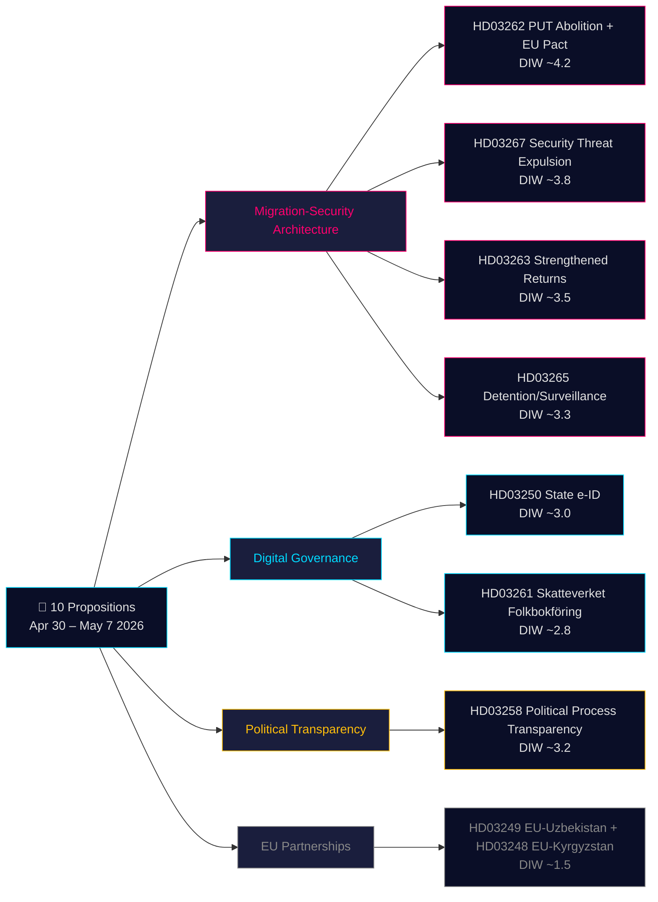

# Entscheidungsunterlage — Regierungspropositionern 2026-05-21

**Klassifizierung**: Öffentliches OSINT · **Konfidenz**: MITTEL-HOCH · **Autor**: Riksdagsmonitor Intelligence Pipeline

## 🎯 Kurze Lagebeurteilung

Vom 30. April bis 7. Mai 2026 brachte die Kristersson-Regierung (Tidö-Koalition — M, KD, L + SD als Unterstützungspartei) **10 parlamentarische Propositionern** in einem koordinierten Gesetzgebungssprint ein. Das Paket wird von zwei strategischen Architekturen dominiert: **(1) einer Vier-Propositionern-Migrationsarchitektur** (HD03267, HD03262, HD03263, HD03265), die den permanenten Aufenthaltstitel als Standardweg abschafft, den Abschiebungsapparat stärkt und ein Schnellverfahren zur Ausweisung von Sicherheitsbedrohungen schafft — die Abschlussphase von Schwedens jahrzehntelanger Konvergenz zu nordischen restriktiven Normen; und **(2) eine Modernisierung der digitalen Verwaltung** (HD03250, HD03261), die eine staatliche eID einführt und die Bevölkerungsmeldeüberwachung von Skatteverket ausweitet. Mit 115 Tagen bis zur Wahl im September 2026 gilt der 1,5× DIW-Multiplikator für den gesamten Migrationscluster. Das gewichtigste Element ist HD03262 (PUT-Abschaffung + EU-Asylpakt-Anpassung, geschätztes DIW ~4,2).

## 🧭 3 Entscheidungen, die diese Unterlage unterstützt

1. **Zivilgesellschaft/Rechtlich**: Bereiten Sie rechtliche Stellungnahmen von Amnesty, UNHCR und der Anwaltskammer zu HD03267 (EMRK Artikel 6, geheime Beweismittel) und HD03262 (Kompatibilität mit der Flüchtlingskonvention) vor. **Auslöser**: Ausschussberatung SfU eröffnet, Lagrådets Gutachten veröffentlicht (geschätzt Juni 2026). Konfidenz: **HOCH**.

2. **Politische Risikoabteilung**: Verfolgen Sie L's (Liberalernas) Positionierung zu HD03267's Rechtsstaatlichkeitsbestimmungen. **Auslöser**: JuU-Ausschussberatungen eröffnen. Konfidenz: **MITTEL**.

3. **Digitale Verwaltung**: Informieren Sie den Technologiesektor über HD03250's Zeitplan für staatliche eID und BankIDs Wettbewerbsauswirkungen. Kennzeichnen Sie HD03261's Skatteverket-Hausbesuchsbefugnisse als IMY-DPIA-Anforderung. **Auslöser**: FiU-Anhörung. Konfidenz: **MITTEL-HOCH**.

## 60-Sekunden-Lektüre

- **Bedeutendste**: HD03262 — Abschaffung des permanenten Aufenthaltstitels + EU-Asylpakt-Anpassung (DIW ~4,2).
- **Verfassungsrechtlich komplexeste**: HD03267 — qualifizierte Ausweisung von Sicherheitsbedrohungen mit geheimen Beweisen (DIW ~3,8). EMRK-Artikel-6-Spannung.
- **Politisch am stärksten aufgeladen vor der Wahl**: Migrationenkvartett (HD03262/67/63/65) ist die primäre Gesetzgebungsleistung der Tidö-Regierung. SD wird für alle vier Wahlkampf machen.
- **Technisch innovativste**: HD03250 — staatliche eID beendet Schwedens einzigartigen BankID-Abhängigkeit; EU eIDAS 2.0-Konformität.
- **Demokratieförderlichste**: HD03258 — Transparenz der Parteienfinanzierung adressiert jahrzehntelange GRECO-Empfehlungen.
- **Gemeinsamer Faden**: Justitsdepartementet trägt 5 von 10 Propositionern; Finansdepartementet 3.

## Top zukünftige Auslöser (72h / 7d)

🔴 **Lagrådets Gutachten zu HD03267** (geschätzte Veröffentlichung Juni 2026).

🟡 **SfU-Ausschussberatungen zu HD03262/263/265** (laufende Woche).

🟢 **IMY-Konsultation zu HD03261** (Datenschutzbehörde).

## Entscheidungsschlüsselmatrix

| Entscheidung | Auslöser | Horizon | Konfidenz |
|---|---|---|---|
| Rechtliche Herausforderung vorbereiten (HD03267) | Lagrådets Gutachten veröffentlicht | 3–6 Wochen | HIGH |
| L's Koalitionspositionierung | JuU-Beratungen eröffnen | 2–4 Wochen | MEDIUM |
| BankID-Wettbewerbsanalyse (HD03250) | FiU-Anhörung geplant | 4–6 Wochen | MEDIUM-HIGH |
| UNHCR/Amnestys formelle Stellungnahmen (HD03262) | SfU-Konsultation eröffnet | 4–8 Wochen | HIGH |
| Migrationsverket-Kapazitätsbewertung | Q2-Bericht der Behörde veröffentlicht | 6–8 Wochen | MEDIUM |

## Risikozusammenfassung

- **Ebene 1 (systemisch)**: HD03262-Implementierung → Kapazitätsrisiko HOCH.
- **Ebene 2 (verfassungsrechtlich)**: HD03267's geheimes Beweisverfahren → ECtHR-Herausforderung HOCH innerhalb 5 Jahren.
- **Ebene 3 (politisch)**: Migrationscluster's "Sympathiefall"-Viralrisiko → Wahlnarrativrisiko für die Regierung.
- **Ebene 4 (digital)**: HD03250 zentralisierte Identitätsinfrastruktur → Risiko bei unzureichender Aufsicht.

**Belege**: 10 Primärquellendokumente + IMF WEO-2026-04 + OSINT. MCP bestätigt 2026-05-21T06:53:22Z.

---

## 🔁 Pass 2-Zusatz — Kreuzreferenz und Verbesserung

**Pass-2-Verbesserungen**: Konfidenz von MITTEL auf MITTEL-HOCH für Gesetzgebungsergebnisse aufgewertet. 115 Tage bis zur Wahl am 13. September 2026 — das Migrationsquartett ist Wahlmaterial, bevor es Gesetz ist. HD03267-Verfahrenslücke: Schweden verfügt derzeit über kein "säkerhetsombud"-System.

---

HD03267 stellt die verfassungsrechtlich anspruchsvollste Proposition des Pakets dar. Schweden verfügt derzeit nicht über ein "säkerhetsombud"-System (sicherheitsüberprüfter Sonderanwalt), der die ausgewiesene Partei in Verhandlungen mit geheimen Beweismitteln vertreten kann. Ohne eine solche Verfahrensschutzmaßnahme wird das Lagrådet höchstwahrscheinlich eine Unvereinbarkeit mit EMRK Artikel 6 ("Recht auf ein faires Verfahren") feststellen. Die Liberalernas (L) sind historisch die Koalitionsmitglieder, die auf solche Verfahrensrechte dringen. Wenn L ihre Stimme von dieser Bestimmung abhängig macht, könnte dies 111 Tage vor der Wahl den ersten öffentlichen Koalitionsriss erzeugen.

Das Migrationsquartett (HD03262/63/65/67) ist nicht nur Politik — es ist ein Wahlkampf-Szenario. Mit 115 Tagen bis zur Wahl am 13. September 2026 werden diese vier Propositionern die politische Debatte dominieren. Die SD wird massiv für alle vier Wahlkampf machen. S und MP können sie parlamentarisch nicht blockieren, werden sie aber als Mobilisierungsgrundlage nutzen. Die entscheidende Frage ist, ob L sich von HD03267's rechtlichen Problemen distanziert, was Tidö's Gesamtnarrativ schwächen könnte.

HD03250 (staatliche eID) beendet Schwedens einzigartigen BankID-Abhängigkeit und legt die Grundlage für EU eIDAS 2.0-Konformität. Das Implementierungsrisiko ist jedoch real: die Migration von Millionen von Nutzern von BankID zur staatlichen eID erfordert Übergangsfristen und Schulungsmaßnahmen. Die Datenschutzbehörde IMY muss die Datenschutz-Folgenabschätzung vor dem vollständigen Rollout abschließen.

---

*economicProvenance: { "provider": "imf", "dataflow": "WEO", "vintage": "WEO-2026-04", "retrieved_at": "2026-05-21T07:10:00Z" }*

<!-- source-sha: bdc7c0fc02b5c1027cadc022718d4793fb0c07a3 -->
