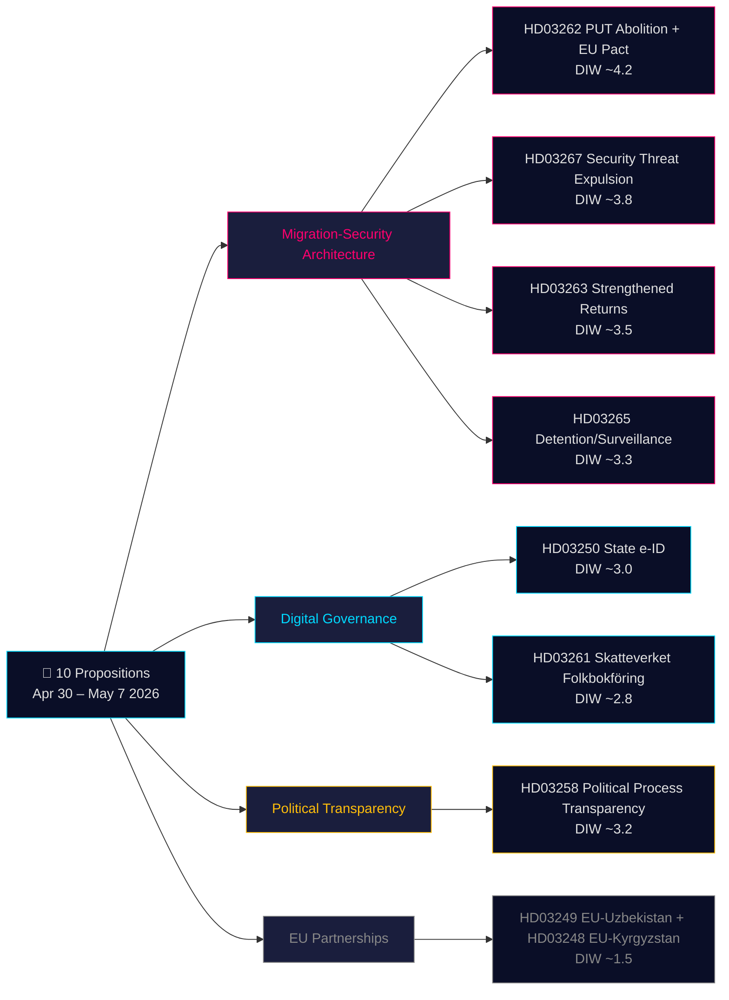

# Nota de análisis decisional — Proposiciones gubernamentales 2026-05-21

**Clasificación**: OSINT público · **Confianza**: MEDIO-ALTO · **Autor**: Riksdagsmonitor Intelligence Pipeline

## 🎯 Evaluación de situación sintética

Del 30 de abril al 7 de mayo de 2026, el gobierno Kristersson (coalición Tidö — M, KD, L + SD como apoyo parlamentario) presentó **10 proposiciones parlamentarias** en un sprint legislativo coordinado. El paquete está dominado por dos arquitecturas estratégicas: **(1) una arquitectura migratoria de cuatro proposiciones** (HD03267, HD03262, HD03263, HD03265) que abolye el permiso de residencia permanente como vía estándar, refuerza el aparato de expulsión y crea un procedimiento de expulsión acelerada para amenazas a la seguridad — la fase final de la convergencia sueca de décadas hacia normas nórdicas restrictivas; y **(2) una modernización de la gobernanza digital** (HD03250, HD03261) que establece una eID estatal y amplía la supervisión del registro de población por parte de Skatteverket. Con 115 días para las elecciones de septiembre de 2026, el multiplicador 1,5× DIW se aplica a todo el clúster migratorio. El elemento de mayor peso es HD03262 (abolición del PUT + adaptación al Pacto de Asilo de la UE, DIW estimado ~4,2).

## 🧭 3 decisiones que esta nota apoya

1. **Sociedad civil/jurídico**: Preparar dictámenes jurídicos de Amnistía Internacional, ACNUR y el Colegio de Abogados sobre HD03267 (CEDH artículo 6, pruebas clasificadas) y HD03262 (compatibilidad con la Convención de Refugiados). **Desencadenante**: Apertura de las deliberaciones del comité SfU y publicación del dictamen del Lagrådet (estimado junio 2026). Confianza: **ALTA**.

2. **Unidad de riesgo político**: Rastrear el posicionamiento de L (Liberalernas) sobre las disposiciones de seguridad jurídica de HD03267. **Desencadenante**: Apertura de las deliberaciones del comité JuU. Confianza: **MEDIA**.

3. **Gobernanza digital**: Informar al sector tecnológico sobre el calendario de la eID estatal HD03250 y el impacto competitivo de BankID. Marcar las competencias de visita domiciliaria de Skatteverket en HD03261 como requisito de EIPD del IMY. **Desencadenante**: Audiencia del comité FiU. Confianza: **MEDIO-ALTA**.

## Lectura de 60 segundos

- **Más significativa**: HD03262 — abolición del permiso de residencia permanente como vía estándar + adaptación al Pacto de Asilo de la UE (DIW ~4,2).
- **Más compleja constitucionalmente**: HD03267 — expulsión calificada de amenazas a la seguridad con pruebas clasificadas (DIW ~3,8). Tensión con el artículo 6 del CEDH.
- **Más cargada políticamente antes de las elecciones**: El cuarteto migratorio (HD03262/67/63/65) es el logro legislativo primario de la coalición Tidö.
- **Más innovadora técnicamente**: HD03250 — la eID estatal pone fin a la dependencia sueca única de BankID; conformidad con eIDAS 2.0 de la UE.
- **Más favorable a la democracia**: HD03258 — la transparencia del financiamiento de partidos aborda recomendaciones GRECO de larga data.
- **Hilo conductor**: Justitsdepartementet lleva 5 de las 10 proposiciones; Finansdepartementet lleva 3.

## Principales desencadenantes futuros (72h / 7d)

🔴 **Dictamen del Lagrådet sobre HD03267** (publicación estimada junio 2026).

🟡 **Deliberaciones del comité SfU sobre HD03262/263/265** (semana en curso).

🟢 **Consulta del IMY (autoridad de protección de datos) sobre HD03261**.

## Matriz de decisiones clave

| Decisión | Desencadenante | Horizon | Confianza |
|---|---|---|---|
| Preparación de impugnación jurídica (HD03267) | Dictamen del Lagrådet publicado | 3–6 semanas | HIGH |
| Posicionamiento de coalición de L | Deliberaciones JuU abiertas | 2–4 semanas | MEDIUM |
| Análisis competitivo de BankID (HD03250) | Audiencia FiU programada | 4–6 semanas | MEDIUM-HIGH |
| Declaraciones formales ACNUR/Amnistía (HD03262) | Consulta SfU abierta | 4–8 semanas | HIGH |
| Evaluación de capacidad Migrationsverket | Informe T2 de la agencia publicado | 6–8 semanas | MEDIUM |

## Resumen de riesgos

- **Nivel 1 (sistémico)**: Implementación de HD03262 → riesgo de capacidad ALTO.
- **Nivel 2 (constitucional)**: Procedimiento de pruebas clasificadas de HD03267 → impugnación ante el TEDH ALTA dentro de 5 años.
- **Nivel 3 (político)**: Riesgo viral de "caso de simpatía" del clúster migratorio → riesgo narrativo electoral para el gobierno.
- **Nivel 4 (digital)**: Infraestructura de identidad centralizada HD03250 → riesgo con supervisión insuficiente.

**Base probatoria**: 10 documentos fuente primarios + IMF WEO-2026-04 + análisis OSINT. MCP confirmado 2026-05-21T06:53:22Z.

---

## 🔁 Adenda Pasada 2 — Referencias cruzadas y mejoras

**Mejoras Pasada 2**: Confianza revisada de MEDIO a MEDIO-ALTO para resultados legislativos. 115 días hasta las elecciones del 13 de septiembre de 2026 — el cuarteto migratorio es material electoral antes de ser ley. Brecha procedimental HD03267: Suecia carece actualmente de un sistema de "säkerhetsombud".

---

*economicProvenance: { "provider": "imf", "dataflow": "WEO", "vintage": "WEO-2026-04", "retrieved_at": "2026-05-21T07:10:00Z" }*

<!-- source-sha: bdc7c0fc02b5c1027cadc022718d4793fb0c07a3 -->
