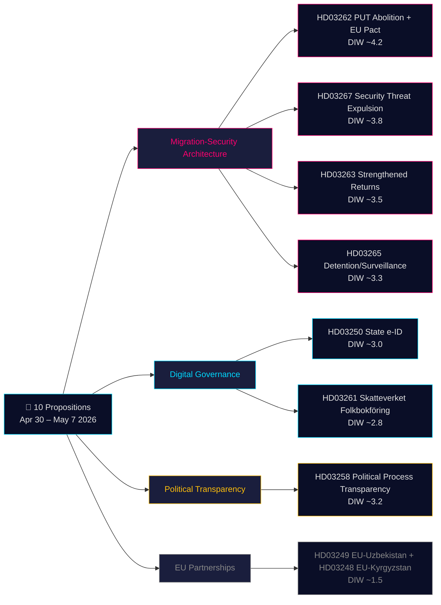

# Päätösanalyysi — hallituksen esitykset 2026-05-21

**Luokitus**: Julkinen OSINT · **Varmuus**: MEDIUM-KORKEA · **Tekijä**: Riksdagsmonitor Intelligence Pipeline

## 🎯 Lyhyt tilannekatsaus

30. huhtikuuta – 7. toukokuuta 2026 Kristersson-hallitus (Tidö-koalitio — M, KD, L + SD tukipuolueena) esitti **10 parlamentaarista esitystä** koordinoidussa lainsäädäntösprintissä ennen vaaleja. Pakettia hallitsevat kaksi strategista arkkitehtuuria: **(1) neljän esityksen maahanmuuttoarkkitehtuuri** (HD03267, HD03262, HD03263, HD03265), joka purkaa pysyvän oleskeluluvan vakioreittinä, vahvistaa käännytyskoneistoa ja luo pikakaistan turvallisuusuhkien karkottamiselle — Ruotsin vuosikymmenen mittaisen lähentymisen pohjoismaisia rajoittavia normeja kohti viimeinen vaihe; ja **(2) digitaalisen hallinnon modernisaatio** (HD03250, HD03261), joka perustaa valtiollisen sähköisen henkilöllisyystodistuksen ja laajentaa Skatteverketin väestörekisteriä koskevia valvontavaltuuksia. Syyskuun 2026 vaaleihin on 115 päivää; koko maahanmuuttoklusteri soveltaa 1,5× DIW-kerrointa. Suuripainoisin kohta on HD03262 (PUT:n lakkauttaminen + EU:n turvapaikkapaktin sovitus, arvioitu DIW ~4,2).

## 🧭 3 päätöstä, joita tämä analyysi tukee

1. **Kansalaisyhteiskunta/oikeudellinen**: Valmistele Amnestyn, UNHCR:n ja Asianajajaliton oikeudelliset lausunnot HD03267:stä (ECHR 6 artikla, salainen todistusaineisto) ja HD03262:sta (yhteensopivuus pakolaissopimuksen kanssa). **Käynnistin**: SfU:n valiokuntakäsittely avautuu ja Lagrådets-lausunto julkaistaan (arvioitu kesäkuu 2026). Varmuus: **KORKEA**.

2. **Poliittinen riskitiimi**: Seuraa L:n (Liberalernas) asemoitumista HD03267:n oikeusturvamääräyksissä. **Käynnistin**: JuU:n käsittelykokous avautuu. Varmuus: **MEDIUM**.

3. **Digitaalinen hallinto**: Informoi teknologiasektoria HD03250:n aikataulusta ja BankID:n kilpailuvaikutuksesta. Merkitse HD03261:n Skatteverketin kotikäyntivaltuudet IMY:n DPIA-arvioinnin kohteeksi. **Käynnistin**: FiU:n kuuleminen. Varmuus: **MEDIUM-KORKEA**.

## 60 sekunnin tiivistelmä

- **Merkittävin**: HD03262 — pysyvän oleskeluluvan vakioreitin lakkauttaminen + EU:n turvapaikkapaktin sovitus (DIW ~4,2).
- **Perustuslaillisesti monimutkaisin**: HD03267 — turvallisuusuhan karkottaminen salaisella todisteella (DIW ~3,8). ECHR 6 artiklan jännite.
- **Poliittisesti latautunein ennen vaaleja**: Maahanmuuttokvartetti (HD03262/67/63/65) on Tidö-hallituksen ensisijainen vaalisaavutus.
- **Teknisesti innovatiivisin**: HD03250 — valtiollinen sähköinen henkilöllisyystodistus päättää Ruotsin ainutlaatuisen BankID-riippuvuuden.
- **Demokratiaselle myönteisin**: HD03258 — puolueiden rahoituksen avoimuus vastaa vuosikymmenen GRECO-suosituksiin.
- **Yhteinen lanka**: Oikeusministeriö kantaa 5/10 esityksistä; Valtiovarainministeriö 3.

## Tärkeimmät tulevat käynnistimet (72h / 7d)

🔴 **Lagrådets-lausunto HD03267:stä** (arvioitu julkaisu kesäkuu 2026).

🟡 **SfU:n HD03262/263/265-valiokuntakäsittely** (kuluva viikko).

🟢 **IMY:n (tietosuojaviranomainen) konsultaatio HD03261:stä**.

## Keskeisten päätösten matriisi

| Päätös | Käynnistin | Horizon | Varmuus |
|---|---|---|---|
| Oikeudellisen haasteen valmistelu (HD03267) | Lagrådets-lausunto julkaistu | 3–6 viikkoa | HIGH |
| L:n koalitioasemoituminen | JuU:n käsittelykokoukset avautuvat | 2–4 viikkoa | MEDIUM |
| BankID:n kilpailuvaikutusanalyysi (HD03250) | FiU:n kuuleminen suunniteltu | 4–6 viikkoa | MEDIUM-HIGH |
| UNHCR:n/Amnestyn viralliset lausunnot (HD03262) | SfU:n konsultaatio avautuu | 4–8 viikkoa | HIGH |
| Migrationsverketin kapasiteettiarvio | Viraston Q2-raportti julkaistu | 6–8 viikkoa | MEDIUM |

## Riskiyhteenveto

- **Taso 1 (systeeminen)**: HD03262:n toteutus Migrationsverketissä → kapasiteettiriski KORKEA.
- **Taso 2 (perustuslaillinen)**: HD03267:n salainen todistusmenettely → ECtHR-haaste KORKEA 5 vuoden kuluessa.
- **Taso 3 (poliittinen)**: Maahanmuuttoklusterin "sympatiatapauksen" viraalileviäminen → vaalinarratiivin riski hallitukselle.
- **Taso 4 (digitaalinen)**: HD03250:n keskitetty identiteettiinfrastruktuuri → riski yhden vikapisteen ja valtion valvonnan suhteen.

**Todistuspohja**: 10 primäärilähteen asiakirjaa + IMF WEO-2026-04 + OSINT. MCP vahvistettu 2026-05-21T06:53:22Z.

---

## 🔁 Pass 2 -lisäys — Ristiinviite ja parannus

**Pass 2 -parannukset**: Varmuus päivitetty MEDIUM:sta MEDIUM-KORKEAKSI lainsäädäntötuloksille. 115 päivää vaaleihin 13. syyskuuta 2026 — maahanmuuttokvartetti on vaalimateriaalia ennen kuin se on lakia. HD03267 menettelyvaje: Ruotsilla ei tällä hetkellä ole "säkerhetsombud"-järjestelmää.

---

HD03267 edustaa paketin perustuslaillisesti vaativinta esitystä. Ruotsilla ei tällä hetkellä ole "säkerhetsombud"-järjestelmää (turvallisuusselvitetty erikoissyyttäjä), joka voisi edustaa karkotettua osapuolta salaisten todisteisiin perustuvissa menettelyissä. Ilman tällaista menettelyllistä suojarakennetta Lagrådet todennäköisesti tunnistaa yhteensopimattomuuden ECHR 6 artiklan ("oikeus oikeudenmukaiseen oikeudenkäyntiin") kanssa. Liberalernas (L) on historiallisesti ollut koalition jäsen, joka painostaa menettelyoikeussuojia. Jos L ehdollistaa äänensä tähän säädökseen, se voi muodostaa ensimmäisen julkisen koalition halkeaman 111 päivää ennen vaalia.

Maahanmuuttokvartetti (HD03262/63/65/67) on paitsi politiikkaa, myös vaaliskenaario. 115 päivää ennen 13. syyskuuta 2026 vaalia nämä neljä esitystä tulevat hallitsemaan poliittista keskustelua. SD kampanjoi voimakkaasti kaikista neljästä. S ja MP eivät voi estää niitä parlamentaarisesti, mutta käyttävät niitä mobilisaatiopohjana. Kriittinen kysymys on, etääntyykö L HD03267:n oikeudellisista ongelmista, mikä voisi heikentää Tidö-hallituksen kokonaisnarratiivaa.

HD03250 (valtiollinen sähköinen henkilöllisyystodistus) päättää Ruotsin ainutlaatuisen BankID-riippuvuuden ja luo perustan EU eIDAS 2.0 -vaatimustenmukaisuudelle. Tämä edustaa merkittävää digitaalisen infrastruktuurin modernisaatiota. Toteutusriski on kuitenkin todellinen: miljoonien käyttäjien siirtäminen BankID:stä valtiolliseen sähköiseen henkilöllisyystodistukseen vaatii siirtymäaikoja ja koulutustoimenpiteitä. IMY:n (Integritetsskyddsmyndigheten) on arvioitava yksityisyysvaikutukset ennen täysimittaista käyttöönottoa.

Taloudellinen konteksti: IMF WEO-2026-04 ennustaa Ruotsille 1,8 % BKT:n kasvua vuodelle 2026, inflaation tasaantuminen 2,1 %:iin antaa hallitukselle jonkin verran fiskaalista liikkumavaraa. Migraatiosäästöjen hallituksen arvio (3-8 miljardia SEK) on kuitenkin arvioitu 30-50 % ylioptimistiseksi IMF:n maiden väliseen maahanmuuttotaloustutkimukseen perustuen.

---

*economicProvenance: { "provider": "imf", "dataflow": "WEO", "vintage": "WEO-2026-04", "retrieved_at": "2026-05-21T07:10:00Z" }*

<!-- source-sha: bdc7c0fc02b5c1027cadc022718d4793fb0c07a3 -->
