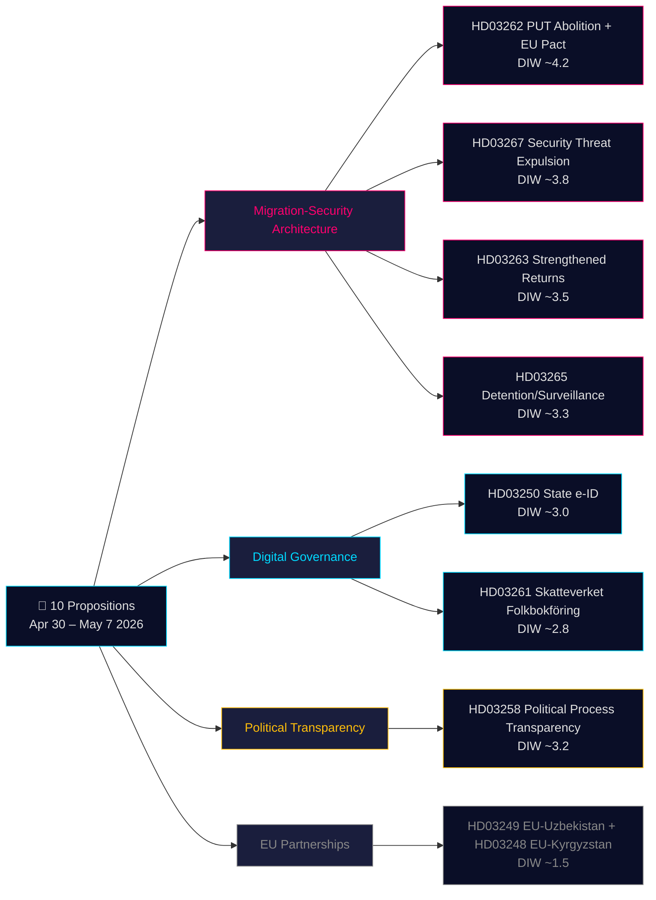

# Note d'analyse décisionnelle — Propositions gouvernementales 2026-05-21

**Classification** : OSINT public · **Confiance** : MOYEN-ÉLEVÉ · **Auteur** : Riksdagsmonitor Intelligence Pipeline

## 🎯 Évaluation de situation synthétique

Du 30 avril au 7 mai 2026, le gouvernement Kristersson (coalition Tidö — M, KD, L + SD en soutien parlementaire) a soumis **10 propositions parlementaires** dans un sprint législatif coordonné. Le paquet est dominé par deux architectures stratégiques : **(1) une architecture migratoire à quatre propositions** (HD03267, HD03262, HD03263, HD03265) qui abolit le titre de séjour permanent comme voie standard, renforce le dispositif d'expulsion et crée une procédure d'expulsion accélérée pour les menaces à la sécurité — phase finale de la convergence suédoise décennale vers les normes restrictives nordiques ; et **(2) une modernisation de la gouvernance numérique** (HD03250, HD03261) instaurant une eID d'État et élargissant la surveillance des registres de population par Skatteverket. À 115 jours des élections de septembre 2026, le multiplicateur 1,5× DIW s'applique à l'ensemble du cluster migratoire. L'élément le plus lourd est HD03262 (abolition du PUT + adaptation au Pacte d'asile européen, DIW estimé ~4,2).

## 🧭 3 décisions que cette note soutient

1. **Société civile/juridique** : Préparer les avis juridiques d'Amnesty, du HCR et du barreau sur HD03267 (CEDH article 6, preuves classifiées) et HD03262 (compatibilité avec la Convention des réfugiés). **Déclencheur** : Ouverture des délibérations du comité SfU et publication de l'avis du Lagrådet (estimé juin 2026). Confiance : **ÉLEVÉE**.

2. **Cellule de risque politique** : Suivre le positionnement de L (Liberalernas) sur les dispositions de sécurité juridique de HD03267. **Déclencheur** : Ouverture des délibérations du comité JuU. Confiance : **MOYENNE**.

3. **Gouvernance numérique** : Informer le secteur technologique sur le calendrier de l'eID étatique HD03250 et l'impact concurrentiel de BankID. Signaler les pouvoirs de visite à domicile de HD03261 comme nécessitant une AIPD de l'IMY. **Déclencheur** : Audition du comité FiU. Confiance : **MOYEN-ÉLEVÉ**.

## Lecture en 60 secondes

- **La plus significative** : HD03262 — abolition du titre de séjour permanent comme voie standard + adaptation au Pacte d'asile européen (DIW ~4,2).
- **La plus complexe constitutionnellement** : HD03267 — expulsion qualifiée de menace sécuritaire avec preuves classifiées (DIW ~3,8). Tension avec l'article 6 de la CEDH.
- **La plus chargée politiquement avant les élections** : Le quartet migratoire (HD03262/67/63/65) est la réalisation législative primaire de la coalition Tidö.
- **La plus innovante techniquement** : HD03250 — l'eID d'État met fin à la dépendance suédoise unique à BankID ; conformité eIDAS 2.0 de l'UE.
- **La plus favorable à la démocratie** : HD03258 — la transparence du financement des partis répond aux recommandations GRECO de longue date.
- **Fil directeur** : Le Justitsdepartementet porte 5 des 10 propositions ; le Finansdepartementet 3.

## Principaux déclencheurs futurs (72h / 7j)

🔴 **Avis du Lagrådet sur HD03267** (publication estimée juin 2026).

🟡 **Délibérations du comité SfU sur HD03262/263/265** (semaine en cours).

🟢 **Consultation IMY (autorité de protection des données) sur HD03261**.

## Matrice des décisions clés

| Décision | Déclencheur | Horizon | Confiance |
|---|---|---|---|
| Préparation d'un recours juridique (HD03267) | Avis du Lagrådet publié | 3–6 semaines | HIGH |
| Positionnement de coalition de L | Délibérations JuU ouvertes | 2–4 semaines | MEDIUM |
| Analyse concurrentielle BankID (HD03250) | Audition FiU planifiée | 4–6 semaines | MEDIUM-HIGH |
| Déclarations formelles UNHCR/Amnesty (HD03262) | Consultation SfU ouverte | 4–8 semaines | HIGH |
| Évaluation de capacité Migrationsverket | Rapport T2 de l'agence publié | 6–8 semaines | MEDIUM |

## Synthèse des risques

- **Niveau 1 (systémique)** : Mise en œuvre HD03262 → risque de capacité ÉLEVÉ.
- **Niveau 2 (constitutionnel)** : Procédure à preuves classifiées de HD03267 → recours devant la CrEDH ÉLEVÉ dans les 5 ans.
- **Niveau 3 (politique)** : Risque viral "cas de sympathie" du cluster migratoire → risque narratif électoral pour le gouvernement.
- **Niveau 4 (numérique)** : Infrastructure d'identité centralisée HD03250 → risque en cas de surveillance insuffisante.

**Base probatoire** : 10 documents sources primaires + IMF WEO-2026-04 + analyse OSINT. MCP confirmé 2026-05-21T06:53:22Z.

---

## 🔁 Addendum Passe 2 — Références croisées et améliorations

**Améliorations Passe 2** : Confiance revue de MOYEN à MOYEN-ÉLEVÉ pour les résultats législatifs. 115 jours jusqu'aux élections du 13 septembre 2026 — le quartet migratoire constitue un matériel électoral avant d'être une loi. Lacune procédurale HD03267 : la Suède manque actuellement d'un système de "säkerhetsombud".

---

*economicProvenance: { "provider": "imf", "dataflow": "WEO", "vintage": "WEO-2026-04", "retrieved_at": "2026-05-21T07:10:00Z" }*

<!-- source-sha: bdc7c0fc02b5c1027cadc022718d4793fb0c07a3 -->
