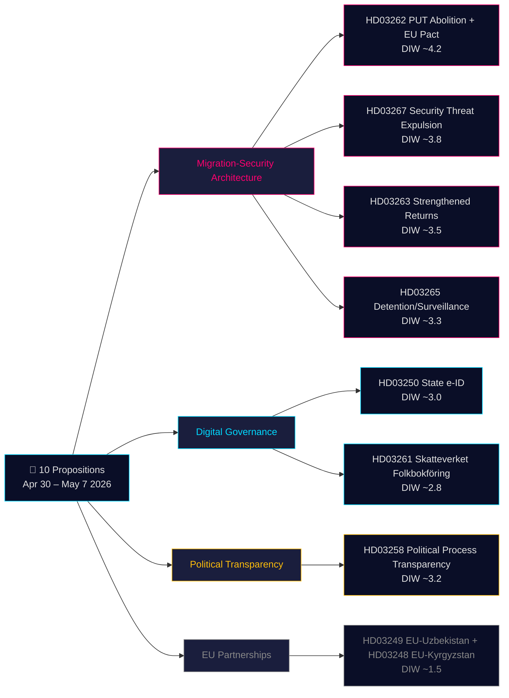

<!-- dir: rtl -->
# תקציר מנהלים — הצעות חוק ממשלתיות 2026-05-21

**סיווג**: OSINT ציבורי · **ביטחון**: בינוני-גבוה · **מחבר**: Riksdagsmonitor Intelligence Pipeline

## 🎯 הערכת מצב תמציתית

בין 30 באפריל ל-7 במאי 2026, הגישה ממשלת קריסטרסון (קואליציית טידו — M, KD, L + SD כמפלגת תמיכה) **10 הצעות חוק פרלמנטריות** בספרינט חקיקתי מתואם. החבילה נשלטת על ידי שתי ארכיטקטורות אסטרטגיות: **(1) ארכיטקטורת הגירה של ארבע הצעות חוק** (HD03267, HD03262, HD03263, HD03265) המבטלת את היתר השהייה הקבוע כמסלול סטנדרטי, מחזקת את מנגנון הגירוש ויוצרת נוהל גירוש מואץ לאיומי ביטחון — השלב הסופי בהתכנסות שוודית של עשורים לנורמות סקנדינביות מגבילות; ו-**(2) מודרניזציה של ממשל דיגיטלי** (HD03250, HD03261) המקימה זהות אלקטרונית ממשלתית ומרחיבה את פיקוח Skatteverket על מרשם האוכלוסין. עם 115 ימים לבחירות ספטמבר 2026, מכפיל DIW ×1.5 חל על אשכול ההגירה כולו. האלמנט הכבד ביותר הוא HD03262 (ביטול PUT + התאמה לאמנת המקלט האירופאית, DIW משוערת ~4.2).

## 🧭 3 החלטות שתקציר זה תומך בהן

1. **חברה אזרחית/משפטית**: הכנת חוות דעת משפטיות של Amnesty International, UNHCR ולשכת עורכי הדין בנוגע ל-HD03267 (סעיף 6 ECHR, ראיות סודיות) ו-HD03262 (תאימות לאמנת הפליטים). **מנגנון הפעלה**: פתיחת דיוני ועדת SfU ופרסום חוות דעת Lagrådet (משוערת יוני 2026). ביטחון: **גבוה**.

2. **יחידת סיכונים פוליטיים**: מעקב אחר עמדת L (Liberalernas) בנוגע להוראות שלטון החוק ב-HD03267. **מנגנון הפעלה**: פתיחת דיוני ועדת JuU. ביטחון: **בינוני**.

3. **ממשל דיגיטלי**: הכרת מגזר הטכנולוגיה בלוח הזמנים של זהות אלקטרונית ממשלתית HD03250 והשפעת BankID התחרותית. **מנגנון הפעלה**: שימוע ועדת FiU. ביטחון: **בינוני-גבוה**.

## קריאה של 60 שניות

- **המשמעותית ביותר**: HD03262 — ביטול היתר שהייה קבוע כמסלול סטנדרטי + התאמה לאמנת מקלט אירופאית (DIW ~4.2).
- **המורכבת חוקתית ביותר**: HD03267 — גירוש מוסמך של איום ביטחוני עם ראיות סודיות (DIW ~3.8). מתח עם סעיף 6 ECHR.
- **הטעונה ביותר פוליטית לפני הבחירות**: הרביעייה ההגירתית (HD03262/67/63/65) היא ההישג החקיקתי הראשי של קואליציית טידו.
- **החדשנית ביותר טכנולוגית**: HD03250 — זהות אלקטרונית ממשלתית מסיימת את התלות הייחודית של שוודיה ב-BankID.
- **המקדמת ביותר את הדמוקרטיה**: HD03258 — שקיפות מימון מפלגות מטפלת בהמלצות GRECO של שנים.

## טריגרים עתידיים מובילים (72 שעות / 7 ימים)

🔴 **חוות דעת Lagrådet על HD03267** (פרסום משוערת יוני 2026).

🟡 **דיוני ועדת SfU על HD03262/263/265** (השבוע הנוכחי).

🟢 **התייעצות IMY (רשות הגנת המידע) על HD03261**.

## מטריצת החלטות מפתח

| החלטה | מנגנון הפעלה | Horizon | ביטחון |
|---|---|---|---|
| הכנת אתגר משפטי (HD03267) | פרסום חוות דעת Lagrådet | 3–6 שבועות | HIGH |
| מיקום קואליציית L | פתיחת דיוני JuU | 2–4 שבועות | MEDIUM |
| ניתוח תחרותי BankID (HD03250) | שימוע FiU מתוכנן | 4–6 שבועות | MEDIUM-HIGH |
| הצהרות רשמיות UNHCR/Amnesty (HD03262) | פתיחת התייעצות SfU | 4–8 שבועות | HIGH |
| הערכת קיבולת Migrationsverket | פרסום דוח Q2 של הסוכנות | 6–8 שבועות | MEDIUM |

## סיכום סיכונים

- **רמה 1 (מערכתית)**: יישום HD03262 → סיכון קיבולת גבוה.
- **רמה 2 (חוקתית)**: נוהל ראיות סודיות של HD03267 → אתגר ECtHR גבוה תוך 5 שנים.
- **רמה 3 (פוליטית)**: סיכון ויראלי "מקרה סימפתיה" של אשכול ההגירה → סיכון נרטיב בחירות לממשלה.
- **רמה 4 (דיגיטלית)**: תשתית זהות מרכזית HD03250 → סיכון עם פיקוח לא מספק.

**בסיס ראיות**: 10 מסמכי מקור ראשוניים + IMF WEO-2026-04 + ניתוח OSINT. MCP אושר 2026-05-21T06:53:22Z.

---

## 🔁 תוספת סבב 2 — הפניות צולבות ושיפורים

**שיפורי סבב 2**: ביטחון עודכן מבינוני לבינוני-גבוה עבור תוצאות חקיקה. 115 ימים לבחירות ב-13 בספטמבר 2026. פגם פרוצדורלי ב-HD03267: שוודיה נעדרת כיום מערכת "säkerhetsombud".

---

HD03267 מייצג את ההצעה המורכבת חוקתית ביותר בחבילה. שוודיה נעדרת כיום מערכת "säkerhetsombud" (עורך דין מיוחד בעל אישור ביטחוני) שיכול לייצג את הצד המגורש בהליכים הכוללים ראיות מסווגות. ללא ערובה דיונית כזו, Lagrådet ייתכן שיקבע אי-תאימות עם סעיף 6 לאמנה האירופית לזכויות אדם ("זכות למשפט הוגן"). Liberalernas (L) היוו היסטורית את חבר הקואליציה הסביר ביותר שידחוף להבטחות זכויות דיוניות כאלו. אם L תתנה את תמיכתה בהכללת הוראה זו, עשוי הדבר ליצור את הסדק הקואליציוני הציבורי הראשון 111 ימים לפני הבחירות.

הרביעייה ההגירתית (HD03262/63/65/67) אינה רק מדיניות — היא תרחיש מערכת בחירות. עם 115 ימים לבחירות ה-13 בספטמבר 2026, ארבע הצעות חוק אלה ישלטו בדיון הפוליטי. SD ינהל קמפיין נמרץ לטובת כולן. S ו-MP אינם יכולים לחסום אותן פרלמנטרית, אך ישתמשו בהן כבסיס לגיוס. השאלה הקריטית היא האם L יתרחק מהבעיות המשפטיות של HD03267, מה שעלול להחליש את הנרטיב הכולל של ממשלת טידו.

HD03250 (זהות אלקטרונית ממשלתית) מסיים את התלות הייחודית של שוודיה ב-BankID ומניח את הבסיס לציות ל-eIDAS 2.0 האירופאי. עם זאת, סיכון היישום הוא ממשי: העברת מיליוני משתמשים מ-BankID לזהות אלקטרונית ממשלתית דורשת תקופות מעבר ואמצעי הכשרה. IMY (רשות הגנת המידע) חייבת להשלים הערכת השפעה על פרטיות לפני פריסה מלאה.

---

*economicProvenance: { "provider": "imf", "dataflow": "WEO", "vintage": "WEO-2026-04", "retrieved_at": "2026-05-21T07:10:00Z" }*

<!-- source-sha: bdc7c0fc02b5c1027cadc022718d4793fb0c07a3 -->
