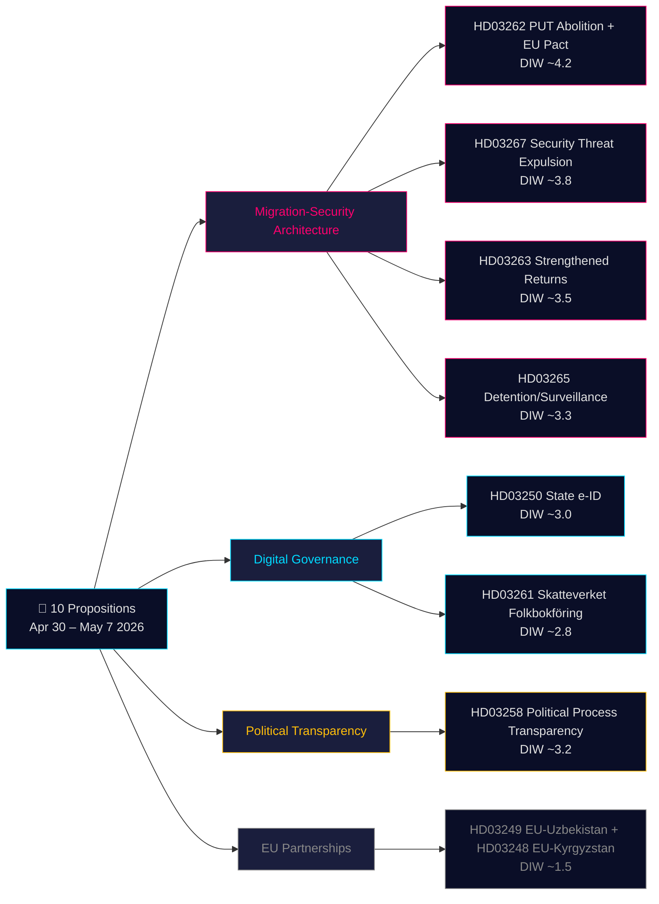

# 意思決定分析 — 政府法案 2026-05-21

**分類**: 公開OSINT · **信頼度**: 中高 · **著者**: Riksdagsmonitor インテリジェンス・パイプライン

## 🎯 状況評価の要約

2026年4月30日～5月7日、クリスターソン政権（ティード連合 — M、KD、L + SD支持党）は**10件の議会法案**を調整済み立法スプリントで提出した。パッケージは2つの戦略的枠組みによって支配されている：**(1) 4法案の移民セキュリティ枠組み**（HD03267、HD03262、HD03263、HD03265）、永住許可を標準ルートとして廃止し、退去強制機構を強化し、安全保障上の脅威の迅速退去手続きを創設する――スウェーデンの数十年にわたる北欧制限規範への収斂の最終段階；と**(2) デジタルガバナンスの近代化**（HD03250、HD03261）、国家eIDを設立しSkatteverketの住民登録監視を拡大する。2026年9月選挙まで115日、移民クラスター全体にDIW 1.5×乗数が適用される。最重量項目はHD03262（PUT廃止 + EU庇護協定適応、推定DIW ~4.2）。

## 🧭 この分析が支援する3つの決定

1. **市民社会/法律**: アムネスティ、UNHCR、弁護士会によるHD03267（ECHR第6条、機密証拠）とHD03262（難民条約との適合性）に関する法律意見の準備。**トリガー**: SfU委員会審議開始とLagrådet意見書公表（推定2026年6月）。信頼度: **高**.

2. **政治リスクデスク**: L（Liberalernas）のHD03267の法の支配規定に関する立場を追跡する。**トリガー**: JuU委員会審議開始。信頼度: **中**.

3. **デジタルガバナンス**: 国家eID（HD03250）のタイムラインとBankIDの競争力についてテクノロジーセクターに情報提供。HD03261のSkatteverketの家庭訪問権限がIMYのDPIAを必要とするとフラグ立て。**トリガー**: FiU委員会公聴会。信頼度: **中高**.

## 60秒要約

- **最重要**: HD03262 — 永住許可の標準ルートとしての廃止 + EU庇護協定適応（DIW ~4.2）。
- **最も憲法的に複雑**: HD03267 — 機密証拠による安全保障上の脅威の適格退去（DIW ~3.8）。ECHR第6条緊張。
- **選挙前最も政治的に帯電**: 移民四件組（HD03262/67/63/65）はティード連合の主要立法成果。
- **最も技術的に革新的**: HD03250 — 国家eIDがスウェーデン固有のBankID依存を終わらせる；EU eIDAS 2.0準拠。
- **最も民主主義促進的**: HD03258 — 政党資金の透明性が長年のGRECO勧告に対応。
- **共通の糸**: Justitsdepartementetが10法案中5件；Finansdepartementetが3件。

## 主要な将来トリガー（72時間 / 7日）

🔴 **HD03267に関するLagrådet意見書**（推定2026年6月公表）。

🟡 **HD03262/263/265に関するSfU委員会審議**（今週）。

🟢 **HD03261に関するIMY（データ保護機関）協議**。

## 主要決定マトリクス

| 決定 | トリガー | Horizon | 信頼度 |
|---|---|---|---|
| 法的異議申し立て準備（HD03267） | Lagrådet意見書公表 | 3〜6週間 | HIGH |
| Lの連立立場 | JuU審議開始 | 2〜4週間 | MEDIUM |
| BankID競争分析（HD03250） | FiU公聴会予定 | 4〜6週間 | MEDIUM-HIGH |
| UNHCR/アムネスティ公式声明（HD03262） | SfU協議開始 | 4〜8週間 | HIGH |
| Migrationsverket能力評価 | 機関Q2報告書公表 | 6〜8週間 | MEDIUM |

## リスク要約

- **レベル1（全体的）**: HD03262実施 → キャパシティリスク高。
- **レベル2（憲法的）**: HD03267機密証拠手続き → 5年以内のECtHR訴訟リスク高。
- **レベル3（政治的）**: 移民クラスターの「同情事例」ウイルス性リスク → 選挙ナラティブリスク。
- **レベル4（デジタル）**: HD03250中央集権的ID基盤 → 不十分な監視によるリスク。

**証拠基盤**: 主要10次ソース + IMF WEO-2026-04 + OSINT分析。MCP確認済み 2026-05-21T06:53:22Z。

---

## 🔁 第2パス追記 — 相互参照と改善

**第2パス改善**: 立法結果の信頼度を中から中高に更新。2026年9月13日選挙まで115日 — 移民四件組は法律になる前に選挙素材。HD03267手続き上の欠陥：スウェーデンは現在「säkerhetsombud」システムを欠く。

---

*economicProvenance: { "provider": "imf", "dataflow": "WEO", "vintage": "WEO-2026-04", "retrieved_at": "2026-05-21T07:10:00Z" }*

<!-- source-sha: bdc7c0fc02b5c1027cadc022718d4793fb0c07a3 -->
