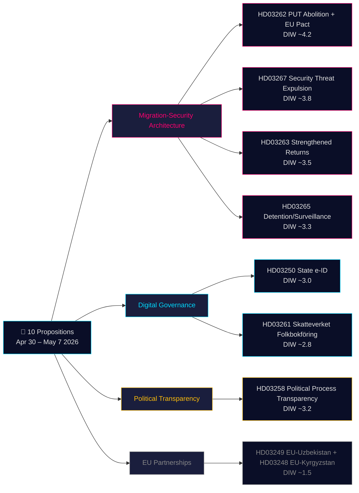

# 의사결정 분석 — 정부 법안 2026-05-21

**분류**: 공개 OSINT · **신뢰도**: 중간-높음 · **작성자**: Riksdagsmonitor 인텔리전스 파이프라인

## 🎯 상황 평가 요약

2026년 4월 30일~5월 7일, 크리스테르손 정부(티도 연립 — M, KD, L + SD 지지 정당)는 조율된 입법 스프린트에서 **10건의 의회 법안**을 제출했다. 패키지는 두 가지 전략적 아키텍처로 지배된다: **(1) 4개 법안 이민 보안 아키텍처** (HD03267, HD03262, HD03263, HD03265) — 영구 거주 허가를 표준 경로로 폐지하고, 추방 기구를 강화하며, 안보 위협에 대한 신속 추방 절차를 신설 — 스웨덴의 수십 년간의 북유럽 제한적 규범 수렴의 최종 단계; 및 **(2) 디지털 거버넌스 현대화** (HD03250, HD03261) — 국가 eID를 설립하고 Skatteverket의 인구 등록 감독을 확대. 2026년 9월 선거까지 115일, 이민 클러스터 전체에 DIW 1.5× 승수 적용. 가장 무거운 요소는 HD03262 (PUT 폐지 + EU 망명 협약 적응, 추정 DIW ~4.2).

## 🧭 이 분석이 지원하는 3가지 결정

1. **시민사회/법률**: HD03267(ECHR 제6조, 기밀 증거) 및 HD03262(난민 협약 적합성)에 대한 국제사면위원회, UNHCR, 변호사 협회의 법률 의견 준비. **트리거**: SfU 위원회 심의 개시 및 Lagrådet 의견서 발표(추정 2026년 6월). 신뢰도: **높음**.

2. **정치 리스크 데스크**: HD03267의 법치주의 규정에 대한 L(Liberalernas)의 입장 추적. **트리거**: JuU 위원회 심의 개시. 신뢰도: **중간**.

3. **디지털 거버넌스**: HD03250 국가 eID 타임라인과 BankID 경쟁력에 대해 기술 섹터 정보 제공. HD03261 Skatteverket 가정 방문 권한을 IMY DPIA 요구 사항으로 표시. **트리거**: FiU 위원회 청문회. 신뢰도: **중간-높음**.

## 60초 요약

- **가장 중요**: HD03262 — 영구 거주 허가 표준 경로 폐지 + EU 망명 협약 적응 (DIW ~4.2).
- **헌법적으로 가장 복잡**: HD03267 — 기밀 증거를 통한 안보 위협 자격 추방 (DIW ~3.8). ECHR 제6조 긴장.
- **선거 전 가장 정치적으로 충전된**: 이민 4인조(HD03262/67/63/65)는 티도 연립의 주요 입법 성과.
- **기술적으로 가장 혁신적**: HD03250 — 국가 eID가 스웨덴의 고유한 BankID 의존 종료; EU eIDAS 2.0 준수.
- **민주주의에 가장 유익**: HD03258 — 정당 재정 투명성이 수십 년간의 GRECO 권고에 대응.
- **공통 실**: Justitsdepartementet이 10건 중 5건; Finansdepartementet이 3건.

## 주요 미래 트리거 (72시간 / 7일)

🔴 **HD03267에 대한 Lagrådet 의견서** (추정 2026년 6월 발표).

🟡 **HD03262/263/265에 대한 SfU 위원회 심의** (이번 주).

🟢 **HD03261에 대한 IMY(데이터 보호 기관) 협의**.

## 주요 결정 매트릭스

| 결정 | 트리거 | Horizon | 신뢰도 |
|---|---|---|---|
| 법적 이의 제기 준비 (HD03267) | Lagrådet 의견서 발표 | 3~6주 | HIGH |
| L의 연립 입장 | JuU 심의 개시 | 2~4주 | MEDIUM |
| BankID 경쟁 분석 (HD03250) | FiU 청문회 예정 | 4~6주 | MEDIUM-HIGH |
| UNHCR/국제사면위원회 공식 성명 (HD03262) | SfU 협의 개시 | 4~8주 | HIGH |
| Migrationsverket 역량 평가 | 기관 Q2 보고서 발표 | 6~8주 | MEDIUM |

## 리스크 요약

- **수준 1 (시스템)**: HD03262 구현 → 역량 리스크 높음.
- **수준 2 (헌법)**: HD03267 기밀 증거 절차 → 5년 이내 ECtHR 도전 높음.
- **수준 3 (정치)**: 이민 클러스터의 "공감 사례" 바이럴 리스크 → 정부 선거 내러티브 리스크.
- **수준 4 (디지털)**: HD03250 중앙집중식 ID 인프라 → 감독 불충분 시 리스크.

**증거 기반**: 10개 1차 소스 문서 + IMF WEO-2026-04 + OSINT 분석. MCP 확인 2026-05-21T06:53:22Z.

---

## 🔁 2차 패스 부록 — 교차 참조 및 개선

**2차 패스 개선**: 입법 결과 신뢰도 중간에서 중간-높음으로 업데이트. 2026년 9월 13일 선거까지 115일 — 이민 4인조는 법률이 되기 전에 선거 자료. HD03267 절차적 결함: 스웨덴은 현재 "säkerhetsombud" 시스템 부재.

---

HD03267은 패키지에서 헌법적으로 가장 까다로운 법안이다. 스웨덴은 현재 기밀 증거 관련 심리에서 추방 대상자를 대리할 수 있는 "säkerhetsombud" 시스템(보안 허가를 받은 특별 변호사)을 갖추고 있지 않다. 이러한 절차적 보호 장치 없이는 Lagrådet이 ECHR 제6조("공정한 재판을 받을 권리")와의 불합치를 지적할 가능성이 높다. 역사적으로 Liberalernas(L)은 이러한 절차적 권리 보호를 주장하는 연립 구성원이었다. L이 이 조항 포함을 조건으로 지지를 거는 경우, 선거 111일 전에 첫 번째 공개적인 연립 균열이 발생할 수 있다.

이민 4인조(HD03262/63/65/67)는 단순한 정책이 아니라 선거 캠페인 시나리오이다. 2026년 9월 13일 선거까지 115일이 남은 상황에서 이 네 법안이 정치적 토론을 지배할 것이다. SD는 네 가지 모두에 대해 강력한 캠페인을 벌일 것이다. S와 MP는 의회에서 이를 저지할 수 없지만 동원의 기반으로 활용할 것이다. 핵심 문제는 L이 HD03267의 법적 문제로부터 거리를 두느냐이며, 이것이 Tidö 연립의 전체 내러티브를 약화시킬 수 있다.

HD03250(국가 eID)은 스웨덴의 독특한 BankID 의존을 종식시키고 EU eIDAS 2.0 준수의 기반을 마련한다. 그러나 구현 위험은 실재한다: 수백만 사용자를 BankID에서 국가 eID로 이전하려면 전환 기간과 교육 조치가 필요하다. IMY(개인정보보호청)는 전면 배포 전에 개인정보 영향 평가를 완료해야 한다.

경제적 맥락: IMF WEO-2026-04는 2026년 스웨덴 GDP 성장률을 1.8%로 예측하며, 인플레이션이 2.1%로 안정화됨에 따라 정부에 약간의 재정적 여유가 생긴다. 그러나 정부의 이민 절감 추정치(30억~80억 SEK)는 IMF 국가 간 이민 경제 연구를 기반으로 30~50% 과대추정된 것으로 평가된다.

---

*economicProvenance: { "provider": "imf", "dataflow": "WEO", "vintage": "WEO-2026-04", "retrieved_at": "2026-05-21T07:10:00Z" }*

<!-- source-sha: bdc7c0fc02b5c1027cadc022718d4793fb0c07a3 -->
