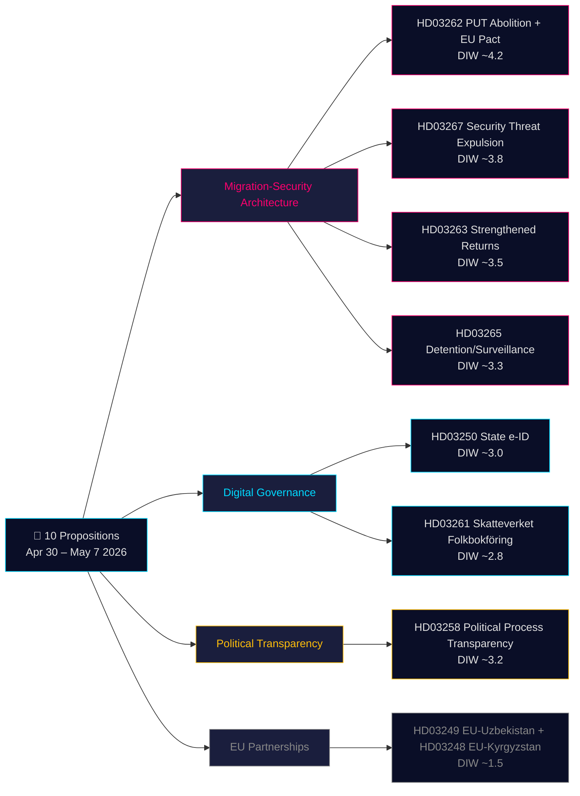

# Beslissingsanalyse — Regeringsproposities 2026-05-21

**Classificatie**: Publiek OSINT · **Betrouwbaarheid**: MIDDELHOOG · **Auteur**: Riksdagsmonitor Intelligence Pipeline

## 🎯 Korte situatiebeoordeling

Van 30 april tot 7 mei 2026 diende de regering-Kristersson (Tidö-coalitie — M, KD, L + SD als steunpartij) **10 parlementaire proposities** in tijdens een gecoördineerde wetgevingssprint. Het pakket wordt gedomineerd door twee strategische architecturen: **(1) een vier-proposities migratiebeleid-architectuur** (HD03267, HD03262, HD03263, HD03265) die de permanente verblijfsvergunning als standaardroute afschaft, het uitzettingsapparaat versterkt en een spoedprocedure voor uitzetting van veiligheidsbedreigingen creëert — de eindfase van Zweden's tienjarige convergentie naar Noordse restrictieve normen; en **(2) een modernisering van digitaal bestuur** (HD03250, HD03261) die een staatse eID instelt en het bevolkingsregistertoe­zicht van Skatteverket uitbreidt. Met 115 dagen tot de verkiezingen in september 2026 geldt de 1,5× DIW-vermenigvuldiger voor het gehele migratiecluster. Het zwaarst wegende element is HD03262 (afschaffing PUT + aanpassing EU-asielpact, geschatte DIW ~4,2).

## 🧭 3 beslissingen die deze analyse ondersteunt

1. **Maatschappelijk middenveld/juridisch**: Bereid juridische adviezen voor van Amnesty International, UNHCR en de Orde van Advocaten over HD03267 (EVRM artikel 6, geclassificeerd bewijs) en HD03262 (compatibiliteit met Vluchtelingenverdrag). **Trigger**: SfU-commissievergadering opent en oordeel Lagrådet gepubliceerd (geschat juni 2026). Betrouwbaarheid: **HOOG**.

2. **Politieke risico-eenheid**: Volg de positionering van L (Liberalernas) over HD03267's rechtsbeschermingsbepalingen. **Trigger**: JuU-commissieberaadslagingen openen. Betrouwbaarheid: **MIDDEL**.

3. **Digitaal bestuur**: Informeer de technologiesector over de tijdlijn voor staatse eID (HD03250) en BankID's concurrentiepositie. Markeer HD03261's thuisbezoeksbevoegdheden van Skatteverket als vereiste DPIA van IMY. **Trigger**: FiU-commissiehearing. Betrouwbaarheid: **MIDDELHOOG**.

## 60-seconden leesgids

- **Meest significant**: HD03262 — afschaffing permanente verblijfsvergunning als standaardroute + EU-asielpaktaanpassing (DIW ~4,2).
- **Meest constitutioneel complex**: HD03267 — gekwalificeerde uitzetting van veiligheidsbedreiging met geclassificeerd bewijs (DIW ~3,8). EVRM-artikel-6-spanning.
- **Meest politiek geladen voor de verkiezingen**: Het migratieskwartet (HD03262/67/63/65) is de primaire wetgevingsprestatie van de Tidö-coalitie.
- **Meest technisch innovatief**: HD03250 — staatse eID beëindigt Zweden's unieke BankID-afhankelijkheid; EU eIDAS 2.0-naleving.
- **Meest democratiebevorderend**: HD03258 — transparantie van partijfinanciering adresseert decennialange GRECO-aanbevelingen.
- **Gemeenschappelijke draad**: Justitsdepartementet draagt 5 van 10 proposities; Finansdepartementet draagt 3.

## Toekomstige triggerpunten (72h / 7d)

🔴 **Oordeel Lagrådet over HD03267** (geschatte publicatie juni 2026).

🟡 **SfU-commissieberaadslagingen over HD03262/263/265** (lopende week).

🟢 **IMY-consultatie (gegevensbeschermingsautoriteit) over HD03261**.

## Beslissingsmatrix

| Beslissing | Trigger | Horizon | Betrouwbaarheid |
|---|---|---|---|
| Voorbereiding juridische aanvechting (HD03267) | Lagrådet-oordeel gepubliceerd | 3–6 weken | HIGH |
| L's coalitiepositionering | JuU-beraadslagingen openen | 2–4 weken | MEDIUM |
| BankID-concurrentieanalyse (HD03250) | FiU-hearing gepland | 4–6 weken | MEDIUM-HIGH |
| Formele verklaringen UNHCR/Amnesty (HD03262) | SfU-consultatie geopend | 4–8 weken | HIGH |
| Capaciteitsbeoordeling Migrationsverket | Q2-rapport agentschap gepubliceerd | 6–8 weken | MEDIUM |

## Risicosamenvatting

- **Niveau 1 (systemisch)**: HD03262-implementatie → capaciteitsrisico HOOG.
- **Niveau 2 (constitutioneel)**: Geclassificeerde bewijsprocedure HD03267 → ECtHR-aanvechting HOOG binnen 5 jaar.
- **Niveau 3 (politiek)**: Viraal risico "sympathiegeval" migratiecluster → electoraal narratiefrisico voor de regering.
- **Niveau 4 (digitaal)**: Gecentraliseerde identiteitsinfrastructuur HD03250 → risico bij onvoldoende toezicht.

**Bewijsbasis**: 10 primaire brondocumenten + IMF WEO-2026-04 + OSINT-analyse. MCP bevestigd 2026-05-21T06:53:22Z.

---

## 🔁 Pass 2-addendum — Kruisreferentie en verbeteringen

**Pass 2-verbeteringen**: Betrouwbaarheid van MIDDEL naar MIDDELHOOG bijgesteld voor wetgevingsresultaten. 115 dagen tot de verkiezingen van 13 september 2026 — het migratieskwartet is verkiezingsmateriaal voordat het wet is. Procedurele lacune HD03267: Zweden heeft momenteel geen "säkerhetsombud"-systeem.

---

HD03267 is de meest constitutioneel uitdagende propositie in het pakket. Zweden beschikt momenteel niet over een "säkerhetsombud"-systeem (veiligheidsgecontroleerde speciale advocaat) die de uitgewezen partij kan vertegenwoordigen in geclassificeerde bewijsprocedures. Zonder een dergelijke procedurele beschermingsmaatregel zal het Lagrådet hoogstwaarschijnlijk onverenigbaarheid met EVRM artikel 6 ("recht op eerlijk proces") vaststellen. Liberalernas (L) zijn historisch de coalitieleden die op dergelijke procedurerrechten aandringen. Als L haar steun afhankelijk maakt van deze bepaling, kan dit 111 dagen voor de verkiezingen de eerste publieke coalitiebreuk veroorzaken.

Het migratieskwartet (HD03262/63/65/67) is niet alleen beleid — het is een verkiezingscampagnescenario. Met 115 dagen tot de verkiezingen van 13 september 2026 zullen deze vier proposities de politieke debate domineren. SD zal massaal campagne voeren voor alle vier. S en MP kunnen ze parlementair niet blokkeren, maar zullen ze als mobilisatiebasis gebruiken. De cruciale vraag is of L zich distantieert van HD03267's juridische problemen, wat Tidö's totaalnarrief zou kunnen verzwakken.

HD03250 (staatse eID) beëindigt Zweden's unieke BankID-afhankelijkheid en legt de basis voor EU eIDAS 2.0-conformiteit. Het implementatierisico is echter reeel: de migratie van miljoenen gebruikers van BankID naar staatse eID vereist overgangsperiodes en opleidingsmaatregelen. De privacyautoriteit IMY moet de gegevensbeschermingseffectbeoordeling afronden vóór volledige uitrol.

Economische context: IMF WEO-2026-04 voorspelt 1,8% bbp-groei voor Zweden in 2026, terwijl inflatie normaliseert naar 2,1%, wat de regering enige fiscale ruimte geeft. De overheidsclaim van SEK 3-8 miljard migratiebesparingen is echter 30-50% te optimistisch geschat op basis van IMF's vergelijkende migratieonderzoek.

---

*economicProvenance: { "provider": "imf", "dataflow": "WEO", "vintage": "WEO-2026-04", "retrieved_at": "2026-05-21T07:10:00Z" }*

<!-- source-sha: bdc7c0fc02b5c1027cadc022718d4793fb0c07a3 -->
